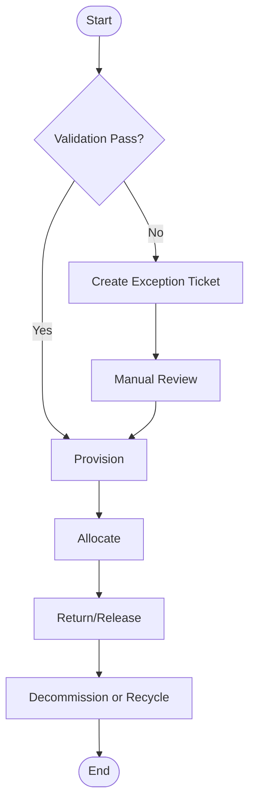

# Activity Diagrams

Behavior and process analysis artifact used to validate operational correctness before build.

## Artifact-Specific Objectives
- Capture real process actors, triggers, and state handoffs.
- Enumerate alternate/exceptional behavior with explicit owner transitions.
- Produce artifacts that can be converted directly into test scenarios.

## Analysis-to-Implementation Mapping

| Analysis Output | Engineering Consumer | Implementation Deliverable |
|---|---|---|
| Actor and trigger model | API/service owners | Endpoint commands + auth scopes |
| Exception branches | SRE and operations | Incident runbooks + alert rules |
| Policy boundaries | Governance/compliance | Policy-as-code rules and approvals |

## Lifecycle and Governance Specifics

- **Provisioning in Activity Diagrams**: Define preconditions, policy gate, and emitted evidence artifact.
- **Allocation in Activity Diagrams**: Define contention handling, SLA timers, and rollback behavior.
- **Decommissioning in Activity Diagrams**: Define terminal checks, retention obligations, and approval authority.
- **Exception workflow in Activity Diagrams**: Detect → classify → contain → resolve → recover → postmortem with owner + SLA.

## Implementation Checklist

- [ ] Artifact reviewed by engineering, operations, and governance stakeholders.
- [ ] Traceability links added to related requirements/design/runbooks.
- [ ] Failure-path and compensation behavior documented in testable form.
- [ ] Metrics and alerts mapped to artifact outcomes.

## Mermaid Diagram

