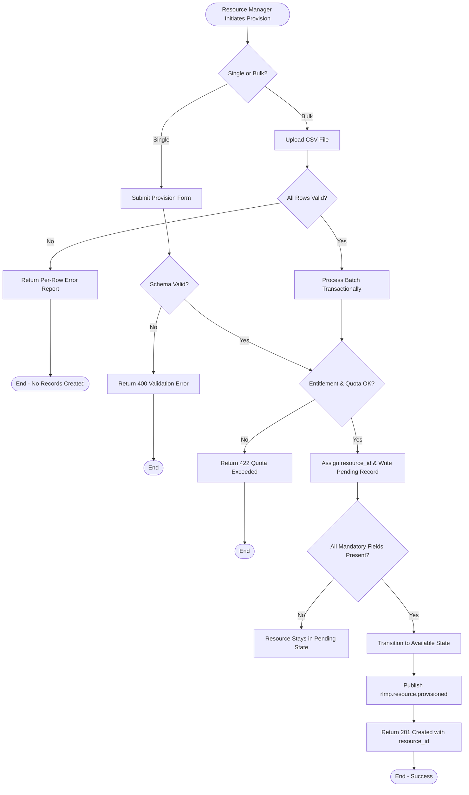
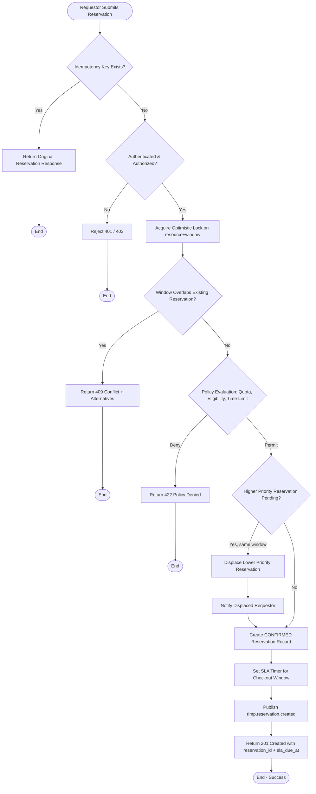
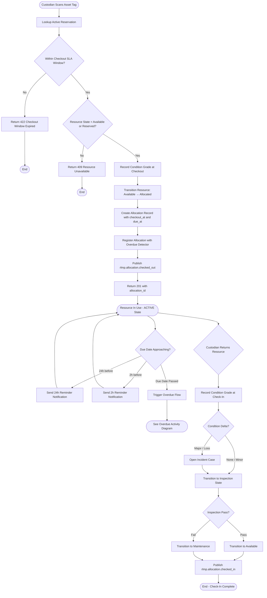
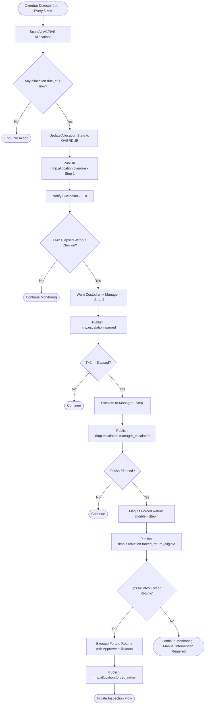
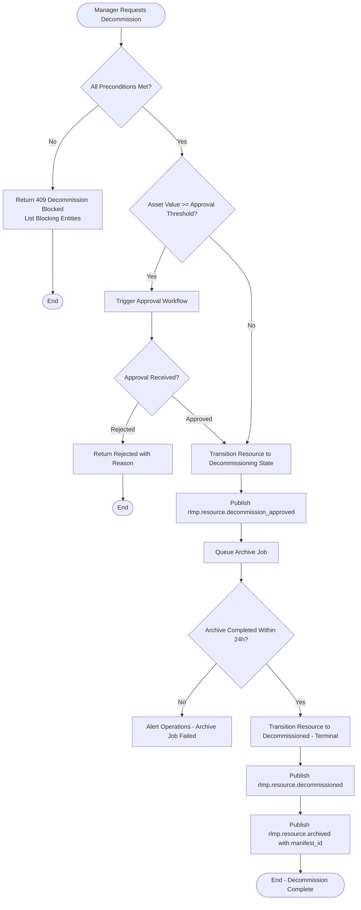

# Activity Diagrams

Activity diagrams showing the detailed flow of each major lifecycle process in the **Resource Lifecycle Management Platform**. Each diagram captures actors, decisions, parallel paths, and exception branches.

---

## 1. Resource Provisioning Activity

---

## 2. Reservation Request Activity

---

## 3. Checkout and Check-In Activity

---

## 4. Overdue Escalation Activity

---

## 5. Decommission Activity

---

## Cross-References

- State transitions: [../detailed-design/state-machine-diagrams.md](../detailed-design/state-machine-diagrams.md)
- Swimlane diagrams: [swimlane-diagrams.md](./swimlane-diagrams.md)
- Sequence diagrams: [../detailed-design/sequence-diagrams.md](../detailed-design/sequence-diagrams.md)
