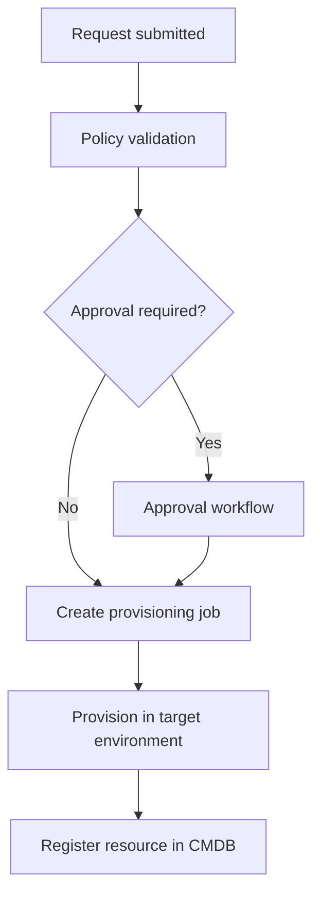
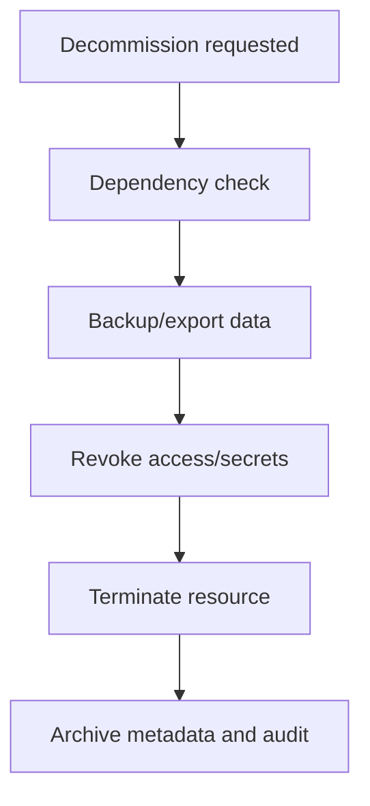

# Activity Diagrams

## Provisioning Flow

```mermaid
flowchart TD
  A[Request submitted] --> B[Policy validation]
  B --> C{Approval required?}
  C -- Yes --> D[Approval workflow]
  C -- No --> E[Create provisioning job]
  D --> E
  E --> F[Provision in target environment]
  F --> G[Register resource in CMDB]
```

## Decommission Flow

```mermaid
flowchart TD
  A[Decommission requested] --> B[Dependency check]
  B --> C[Backup/export data]
  C --> D[Revoke access/secrets]
  D --> E[Terminate resource]
  E --> F[Archive metadata and audit]
```
