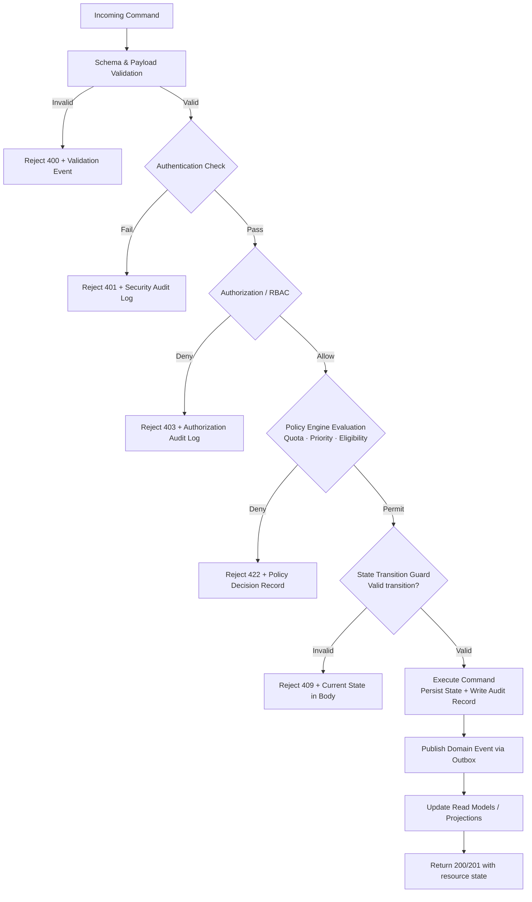

# Business Rules

This document defines all enforceable policy and process rules for the **Resource Lifecycle Management Platform**. Every state-changing command, scheduled job, and operational action must comply with these rules. Rules are numbered, categorized, and traceable to design and implementation artifacts.

## Context

- **Domain**: Resource lifecycle management — provisioning, reservation, allocation, custody, overdue recovery, settlement, decommissioning.
- **Rule categories**: lifecycle transitions, authorization, quota and concurrency, financial, data integrity, and resilience.
- **Enforcement points**: REST/gRPC API gateway, command handlers, policy decision engine, state machine, background workers, and administrative console.

---

## Enforceable Business Rules

| Rule ID | Category | Rule | Enforcement Point |
|---|---|---|---|
| BR-1 | Authorization | Every state-changing command MUST pass authentication (valid JWT/API key) and authorization (role + scope check) before any processing occurs. Unauthenticated and unauthorized requests are rejected with 401/403 and a security audit log entry. | API Gateway, Command Handler |
| BR-2 | Data Integrity | A resource record MUST include all mandatory fields (category, condition grade, asset tag, tenant ID, cost centre) before it transitions out of `Pending` state. Incomplete records stay in `Pending` and cannot be reserved. | Provisioning Service |
| BR-3 | Concurrency | Reservation windows for the same resource MUST NOT overlap. Concurrent reservation attempts for the same resource and overlapping time windows are serialized using optimistic locking; the losing request receives a 409 with a retry token and suggested alternatives. | Allocation Service, Lock Manager |
| BR-4 | Quota | Each requestor and tenant is subject to configurable resource quotas. A reservation or allocation that would breach the quota limit is denied with an explicit `QUOTA_EXCEEDED` error code. Quotas are evaluated atomically with reservation creation. | Policy Engine |
| BR-5 | Idempotency | All commands that mutate state MUST be idempotent with respect to their `idempotency_key`. A repeated command with the same key returns the original result without re-applying side effects. | All Command Handlers |
| BR-6 | Lifecycle Ordering | State transitions MUST follow the configured state graph (see state-machine-diagrams.md). Invalid transitions (e.g., `Available → Decommissioned` without going through inspection) are rejected with `INVALID_TRANSITION` and the current state in the error body. | State Machine Engine |
| BR-7 | Audit | Every state change MUST be recorded with `actor_id`, `correlation_id`, `reason_code`, `before_state`, `after_state`, and UTC `timestamp`. Records are immutable after creation. | Audit Writer |
| BR-8 | Condition Tracking | Condition assessment (grade A–D, notes) MUST be recorded at checkout and check-in. A grade downgrade between checkout and check-in automatically opens an incident/settlement case with severity proportional to the grade delta. | Custody Service, Incident Service |
| BR-9 | Overdue Escalation | An allocation that passes its return due date without a check-in event triggers the overdue escalation ladder: notify (T+0) → warn (T+4 h) → escalate to manager (T+24 h) → forced-return eligible (T+48 h). Each step is configurable and audited. | Overdue Detector, Notification Service |
| BR-10 | Decommissioning | A resource can only transition to `Decommissioned` when: (a) all open settlement cases are closed with zero outstanding balance, (b) all retention locks have expired or been explicitly released by a Compliance Officer, and (c) the decommission has been approved by an authorized Resource Manager for assets above the configured value threshold. | Decommission Orchestrator |
| BR-11 | Financial Integrity | Settlement charges and deposit adjustments MUST be published to the financial ledger via the outbox pattern. Each financial event is exactly-once delivered. Reconciliation runs daily; discrepancies trigger a blocking alert. | Settlement Service, Outbox Publisher |
| BR-12 | Override Governance | Any manual override of a business rule requires: (a) an override-eligible role, (b) an explicit reason code from the approved override catalog, and (c) an expiry timestamp. Expired overrides automatically invalidate pending work and trigger a review task. | Override Authorization Service |

---

## Rule Evaluation Pipeline

---

## Major Business Rule Traceability Matrix

| Rule ID | Design Artifacts | Implementation Artifacts |
|---|---|---|
| BR-1 | [detailed-design/api-design.md](../detailed-design/api-design.md), [high-level-design/architecture-diagram.md](../high-level-design/architecture-diagram.md), [analysis/use-case-descriptions.md](./use-case-descriptions.md) | [implementation/implementation-guidelines.md](../implementation/implementation-guidelines.md), [implementation/backend-status-matrix.md](../implementation/backend-status-matrix.md) |
| BR-2 | [detailed-design/erd-database-schema.md](../detailed-design/erd-database-schema.md), [analysis/data-dictionary.md](./data-dictionary.md) | [implementation/backend-status-matrix.md](../implementation/backend-status-matrix.md) |
| BR-3 | [detailed-design/sequence-diagrams.md](../detailed-design/sequence-diagrams.md), [detailed-design/state-machine-diagrams.md](../detailed-design/state-machine-diagrams.md) | [implementation/implementation-guidelines.md](../implementation/implementation-guidelines.md), [edge-cases/reservation-and-allocation-conflicts.md](../edge-cases/reservation-and-allocation-conflicts.md) |
| BR-4 | [analysis/use-case-descriptions.md](./use-case-descriptions.md), [high-level-design/architecture-diagram.md](../high-level-design/architecture-diagram.md) | [implementation/backend-status-matrix.md](../implementation/backend-status-matrix.md) |
| BR-5 | [detailed-design/sequence-diagrams.md](../detailed-design/sequence-diagrams.md), [high-level-design/system-sequence-diagrams.md](../high-level-design/system-sequence-diagrams.md) | [implementation/implementation-guidelines.md](../implementation/implementation-guidelines.md) |
| BR-6 | [detailed-design/state-machine-diagrams.md](../detailed-design/state-machine-diagrams.md), [detailed-design/lifecycle-orchestration.md](../detailed-design/lifecycle-orchestration.md) | [implementation/c4-code-diagram.md](../implementation/c4-code-diagram.md) |
| BR-7 | [analysis/event-catalog.md](./event-catalog.md), [detailed-design/api-design.md](../detailed-design/api-design.md) | [implementation/implementation-guidelines.md](../implementation/implementation-guidelines.md), [implementation/backend-status-matrix.md](../implementation/backend-status-matrix.md) |
| BR-8 | [analysis/activity-diagrams.md](./activity-diagrams.md), [detailed-design/sequence-diagrams.md](../detailed-design/sequence-diagrams.md) | [edge-cases/checkout-checkin-and-condition-disputes.md](../edge-cases/checkout-checkin-and-condition-disputes.md) |
| BR-9 | [detailed-design/lifecycle-orchestration.md](../detailed-design/lifecycle-orchestration.md), [analysis/swimlane-diagrams.md](./swimlane-diagrams.md) | [edge-cases/lifecycle-state-sync-and-overdue-recovery.md](../edge-cases/lifecycle-state-sync-and-overdue-recovery.md), [implementation/backend-status-matrix.md](../implementation/backend-status-matrix.md) |
| BR-10 | [detailed-design/state-machine-diagrams.md](../detailed-design/state-machine-diagrams.md), [requirements/requirements.md](../requirements/requirements.md) | [implementation/implementation-guidelines.md](../implementation/implementation-guidelines.md), [edge-cases/settlement-and-incident-resolution.md](../edge-cases/settlement-and-incident-resolution.md) |
| BR-11 | [high-level-design/architecture-diagram.md](../high-level-design/architecture-diagram.md), [detailed-design/api-design.md](../detailed-design/api-design.md) | [edge-cases/settlement-and-incident-resolution.md](../edge-cases/settlement-and-incident-resolution.md) |
| BR-12 | [analysis/use-case-descriptions.md](./use-case-descriptions.md), [edge-cases/operations.md](../edge-cases/operations.md) | [implementation/backend-status-matrix.md](../implementation/backend-status-matrix.md) |

---

## Exception and Override Handling

- Override requests are evaluated against a **pre-approved override catalog** maintained by the Compliance Officer.
- All override grants are dual-logged (business audit log + security SIEM).
- Override windows automatically expire at the configured `expiry_timestamp`; any work items still relying on the override are placed in `pending_review` state.
- Patterns of repeated overrides for the same rule ID trigger a policy-review workflow to determine whether the rule needs adjustment.

---

## Cross-References

- Event catalog: [event-catalog.md](./event-catalog.md)
- State machine: [../detailed-design/state-machine-diagrams.md](../detailed-design/state-machine-diagrams.md)
- Lifecycle orchestration: [../detailed-design/lifecycle-orchestration.md](../detailed-design/lifecycle-orchestration.md)
- Edge cases: [../edge-cases/README.md](../edge-cases/README.md)
