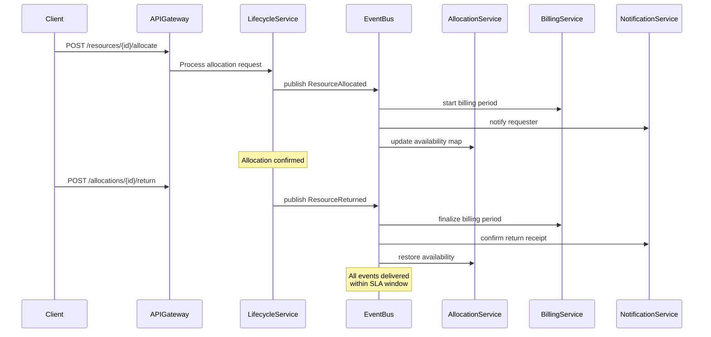

## Contract Conventions

All events follow the CloudEvents 1.0 specification with the following envelope:
- `specversion`: "1.0"
- `type`: `rlmp.{domain}.{event_name}` (lowercase, dot-separated)
- `source`: `/services/{service-name}`
- `id`: UUID v4 (unique per event instance)
- `time`: ISO 8601 UTC timestamp
- `datacontenttype`: "application/json"
- `data`: domain-specific payload (schema versioned)

Retry policy: 3 attempts with exponential backoff (1s, 4s, 16s) before DLQ.

## Domain Events

| Event | Producer | Consumer(s) | Trigger | Key Payload |
|---|---|---|---|---|
| `rlmp.resource.provisioned` | ProvisioningService | BillingService, AuditWriter | New resource instance created | `resource_id`, `profile_id`, `location`, `commissioned_at` |
| `rlmp.resource.decommissioned` | LifecycleService | BillingService, AuditWriter | Resource end-of-life reached | `resource_id`, `reason`, `decommissioned_at` |
| `rlmp.allocation.created` | AllocationService | BillingService, NotificationService | Reservation confirmed | `allocation_id`, `resource_id`, `requester_id`, `start_at`, `end_at` |
| `rlmp.allocation.returned` | AllocationService | BillingService, InventoryService | Resource returned | `allocation_id`, `resource_id`, `return_condition`, `returned_at` |
| `rlmp.allocation.overdue` | SchedulerService | NotificationService, EscalationService | Return deadline passed | `allocation_id`, `resource_id`, `requester_id`, `overdue_since` |
| `rlmp.maintenance.scheduled` | MaintenanceService | AllocationService, NotificationService | Maintenance window created | `resource_id`, `window_start`, `window_end`, `maintenance_type` |
| `rlmp.incident.raised` | MonitoringService | EscalationService, AuditWriter | Resource incident detected | `resource_id`, `incident_type`, `severity`, `detected_at` |
| `rlmp.billing.finalized` | BillingService | FinanceSystem, AuditWriter | Billing period closed | `allocation_id`, `amount`, `currency`, `period_end` |

# Event Catalog

All domain events emitted by the **Resource Lifecycle Management Platform**. Each event is versioned, schema-validated, and published via the transactional outbox to the platform event bus. Consumers subscribe by event type and tenant.

---

## Event Naming Convention

```
<domain>.<aggregate>.<past-tense-verb>
```
Example: `rlmp.resource.provisioned`

All events share a common envelope:

```json
{
  "event_id": "<uuid>",
  "event_type": "<string>",
  "spec_version": "1.0",
  "source": "urn:rlmp:<service-name>",
  "subject": "<aggregate-id>",
  "time": "<ISO 8601 UTC>",
  "tenant_id": "<uuid>",
  "correlation_id": "<uuid>",
  "data": { /* event-specific payload */ }
}
```

---

## Provisioning Events

| Event Type | Producer | Consumers | Trigger | Key Payload Fields |
|---|---|---|---|---|
| `rlmp.resource.provisioned` | Provisioning Service | Catalog Service, Audit Writer, SIEM | New resource record created and validated | `resource_id`, `category`, `asset_tag`, `condition_grade`, `location_id`, `tenant_id` |
| `rlmp.resource.catalog_updated` | Provisioning Service | Search Index, Audit Writer | Metadata (name, location, condition) updated | `resource_id`, `changed_fields[]`, `before_snapshot`, `after_snapshot` |
| `rlmp.resource.condition_assessed` | Custody Service | Incident Service, Audit Writer | Inspection or condition update recorded | `resource_id`, `inspector_id`, `previous_grade`, `new_grade`, `notes` |

---

## Reservation Events

| Event Type | Producer | Consumers | Trigger | Key Payload Fields |
|---|---|---|---|---|
| `rlmp.reservation.created` | Allocation Service | Notification Service, Audit Writer | Reservation confirmed | `reservation_id`, `resource_id`, `requestor_id`, `start_at`, `end_at`, `priority` |
| `rlmp.reservation.cancelled` | Allocation Service | Notification Service, Audit Writer | Reservation cancelled by requestor or system | `reservation_id`, `resource_id`, `requestor_id`, `cancellation_reason`, `cancelled_by` |
| `rlmp.reservation.expired` | SLA Timer Service | Allocation Service, Notification Service | Checkout window closed without checkout | `reservation_id`, `resource_id`, `requestor_id`, `expired_at` |
| `rlmp.reservation.conflict_detected` | Allocation Service | Notification Service | Competing reservation detected during creation | `resource_id`, `conflicting_reservation_ids[]`, `requested_window` |
| `rlmp.reservation.priority_displaced` | Allocation Service | Notification Service, Audit Writer | Lower-priority reservation displaced by higher | `reservation_id`, `displacing_reservation_id`, `resource_id`, `displaced_requestor_id` |

---

## Allocation / Custody Events

| Event Type | Producer | Consumers | Trigger | Key Payload Fields |
|---|---|---|---|---|
| `rlmp.allocation.checked_out` | Custody Service | Overdue Detector, Notification Service, Audit Writer | Resource physically/logically checked out | `allocation_id`, `resource_id`, `custodian_id`, `checkout_at`, `due_at`, `checkout_condition` |
| `rlmp.allocation.checked_in` | Custody Service | Incident Service, Notification Service, Audit Writer | Resource returned; condition recorded | `allocation_id`, `resource_id`, `custodian_id`, `checkin_at`, `checkin_condition`, `condition_delta` |
| `rlmp.allocation.extended` | Allocation Service | Overdue Detector, Audit Writer | Extension granted; due date pushed | `allocation_id`, `resource_id`, `previous_due_at`, `new_due_at`, `extension_number` |
| `rlmp.allocation.overdue` | Overdue Detector | Notification Service, Escalation Engine, Audit Writer | Allocation passed due date without check-in | `allocation_id`, `resource_id`, `custodian_id`, `due_at`, `hours_overdue`, `escalation_step` |
| `rlmp.allocation.forced_return` | Custody Service | Incident Service, Notification Service, Audit Writer | Operations initiated forced return | `allocation_id`, `resource_id`, `custodian_id`, `approver_id`, `reason_code`, `forced_at` |
| `rlmp.allocation.custody_transferred` | Custody Service | Audit Writer, Notification Service | Custody transferred between users | `allocation_id`, `resource_id`, `from_actor`, `to_actor`, `transferred_at` |
| `rlmp.allocation.loss_reported` | Custody Service | Incident Service, Audit Writer | Custodian reported resource as lost | `allocation_id`, `resource_id`, `custodian_id`, `reported_at`, `description` |

---

## Overdue Escalation Events

| Event Type | Producer | Consumers | Trigger | Key Payload Fields |
|---|---|---|---|---|
| `rlmp.escalation.notified` | Escalation Engine | Notification Service | T+0 escalation step | `allocation_id`, `custodian_id`, `due_at`, `step` |
| `rlmp.escalation.warned` | Escalation Engine | Notification Service, Manager Service | T+4 h step | `allocation_id`, `custodian_id`, `manager_id`, `due_at`, `step` |
| `rlmp.escalation.manager_escalated` | Escalation Engine | Notification Service, Ops Dashboard | T+24 h step | `allocation_id`, `resource_id`, `manager_id`, `step` |
| `rlmp.escalation.forced_return_eligible` | Escalation Engine | Ops Dashboard, Notification Service | T+48 h; manual forced-return available | `allocation_id`, `resource_id`, `step` |

---

## Incident and Settlement Events

| Event Type | Producer | Consumers | Trigger | Key Payload Fields |
|---|---|---|---|---|
| `rlmp.incident.opened` | Incident Service | Settlement Service, Notification Service, Audit Writer | New incident case created | `case_id`, `resource_id`, `allocation_id`, `case_type`, `severity`, `owner_id`, `sla_due_at` |
| `rlmp.incident.updated` | Incident Service | Audit Writer | Case details or state updated | `case_id`, `changed_fields[]`, `updated_by` |
| `rlmp.incident.resolved` | Incident Service | Settlement Service, Notification Service, Audit Writer | Case resolved with outcome | `case_id`, `resolution_notes`, `resolved_by`, `resolved_at` |
| `rlmp.settlement.calculated` | Settlement Service | Finance Ledger, Audit Writer | Settlement amount determined | `settlement_id`, `case_id`, `charge_type`, `amount`, `currency`, `rate_card_id` |
| `rlmp.settlement.posted` | Settlement Service | Finance Ledger, Audit Writer | Settlement event sent to financial ledger | `settlement_id`, `ledger_event_id`, `posted_at` |
| `rlmp.settlement.disputed` | Settlement Service | Audit Writer, Notification Service | Custodian disputed the charge | `settlement_id`, `disputed_by`, `dispute_notes` |
| `rlmp.settlement.voided` | Settlement Service | Finance Ledger, Audit Writer | Settlement voided after dispute resolution | `settlement_id`, `voided_by`, `reason` |

---

## Decommissioning Events

| Event Type | Producer | Consumers | Trigger | Key Payload Fields |
|---|---|---|---|---|
| `rlmp.resource.decommission_requested` | Decommission Orchestrator | Approval Service, Audit Writer | Manager submitted decommission request | `resource_id`, `requested_by`, `reason`, `asset_value` |
| `rlmp.resource.decommission_approved` | Approval Service | Decommission Orchestrator, Audit Writer | Approver granted decommission | `resource_id`, `approved_by`, `approved_at` |
| `rlmp.resource.decommissioned` | Decommission Orchestrator | Archive Job, Audit Writer, Finance Ledger | Resource transitioned to terminal state | `resource_id`, `decommissioned_at`, `archive_manifest_id` |
| `rlmp.resource.archived` | Archive Job | Audit Writer, Compliance API | Cold-storage archive complete | `resource_id`, `archive_location`, `archived_at`, `manifest_id` |

---

## System / Operational Events

| Event Type | Producer | Consumers | Trigger | Key Payload Fields |
|---|---|---|---|---|
| `rlmp.policy.updated` | Policy Service | All services (cache invalidation) | Policy profile version changed | `policy_profile_id`, `version`, `changed_by`, `effective_at` |
| `rlmp.reconciliation.completed` | Reconciliation Job | Ops Dashboard, Audit Writer | Daily financial reconciliation done | `run_id`, `discrepancy_count`, `period`, `completed_at` |
| `rlmp.dlq.message_received` | DLQ Monitor | Ops Dashboard, Alert Manager | Message landed in DLQ | `queue_name`, `original_event_id`, `failure_reason`, `retry_count` |

---

## SLA Expectations

| Event Category | Max Time to Publish After Trigger | Consumer Max Lag |
|---|---|---|
| Command confirmation events | 500 ms | 2 s |
| Overdue detection | 10 min from breach | 60 s |
| Settlement posting | 30 s from incident resolution | 5 s |
| Audit write | 1 s from command completion | 5 s |
| SIEM/archive events | 10 s | 30 s |

---

## Cross-References

- Event envelope schema details: [data-dictionary.md](./data-dictionary.md)
- State transitions that emit events: [../detailed-design/state-machine-diagrams.md](../detailed-design/state-machine-diagrams.md)
- Outbox pattern implementation: [../detailed-design/lifecycle-orchestration.md](../detailed-design/lifecycle-orchestration.md)

## Publish and Consumption Sequence



## Operational SLOs

| Event Type | Max publish latency | Consumer max lag | Availability SLO |
|---|---|---|---|
| Allocation events | 500ms | 2s | 99.9% |
| Overdue detection | 10min from breach | 60s | 99.5% |
| Maintenance window | 1s from creation | 5s | 99.9% |
| Billing events | 30s from return | 10s | 99.9% |
| Audit events | 1s from action | 5s | 99.99% |
