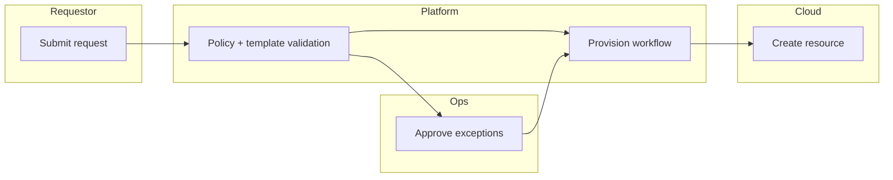

# Swimlane Diagrams

```mermaid
flowchart LR
  subgraph Requestor
    A[Submit request]
  end
  subgraph Platform
    B[Policy + template validation]
    C[Provision workflow]
  end
  subgraph Ops
    D[Approve exceptions]
  end
  subgraph Cloud
    E[Create resource]
  end
  A --> B --> C --> E
  B --> D --> C
```
