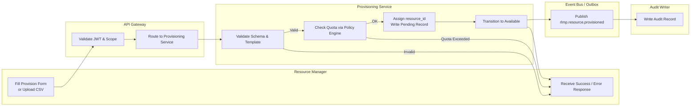
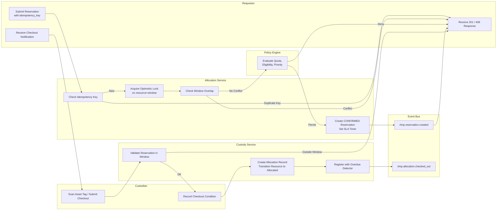
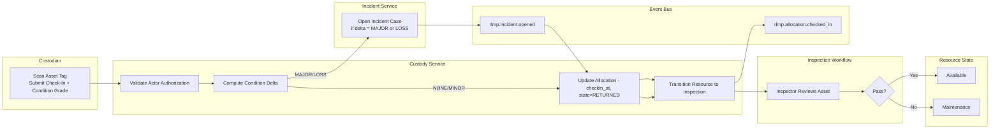
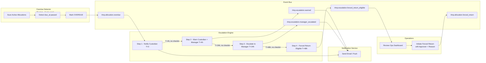
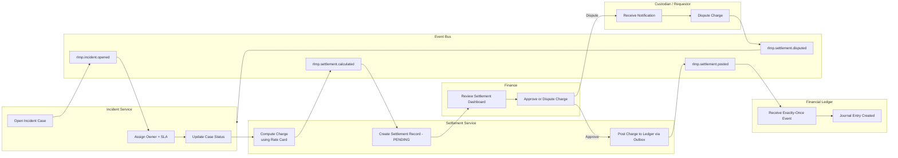

# Swimlane Diagrams

Cross-actor swimlane diagrams showing who does what and when in the **Resource Lifecycle Management Platform**. Each diagram is organized by horizontal swimlane (one per actor/system) to make handoffs and responsibilities unambiguous.

---

## 1. Resource Provisioning Swimlane

---

## 2. Reservation and Allocation Swimlane

---

## 3. Check-In and Condition Assessment Swimlane

---

## 4. Overdue Escalation Swimlane

---

## 5. Settlement and Incident Resolution Swimlane

---

## Cross-References

- Activity diagrams (decision detail): [activity-diagrams.md](./activity-diagrams.md)
- System sequence diagrams: [../high-level-design/system-sequence-diagrams.md](../high-level-design/system-sequence-diagrams.md)
- Business rules driving each handoff: [business-rules.md](./business-rules.md)
