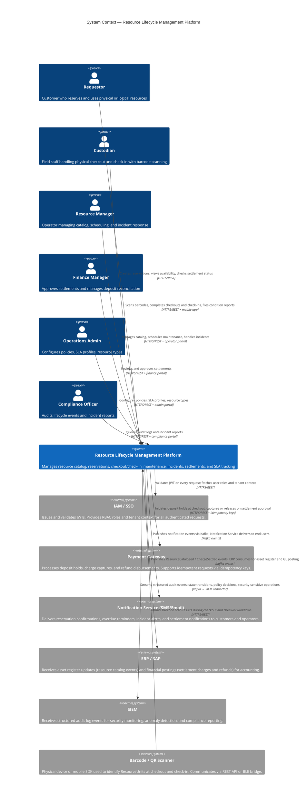
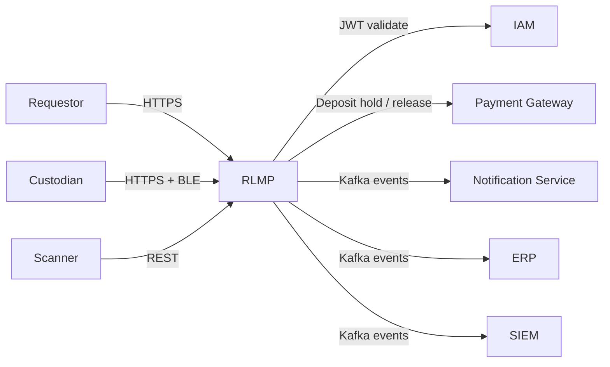

# System Context Diagram — Resource Lifecycle Management Platform

## Purpose

This document describes the Resource Lifecycle Management Platform (RLMP) in the context of its
external environment. It defines the system boundary, identifies all external actors and systems,
and describes the nature of each integration.

---

## C4 Level 1 — System Context Diagram

---

## External System Profiles

### IAM / SSO

| Attribute | Detail |
|-----------|--------|
| **Purpose** | Central identity provider for all RLMP actors |
| **Protocol** | OAuth 2.0 / OpenID Connect; JWT tokens (RS256) |
| **Integration Point** | API Gateway validates Bearer token on every inbound request |
| **Data Exchanged** | Access token, user_id, tenant_id, roles[] |
| **Failure Mode** | Hard dependency — all requests rejected if IAM is unreachable |
| **SLA Requirement** | ≥ 99.99% availability; token validation must complete < 20 ms (local JWKS cache) |

### Payment Gateway

| Attribute | Detail |
|-----------|--------|
| **Purpose** | Authorise and capture deposits; disburse refunds on settlement |
| **Protocol** | HTTPS REST with HMAC-signed requests; idempotency key header |
| **Integration Point** | Checkout Service calls `/holds`, `/captures`, `/refunds` |
| **Data Exchanged** | payment_method_id, amount, currency, idempotency_key, hold_reference |
| **Failure Mode** | Soft dependency — deposit hold failure blocks checkout; retry with exponential backoff up to 3 attempts |
| **SLA Requirement** | p95 hold initiation ≤ 2 s; settlement disbursement ≤ 30 s |

### Notification Service (SMS/Email)

| Attribute | Detail |
|-----------|--------|
| **Purpose** | Deliver transactional notifications to customers and operators |
| **Protocol** | Kafka consumer on `notifications.outbound` topic |
| **Notification Types** | Reservation confirmed, Reservation cancelled, Checkout completed, Overdue reminder (1 h/4 h/24 h), Incident created, Settlement approved |
| **Failure Mode** | Async — RLMP fires-and-forgets via Kafka; retry handled by Notification Service |
| **Data Exchanged** | notification_type, recipient, template_id, template_vars, idempotency_key |

### ERP / SAP

| Attribute | Detail |
|-----------|--------|
| **Purpose** | Asset register (resource catalog) and financial accounting (settlements) |
| **Protocol** | Kafka consumer on `erp.sync` topic; SAP IDoc adapter on receiving end |
| **Data Exchanged** | ResourceCataloged (asset creation), ChargeSettled (GL posting), DepositReleased (refund posting) |
| **Failure Mode** | Async — RLMP publishes events; ERP lag is acceptable up to 15 min |
| **Reconciliation** | Nightly reconciliation job cross-checks RLMP settlement totals vs. SAP posting totals |

### SIEM

| Attribute | Detail |
|-----------|--------|
| **Purpose** | Security event monitoring, anomaly detection, compliance audit trail |
| **Protocol** | Kafka connector → SIEM ingest pipeline (Splunk / Elastic SIEM) |
| **Events Forwarded** | All state-transition events, policy-evaluation decisions, failed auth attempts, override actions |
| **Data Classification** | Audit-grade; records must be tamper-evident, retained for ≥ 7 years |
| **Latency SLO** | Audit events delivered to SIEM within 10 s of origination |

### Barcode / QR Scanner

| Attribute | Detail |
|-----------|--------|
| **Purpose** | Identify physical ResourceUnits by their barcode or QR code during checkout and check-in |
| **Protocol** | REST POST to `/checkouts` or `/check-ins` with scanned_barcode field; mobile SDK for BLE scanners |
| **Offline Mode** | Custodian mobile app queues scans locally; syncs on reconnection |
| **Validation** | Barcode validated against resource_units.barcode_id with exact match; returns resource_unit_id |

---

## Data Flow Summary

---

## Security Boundary

All inbound traffic passes through the API Gateway, which enforces:
1. **TLS 1.3** termination
2. **JWT validation** (RS256 signature + expiry check via local JWKS cache)
3. **Tenant isolation** — `tenant_id` extracted from JWT claims and injected into all downstream service calls
4. **Rate limiting** — 1,000 rps per tenant; 100 rps per individual user
5. **WAF rules** — OWASP Top 10 rule set applied at edge
