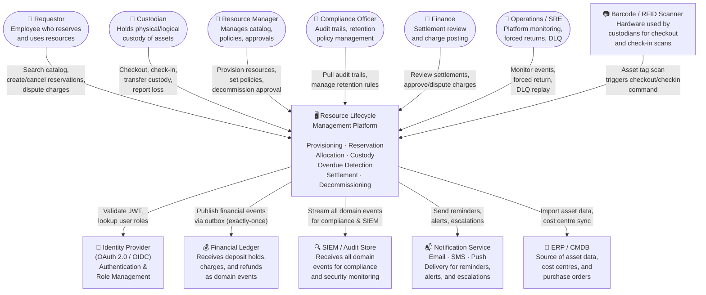
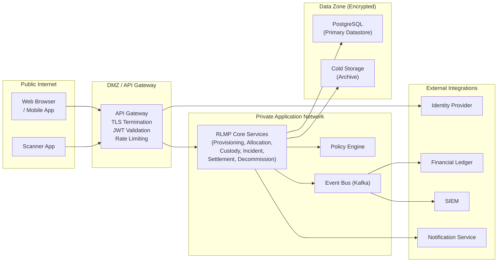

# System Context Diagram

High-level view of the **Resource Lifecycle Management Platform** and all external systems, users, and integrations it interacts with.

## Context Description

The RLMP is the central system of record for asset lifecycle management. It sits between human actors (requestors, managers, custodians, compliance, finance, operations) and a set of external technical systems (identity provider, financial ledger, SIEM, notification delivery, and integrating enterprise systems).

---

## System Context Diagram (C4 Level 1)

---

## External System Descriptions

| External System | Protocol / Integration | Data Exchanged | Criticality |
|---|---|---|---|
| **Identity Provider** | OAuth 2.0 / OIDC (JWT) | User identity, role claims, group memberships | Critical – all API calls require valid JWT |
| **Financial Ledger** | Async event (outbox → event bus) | Deposit holds, damage charges, refunds, reconciliation confirmations | High – financial integrity depends on this |
| **SIEM / Audit Store** | Event stream (Kafka / Kinesis) | All domain events with actor, correlation ID, timestamps | High – compliance and forensic audit |
| **Notification Service** | HTTP API / message queue | Reminder emails, SMS, push; escalation notifications | Medium – degraded-mode OK with retry |
| **ERP / CMDB** | REST API (inbound sync) | Asset master data, purchase orders, cost centres | Medium – sync at provisioning time |
| **Barcode / RFID Scanner** | Local HTTP or mobile app | Asset tag value triggering checkout/checkin commands | High – primary field interaction method |

---

## Trust Boundaries

---

## Integration Contract Summary

| Integration | Direction | Consistency Model | Failure Mode |
|---|---|---|---|
| Identity Provider | Inbound (token validation) | Synchronous, cached 60 s | Deny request if IAM unreachable; alert ops |
| Financial Ledger | Outbound (event) | Async, exactly-once via outbox | Queue events; retry with exponential backoff |
| SIEM | Outbound (event stream) | Async, at-least-once | Events queued; loss acceptable only if SIEM fully down |
| Notification Service | Outbound (event consumer) | Async, at-least-once | Retry with backoff; missed notification non-blocking |
| ERP / CMDB | Bidirectional (sync job) | Eventual, daily batch | Alert on sync failure; manual reconciliation available |
| Scanner | Inbound (command) | Synchronous | Retry via mobile app; offline mode stores scan locally |

---

## Cross-References

- Detailed service topology: [../high-level-design/architecture-diagram.md](../high-level-design/architecture-diagram.md)
- C4 Container and Component views: [../high-level-design/c4-diagrams.md](../high-level-design/c4-diagrams.md)
- Infrastructure topology: [../infrastructure/deployment-diagram.md](../infrastructure/deployment-diagram.md)
