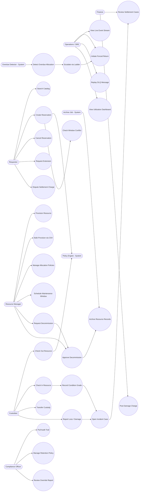

# Use Case Diagram

Visual overview of all primary actors and their relationships to use cases in the **Resource Lifecycle Management Platform**.

## Actors

| Actor | Type | Description |
|---|---|---|
| Requestor | Primary | Searches catalog and submits reservation requests |
| Custodian | Primary | Checks out and returns resources; holds custody |
| Resource Manager | Primary | Manages catalog, policies, approvals, and decommissioning |
| Compliance Officer | Primary | Reviews audit evidence and manages retention policies |
| Finance | Primary | Manages settlement cases and financial reconciliation |
| Operations / SRE | Primary | Operates exception runbooks and monitors platform health |
| Overdue Detector | System | Scheduled job that detects and escalates overdue allocations |
| Policy Engine | System | Evaluates quota, eligibility, and priority rules |
| Archive Job | System | Moves decommissioned records to cold storage |

## Use Case Diagram

## Actor–Use Case Summary

| Actor | Primary Use Cases |
|---|---|
| Requestor | Search Catalog, Create Reservation, Cancel Reservation, Request Extension, Dispute Settlement Charge |
| Custodian | Check Out, Check In, Transfer Custody, Report Loss/Damage |
| Resource Manager | Provision Resource, Bulk Provision, Manage Policy, Schedule Maintenance, Request & Approve Decommission |
| Compliance Officer | Pull Audit Trail, Manage Retention, Review Override Report |
| Finance | Review Settlement Cases, Post Damage Charge |
| Operations / SRE | Forced Return, View Event Stream, Replay DLQ, View Dashboard |
| Overdue Detector | Detect Overdue, Escalate via Ladder |
| Policy Engine | Evaluate Quota, Eligibility, Priority |
| Archive Job | Archive Resource Records |

## Cross-References

- Detailed use case flows: [use-case-descriptions.md](./use-case-descriptions.md)
- Actor authorization rules: [business-rules.md](./business-rules.md)
- Functional requirements per use case: [../requirements/requirements.md](../requirements/requirements.md)
