# Use-Case Diagram — Resource Lifecycle Management Platform

## Actors

| Actor | Type | Description |
|-------|------|-------------|
| **Requestor** | Primary | Customer who reserves and uses resources |
| **Custodian** | Primary | Field staff who handles physical handoff and return |
| **Resource Manager** | Primary | Operator responsible for catalog and day-to-day operations |
| **Operations Admin** | Primary | Configures policies, SLA profiles, and resource types |
| **Finance Manager** | Primary | Approves settlements and manages deposit reconciliation |
| **Compliance Officer** | Primary | Reviews audit trails, incidents, and overdue reports |
| **Payment Gateway** | External | Processes deposit holds, captures, and refunds |
| **IAM/SSO** | External | Authenticates actors and issues JWTs |
| **Notification Service** | External | Delivers email and SMS notifications |
| **Overdue Detector** | System | Automated timer service that triggers escalation flows |
| **SLA Monitor** | System | Automated monitor that detects SLA breaches |

---

## Use-Case Diagram

```mermaid
flowchart TD
    subgraph Requestor_Actor["Requestor"]
        R1([Search Resource Availability])
        R2([Create Reservation])
        R3([Cancel Reservation])
        R4([View Reservation History])
        R5([Track Deposit and Settlement])
    end

    subgraph Custodian_Actor["Custodian"]
        C1([Scan Barcode at Checkout])
        C2([Complete Checkout])
        C3([Scan Barcode at Check-In])
        C4([File Condition Report])
        C5([Report Incident])
    end

    subgraph ResourceManager_Actor["Resource Manager"]
        M1([Catalog New Resource])
        M2([Activate Resource])
        M3([Schedule Maintenance])
        M4([Cancel Conflicting Reservations])
        M5([Assign Custodian to Checkout])
        M6([Retire Resource])
    end

    subgraph OpsAdmin_Actor["Operations Admin"]
        O1([Define Resource Type])
        O2([Configure Policy])
        O3([Configure SLA Profile])
        O4([Manage Integration Config])
    end

    subgraph Finance_Actor["Finance Manager"]
        F1([Review Settlement])
        F2([Approve Settlement])
        F3([Generate Settlement Report])
        F4([Reconcile Deposit Ledger])
    end

    subgraph Compliance_Actor["Compliance Officer"]
        L1([Audit Resource Lifecycle Events])
        L2([Review Incident Reports])
        L3([Monitor Overdue Escalations])
        L4([Export Compliance Report])
    end

    subgraph System_Actor["System Automated"]
        S1([Detect Overdue Resource])
        S2([Escalate Overdue Incident])
        S3([Detect SLA Breach])
        S4([Issue SLA Credit])
    end

    Requestor_Actor --> R1
    Requestor_Actor --> R2
    Requestor_Actor --> R3
    Requestor_Actor --> R4
    Requestor_Actor --> R5

    Custodian_Actor --> C1
    Custodian_Actor --> C2
    Custodian_Actor --> C3
    Custodian_Actor --> C4
    Custodian_Actor --> C5

    ResourceManager_Actor --> M1
    ResourceManager_Actor --> M2
    ResourceManager_Actor --> M3
    ResourceManager_Actor --> M4
    ResourceManager_Actor --> M5
    ResourceManager_Actor --> M6

    OpsAdmin_Actor --> O1
    OpsAdmin_Actor --> O2
    OpsAdmin_Actor --> O3
    OpsAdmin_Actor --> O4

    Finance_Actor --> F1
    Finance_Actor --> F2
    Finance_Actor --> F3
    Finance_Actor --> F4

    Compliance_Actor --> L1
    Compliance_Actor --> L2
    Compliance_Actor --> L3
    Compliance_Actor --> L4

    System_Actor --> S1
    System_Actor --> S2
    System_Actor --> S3
    System_Actor --> S4
```

---

## Use-Case Relationships

### Include Relationships

| Use Case | Includes | Description |
|----------|----------|-------------|
| Create Reservation | Search Resource Availability | Must query availability before booking |
| Complete Checkout | Scan Barcode at Checkout | Barcode scan is required step |
| Complete Checkout | Initiate Deposit Hold | Payment hold is mandatory (BR-03) |
| File Condition Report | Complete Check-In | Condition report follows check-in |
| Approve Settlement | Review Settlement | Review precedes approval |
| Escalate Overdue Incident | Detect Overdue Resource | Detection triggers escalation |
| Issue SLA Credit | Detect SLA Breach | Breach detection triggers credit |

### Extend Relationships

| Use Case | Extends | Condition |
|----------|---------|-----------|
| Cancel Conflicting Reservations | Schedule Maintenance | When new maintenance conflicts with existing reservations (BR-05) |
| Auto-Create Incident | File Condition Report | When severity ≥ MODERATE (BR-06) |
| Apply Cancellation Fee | Cancel Reservation | When cancelled within lead-time window |
| Legal Hold | Escalate Overdue Incident | When resource overdue > 24 h (BR-08) |
| Assign Replacement Resource | Cancel Conflicting Reservations | When operator chooses to offer substitute |

---

## Actor–Use-Case Matrix

| Use Case | Requestor | Custodian | Res. Mgr | Ops Admin | Finance | Compliance |
|----------|-----------|-----------|----------|-----------|---------|------------|
| Search Resource Availability | ✓ | ✓ | ✓ | — | — | — |
| Create Reservation | ✓ | — | ✓ | — | — | — |
| Cancel Reservation | ✓ | — | ✓ | — | — | — |
| Catalog New Resource | — | — | ✓ | ✓ | — | — |
| Activate / Retire Resource | — | — | ✓ | ✓ | — | — |
| Complete Checkout | — | ✓ | ✓ | — | — | — |
| File Condition Report | — | ✓ | — | — | — | — |
| Report Incident | — | ✓ | ✓ | — | — | — |
| Schedule Maintenance | — | — | ✓ | ✓ | — | — |
| Configure Policy | — | — | — | ✓ | — | — |
| Configure SLA Profile | — | — | — | ✓ | — | — |
| Approve Settlement | — | — | — | — | ✓ | — |
| Audit Lifecycle Events | — | — | — | — | — | ✓ |
| Monitor Overdue Escalations | — | — | ✓ | — | — | ✓ |
