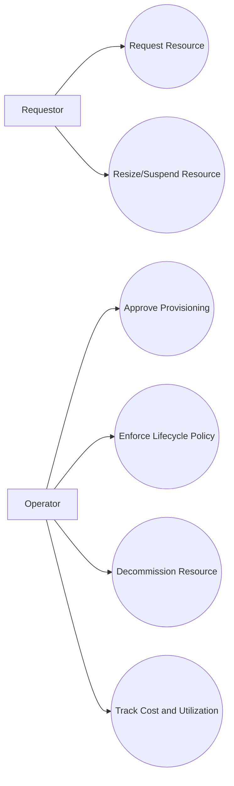

# Use Case Diagram

```mermaid
flowchart LR
  Requestor --> UC1((Request Resource))
  Operator --> UC2((Approve Provisioning))
  Requestor --> UC3((Resize/Suspend Resource))
  Operator --> UC4((Enforce Lifecycle Policy))
  Operator --> UC5((Decommission Resource))
  Operator --> UC6((Track Cost and Utilization))
```
