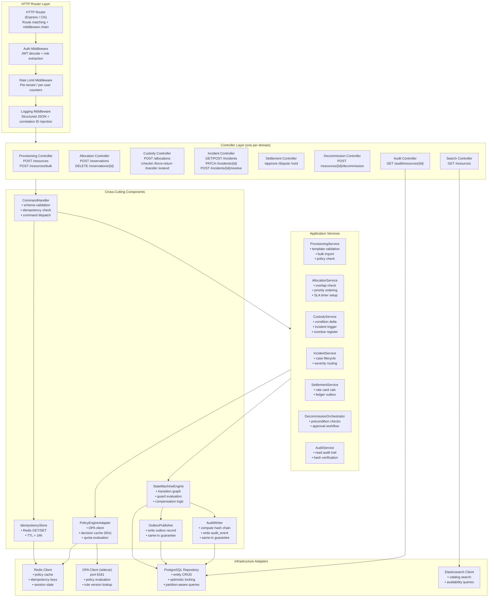

# C4 Component Diagram

Detailed C4 Level 3 component diagram for the **Core API** container of the Resource Lifecycle Management Platform, showing all internal components, their responsibilities, and communication interfaces.

---

## Core API Container – Internal Component View



---

## Component Responsibilities

| Component | Responsibility | Key Dependency |
|---|---|---|
| HTTP Router | Route matching, middleware chain | Express / Chi framework |
| Auth Middleware | Extract and validate JWT claims; attach `actorContext` to request | Identity Provider (cached JWKS) |
| Rate Limit Middleware | Per-tenant and per-user counter enforcement | Redis |
| Controller | Parse HTTP request; call command handler; format HTTP response | Application Service |
| CommandHandler | Schema validation; idempotency check; select correct service | IdempotencyStore, Application Services |
| StateMachineEngine | Enforce state graph transitions; call guards; execute command; call outbox and audit publishers | PostgreSQL Repository, OutboxPublisher, AuditWriter |
| PolicyEngineAdapter | Send policy requests to OPA; cache decisions for 60 s; handle OPA unavailability | OPA Sidecar, Redis |
| OutboxPublisher | Write outbox record in same transaction as entity mutation | PostgreSQL (same connection) |
| AuditWriter | Compute SHA-256 hash chain entry; write immutable audit_event | PostgreSQL (same connection) |
| IdempotencyStore | Redis-backed idempotency key cache (24 h TTL) | Redis |
| PostgreSQL Repository | All entity persistence; optimistic locking; partition-aware | PostgreSQL 15 |

---

## Key Internal Contracts

### CommandHandler → StateMachineEngine

```
Input:  TransitionCommand { entity_id, command_name, payload, actor_context, idempotency_key }
Output: TransitionResult  { new_state, version, emitted_events[] }
Throws: TransitionError   { current_state, reason, error_code }
```

### StateMachineEngine → PolicyEngineAdapter

```
Input:  PolicyRequest { action, resource_id, requestor_id, tenant_id, window, quota_context }
Output: PolicyDecision { decision: PERMIT | DENY, matched_rule_id, reason }
```

### StateMachineEngine → OutboxPublisher + AuditWriter

Both are called within the same database transaction:
```
outboxPub.publish(event, connection)   // writes to outbox table
auditWriter.write(record, connection)  // writes to audit_events table
// transaction committed by StateMachineEngine
```

---

## Cross-References

- Container-level C4 view: [../high-level-design/c4-diagrams.md](../high-level-design/c4-diagrams.md)
- Class diagrams (method signatures): [class-diagrams.md](./class-diagrams.md)
- Lifecycle orchestration (transition logic): [lifecycle-orchestration.md](./lifecycle-orchestration.md)
