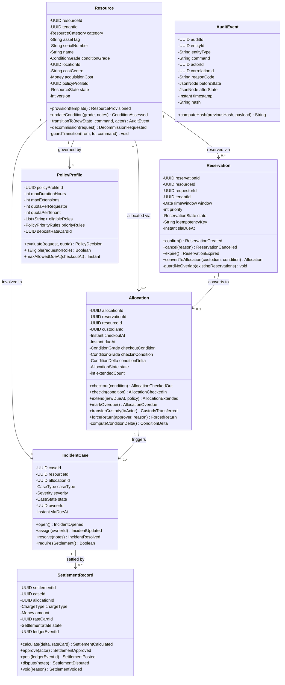
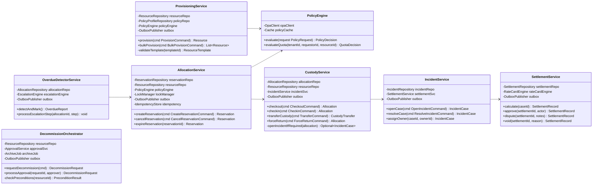
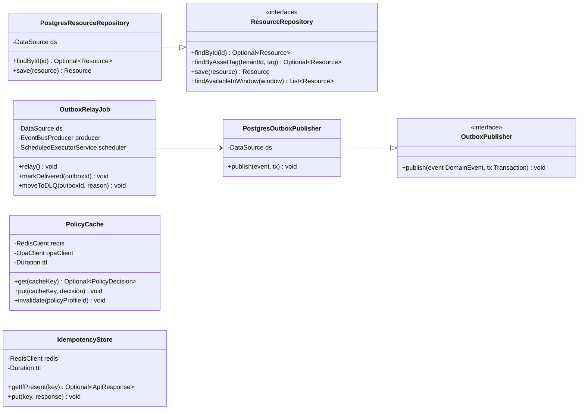

# Class Diagrams

Detailed class diagrams for the **Resource Lifecycle Management Platform** implementation layers: domain model, application services, and infrastructure adapters.

---

## 1. Core Domain Classes

---

## 2. Application Service Layer

---

## 3. Infrastructure Layer

---

## Cross-References

- Domain model (aggregate overview): [../high-level-design/domain-model.md](../high-level-design/domain-model.md)
- ERD (persistence layer): [erd-database-schema.md](./erd-database-schema.md)
- Component diagrams (deployment view): [component-diagrams.md](./component-diagrams.md)
