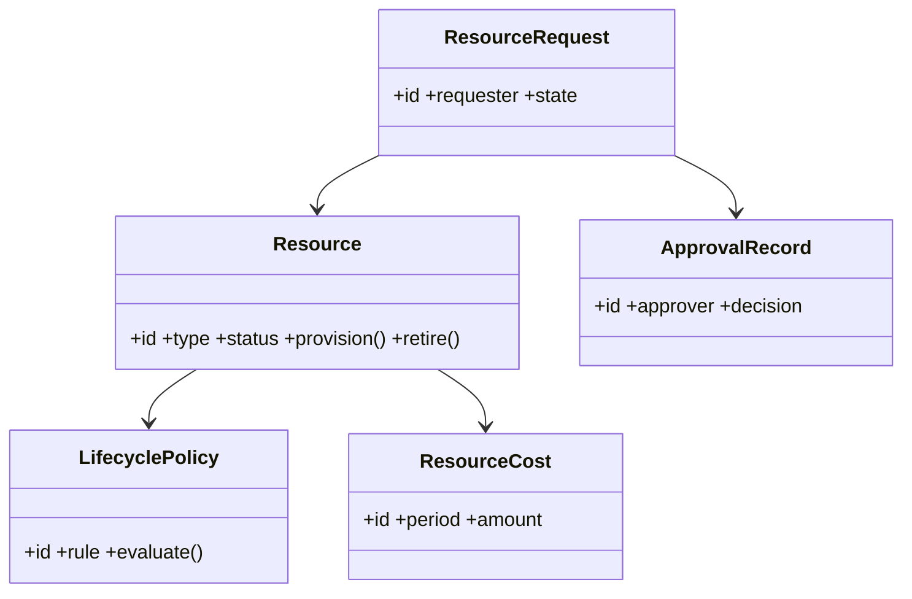

# Class Diagrams

```mermaid
classDiagram
  class Resource {+id +type +status +provision() +retire()}
  class ResourceRequest {+id +requester +state}
  class LifecyclePolicy {+id +rule +evaluate()}
  class ApprovalRecord {+id +approver +decision}
  class ResourceCost {+id +period +amount}
  ResourceRequest --> Resource
  Resource --> LifecyclePolicy
  Resource --> ResourceCost
  ResourceRequest --> ApprovalRecord
```
