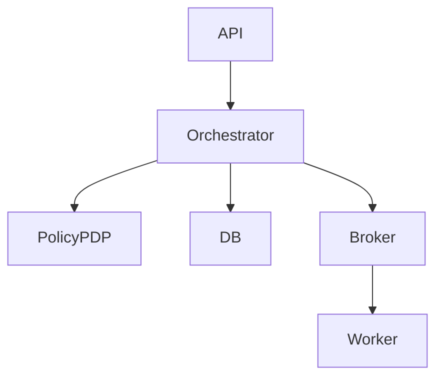

# Component Diagrams

Low-level engineering specification that can be implemented directly by backend/integration teams.

## Artifact-Specific Objectives
- Specify concrete schemas, state transitions, and component interfaces.
- Define transaction boundaries, idempotency keys, and retry semantics.
- Include migration and backward compatibility constraints.

## Engineering Detail Matrix

| Component Concern | Required Detail | Done When |
|---|---|---|
| API contracts | request/response/error schemas with examples | OpenAPI/proto merged and linted |
| Persistence | normalized schema/indexing/retention | migration tested on production-like dataset |
| State logic | transition guards + compensation | state-machine and chaos tests pass |

## Lifecycle and Governance Specifics

- **Provisioning in Component Diagrams**: Define preconditions, policy gate, and emitted evidence artifact.
- **Allocation in Component Diagrams**: Define contention handling, SLA timers, and rollback behavior.
- **Decommissioning in Component Diagrams**: Define terminal checks, retention obligations, and approval authority.
- **Exception workflow in Component Diagrams**: Detect → classify → contain → resolve → recover → postmortem with owner + SLA.

## Implementation Checklist

- [ ] Artifact reviewed by engineering, operations, and governance stakeholders.
- [ ] Traceability links added to related requirements/design/runbooks.
- [ ] Failure-path and compensation behavior documented in testable form.
- [ ] Metrics and alerts mapped to artifact outcomes.

## Mermaid Diagram

