# Component Diagrams

Logical component diagram showing all deployable units in the **Resource Lifecycle Management Platform** and their communication interfaces.

---

## Service Component Breakdown

```mermaid
flowchart TB
  subgraph Public["Public Layer"]
    APIGW["API Gateway\n(Kong / AWS APIGW)\nPort 443\nTLS, JWT, Rate Limiting"]
  end

  subgraph CoreServices["Core Domain Services (Internal Network)"]
    CoreAPI["Core API Service\n(Node.js / Go)\nPort 8080\nHTTP/REST\n\nProvisioning · Allocation\nCustody · Incident\nSettlement · Decommission\nAudit endpoints"]
    PolicyEng["Policy Engine\n(OPA Sidecar)\nPort 8181\nHTTP/REST\nEvaluates: quota, eligibility,\npriority, override rules"]
  end

  subgraph AsyncServices["Async Services (Internal Network)"]
    OutboxRelay["Outbox Relay Job\n(Cron, every 1 s)\nPostgres → Kafka producer"]
    OverdueDetector["Overdue Detector\n(Cron, every 5 min)\nScans active allocations"]
    EscalationEngine["Escalation Engine\n(Event consumer)\nProcesses escalation steps"]
    SettlementWorker["Settlement Worker\n(Event consumer)\nCalculates charges\nPosts to ledger outbox"]
    NotifWorker["Notification Worker\n(Event consumer)\nDelivers email/SMS/push"]
    SearchIndexer["Search Indexer\n(Event consumer)\nUpdates Elasticsearch index"]
    AuditForwarder["Audit Forwarder\n(Event consumer)\nForwards to SIEM"]
    ArchiveJob["Archive Job\n(Triggered by Decommission)\nWrites to cold storage"]
  end

  subgraph DataLayer["Data Layer"]
    Postgres["PostgreSQL 15\nPrimary\nPort 5432"]
    ReadReplica["PostgreSQL\nRead Replica\nPort 5433"]
    Redis["Redis 7\nPort 6379\nPolicy cache · Idempotency"]
    Kafka["Apache Kafka\nPort 9092\nEvent streaming"]
    Elasticsearch["Elasticsearch 8\nPort 9200\nCatalog search"]
    S3["Object Storage\n(S3 / GCS)\nArchive + Photo Evidence"]
  end

  subgraph External["External Systems"]
    IAM["Identity Provider\n(Auth0 / Okta / Cognito)\nOAuth2 / OIDC"]
    Ledger["Financial Ledger\n(ERP / Stripe / Internal)"]
    SIEM_ext["SIEM\n(Splunk / Datadog)"]
    NotifSvc_ext["Notification Service\n(SendGrid / Twilio)"]
    ERPsys["ERP / CMDB\n(ServiceNow / SAP)"]
  end

  %% Public → Core
  APIGW -->|"JWT validation"| IAM
  APIGW -->|"HTTP/REST"| CoreAPI

  %% Core → Internal
  CoreAPI -->|"HTTP"| PolicyEng
  CoreAPI -->|"SQL (pool)"| Postgres
  CoreAPI -->|"GET/SET"| Redis
  CoreAPI -->|"SQL (write outbox)"| Postgres

  %% Async pipeline
  OutboxRelay -->|"SQL SELECT pending"| Postgres
  OutboxRelay -->|"Kafka produce"| Kafka

  Kafka -->|"Consume"| OverdueDetector
  Kafka -->|"Consume"| EscalationEngine
  Kafka -->|"Consume"| SettlementWorker
  Kafka -->|"Consume"| NotifWorker
  Kafka -->|"Consume"| SearchIndexer
  Kafka -->|"Consume"| AuditForwarder
  Kafka -->|"Consume"| ArchiveJob

  %% Workers → stores
  OverdueDetector -->|"SQL"| Postgres
  EscalationEngine -->|"Kafka produce"| Kafka
  SettlementWorker -->|"SQL"| Postgres
  SettlementWorker -->|"Kafka produce"| Kafka
  SearchIndexer -->|"REST"| Elasticsearch
  AuditForwarder -->|"HTTP / Syslog"| SIEM_ext
  ArchiveJob -->|"SDK"| S3
  NotifWorker -->|"HTTP"| NotifSvc_ext

  %% Read path
  CoreAPI -->|"SQL (read)"| ReadReplica
  CoreAPI -->|"REST"| Elasticsearch

  %% External outbound
  SettlementWorker -->|"Event"| Ledger

  %% ERP inbound
  ERPsys -->|"REST sync"| APIGW
```

---

## Component Interface Summary

| Component | Inbound Interface | Outbound Interface | State |
|---|---|---|---|
| API Gateway | HTTPS from clients | JWT validation to IAM; HTTP to Core API | Stateless |
| Core API | HTTP/REST from APIGW | SQL to Postgres; HTTP to Policy Engine; GET/SET to Redis | Stateless |
| Policy Engine | HTTP from Core API | None (in-memory evaluation) | In-memory policy cache |
| Outbox Relay | Cron trigger | SQL read from Postgres; Kafka produce | Stateless |
| Overdue Detector | Cron trigger | SQL read/write to Postgres; Kafka produce | Stateless |
| Escalation Engine | Kafka consume | Kafka produce; HTTP to Notification Service | Stateless |
| Settlement Worker | Kafka consume | SQL write to Postgres; Kafka produce | Stateless |
| Notification Worker | Kafka consume | HTTP to Notification Service | Stateless |
| Search Indexer | Kafka consume | REST to Elasticsearch | Stateless |
| Audit Forwarder | Kafka consume | HTTP/Syslog to SIEM | Stateless |
| Archive Job | Decommission event | SQL read; S3 write | Stateless |

---

## Scaling Characteristics

| Component | Scaling Axis | Bottleneck |
|---|---|---|
| Core API | Horizontal (stateless pods) | PostgreSQL write throughput |
| Policy Engine | Co-located sidecar (1:1 with Core API pod) | OPA rule evaluation time |
| Kafka consumers | Partition-parallel | Partition count (default 12 per topic) |
| Overdue Detector | Single leader (leader election via Redis) | Query over `allocations` table size |
| Elasticsearch | Shard-based scale-out | Index refresh latency |

---

## Cross-References

- C4 Container diagram: [../high-level-design/c4-diagrams.md](../high-level-design/c4-diagrams.md)
- Infrastructure deployment: [../infrastructure/deployment-diagram.md](../infrastructure/deployment-diagram.md)
- Class diagrams (internal code structure): [class-diagrams.md](./class-diagrams.md)
