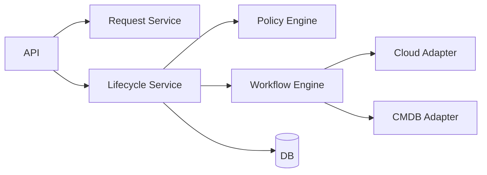

# Component Diagrams

```mermaid
flowchart LR
  API --> RequestSvc[Request Service]
  API --> LifecycleSvc[Lifecycle Service]
  LifecycleSvc --> PolicySvc[Policy Engine]
  LifecycleSvc --> Workflow[Workflow Engine]
  Workflow --> CloudAdapter[Cloud Adapter]
  Workflow --> CMDBAdapter[CMDB Adapter]
  LifecycleSvc --> DB[(DB)]
```
