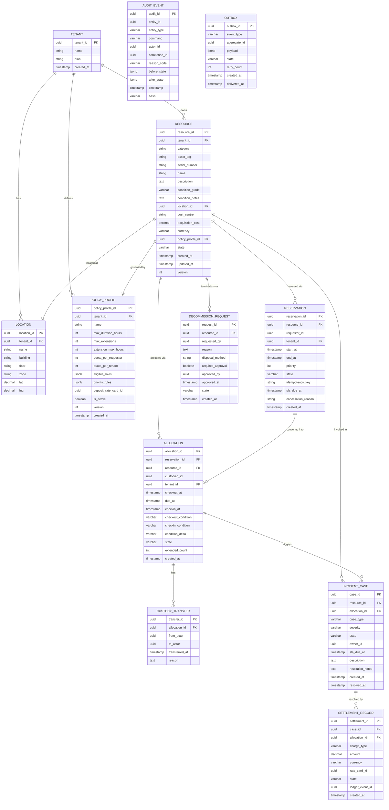

# ERD Database Schema

Complete entity-relationship diagram and table definitions for the **Resource Lifecycle Management Platform** PostgreSQL primary datastore.

---

## Entity-Relationship Diagram



---

## Key Table Definitions

### resources

```sql
CREATE TABLE resources (
  resource_id       UUID PRIMARY KEY DEFAULT gen_random_uuid(),
  tenant_id         UUID NOT NULL REFERENCES tenants(tenant_id),
  category          VARCHAR(32) NOT NULL CHECK (category IN ('EQUIPMENT','VEHICLE','SPACE','LICENSE','TOOL','CONSUMABLE')),
  asset_tag         VARCHAR(64) NOT NULL,
  serial_number     VARCHAR(128),
  name              VARCHAR(255) NOT NULL,
  description       TEXT,
  condition_grade   CHAR(1) NOT NULL CHECK (condition_grade IN ('A','B','C','D')),
  condition_notes   TEXT,
  location_id       UUID NOT NULL REFERENCES locations(location_id),
  cost_centre       VARCHAR(64) NOT NULL,
  acquisition_cost  NUMERIC(12,2),
  currency          CHAR(3),
  policy_profile_id UUID NOT NULL REFERENCES policy_profiles(policy_profile_id),
  state             VARCHAR(32) NOT NULL DEFAULT 'PENDING',
  created_at        TIMESTAMPTZ NOT NULL DEFAULT NOW(),
  updated_at        TIMESTAMPTZ NOT NULL DEFAULT NOW(),
  version           INTEGER NOT NULL DEFAULT 1,
  CONSTRAINT resources_tenant_tag_unique UNIQUE (tenant_id, asset_tag)
);

CREATE INDEX idx_resources_tenant_state    ON resources(tenant_id, state);
CREATE INDEX idx_resources_tenant_category ON resources(tenant_id, category);
CREATE INDEX idx_resources_location        ON resources(location_id);
```

---

### reservations

```sql
CREATE TABLE reservations (
  reservation_id    UUID PRIMARY KEY DEFAULT gen_random_uuid(),
  resource_id       UUID NOT NULL REFERENCES resources(resource_id),
  requestor_id      UUID NOT NULL,
  tenant_id         UUID NOT NULL REFERENCES tenants(tenant_id),
  start_at          TIMESTAMPTZ NOT NULL,
  end_at            TIMESTAMPTZ NOT NULL CHECK (end_at > start_at),
  priority          INTEGER NOT NULL DEFAULT 5 CHECK (priority BETWEEN 1 AND 10),
  state             VARCHAR(32) NOT NULL DEFAULT 'PENDING',
  idempotency_key   VARCHAR(128) NOT NULL,
  sla_due_at        TIMESTAMPTZ,
  cancellation_reason VARCHAR(255),
  created_at        TIMESTAMPTZ NOT NULL DEFAULT NOW(),
  CONSTRAINT reservations_idempotency_unique UNIQUE (tenant_id, idempotency_key)
);

-- Exclusion constraint prevents overlapping CONFIRMED reservations for same resource
ALTER TABLE reservations
  ADD CONSTRAINT no_overlap_confirmed
  EXCLUDE USING gist (
    resource_id WITH =,
    tstzrange(start_at, end_at, '[]') WITH &&
  )
  WHERE (state = 'CONFIRMED');

CREATE INDEX idx_reservations_resource_state ON reservations(resource_id, state);
CREATE INDEX idx_reservations_requestor      ON reservations(requestor_id, tenant_id);
CREATE INDEX idx_reservations_sla            ON reservations(sla_due_at) WHERE state = 'CONFIRMED';
```

---

### allocations

```sql
CREATE TABLE allocations (
  allocation_id       UUID PRIMARY KEY DEFAULT gen_random_uuid(),
  reservation_id      UUID REFERENCES reservations(reservation_id),
  resource_id         UUID NOT NULL REFERENCES resources(resource_id),
  custodian_id        UUID NOT NULL,
  tenant_id           UUID NOT NULL REFERENCES tenants(tenant_id),
  checkout_at         TIMESTAMPTZ NOT NULL,
  due_at              TIMESTAMPTZ NOT NULL,
  checkin_at          TIMESTAMPTZ,
  checkout_condition  CHAR(1) NOT NULL CHECK (checkout_condition IN ('A','B','C','D')),
  checkin_condition   CHAR(1) CHECK (checkin_condition IN ('A','B','C','D')),
  condition_delta     VARCHAR(16) CHECK (condition_delta IN ('NONE','MINOR','MAJOR','LOSS')),
  state               VARCHAR(32) NOT NULL DEFAULT 'ACTIVE',
  extended_count      INTEGER NOT NULL DEFAULT 0,
  created_at          TIMESTAMPTZ NOT NULL DEFAULT NOW()
);

CREATE INDEX idx_allocations_resource_state ON allocations(resource_id, state);
CREATE INDEX idx_allocations_custodian      ON allocations(custodian_id, state);
CREATE INDEX idx_allocations_overdue        ON allocations(due_at) WHERE state = 'ACTIVE';
```

---

### incident_cases

```sql
CREATE TABLE incident_cases (
  case_id         UUID PRIMARY KEY DEFAULT gen_random_uuid(),
  resource_id     UUID NOT NULL REFERENCES resources(resource_id),
  allocation_id   UUID REFERENCES allocations(allocation_id),
  case_type       VARCHAR(32) NOT NULL,
  severity        VARCHAR(16) NOT NULL,
  state           VARCHAR(32) NOT NULL DEFAULT 'OPEN',
  owner_id        UUID NOT NULL,
  sla_due_at      TIMESTAMPTZ NOT NULL,
  description     TEXT NOT NULL,
  resolution_notes TEXT,
  created_at      TIMESTAMPTZ NOT NULL DEFAULT NOW(),
  resolved_at     TIMESTAMPTZ
);

CREATE INDEX idx_incidents_resource ON incident_cases(resource_id, state);
CREATE INDEX idx_incidents_sla      ON incident_cases(sla_due_at) WHERE state IN ('OPEN','IN_REVIEW');
```

---

### audit_events

```sql
CREATE TABLE audit_events (
  audit_id       UUID PRIMARY KEY DEFAULT gen_random_uuid(),
  entity_id      UUID NOT NULL,
  entity_type    VARCHAR(64) NOT NULL,
  command        VARCHAR(128) NOT NULL,
  actor_id       UUID NOT NULL,
  correlation_id UUID NOT NULL,
  reason_code    VARCHAR(64),
  before_state   JSONB,
  after_state    JSONB,
  timestamp      TIMESTAMPTZ NOT NULL DEFAULT NOW(),
  hash           VARCHAR(64) NOT NULL
) PARTITION BY RANGE (timestamp);

-- Monthly partitions for efficient retention management
CREATE TABLE audit_events_2025_06 PARTITION OF audit_events
  FOR VALUES FROM ('2025-06-01') TO ('2025-07-01');

CREATE INDEX idx_audit_entity ON audit_events(entity_id, timestamp);
CREATE INDEX idx_audit_actor  ON audit_events(actor_id, timestamp);
```

---

### outbox

```sql
CREATE TABLE outbox (
  outbox_id     UUID PRIMARY KEY DEFAULT gen_random_uuid(),
  event_type    VARCHAR(128) NOT NULL,
  aggregate_id  UUID NOT NULL,
  payload       JSONB NOT NULL,
  state         VARCHAR(16) NOT NULL DEFAULT 'PENDING',
  retry_count   INTEGER NOT NULL DEFAULT 0,
  created_at    TIMESTAMPTZ NOT NULL DEFAULT NOW(),
  delivered_at  TIMESTAMPTZ
);

CREATE INDEX idx_outbox_pending ON outbox(created_at) WHERE state = 'PENDING';
```

---

## Indexing Strategy

| Table | Hot Queries | Index Strategy |
|---|---|---|
| `resources` | Tenant + state lookup; category filter | Composite `(tenant_id, state)`, `(tenant_id, category)` |
| `reservations` | Overlap check; requestor's active reservations | GiST exclusion on `(resource_id, tstzrange)`; composite `(requestor_id, tenant_id)` |
| `allocations` | Overdue scan; custodian view | Partial index on `due_at WHERE state='ACTIVE'`; composite `(custodian_id, state)` |
| `incident_cases` | Open cases by resource; SLA breach scan | Partial index on `sla_due_at WHERE state IN ('OPEN','IN_REVIEW')` |
| `audit_events` | Per-resource history; compliance export | Partitioned table; composite `(entity_id, timestamp)` |
| `outbox` | Relay job scan | Partial index on `created_at WHERE state='PENDING'` |

---

## Data Retention

| Table | Retention | Archival |
|---|---|---|
| `resources` | Active + 7 years post-decommission | Decommissioned records archived to cold storage |
| `reservations` | 3 years | Archive to cold storage after expiry + 3 years |
| `allocations` | 7 years | Archive to cold storage after checkin + 7 years |
| `audit_events` | 7 years minimum (configurable per compliance profile) | Monthly partitions moved to cold storage on expiry |
| `incident_cases` | 7 years | Archive with linked settlement records |
| `outbox` | 7 days | Delete after delivery; DLQ retains undelivered for 30 days |

---

## Cross-References

- Data dictionary: [../analysis/data-dictionary.md](../analysis/data-dictionary.md)
- Domain model: [../high-level-design/domain-model.md](../high-level-design/domain-model.md)
- Class diagrams: [class-diagrams.md](./class-diagrams.md)
