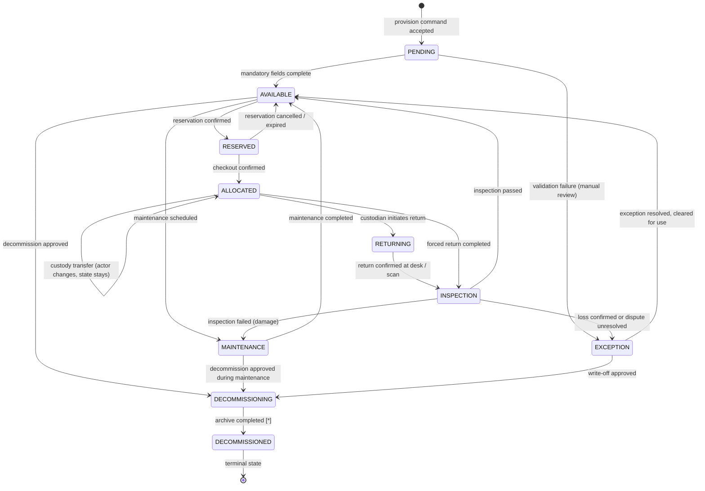
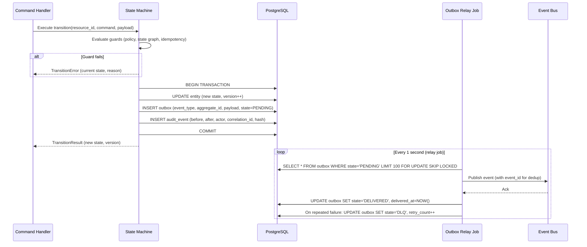

# Lifecycle Orchestration

This document specifies how the **Resource Lifecycle Management Platform** orchestrates state transitions, enforces transition guards, executes compensations, and manages the transactional outbox for reliable event delivery.

---

## Lifecycle State Graph

The state machine governs a single resource through its entire lifespan. All transitions are enforced by the **State Machine Engine** before any persistence occurs.

---

## Transition Table

| From State | To State | Command | Required Guards | Emitted Event | Compensation (on failure) |
|---|---|---|---|---|---|
| `PENDING` | `AVAILABLE` | `CompleteProvisioning` | All mandatory fields present; no duplicate asset_tag | `rlmp.resource.provisioned` | Revert to `PENDING` |
| `AVAILABLE` | `RESERVED` | `ConfirmReservation` | No window overlap; quota OK; eligibility OK | `rlmp.reservation.created` | Release optimistic lock; return 409 |
| `RESERVED` | `AVAILABLE` | `CancelReservation` | State = `CONFIRMED`; not yet converted | `rlmp.reservation.cancelled` | No compensation needed |
| `RESERVED` | `AVAILABLE` | `ExpireReservation` | SLA timer elapsed; no checkout occurred | `rlmp.reservation.expired` | No compensation needed |
| `RESERVED` | `ALLOCATED` | `Checkout` | Reservation in window; resource state = RESERVED/AVAILABLE; actor = custodian | `rlmp.allocation.checked_out` | Rollback allocation; revert resource to AVAILABLE |
| `AVAILABLE` | `ALLOCATED` | `DirectCheckout` | Policy permits direct allocation; no conflicting reservation | `rlmp.allocation.checked_out` | Rollback; revert resource to AVAILABLE |
| `ALLOCATED` | `ALLOCATED` | `TransferCustody` | Receiving actor has allocation eligibility | `rlmp.allocation.custody_transferred` | No state change on failure |
| `ALLOCATED` | `RETURNING` | `InitiateReturn` | Custodian identity confirmed | `rlmp.allocation.return_initiated` | Revert to ALLOCATED |
| `RETURNING` | `INSPECTION` | `ConfirmReturn` | Condition grade recorded; photo refs valid (if grade D) | `rlmp.allocation.checked_in` | Revert to RETURNING |
| `ALLOCATED` | `INSPECTION` | `ForceReturn` | Approver identity; reason code in override catalog; override not expired | `rlmp.allocation.forced_return` | Revert to ALLOCATED |
| `INSPECTION` | `AVAILABLE` | `PassInspection` | Inspector identity; grade A or B; no open incidents | `rlmp.resource.condition_assessed` | Revert to INSPECTION |
| `INSPECTION` | `MAINTENANCE` | `FailInspection` | Inspector identity; grade C or D or unresolved incident | `rlmp.resource.condition_assessed` | Revert to INSPECTION |
| `MAINTENANCE` | `AVAILABLE` | `CompleteMaintenance` | Maintenance ticket closed; grade A or B | `rlmp.resource.condition_assessed` | No auto-compensation |
| `AVAILABLE` | `DECOMMISSIONING` | `ApproveDecommission` | Zero open allocations; zero open settlements; retention lock expired; approval received if high-value | `rlmp.resource.decommission_approved` | Revert to AVAILABLE |
| `DECOMMISSIONING` | `DECOMMISSIONED` | `ArchiveComplete` | Archive manifest ID present; cold storage write confirmed | `rlmp.resource.decommissioned`, `rlmp.resource.archived` | Retry archive job; revert to DECOMMISSIONING |

---

## Transactional Outbox Pattern

Every state transition is committed atomically with its outbox record in a single PostgreSQL transaction. This ensures **no event is lost and no event is emitted for a rolled-back transition**.

---

## Idempotency and Retry Semantics

### Command-level Idempotency
- All write commands accept an `Idempotency-Key` header.
- The key is stored in Redis with TTL = 24 hours.
- On duplicate key: the original response is returned without re-executing the command.
- The key is cleared after the TTL; new commands with the same business intent must use a new key.

### Outbox Relay Idempotency
- Each outbox record includes a unique `event_id` derived from `(aggregate_id, event_type, version)`.
- Event Bus consumers use this `event_id` as a deduplication key.
- Maximum retries = 5; after 5 failures, the outbox record is moved to `DLQ` state.

### State Machine Optimistic Locking
- Every entity has a `version` counter.
- `UPDATE entity SET state=?, version=version+1 WHERE id=? AND version=<expected>` is the write pattern.
- If `rowsAffected = 0`, a concurrency conflict is raised; the command handler retries up to 3 times with exponential backoff before returning `409 CONCURRENCY_CONFLICT`.

---

## SLA Timer Orchestration

| Timer | Target | Trigger Event | Action on Expiry |
|---|---|---|---|
| Checkout window SLA | `reservation.sla_due_at` | `rlmp.reservation.created` | `ExpireReservation` command; `rlmp.reservation.expired` emitted |
| Overdue detector | `allocation.due_at` | `rlmp.allocation.checked_out` | `rlmp.allocation.overdue` emitted; escalation ladder starts |
| Escalation step 2 | `overdue_at + 4h` | `rlmp.allocation.overdue` | `rlmp.escalation.warned` emitted |
| Escalation step 3 | `overdue_at + 24h` | `rlmp.escalation.warned` | `rlmp.escalation.manager_escalated` emitted |
| Escalation step 4 | `overdue_at + 48h` | `rlmp.escalation.manager_escalated` | `rlmp.escalation.forced_return_eligible` emitted |
| Incident SLA | `incident.sla_due_at` | `rlmp.incident.opened` | Alert ops; auto-escalate severity |
| Override expiry | `override.expiry_timestamp` | Override grant | Invalidate override; place dependent work in `PENDING_REVIEW` |

---

## Compensation Patterns

| Scenario | Compensation Action |
|---|---|
| Checkout succeeds but outbox write fails | Transaction rolled back entirely; client receives transient error; retry with same idempotency key |
| Allocation reserved but payment deposit fails | Allocation released; `rlmp.allocation.deposit_failed` emitted; resource returned to `AVAILABLE` |
| Decommission approved but archive job fails | Resource stays in `DECOMMISSIONING`; retry archive job up to 3 times; alert ops after 3rd failure |
| Bulk provision partially fails | Entire batch rolled back (single transaction); partial rows never committed |
| Priority displacement notification fails | Displacement still committed; notification retried asynchronously; no rollback of business state |

---

## Cross-References

- State machine diagrams: [state-machine-diagrams.md](./state-machine-diagrams.md)
- Sequence diagrams: [sequence-diagrams.md](./sequence-diagrams.md)
- Business rules: [../analysis/business-rules.md](../analysis/business-rules.md)
- Event catalog: [../analysis/event-catalog.md](../analysis/event-catalog.md)
