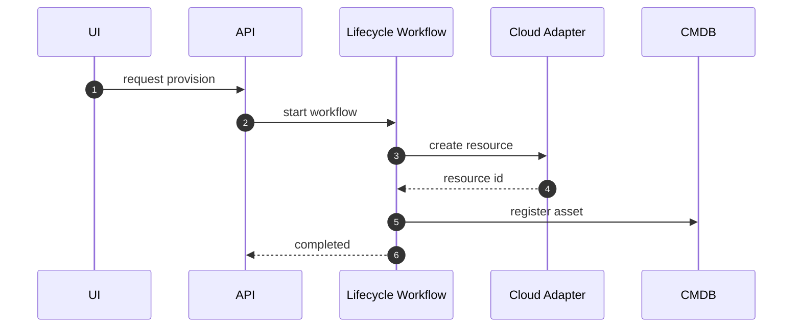

# Sequence Diagrams

```mermaid
sequenceDiagram
  autonumber
  participant UI
  participant API
  participant WF as Lifecycle Workflow
  participant Cloud as Cloud Adapter
  participant CMDB
  UI->>API: request provision
  API->>WF: start workflow
  WF->>Cloud: create resource
  Cloud-->>WF: resource id
  WF->>CMDB: register asset
  WF-->>API: completed
```
