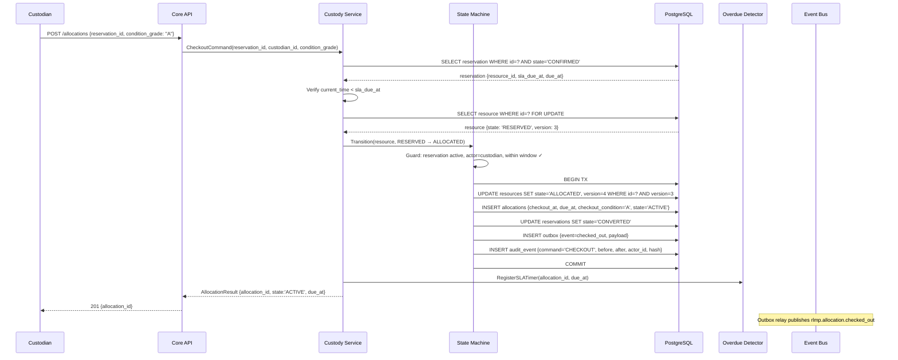
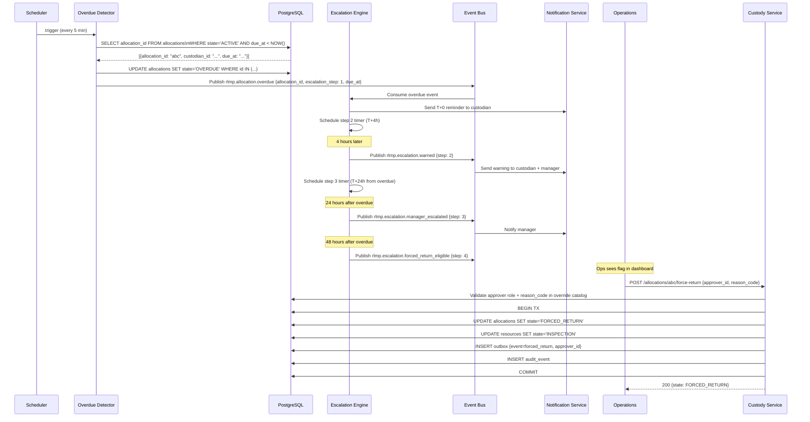
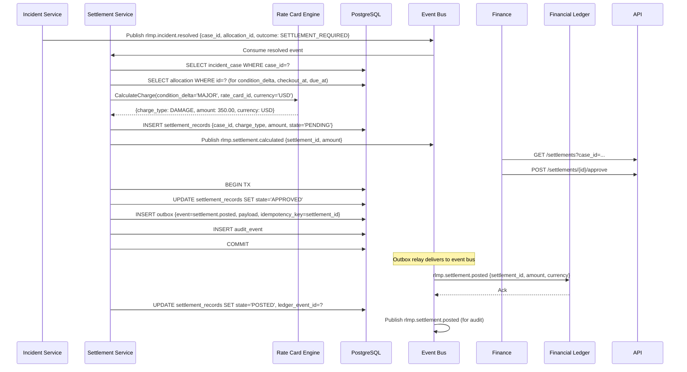
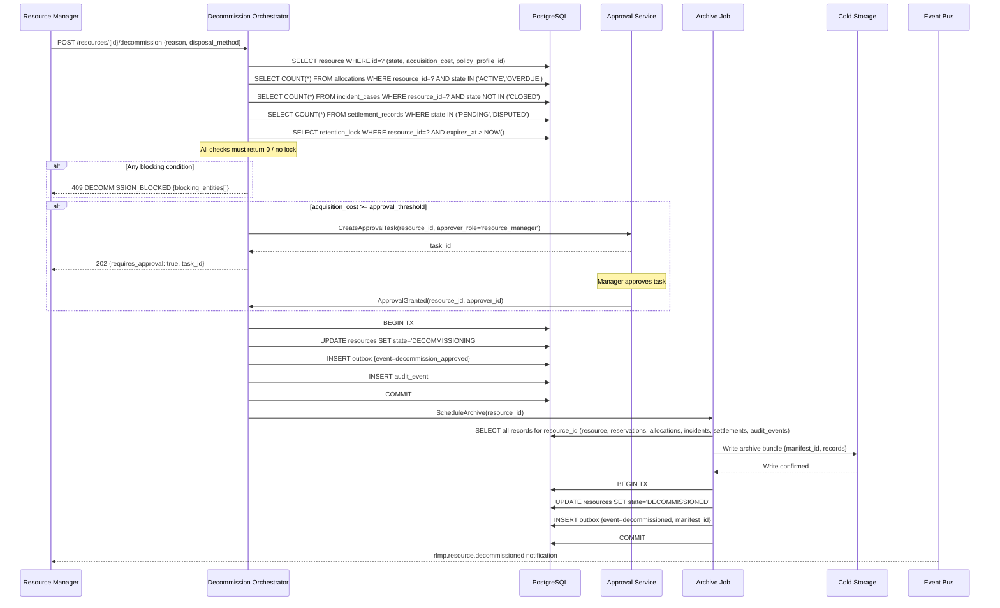

# Sequence Diagrams

Low-level sequence diagrams for the **Resource Lifecycle Management Platform**'s internal service interactions. These diagrams show service-to-service calls, database operations, and outbox/event bus patterns.

---

## 1. Concurrent Reservation Conflict Resolution

```mermaid
sequenceDiagram
  participant ClientA as Client A
  participant ClientB as Client B
  participant AS as Allocation Service
  participant Lock as Lock Manager (SELECT FOR UPDATE)
  participant DB as PostgreSQL
  participant PE as Policy Engine

  par Concurrent requests
    ClientA->>AS: POST /reservations {resource_id, window: 9-17, priority: 5}
    ClientB->>AS: POST /reservations {resource_id, window: 10-15, priority: 5}
  end

  AS->>Lock: Acquire row lock on resource_id (SELECT FOR UPDATE SKIP LOCKED)
  Note over Lock: ClientA wins the lock\nClientB queues behind it

  AS->>DB: SELECT overlapping CONFIRMED reservations
  DB-->>AS: [] (no conflict for ClientA)
  AS->>PE: Evaluate quota + eligibility (ClientA)
  PE-->>AS: permit
  AS->>DB: INSERT reservation (ClientA, CONFIRMED); INSERT outbox; COMMIT
  AS-->>ClientA: 201 {reservation_id}

  Note over Lock: ClientB lock acquired
  AS->>DB: SELECT overlapping CONFIRMED reservations
  DB-->>AS: [{ClientA reservation}] — overlap detected
  AS-->>ClientB: 409 {error_code: WINDOW_CONFLICT, alternatives: [{start: 17:00}]}
```

---

## 2. Checkout with Condition Recording



---

## 3. Overdue Detection and Forced Return



---

## 4. Settlement Calculation and Posting



---

## 5. Decommission Orchestration



---

## Cross-References

- System sequence diagrams (external actor view): [../high-level-design/system-sequence-diagrams.md](../high-level-design/system-sequence-diagrams.md)
- Lifecycle orchestration (state transition detail): [lifecycle-orchestration.md](./lifecycle-orchestration.md)
- State machine (all entity state graphs): [state-machine-diagrams.md](./state-machine-diagrams.md)
