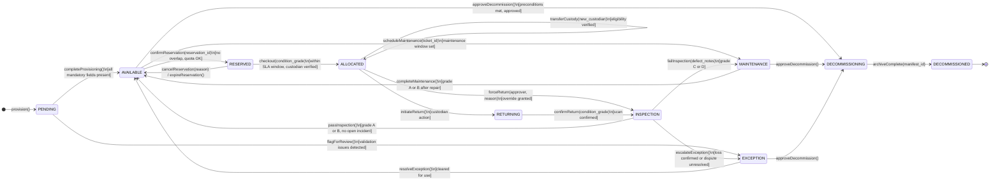
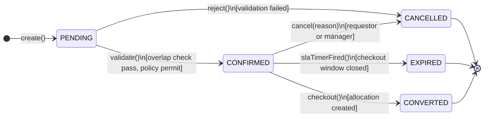
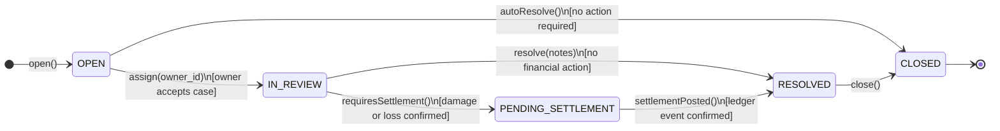
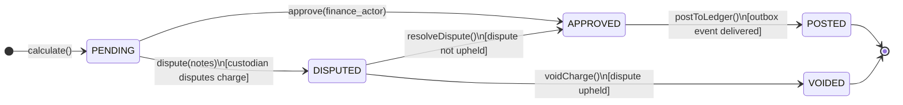
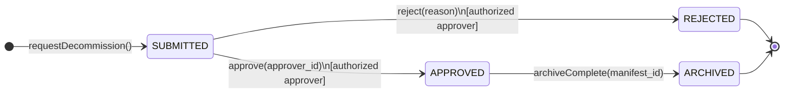

# State Machine Diagrams

Complete state machine diagrams for every stateful entity in the **Resource Lifecycle Management Platform**.

---

## 1. Resource State Machine

**Guard Matrix for Resource**:

| Transition | Guard Conditions |
|---|---|
| `PENDING → AVAILABLE` | All of: category, asset_tag, condition_grade, location_id, cost_centre, policy_profile_id present |
| `AVAILABLE → RESERVED` | No CONFIRMED reservation overlapping window; requestor quota not exceeded; requestor role in eligible_roles |
| `RESERVED → ALLOCATED` | Current UTC within [reservation.start_at, reservation.sla_due_at]; actor = reservation.requestor_id or delegated custodian |
| `ALLOCATED → INSPECTION` (forced) | approver holds `operations` role; reason_code in override catalog; override not expired |
| `* → DECOMMISSIONING` | No active allocation or reservation; all incident_cases CLOSED; all settlement_records POSTED or VOIDED; retention lock expired |
| `DECOMMISSIONING → DECOMMISSIONED` | Archive manifest ID present; cold storage write confirmed |

---

## 2. Reservation State Machine

---

## 3. Allocation State Machine

```mermaid
stateDiagram-v2
  direction LR
  [*] --> ACTIVE : checkout()

  ACTIVE --> ACTIVE : transferCustody()\n[actor changes; state stays]
  ACTIVE --> RETURNING : initiateReturn()
  ACTIVE --> OVERDUE : overdueDetected()\n[due_at < now()]
  ACTIVE --> LOST : reportLoss()

  RETURNING --> RETURNED : confirmReturn(condition_grade)

  OVERDUE --> RETURNED : lateCheckin(condition_grade)\n[custodian returns after overdue]
  OVERDUE --> FORCED_RETURN : forceReturn(approver, reason)

  LOST --> [*]
  RETURNED --> [*]
  FORCED_RETURN --> [*]
```

---

## 4. Incident Case State Machine

---

## 5. Settlement Record State Machine

---

## 6. Decommission Request State Machine

---

## State Transition Audit Requirements

Every state transition MUST write an `audit_event` record in the same database transaction with:
- `command` = name of the transition command
- `before_state` = JSON snapshot of entity before change
- `after_state` = JSON snapshot after change
- `actor_id` = identity of the user or system triggering the transition
- `correlation_id` = request correlation ID
- `hash` = SHA-256(`prev_hash || payload`) — forms a tamper-evident chain

---

## Cross-References

- Lifecycle orchestration (transition execution): [lifecycle-orchestration.md](./lifecycle-orchestration.md)
- Domain model (state enumerations): [../high-level-design/domain-model.md](../high-level-design/domain-model.md)
- Business rules (transition guards): [../analysis/business-rules.md](../analysis/business-rules.md)
