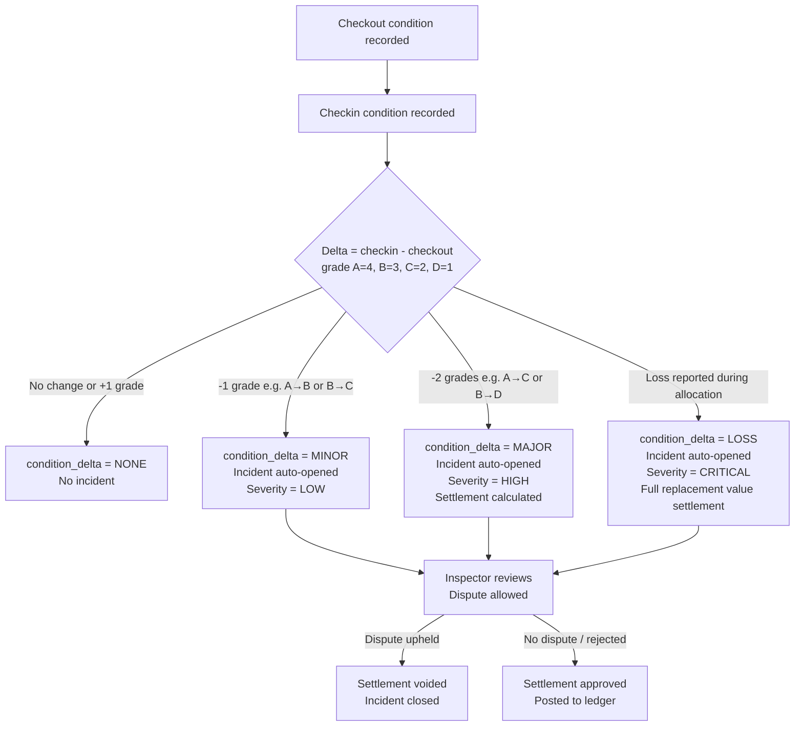

# Checkout / Check-In and Condition Disputes

Edge cases related to the physical custody handoff, condition recording, and disputes about asset condition in the **Resource Lifecycle Management Platform**.

---

## EC-CCI-01: Scanner Offline During Checkout

**Description**: The barcode/RFID scanner loses connectivity mid-checkout. The scan is recorded locally by the mobile app but not yet transmitted to the server.

| Aspect | Detail |
|---|---|
| **Trigger** | Mobile scanner app loses network; local scan is cached but checkout command not sent |
| **Detection** | Mobile app shows offline indicator; no `rlmp.allocation.checked_out` event published within expected window; ops dashboard shows overdue SLA warning |
| **Containment** | Resource remains in `RESERVED` state; SLA checkout window is still ticking |
| **Recovery** | Mobile app retries checkout with same `idempotency_key` on reconnection; if SLA breached, Custodian or Manager must request emergency checkout via web portal with justification |
| **Evidence** | Mobile app logs cached scan timestamp; server logs show no checkout command; `rlmp.reservation.expired` emitted if SLA breached |
| **Owner** | Custodian (primary), SRE (escalation) |
| **SLA** | Mobile app retries within 5 min of reconnection; manual escalation within SLA window |
| **Prevention** | Mobile app implements offline-first checkout with local scan queue and background sync |

---

## EC-CCI-02: Condition Grade Recorded Incorrectly at Checkout

**Description**: Custodian records grade `A` at checkout, but the resource was actually grade `B`. Discovered at check-in when grade is `B`, triggering a spurious `MINOR` delta.

| Aspect | Detail |
|---|---|
| **Trigger** | `checkout_condition = A`; `checkin_condition = B`; `condition_delta = MINOR` |
| **Detection** | Check-in triggers `MINOR` delta; incident case created automatically |
| **Containment** | Incident case opened with `case_type = CONDITION_DISPUTE`; resource moves to `INSPECTION` hold |
| **Recovery** | Inspector reviews photo evidence taken at checkout; if grade was mis-entered, Inspector updates checkout condition record; settlement is voided; incident closed |
| **Evidence** | Photo evidence refs attached at checkout; audit trail shows original checkout condition record and any amendments |
| **Owner** | Resource Manager / Inspector |
| **SLA** | Dispute reviewed within 48 h |
| **Prevention** | Require photo evidence at checkout for grade A resources; add confirmation step in mobile UI |

---

## EC-CCI-03: Dispute Over Pre-Existing Damage

**Description**: Custodian disputes a `MAJOR` condition delta at check-in, claiming the damage was pre-existing before their allocation started.

| Aspect | Detail |
|---|---|
| **Trigger** | Custodian submits dispute on incident case with notes; `rlmp.settlement.disputed` event emitted |
| **Detection** | Settlement record transitions to `DISPUTED`; Finance and Resource Manager are alerted |
| **Containment** | Settlement charge is frozen; resource remains in `INSPECTION` hold until dispute resolved; no funds posted to ledger |
| **Recovery** | Resource Manager reviews: (a) checkout photo evidence, (b) prior inspection records, (c) custodian's dispute notes. If dispute upheld → settlement voided + incident closed. If rejected → settlement approved + posted. |
| **Evidence** | Photo evidence at checkout and check-in; prior inspection records; dispute notes; approval/rejection audit record |
| **Owner** | Resource Manager (dispute reviewer) |
| **SLA** | Dispute reviewed within 5 business days |

---

## EC-CCI-04: Check-In Without Active Allocation

**Description**: Custodian attempts check-in for an `allocation_id` that is already `RETURNED`, `FORCED_RETURN`, or does not exist.

| Aspect | Detail |
|---|---|
| **Trigger** | `POST /allocations/{id}/checkin` where `allocation.state NOT IN (ACTIVE, OVERDUE)` |
| **Detection** | Custody Service validates allocation state before accepting check-in |
| **Containment** | Returns `409 INVALID_ALLOCATION_STATE` with current state |
| **Recovery** | If duplicate check-in: idempotency key check returns cached 200 from first check-in. If truly invalid: no action; custodian contacts Resource Manager |
| **Evidence** | Audit log records the rejected check-in attempt |
| **Owner** | N/A (expected system behavior) |
| **SLA** | Instant |

---

## EC-CCI-05: Photo Evidence Upload Fails for Grade D Check-In

**Description**: Policy requires photo evidence when condition grade is `D`, but the upload to S3 fails.

| Aspect | Detail |
|---|---|
| **Trigger** | `checkin_condition = D`; mobile app S3 upload returns error |
| **Detection** | Mobile app receives upload error; check-in command cannot be submitted without required `photo_evidence_refs` |
| **Containment** | Check-in is blocked until evidence is uploaded; resource remains `ALLOCATED`/`OVERDUE` |
| **Recovery** | Mobile app retries S3 upload with exponential backoff; if upload consistently fails, Custodian can use web portal upload or email photos to Resource Manager who manually attaches refs |
| **Evidence** | S3 upload error logged; incident case notes updated with workaround |
| **Owner** | Custodian (primary), SRE (if S3 unavailable) |
| **SLA** | Unblock within 2 h; escalate to SRE if S3 degraded for > 30 min |

---

## EC-CCI-06: Concurrent Check-In from Two Actors

**Description**: Forced return and voluntary check-in are submitted for the same allocation within milliseconds (custodian returns the same moment operations forces return).

| Aspect | Detail |
|---|---|
| **Trigger** | `POST /allocations/{id}/checkin` and `POST /allocations/{id}/force-return` arrive simultaneously |
| **Detection** | Optimistic lock on allocation `version` ensures exactly one wins; loser gets `409 CONCURRENCY_CONFLICT` |
| **Containment** | First command to commit wins; second is rejected with 409 |
| **Recovery** | If voluntary check-in won: allocation is `RETURNED` (correct); forced return rejected (correct). If forced return won: allocation is `FORCED_RETURN`; voluntary check-in rejected; custodian informed via notification |
| **Evidence** | Audit log has both attempts with lock-acquired timestamp; winner's record is canonical |
| **Owner** | Platform Engineering |
| **SLA** | Automated |

---

## Condition Delta Decision Tree

