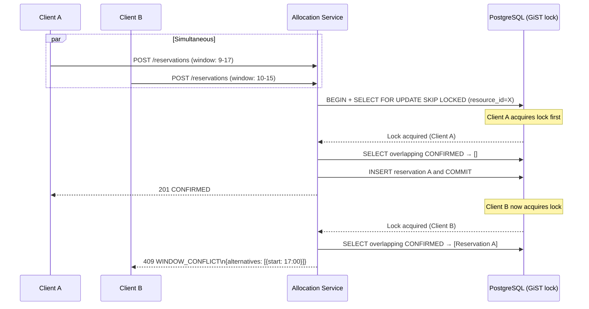

# Reservation and Allocation Conflicts

Edge cases covering concurrent reservation attempts, quota races, priority disputes, and allocation contention for the **Resource Lifecycle Management Platform**.

---

## EC-RAC-01: Concurrent Double-Booking

**Description**: Two requestors submit reservations for the same resource with overlapping windows at nearly the same time, and both requests pass the initial overlap check before either commits.

| Aspect | Detail |
|---|---|
| **Trigger** | Two `POST /reservations` with overlapping `(resource_id, window)` arrive within the same millisecond |
| **Detection** | Optimistic lock / GiST exclusion constraint violation on commit; `409 WINDOW_CONFLICT` returned to loser |
| **Containment** | The losing request's transaction is rolled back; no partial reservation persists; loser receives 409 with alternative windows |
| **Recovery** | Loser retries with a new request (new `idempotency_key`) using a suggested alternative window; no manual intervention required |
| **Evidence** | Audit log: `RESERVATION_CONFLICT` event with both `requestor_id` values and `correlation_id` |
| **Owner** | Platform Engineering |
| **SLA** | Automated; sub-second resolution |
| **Test** | 50 concurrent requests for same window → exactly 1 success; remainder receive 409 |

---

## EC-RAC-02: Quota Race Condition

**Description**: A requestor is at quota limit N-1 and submits multiple concurrent reservation requests. Without proper atomic quota check, multiple requests could succeed.

| Aspect | Detail |
|---|---|
| **Trigger** | N concurrent `POST /reservations` from same requestor, quota limit = N-1 |
| **Detection** | Quota check uses `SELECT COUNT(...) FOR UPDATE` (pessimistic) or atomic counter in Redis to serialize |
| **Containment** | All requests beyond quota limit are denied with `422 QUOTA_EXCEEDED` |
| **Recovery** | Requestor cancels an existing reservation to free quota, then retries |
| **Evidence** | Policy Engine logs every quota decision with `matched_rule_id`, `current_count`, `limit` |
| **Owner** | Platform Engineering |
| **SLA** | Automated; sub-second resolution |
| **Test** | Inject concurrent requests at quota boundary; verify exactly quota-limit successes |

---

## EC-RAC-03: Priority Displacement Notification Failure

**Description**: A higher-priority reservation successfully displaces a lower-priority one, but the notification to the displaced requestor fails to deliver.

| Aspect | Detail |
|---|---|
| **Trigger** | `rlmp.reservation.priority_displaced` event consumed by Notification Service; delivery fails |
| **Detection** | Notification Worker DLQ receives undeliverable notification; alert fires if DLQ depth > 5 |
| **Containment** | Displacement business state is committed and correct; only notification delivery is affected; retry mechanism kicks in |
| **Recovery** | Notification Worker retries with exponential backoff (max 5 retries over 1 h); if still undeliverable, ops creates manual outreach task |
| **Evidence** | DLQ record with `original_event_id`, `failure_reason`, `retry_count`; notification delivery log shows failed attempts |
| **Owner** | Platform Engineering / SRE |
| **SLA** | Retry within 1 h; manual outreach within 4 h |
| **Test** | Inject Notification Service error; verify business state is correct; verify DLQ contains event; verify retry succeeds after Notification Service recovery |

---

## EC-RAC-04: Stale Availability Cache Causes False Availability

**Description**: The search/availability index (Elasticsearch) shows a resource as available, but it has been reserved since the last index update. Requestor submits reservation based on stale data.

| Aspect | Detail |
|---|---|
| **Trigger** | Elasticsearch index lag > 30 s; requestor queries availability, gets stale result, submits reservation |
| **Detection** | Reservation command hits the authoritative overlap check on PostgreSQL → returns 409 WINDOW_CONFLICT |
| **Containment** | The PostgreSQL overlap check (not the Elasticsearch index) is the final authority; stale search results only affect UX, not data integrity |
| **Recovery** | Requestor receives 409 with updated alternatives from authoritative DB; Search Indexer catches up within ~30 s |
| **Evidence** | `rlmp.reservation.conflict_detected` event; search lag metric spike in Datadog |
| **Owner** | Platform Engineering |
| **SLA** | No data integrity impact; UX impact resolved within 30 s of event publication |
| **Test** | Pause search indexer; create reservation; verify search still shows available; verify reservation command fails correctly via DB check |

---

## EC-RAC-05: Priority Scoring Ties

**Description**: Two requestors with identical priority scores submit reservations for the same window simultaneously. No deterministic winner is defined.

| Aspect | Detail |
|---|---|
| **Trigger** | Two requests with `priority = 5`, same window, arrive within same lock window |
| **Detection** | System uses `SELECT FOR UPDATE SKIP LOCKED` → first-lock-wins determinism applied |
| **Containment** | Database lock ordering ensures a deterministic winner; no manual intervention needed |
| **Recovery** | Loser receives 409 with alternatives |
| **Evidence** | Both requests logged in audit with `priority`, `lock_acquired_at` timestamps |
| **Owner** | Platform Engineering |
| **SLA** | Automated; deterministic resolution |
| **Note** | If priority tie-breaking policy is required, add a secondary sort criterion (e.g., `created_at ASC`) in the Policy Engine priority rules |

---

## EC-RAC-06: Checkout After Reservation Expiry

**Description**: Custodian attempts checkout after the SLA checkout window has closed (reservation in `EXPIRED` state).

| Aspect | Detail |
|---|---|
| **Trigger** | `POST /allocations` submitted after `reservation.sla_due_at` |
| **Detection** | Custody Service validates `current_time < sla_due_at`; fails with `422 CHECKOUT_WINDOW_EXPIRED` |
| **Containment** | No allocation created; resource returned to `AVAILABLE` (reservation already expired) |
| **Recovery** | Custodian must create a new reservation; Resource Manager may grant an immediate direct checkout if justified |
| **Evidence** | `rlmp.reservation.expired` event; `CHECKOUT_WINDOW_EXPIRED` audit entry |
| **Owner** | N/A (expected system behavior) |
| **SLA** | Instant |

---

## Flow: Double-Booking Conflict Resolution

