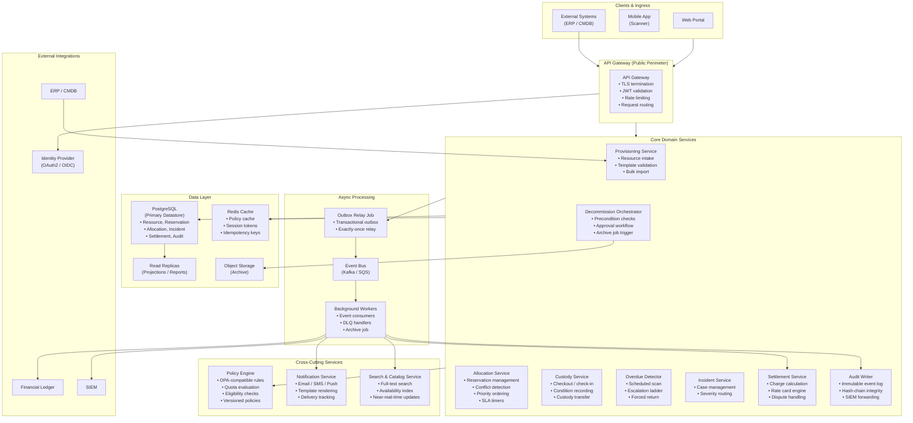

# Architecture Diagram

Service-level architecture for the **Resource Lifecycle Management Platform**, showing all services, their responsibilities, communication patterns, and failure-isolation boundaries.

---

## Architecture Decisions

| Decision Topic | Selected Approach | Rationale |
|---|---|---|
| Write path | Command handler → state machine → outbox | Centralized transition guards; outbox ensures exactly-once event delivery |
| Read path | Materialized projections / read models | Decoupled from write path; allows independent scaling for high-query workloads |
| Consistency | Serializable per `(resource_id, window)` | Prevents double-allocation; optimistic locking on hot rows |
| Integration | Transactional outbox → event bus | At-least-once delivery guarantee; consumers can replay without re-triggering side effects |
| Policy evaluation | Dedicated Policy Engine with 60 s cache | Decoupled from business logic; versioned rules; cache prevents hot-path latency |
| Background jobs | Queue-driven workers with DLQ | Auto-scale on lag; poison message isolation; operational replay |
| Secrets | Vault / cloud secret manager | No secrets in config files or environment variables |
| Observability | Structured JSON logging + distributed tracing + metrics | Uniform correlation across all services |

---

## High-Level Service Map

---

## Service Responsibilities

| Service | Owner Team | Write / Read | Key Inputs | Key Outputs |
|---|---|---|---|---|
| Provisioning Service | Platform Eng | Write | `POST /resources`, CSV import | Resource record, `rlmp.resource.provisioned` |
| Allocation Service | Platform Eng | Write | `POST /reservations`, `DELETE /reservations/{id}` | Reservation record, `rlmp.reservation.*` |
| Custody Service | Platform Eng | Write | `POST /allocations`, `POST /allocations/{id}/checkin` | Allocation record, `rlmp.allocation.*` |
| Overdue Detector | SRE / Platform Eng | Write (state) | Scheduled job, active allocations | `rlmp.allocation.overdue`, escalation events |
| Incident Service | Platform Eng | Write | Condition delta events, loss reports | Incident case, `rlmp.incident.*` |
| Settlement Service | Platform Eng | Write | Resolved incident cases | Settlement record, `rlmp.settlement.*` |
| Decommission Orchestrator | Platform Eng | Write | `POST /resources/{id}/decommission` | Decommission record, archive trigger |
| Audit Writer | Compliance / Platform | Write | All domain events | Immutable audit log, hash chain |
| Policy Engine | Platform Eng | Read (evaluate) | Reservation/allocation commands | `PolicyDecision` (permit/deny) |
| Notification Service | Platform Eng | Write (send) | Notification events from bus | Delivered email/SMS/push |
| Search & Catalog Service | Platform Eng | Read | `rlmp.resource.*` events | Search index, availability API |

---

## Consistency and Failure Isolation

| Interaction | Pattern | Failure Mode |
|---|---|---|
| Command → State Machine | Synchronous, serializable | Return error; client retries with idempotency key |
| State Machine → Outbox | Transactional (same DB tx) | Rollback entire transaction; no partial state |
| Outbox → Event Bus | Asynchronous relay job | Retry with exponential backoff; DLQ after max retries |
| Event Bus → Worker | At-least-once consumer | Idempotent consumer; DLQ for poison messages |
| Worker → Notification | HTTP with retry | Non-blocking; missed notification is non-critical |
| Worker → Ledger | Exactly-once (idempotency key) | DLQ + alert if undelivered after 1 h |

---

## Cross-References

- C4 context / container diagrams: [c4-diagrams.md](./c4-diagrams.md)
- Detailed component design: [../detailed-design/component-diagrams.md](../detailed-design/component-diagrams.md)
- Infrastructure topology: [../infrastructure/deployment-diagram.md](../infrastructure/deployment-diagram.md)
- Sequence diagrams for key flows: [system-sequence-diagrams.md](./system-sequence-diagrams.md)
