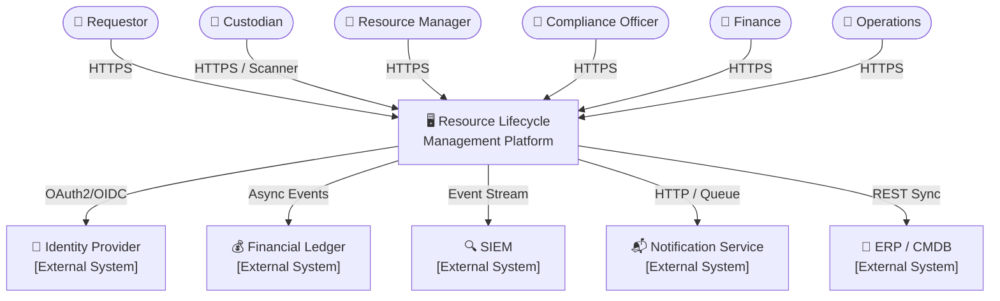
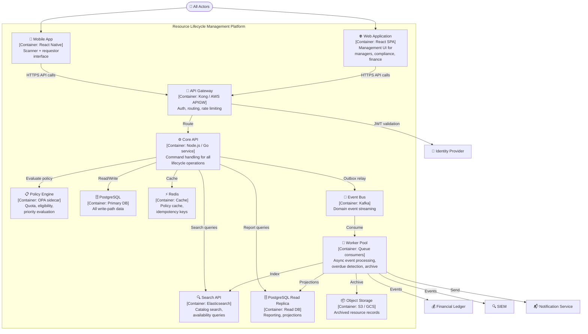
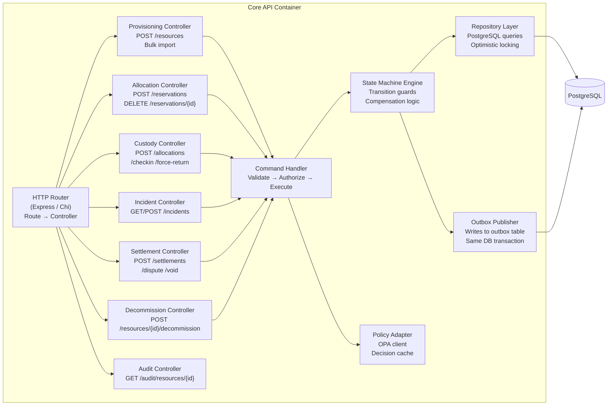

# C4 Diagrams

C4 model views (Context, Container, Component) for the **Resource Lifecycle Management Platform**.

---

## Level 1 – System Context

> Who uses the system and what other systems does it talk to?

---

## Level 2 – Container Diagram

> What containers make up the RLMP system?

---

## Level 3 – Component Diagram (Core API Container)

> What components live inside the Core API container?

---

## Cross-References

- Detailed component diagrams: [../detailed-design/c4-component-diagram.md](../detailed-design/c4-component-diagram.md)
- Infrastructure deployment: [../infrastructure/deployment-diagram.md](../infrastructure/deployment-diagram.md)
- System context narrative: [../analysis/system-context-diagram.md](../analysis/system-context-diagram.md)
