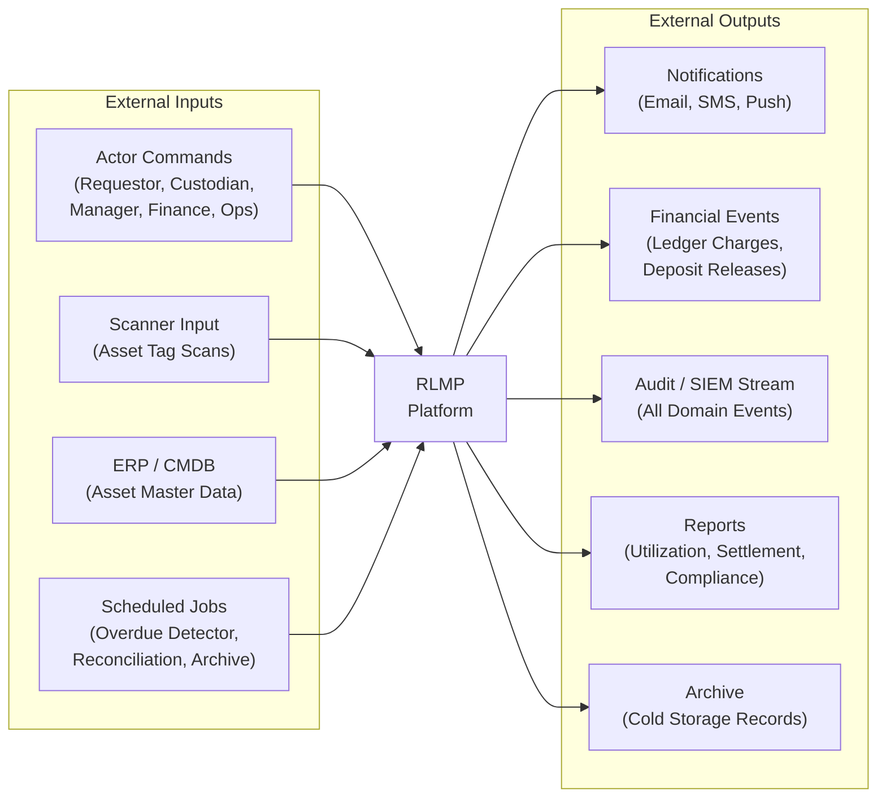
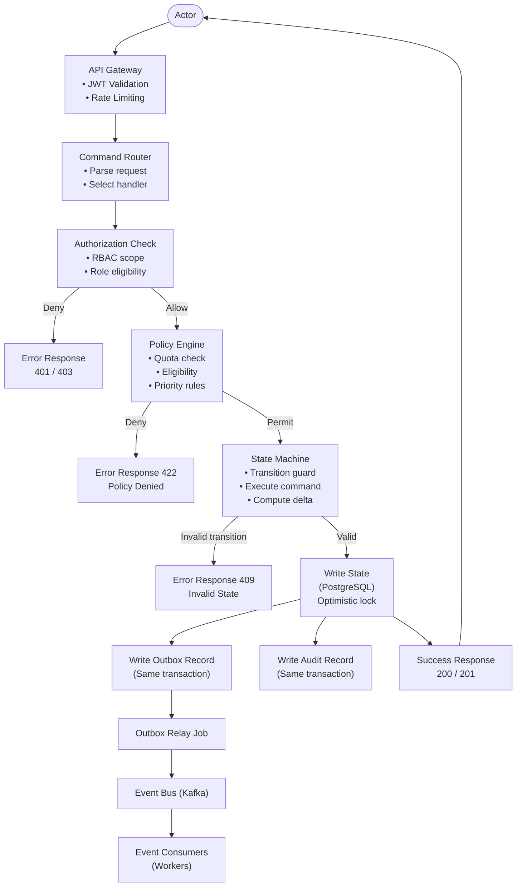
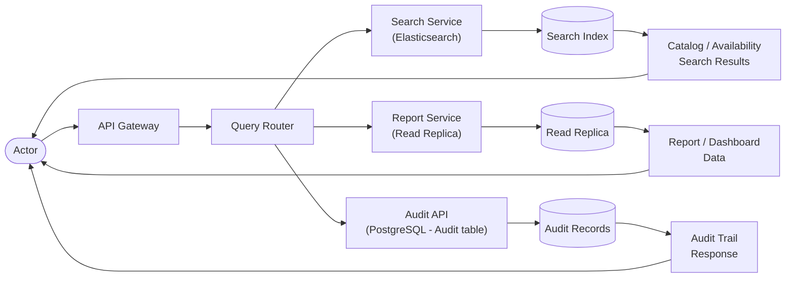
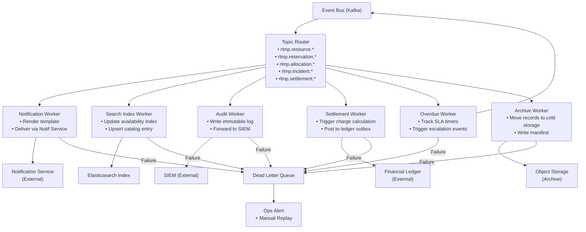
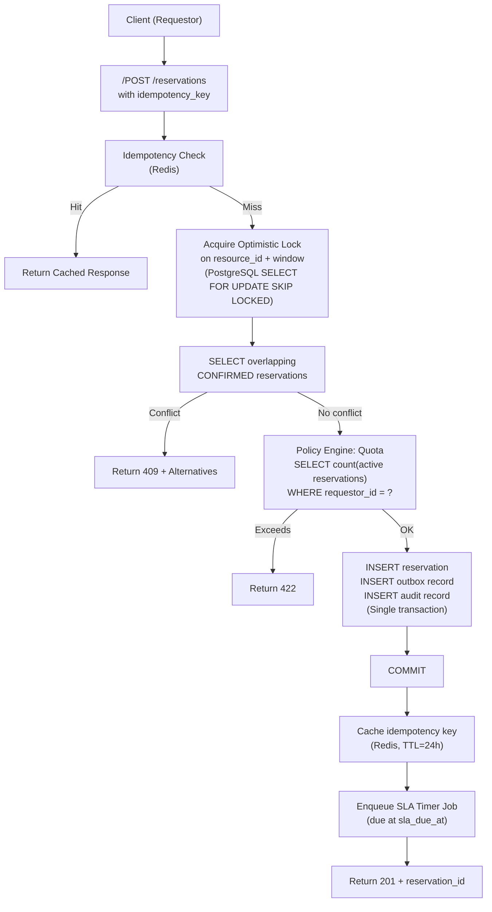

# Data Flow Diagrams

Data flow diagrams (DFDs) showing how data moves through the **Resource Lifecycle Management Platform** for each major functional area.

---

## DFD Level 0 – Platform Overview

---

## DFD Level 1 – Command Processing Flow

---

## DFD Level 1 – Read / Query Flow

---

## DFD Level 1 – Event Processing Flow

---

## DFD Level 2 – Allocation Write Path (Detail)

---

## Data Stores Summary

| Store | Technology | Data | Access Pattern |
|---|---|---|---|
| Primary DB | PostgreSQL | All entity records, outbox, audit log | Serializable writes; read queries via ORM |
| Read Replica | PostgreSQL replica | Projections, reports | Read-only; eventual consistency ~1 s lag |
| Search Index | Elasticsearch | Resource catalog, availability windows | Full-text + filter queries |
| Cache | Redis | Policy decisions (60 s TTL), idempotency keys (24 h TTL), session tokens | Key-value get/set |
| Event Bus | Kafka | All domain events | Publish/subscribe; replay from offset |
| Cold Storage | S3 / GCS | Archived resource records, manifests | Write once; read rarely (compliance) |

---

## Cross-References

- Event catalog (all events): [../analysis/event-catalog.md](../analysis/event-catalog.md)
- Sequence diagrams (flow timing): [system-sequence-diagrams.md](./system-sequence-diagrams.md)
- ERD (data store schema): [../detailed-design/erd-database-schema.md](../detailed-design/erd-database-schema.md)
