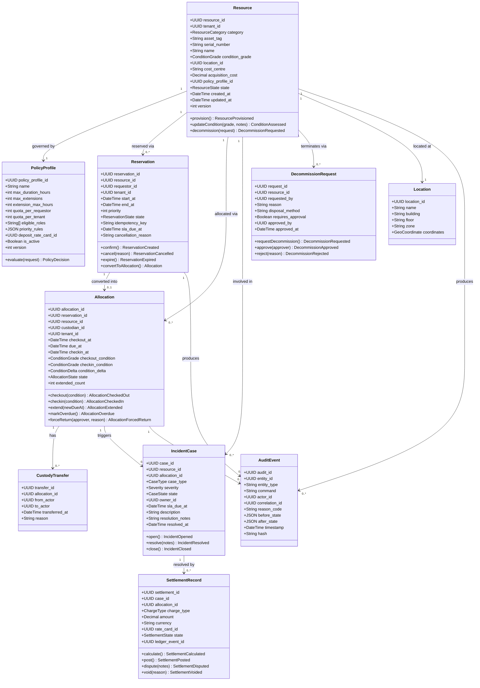

# Domain Model

The domain model defines the core aggregates, entities, value objects, and their relationships within the **Resource Lifecycle Management Platform**. All services are aligned to these bounded contexts.

---

## Bounded Contexts

| Bounded Context | Responsibility | Key Aggregates |
|---|---|---|
| **Resource Catalog** | Ownership of the resource record and its metadata | Resource, PolicyProfile |
| **Reservation** | Time-bound holds and priority management | Reservation |
| **Allocation & Custody** | Active possession tracking and condition management | Allocation, CustodyTransfer |
| **Incident & Settlement** | Exception case management and financial charges | IncidentCase, SettlementRecord |
| **Decommission & Archive** | Terminal lifecycle transitions and compliance archival | DecommissionRequest, ArchiveManifest |
| **Audit** | Immutable event ledger for all state changes | AuditEvent |

---

## Domain Class Diagram



---

## State Enumerations

### ResourceState

```
PENDING → AVAILABLE → RESERVED → ALLOCATED
       ↓                              ↓
   EXCEPTION              RETURNING → INSPECTION
                                     ↙        ↘
                              AVAILABLE    MAINTENANCE
                                                ↓
                                          DECOMMISSIONING
                                                ↓
                                         DECOMMISSIONED
```

| State | Description |
|---|---|
| `PENDING` | Record created; mandatory fields incomplete |
| `AVAILABLE` | Ready for reservation |
| `RESERVED` | Time-window hold confirmed |
| `ALLOCATED` | Active custody with a custodian |
| `RETURNING` | Checkout SLA timer fired; custodian initiated return |
| `INSPECTION` | Post-return condition assessment in progress |
| `MAINTENANCE` | Scheduled or corrective maintenance |
| `DECOMMISSIONING` | Terminal transition in progress; awaiting archive |
| `DECOMMISSIONED` | Terminal; archived; no further transitions |
| `EXCEPTION` | Manual hold; requires ops/compliance resolution |

### ReservationState

| State | Description |
|---|---|
| `PENDING` | Submitted; not yet processed |
| `CONFIRMED` | Active hold; checkout window open |
| `CANCELLED` | Cancelled by requestor or system |
| `EXPIRED` | Checkout window closed without checkout |
| `CONVERTED` | Converted to an active Allocation |

### AllocationState

| State | Description |
|---|---|
| `ACTIVE` | Resource in custody; within due date |
| `OVERDUE` | Due date passed; escalation ladder active |
| `RETURNED` | Resource checked in; condition recorded |
| `FORCED_RETURN` | Ops initiated forced return |
| `LOST` | Custodian reported resource as lost |

---

## Domain Events Summary

| Aggregate | Events Emitted |
|---|---|
| Resource | `provisioned`, `catalog_updated`, `condition_assessed`, `decommission_requested`, `decommissioned`, `archived` |
| Reservation | `created`, `cancelled`, `expired`, `conflict_detected`, `priority_displaced` |
| Allocation | `checked_out`, `checked_in`, `extended`, `overdue`, `forced_return`, `custody_transferred`, `loss_reported` |
| IncidentCase | `opened`, `updated`, `resolved` |
| SettlementRecord | `calculated`, `posted`, `disputed`, `voided` |
| DecommissionRequest | `requested`, `approved`, `rejected` |

---

## Cross-References

- Data dictionary (attribute constraints): [../analysis/data-dictionary.md](../analysis/data-dictionary.md)
- State machine diagrams: [../detailed-design/state-machine-diagrams.md](../detailed-design/state-machine-diagrams.md)
- ERD (database schema): [../detailed-design/erd-database-schema.md](../detailed-design/erd-database-schema.md)
- Class diagrams (implementation detail): [../detailed-design/class-diagrams.md](../detailed-design/class-diagrams.md)
