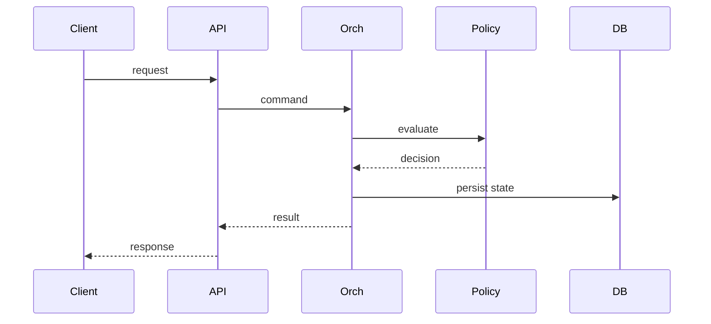

# System Sequence Diagrams

Architecture-level blueprint translating analysis outcomes into deployable logical structures.

## Artifact-Specific Objectives
- Define macro boundaries and integration contracts.
- Specify consistency model (sync/async/eventual) per interaction.
- Include resilience patterns and failure isolation zones.

## Architecture Decisions

| Decision Topic | Selected Approach | Why This Enables Implementation |
|---|---|---|
| Write path | Command + orchestrator | Centralized lifecycle guard enforcement |
| Read path | Projection/read models | Scalable query workloads without write contention |
| Integration | Event bus + outbox | Reliable delivery and replayability |

## Lifecycle and Governance Specifics

- **Provisioning in System Sequence Diagrams**: Define preconditions, policy gate, and emitted evidence artifact.
- **Allocation in System Sequence Diagrams**: Define contention handling, SLA timers, and rollback behavior.
- **Decommissioning in System Sequence Diagrams**: Define terminal checks, retention obligations, and approval authority.
- **Exception workflow in System Sequence Diagrams**: Detect → classify → contain → resolve → recover → postmortem with owner + SLA.

## Implementation Checklist

- [ ] Artifact reviewed by engineering, operations, and governance stakeholders.
- [ ] Traceability links added to related requirements/design/runbooks.
- [ ] Failure-path and compensation behavior documented in testable form.
- [ ] Metrics and alerts mapped to artifact outcomes.

## Mermaid Diagram

