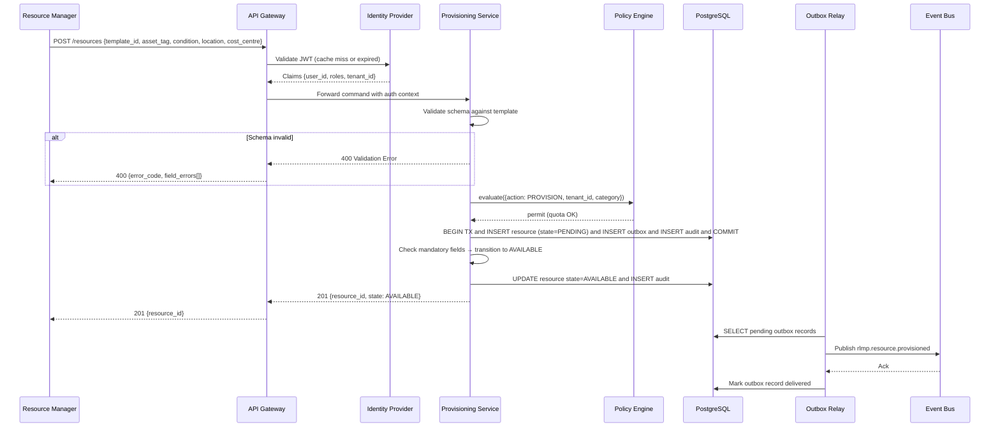
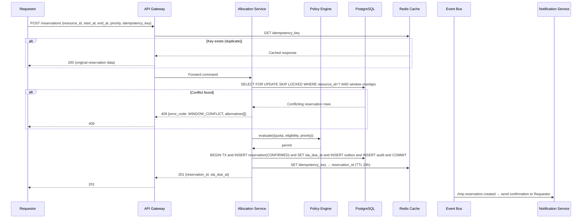
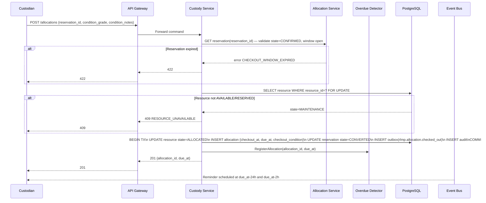
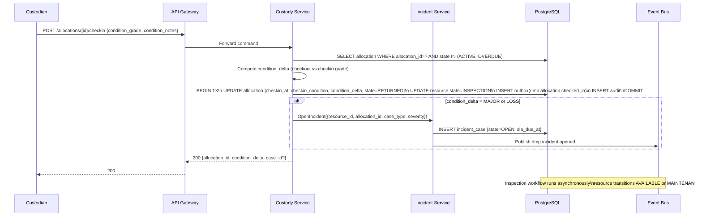
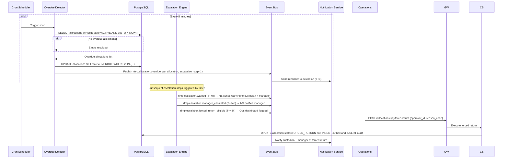
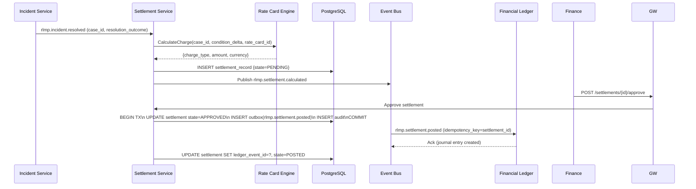
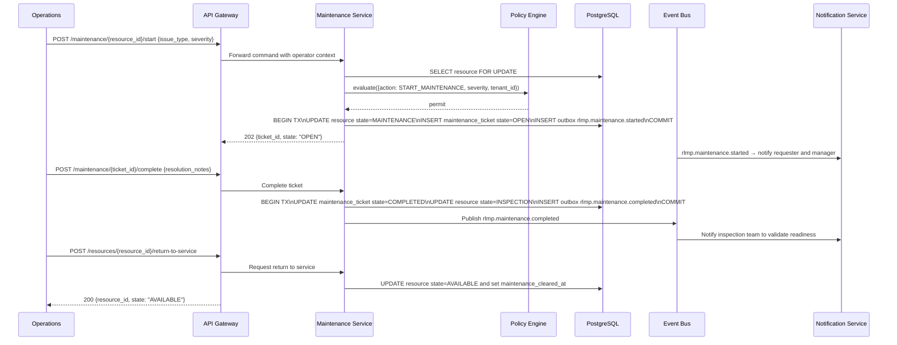

# System Sequence Diagrams

System-level sequence diagrams for the **Resource Lifecycle Management Platform**'s primary flows. These diagrams show the interaction between external actors and system components, with timing and protocol details.

---

## 1. Resource Provisioning Sequence

---

## 2. Reservation Creation Sequence

---

## 3. Checkout Sequence

---

## 4. Check-In and Condition Assessment Sequence

---

## 5. Overdue Detection and Escalation Sequence

---

## 6. Settlement Posting Sequence

---

## Cross-References

- Detailed sequence diagrams: [../detailed-design/sequence-diagrams.md](../detailed-design/sequence-diagrams.md)
- Activity diagrams: [../analysis/activity-diagrams.md](../analysis/activity-diagrams.md)
- State machine: [../detailed-design/state-machine-diagrams.md](../detailed-design/state-machine-diagrams.md)

---

## 7. Maintenance Escalation and Return-to-Service Sequence

