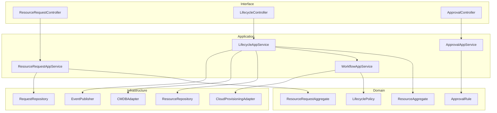
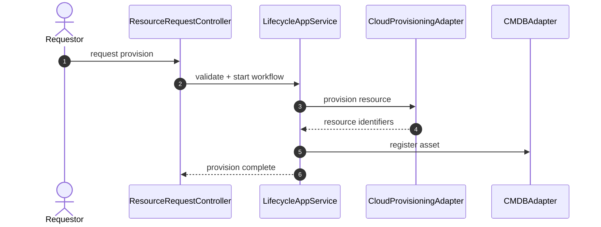

# C4 Code Diagram

This code-level view expands lifecycle orchestration modules for provisioning, updates, and retirement.

## Code-Level Structure

## Critical Runtime Sequence: Provision Resource

## Notes
- Persist workflow state transitions for replay and audit.
- Keep cloud adapter actions idempotent using request correlation identifiers.
