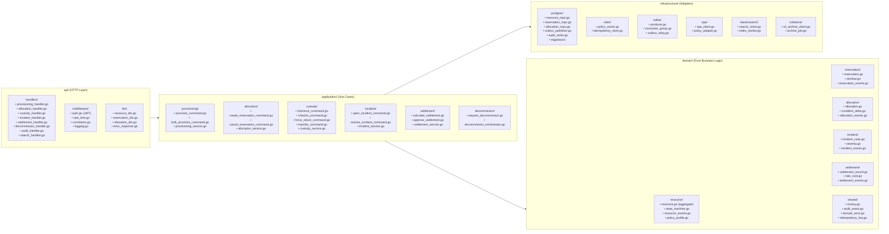

# C4 Code Diagram

Code-level (C4 Level 4) organization for the **Resource Lifecycle Management Platform**. Shows the internal module structure within the Core API service.

---

## Module Dependency Graph



---

## Key Module Contracts

### domain/resource/state_machine.go

```go
type TransitionCommand struct {
    EntityID      uuid.UUID
    Command       string
    Payload       json.RawMessage
    ActorContext  ActorContext
}

type TransitionResult struct {
    NewState    ResourceState
    Version     int
    EmittedEvents []DomainEvent
}

type StateMachineEngine interface {
    Transition(entity *Resource, cmd TransitionCommand) (TransitionResult, error)
}
```

### application/custody/custody_service.go

```go
type CheckoutCommand struct {
    ReservationID   uuid.UUID
    CustodianID     uuid.UUID
    ConditionGrade  ConditionGrade
    ConditionNotes  string
    IdempotencyKey  string
    CorrelationID   uuid.UUID
}

type CustodyService interface {
    Checkout(ctx context.Context, cmd CheckoutCommand) (*Allocation, error)
    Checkin(ctx context.Context, cmd CheckinCommand) (*Allocation, error)
    ForceReturn(ctx context.Context, cmd ForceReturnCommand) (*Allocation, error)
    TransferCustody(ctx context.Context, cmd TransferCommand) (*CustodyTransfer, error)
}
```

### infrastructure/postgres/outbox_publisher.go

```go
// Must be called within an existing transaction
type OutboxPublisher interface {
    Publish(ctx context.Context, tx *sql.Tx, event DomainEvent) error
}

// Implementation writes to outbox table, NEVER to Kafka directly
type PostgresOutboxPublisher struct {
    // uses the caller's tx — no new transaction opened
}
```

---

## Dependency Inversion Rules

- `domain/` has **zero** external dependencies. It MUST NOT import `infrastructure/` or `application/`.
- `application/` depends on `domain/` and declares **interfaces** for repositories and external services.
- `infrastructure/` **implements** those interfaces; no other layer imports `infrastructure/` directly.
- `api/` depends on `application/` only, never on `domain/` or `infrastructure/` directly.

---

## Cross-References

- Component diagram (runtime view): [../detailed-design/c4-component-diagram.md](../detailed-design/c4-component-diagram.md)
- Class diagrams (type signatures): [../detailed-design/class-diagrams.md](../detailed-design/class-diagrams.md)
- Implementation guidelines (conventions): [implementation-guidelines.md](./implementation-guidelines.md)
