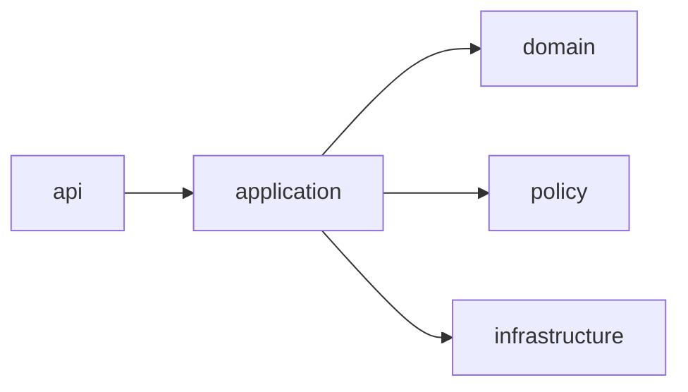

# C4 Code Diagram

Execution guidance for sprint delivery, release readiness, and production operations.

## Artifact-Specific Objectives
- Convert design artifacts into sprint-ready tasks and milestones.
- Define quality gates for CI, staging, and production promotion.
- Track operational readiness (runbooks, alerts, dashboards, ownership).

## Delivery Governance

| Milestone | Mandatory Evidence | Release Gate Owner |
|---|---|---|
| Feature complete | Unit/integration test reports + schema diffs | Engineering lead |
| Staging ready | Load test + security scan + rollback test | SRE lead |
| Production ready | Runbook signoff + on-call handover + compliance attestation | Platform manager |

## Lifecycle and Governance Specifics

- **Provisioning in C4 Code Diagram**: Define preconditions, policy gate, and emitted evidence artifact.
- **Allocation in C4 Code Diagram**: Define contention handling, SLA timers, and rollback behavior.
- **Decommissioning in C4 Code Diagram**: Define terminal checks, retention obligations, and approval authority.
- **Exception workflow in C4 Code Diagram**: Detect → classify → contain → resolve → recover → postmortem with owner + SLA.

## Implementation Checklist

- [ ] Artifact reviewed by engineering, operations, and governance stakeholders.
- [ ] Traceability links added to related requirements/design/runbooks.
- [ ] Failure-path and compensation behavior documented in testable form.
- [ ] Metrics and alerts mapped to artifact outcomes.

## Mermaid Diagram

