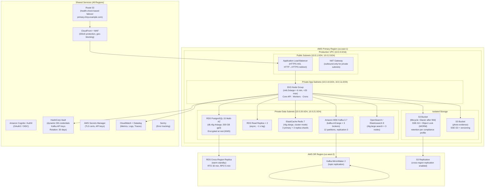

# Cloud Architecture

Multi-region cloud architecture for the **Resource Lifecycle Management Platform** covering compute, data, networking, secrets, observability, and disaster recovery.

---

## Environment Layout



---

## DR Failover Procedure

```mermaid
flowchart TD
  Detect[Alert: Primary Region Unreachable] --> Assess{Confirm region failure\n(Route 53 health check fails)}
  Assess -->|False alarm| Resume[Continue on Primary]
  Assess -->|Confirmed| PromoteReplica[Promote RDS Cross-Region Replica\n(~5 min)]
  PromoteReplica --> PointKafka[Redirect Kafka producers\nto DR MSK cluster]
  PointKafka --> UpdateDNS[Update Route 53 failover record\nto DR ALB]
  UpdateDNS --> ScaleEKS[Scale DR EKS node group\nto production capacity]
  ScaleEKS --> SmokeTest[Run smoke test suite\nagainst DR endpoint]
  SmokeTest -->|Pass| TrafficLive[100% traffic on DR\nRTO achieved]
  SmokeTest -->|Fail| Rollback[Investigate and escalate\nto incident commander]
```

---

## Security Architecture

| Control | Implementation | Validation |
|---|---|---|
| Encryption in transit | TLS 1.3 minimum, mTLS between services | Quarterly TLS scan |
| Encryption at rest | KMS-managed keys for RDS, S3, ElastiCache | Key rotation audit annually |
| IAM / RBAC | EKS IRSA; least-privilege IAM roles per service | IAM Access Analyzer weekly |
| Secret management | Vault dynamic secrets; no static passwords | Secret rotation log review monthly |
| Network isolation | VPC + security groups + NACLs; no 0.0.0.0/0 egress from data subnets | IaC policy checks (Checkov/OPA) |
| WAF rules | OWASP CRS ruleset; rate limiting; bot mitigation | Monthly WAF rule review |
| Audit logs | CloudTrail + VPC Flow Logs → SIEM (90-day hot, 7-year cold) | SIEM alert on unauthorized API calls |
| Vulnerability scanning | Trivy on container images in CI; Inspector on EC2/ECS | PR gate: no CRITICAL CVEs |
| Penetration testing | Annual external pentest + quarterly internal red team | Remediation within 30 days for critical |

---

## Backup and Recovery

| Data Store | Backup Frequency | Retention | Recovery Method |
|---|---|---|---|
| PostgreSQL | Automated daily snapshot + continuous WAL (5-min RPO) | 35 days point-in-time | RDS restore or WAL replay |
| Redis | RDB snapshot every 15 min | 7 days | ElastiCache snapshot restore |
| Kafka | MirrorMaker 2 to DR region | Infinite (log compaction) | Replay from offset |
| S3 Archive | Versioning + cross-region replication | Compliance retention period | S3 Object Lock prevents deletion |
| Elasticsearch | Automated snapshot to S3 | 30 days | ES snapshot restore |

---

## Cross-References

- Deployment diagram: [deployment-diagram.md](./deployment-diagram.md)
- Network infrastructure: [network-infrastructure.md](./network-infrastructure.md)
- Implementation security guidelines: [../implementation/implementation-guidelines.md](../implementation/implementation-guidelines.md)
