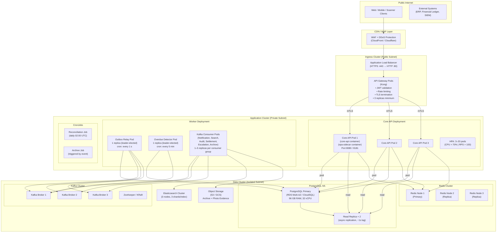

# Deployment Diagram

Production deployment topology for the **Resource Lifecycle Management Platform** on Kubernetes.

---

## Kubernetes Deployment Architecture

---

## Environment Configuration

| Environment | Purpose | Replicas (Core API) | DB | Notes |
|---|---|---|---|---|
| `dev` | Local development | 1 | Docker Postgres | OPA in single-process mode |
| `ci` | Automated testing | 1 | Ephemeral Postgres (Testcontainers) | No real Kafka; test doubles |
| `staging` | Pre-production validation | 3 | RDS Multi-AZ (smaller instance) | Full Kafka cluster; anonymized prod data |
| `production` | Live service | 3–20 (HPA) | RDS Multi-AZ + 2 read replicas | Full HA; all monitoring enabled |
| `dr` | Disaster recovery | 3 (warm standby) | Cross-region replica | RTO ≤ 30 min; RPO ≤ 5 min |

---

## Resource Requirements

| Service | CPU Request | CPU Limit | Memory Request | Memory Limit | Replicas |
|---|---|---|---|---|---|
| Core API | 500m | 2000m | 512Mi | 2Gi | 3–20 (HPA) |
| OPA Sidecar | 100m | 500m | 128Mi | 512Mi | co-located |
| Outbox Relay | 100m | 500m | 128Mi | 256Mi | 1 |
| Overdue Detector | 100m | 500m | 128Mi | 256Mi | 1 |
| Kafka Consumer (each) | 200m | 1000m | 256Mi | 1Gi | 1–5 |

---

## Health Checks

All pods expose:
- `GET /healthz/live` → liveness probe (returns 200 if process alive)
- `GET /healthz/ready` → readiness probe (returns 200 only if DB connection pool and Redis are reachable)

---

## Cross-References

- Cloud architecture: [cloud-architecture.md](./cloud-architecture.md)
- Network infrastructure: [network-infrastructure.md](./network-infrastructure.md)
- Component diagram: [../detailed-design/component-diagrams.md](../detailed-design/component-diagrams.md)
