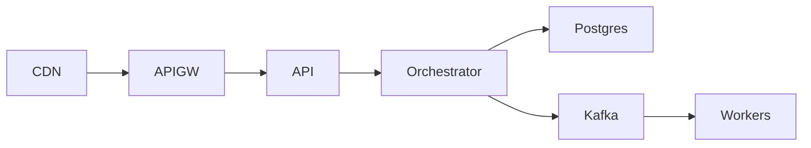

# Deployment Diagram

Runtime platform specification for secure, resilient, and observable deployment.

## Artifact-Specific Objectives
- Define environment topology, trust boundaries, and security controls.
- Specify HA, backup, and disaster-recovery parameters.
- Map observability pipelines and alert responsibilities.

## Platform Control Matrix

| Infrastructure Area | Required Control | Validation Method |
|---|---|---|
| Network | Segmented subnets + least-privilege ACLs | IaC policy checks + penetration tests |
| Data | HA database, encryption, backups | failover drill + restore verification |
| Operations | telemetry + centralized SIEM | alert test + incident simulation |

## Lifecycle and Governance Specifics

- **Provisioning in Deployment Diagram**: Define preconditions, policy gate, and emitted evidence artifact.
- **Allocation in Deployment Diagram**: Define contention handling, SLA timers, and rollback behavior.
- **Decommissioning in Deployment Diagram**: Define terminal checks, retention obligations, and approval authority.
- **Exception workflow in Deployment Diagram**: Detect → classify → contain → resolve → recover → postmortem with owner + SLA.

## Implementation Checklist

- [ ] Artifact reviewed by engineering, operations, and governance stakeholders.
- [ ] Traceability links added to related requirements/design/runbooks.
- [ ] Failure-path and compensation behavior documented in testable form.
- [ ] Metrics and alerts mapped to artifact outcomes.

## Mermaid Diagram

