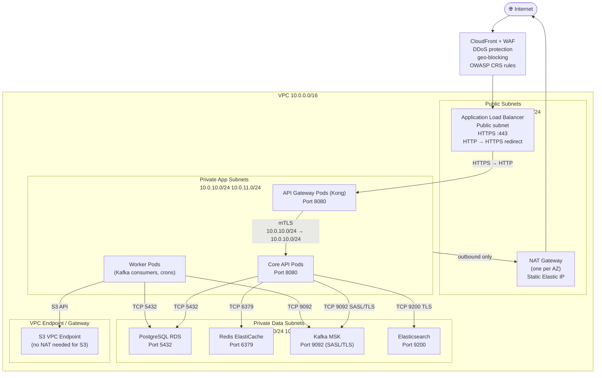
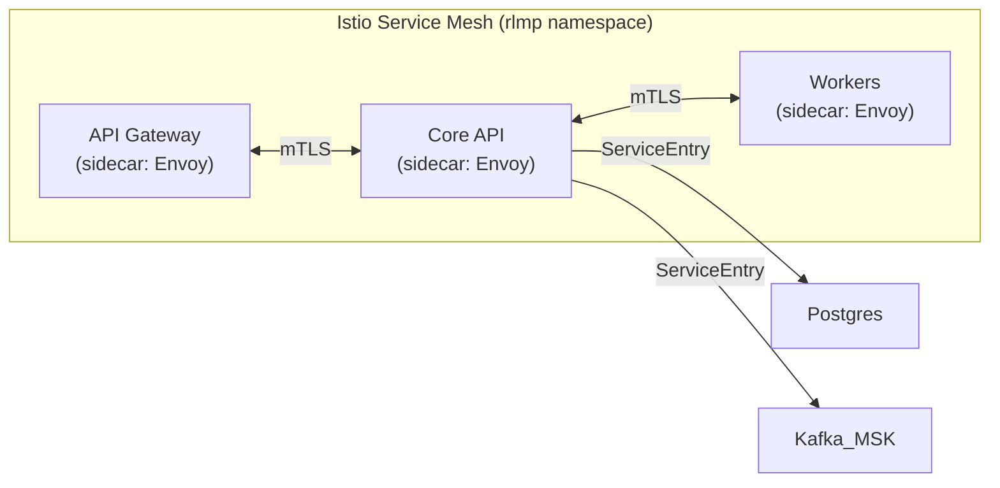

# Network Infrastructure

Network topology, security group rules, traffic flow, and service mesh configuration for the **Resource Lifecycle Management Platform**.

---

## Network Topology

---

## Security Group Rules

### SG: api-gateway
| Direction | Port | Protocol | Source / Dest | Purpose |
|---|---|---|---|---|
| Inbound | 8080 | TCP | ALB security group | Receive proxied requests |
| Outbound | 8080 | TCP | core-api security group | Forward to Core API |
| Outbound | 443 | TCP | Identity Provider IP ranges | JWT validation |

### SG: core-api
| Direction | Port | Protocol | Source / Dest | Purpose |
|---|---|---|---|---|
| Inbound | 8080 | TCP | api-gateway security group | Accept requests |
| Outbound | 5432 | TCP | postgres security group | DB queries |
| Outbound | 6379 | TCP | redis security group | Cache operations |
| Outbound | 9092 | TCP | kafka security group | Outbox events |
| Outbound | 9200 | TCP | elasticsearch security group | Search queries |
| Outbound | 8181 | TCP | localhost (OPA sidecar) | Policy evaluation |

### SG: postgres
| Direction | Port | Protocol | Source / Dest | Purpose |
|---|---|---|---|---|
| Inbound | 5432 | TCP | core-api security group | Application queries |
| Inbound | 5432 | TCP | worker security group | Worker jobs |
| Inbound | 5432 | TCP | bastion security group | Admin access |
| Outbound | — | All | None | No direct outbound |

### SG: kafka
| Direction | Port | Protocol | Source / Dest | Purpose |
|---|---|---|---|---|
| Inbound | 9092 | TCP | core-api security group | Producer |
| Inbound | 9092 | TCP | worker security group | Consumer |
| Outbound | — | All | None | Managed service |

---

## Service Mesh (Optional – Istio)

When Istio is enabled (recommended for production):
- mTLS is enforced **automatically** between all pods in the mesh.
- Explicit `PeerAuthentication` policy set to `STRICT` for the `rlmp` namespace.
- `AuthorizationPolicy` restricts core-api → postgres to only the `core-api` service account.
- Traffic to external systems uses Istio `ServiceEntry` objects (no ad-hoc egress allowed).

---

## DNS and Load Balancing

| FQDN | Target | Routing |
|---|---|---|
| `api.rlmp.example.com` | CloudFront → ALB → API Gateway | Active-active, health-check based |
| `api-dr.rlmp.example.com` | DR ALB → DR API Gateway | Active only during failover |
| Internal: `core-api.rlmp.svc.cluster.local` | Kubernetes ClusterIP | Service DNS within cluster |
| Internal: `postgres-primary.rlmp.svc.cluster.local` | PostgreSQL primary | RDS CNAME via ExternalName service |

---

## Cross-References

- Cloud architecture: [cloud-architecture.md](./cloud-architecture.md)
- Deployment diagram: [deployment-diagram.md](./deployment-diagram.md)
- Security edge cases: [../edge-cases/security-and-compliance.md](../edge-cases/security-and-compliance.md)
