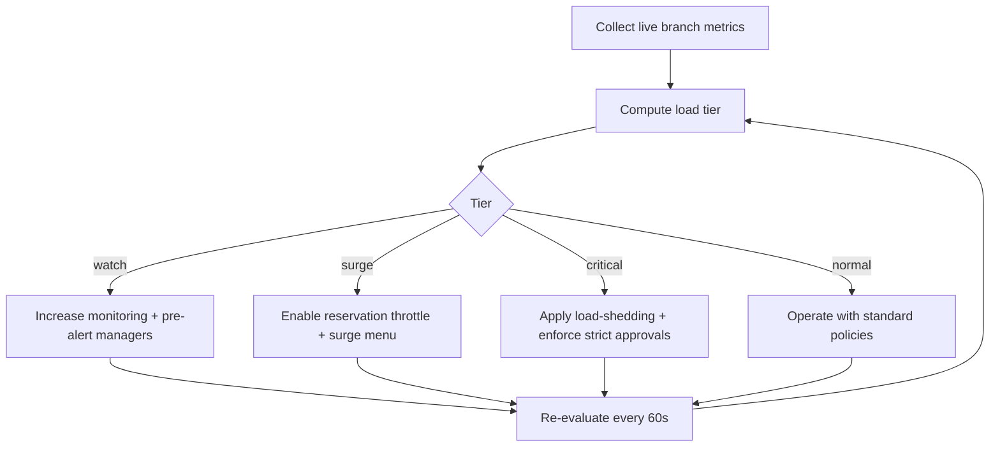

# Activity Diagram - Restaurant Management System

## Guest-to-Settlement Flow

```mermaid
flowchart TD
    start([Guest wants service]) --> arrival{Reservation or walk-in?}
    arrival -- Reservation --> seat[Seat reserved table]
    arrival -- Walk-in --> wait{Table available?}
    wait -- No --> queue[Join waitlist and monitor status]
    wait -- Yes --> seat
    queue --> seat
    seat --> order[Waiter captures order]
    order --> validate{Items available and valid?}
    validate -- No --> adjust[Adjust order or substitute items]
    adjust --> order
    validate -- Yes --> kitchen[Route tickets to kitchen stations]
    kitchen --> prep[Prepare items and update status]
    prep --> ready[Mark ready / serve items]
    ready --> more{More items or requests?}
    more -- Yes --> order
    more -- No --> bill[Generate bill]
    bill --> settle[Collect payment and close settlement]
    settle --> close[Update sales, stock, and branch summaries]
    close --> end([Service completed])
```

## Peak-Load Adaptive Activity Flow



## Activity Controls and Guard Conditions

| Activity Step | Guard Condition | Failure Handling |
|---------------|-----------------|------------------|
| Seat party | Table status must be `available` or valid `reserved` hold | Reject seating and propose alternative table graph |
| Submit order | Draft version matches latest persisted version | Return conflict payload and allow selective merge |
| Route to kitchen | Station routing exists for every line item | Mark unroutable lines as blocked and notify expediter |
| Close bill | No unresolved payment intents | Keep check open in `partially_paid` with retry-safe reconciliation |
| Release table | Check terminal state reached and incident flag clear | Transition to `blocked` requiring manager clearance |
