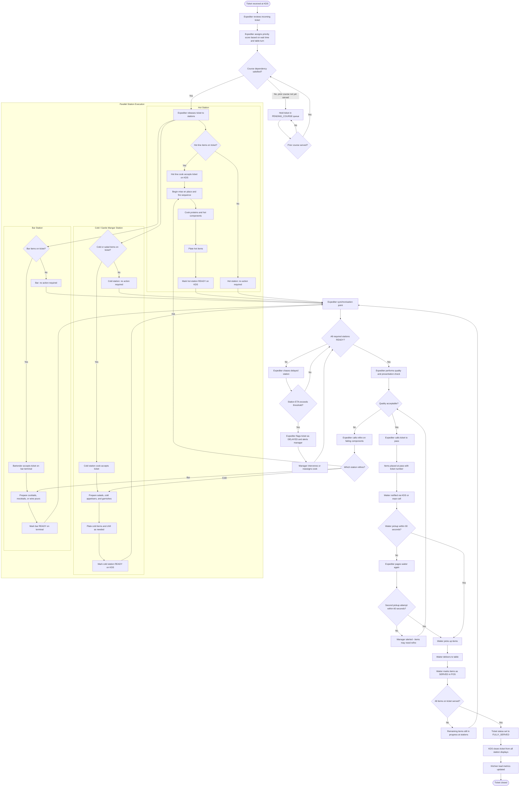

# Activity Diagram - Restaurant Management System

This document captures the five primary operational flows of the restaurant management system as UML-style activity diagrams rendered with Mermaid. Each diagram covers the complete lifecycle of a distinct business process, including all decision branches, error paths, and recovery actions. Guard conditions, timing requirements, and concurrency notes follow the diagrams.

---

## Diagram 1: Customer Reservation Flow

### Introduction

The reservation flow begins the moment a prospective guest decides to book a table and ends either with a confirmed, seated party or with the party escalated to the waitlist after an extended no-show window. The flow handles two inbound channels (online self-service and staff-assisted phone or walk-in booking), enforces capacity and time-slot rules at each step, and emits the appropriate confirmation artefact to the guest. After a party arrives, a grace-period timer governs whether the table is held, reassigned, or escalated. Guests who cannot be seated immediately are placed on a real-time waitlist that re-evaluates every time a table becomes available.

Key actors: **Guest**, **Reservation System**, **Front-of-House Staff**, **Notification Service**, **Waitlist Manager**.

```mermaid
flowchart TD
    A([Guest decides to make a reservation]) --> B{Booking channel?}

    B -- Online --> C[Guest opens reservation portal or app]
    B -- Phone / Walk-in --> D[Staff opens reservation console]

    C --> E[Guest selects date, time, party size, and preferences]
    D --> F[Staff captures date, time, party size, and special requests]

    E --> G[System checks real-time table availability]
    F --> G

    G --> H{Slot available?}

    H -- No --> I[System returns next available slots within ±2 hours]
    I --> J{Guest accepts alternative slot?}
    J -- No --> K[Add guest to waitlist with priority score]
    J -- Yes --> L[Guest selects alternative slot]
    L --> G

    H -- Yes --> M[Lock slot for 5-minute hold window]
    M --> N{Booking channel?}

    N -- Online --> O[Guest completes profile and payment guarantee]
    N -- Phone / Walk-in --> P[Staff records guest profile and notes]

    O --> Q[Validate guest profile - email and phone required]
    P --> Q

    Q --> R{Profile valid?}
    R -- No --> S[Return validation errors to guest or staff]
    S --> O
    R -- Yes --> T[Persist reservation with status CONFIRMED]

    T --> U{Preferred confirmation method?}
    U -- SMS only --> V[Send SMS confirmation with booking code]
    U -- Email only --> W[Send email confirmation with booking details]
    U -- Both --> X[Send SMS and email confirmation concurrently]

    V --> Y[Release slot hold - table now RESERVED]
    W --> Y
    X --> Y

    K --> Z[Waitlist engine polls for cancellations every 60s]
    Z --> AA{Table freed?}
    AA -- No --> Z
    AA -- Yes --> AB[Notify next waitlist guest via preferred channel]
    AB --> AC{Guest responds within 10 minutes?}
    AC -- No --> AD[Skip guest and advance waitlist position]
    AD --> Z
    AC -- Yes --> T

    Y --> AE([Reservation confirmed - awaiting guest arrival])

    AE --> AF{Guest arrives?}
    AF -- Yes, on time --> AG[Staff marks party as ARRIVED in system]
    AF -- Yes, within grace period --> AH{Within 15-minute grace window?}
    AH -- Yes --> AG
    AH -- No --> AI[Notify manager of late arrival]
    AI --> AJ{Manager approves extended hold?}
    AJ -- Yes --> AG
    AJ -- No --> AK[Release table back to available pool]
    AK --> AL[Mark reservation as NO_SHOW]
    AL --> AM[Log no-show against guest profile]
    AM --> AN([Reservation cycle ends])

    AF -- No response by reservation time --> AO[Start no-show timer 15 minutes]
    AO --> AP{Timer expired?}
    AP -- No --> AF
    AP -- Yes --> AK

    AG --> AQ[Host assigns specific table matching party size and preferences]
    AQ --> AR([Guest seated - hand off to Table Service flow])
```

---

## Diagram 2: Table Service Order Flow (Seated to Payment Complete)

### Introduction

The table service flow covers the entire dine-in lifecycle from the moment a host seats a party through every round of ordering, kitchen execution, and course delivery, and concludes with bill generation, payment processing, receipt printing, and table release. The flow accommodates multiple order rounds (appetisers, mains, desserts, additional drinks), handles item substitutions when stock runs out mid-service, and manages payment failure retries. At the end of the flow the table transitions back to the available pool and the POS settlement record is finalised.

Key actors: **Host**, **Waiter**, **POS System**, **Kitchen Display System (KDS)**, **Payment Gateway**, **Cashier / Manager**.

```mermaid
flowchart TD
    A([Guest arrives and is greeted by host]) --> B[Host verifies reservation or party size for walk-in]
    B --> C{Table ready?}
    C -- No --> D[Offer waiting area and estimated wait time]
    D --> E{Guest willing to wait?}
    E -- No --> F([Guest leaves - cycle ends])
    E -- Yes --> G[Add to floor wait queue]
    G --> C
    C -- Yes --> H[Host seats party at assigned table]
    H --> I[System sets table status to OCCUPIED]
    I --> J[System auto-assigns waiter based on section rotation]
    J --> K[Waiter greeted notification sent to assigned waiter's device]
    K --> L[Waiter approaches table and presents menus]
    L --> M[Waiter takes beverage order first]
    M --> N[Waiter enters order items in POS]

    N --> O{All items available in real-time inventory?}
    O -- No --> P[System flags unavailable items and suggests substitutes]
    P --> Q{Guest accepts substitute or removes item?}
    Q -- Accepts substitute --> R[Replace line item in POS]
    Q -- Removes item --> S[Remove line item from order]
    R --> O
    S --> O
    O -- Yes --> T[Waiter submits order]

    T --> U[POS validates order against active menu and pricing rules]
    U --> V{Order valid?}
    V -- No --> W[Return validation error to waiter's device]
    W --> N
    V -- Yes --> X[POS assigns order ID and timestamps each line item]

    X --> Y[Route tickets to appropriate kitchen stations]

    subgraph KitchenRouting [Kitchen Station Routing]
        Y --> Y1{Hot station items?}
        Y1 -- Yes --> Y2[Send ticket to hot line KDS]
        Y1 -- No --> Y3[Skip hot station]
        Y --> Y4{Cold or salad items?}
        Y4 -- Yes --> Y5[Send ticket to cold station KDS]
        Y4 -- No --> Y6[Skip cold station]
        Y --> Y7{Bar items?}
        Y7 -- Yes --> Y8[Send ticket to bar POS terminal]
        Y7 -- No --> Y9[Skip bar]
    end

    Y2 --> Z[Kitchen prepares items - see Diagram 3]
    Y5 --> Z
    Y8 --> Z

    Z --> AA[Expediter marks all items for a course as READY]
    AA --> AB[Waiter pickup notification sent]
    AB --> AC[Waiter picks up and serves items]
    AC --> AD[Waiter marks items as SERVED in POS]

    AD --> AE{More courses or additional orders?}
    AE -- Yes --> AF[Guest places additional order round]
    AF --> N
    AE -- No --> AG{Guest requests bill?}
    AG -- Not yet --> AH[Waiter performs periodic check-backs]
    AH --> AG
    AG -- Yes --> AI[Waiter triggers bill request in POS]

    AI --> AJ[POS aggregates all line items, modifiers, and taxes]
    AJ --> AK{Discounts or promotions applicable?}
    AK -- Yes --> AL[Apply discount rules and recompute totals]
    AL --> AM[Generate itemised bill]
    AK -- No --> AM

    AM --> AN[Waiter presents bill to guest]
    AN --> AO{Payment method?}
    AO -- Cash --> AP[Collect cash and calculate change]
    AP --> AQ[Waiter records cash payment in POS]
    AO -- Card --> AR[Process card on payment terminal]
    AR --> AS{Payment authorised?}
    AS -- No --> AT[Terminal returns decline reason]
    AT --> AU{Retry or alternate method?}
    AU -- Retry --> AR
    AU -- Alternate method --> AO
    AS -- Yes --> AV[Record card settlement reference in POS]
    AO -- Split payment --> AW[Guest specifies split amounts per method]
    AW --> AX[Process each split sequentially]
    AX --> AS

    AQ --> AY[Mark order as PAID in POS]
    AV --> AY

    AY --> AZ{Receipt preference?}
    AZ -- Print --> BA[Print physical receipt]
    AZ -- Email --> BB[Email digital receipt]
    AZ -- Both --> BC[Print and email receipt concurrently]
    AZ -- None --> BD[Skip receipt]

    BA --> BE[Waiter thanks guest]
    BB --> BE
    BC --> BE
    BD --> BE

    BE --> BF[Guest departs]
    BF --> BG[Waiter marks table as NEEDS_BUSSING]
    BG --> BH[Bussing team clears and resets table]
    BH --> BI[Table status set to AVAILABLE]
    BI --> BJ[Notify host of available table]
    BJ --> BK([Table service cycle complete])
```

---

## Diagram 3: Kitchen Preparation and Ticket Flow

### Introduction

The kitchen flow handles every ticket from the moment it arrives on a kitchen display system through multi-station parallel execution, expediter oversight, pass pickup, and final service confirmation. Tickets for complex dishes may require coordinated execution across the hot line, cold station, and bar simultaneously; the expediter acts as the synchronisation point before any course is allowed to leave the pass. A refire path handles items that arrive at the pass in an unacceptable condition. When a ticket is fully served and confirmed by the waiter, it is closed and the kitchen load is updated.

Key actors: **Expediter**, **Line Cook (Hot)**, **Line Cook (Cold)**, **Bartender**, **Waiter**, **KDS**.

---

## Diagram 4: Delivery Order Flow

### Introduction

The delivery flow accommodates two inbound channels: orders received from third-party aggregator platforms (e.g., integrated via webhook) and orders placed directly through the restaurant's own online ordering portal or POS. After validation, both paths converge on kitchen preparation and then diverge again for driver assignment — third-party orders may use the platform's own driver fleet while direct orders use the restaurant's in-house drivers or a contracted courier. The flow includes handling for driver unavailability, failed deliveries, and returned orders, as well as payment settlement differences between aggregator-collected and direct-collected payments.

Key actors: **Customer**, **Third-Party Platform**, **Online Portal / POS**, **Kitchen**, **Driver / Courier**, **Delivery Manager**, **Payment Gateway**.

```mermaid
flowchart TD
    A([Delivery order initiated]) --> B{Order source?}

    B -- Third-party platform --> C[Platform sends order webhook to integration service]
    C --> D[Integration service parses and maps platform order to internal schema]
    D --> E{Mapping successful?}
    E -- No --> F[Log parse error and send NACK to platform]
    F --> G[Alert integration ops team]
    G --> H([Order ingestion failed])
    E -- Yes --> I[Create internal order with source = THIRD_PARTY]

    B -- Direct portal or POS --> J[Customer submits order via portal or staff enters via POS]
    J --> K[Validate customer address using geolocation service]
    K --> L{Address within delivery radius?}
    L -- No --> M[Return out-of-range error to customer]
    M --> N([Order rejected - outside delivery zone])
    L -- Yes --> O[Create internal order with source = DIRECT]

    I --> P[Order validation: menu availability, pricing, and minimum order check]
    O --> P

    P --> Q{Order valid?}
    Q -- No --> R[Return validation errors]
    R --> S{Source?}
    S -- Third-party --> T[Send error response to platform for customer correction]
    S -- Direct --> U[Return errors to customer interface]
    T --> A
    U --> A

    Q -- Yes --> V[Confirm order and send acknowledgement to customer]
    V --> W{Payment method?}
    W -- Pre-paid online --> X[Verify payment intent with payment gateway]
    X --> Y{Payment confirmed?}
    Y -- No --> Z[Cancel order and notify customer]
    Z --> AA([Order cancelled - payment failed])
    Y -- Yes --> AB[Mark payment as CAPTURED]
    W -- Cash on delivery --> AC[Mark payment as PENDING_COD]
    W -- Platform-collected --> AD[Mark payment as PLATFORM_SETTLED - no gateway action]

    AB --> AE[Route ticket to kitchen]
    AC --> AE
    AD --> AE

    AE --> AF[Kitchen prepares order - see Diagram 3]
    AF --> AG[Packaging team prepares delivery packaging]
    AG --> AH[Items packed and labelled with order ID and delivery address]
    AH --> AI{Driver assignment method?}

    AI -- Third-party fleet --> AJ[Notify platform that order is ready for pickup]
    AJ --> AK{Platform driver arrives within estimated window?}
    AK -- No --> AL[Send late pickup alert to delivery manager]
    AL --> AM{Wait extended or reassign?}
    AM -- Wait --> AK
    AM -- Reassign to in-house driver --> AN

    AI -- In-house driver --> AN[System checks available in-house drivers]
    AN --> AO{Driver available?}
    AO -- No --> AP[Notify delivery manager - no driver available]
    AP --> AQ{Resolution?}
    AQ -- Wait for driver --> AN
    AQ -- Use contracted courier --> AR[Dispatch to contracted courier API]
    AR --> AS{Courier accepts?}
    AS -- No --> AP
    AS -- Yes --> AT[Assign courier as driver entity]
    AO -- Yes --> AT

    AK -- Yes --> AT

    AT --> AU[Driver receives pickup notification on driver app]
    AU --> AV[Driver confirms pickup and order condition]
    AV --> AW{Order condition acceptable?}
    AW -- No, items damaged --> AX[Manager inspects and decides to refire or refund]
    AX --> AY{Refire or refund?}
    AY -- Refire --> AF
    AY -- Refund --> AZ[Process refund and cancel delivery]
    AZ --> BA([Order refunded - cycle ends])

    AW -- Yes --> BB[Driver departs - order status set to OUT_FOR_DELIVERY]
    BB --> BC[Real-time GPS tracking active]
    BC --> BD{Delivery attempt successful?}
    BD -- Yes --> BE[Driver marks delivered on driver app]
    BE --> BF[Customer notified of successful delivery]
    BF --> BG{Payment method?}
    BG -- COD --> BH[Driver collects cash and records amount in app]
    BH --> BI[Reconcile COD amount against order total]
    BI --> BJ{COD amount correct?}
    BJ -- No --> BK[Flag discrepancy for manager review]
    BJ -- Yes --> BL[Mark payment as COLLECTED]
    BG -- Pre-paid or platform --> BL
    BL --> BM[Order status set to COMPLETED]
    BM --> BN([Delivery cycle complete])

    BD -- No, customer not home --> BO[Driver attempts contact via phone]
    BO --> BP{Customer reachable?}
    BP -- Yes --> BQ[Reattempt delivery at agreed time]
    BQ --> BD
    BP -- No --> BR[Driver returns order to restaurant]
    BR --> BS[Order status set to DELIVERY_FAILED]
    BS --> BT[Notify customer and initiate refund or reschedule]
    BT --> BU([Delivery failed - escalated to manager])
```

---

## Diagram 5: End-of-Day Reconciliation Flow

### Introduction

The end-of-day (EOD) reconciliation flow is initiated by the closing manager and ensures that all financial, inventory, and operational records for the shift are accurate before the system advances to the next business day. The flow enforces strict checkpoints: all orders must be closed, all payment settlements must match POS totals, cash drawers must be physically counted and reconciled, and any discrepancy above a configurable threshold requires manager sign-off. Tips are distributed to staff according to the configured tip-pooling or tip-out rules. A daily sales report is generated and the accounting export is pushed to the external accounting system. Only after all steps succeed does the manager formally sign off and close the shift.

Key actors: **Closing Manager**, **POS System**, **Accounting System**, **Inventory System**, **Payroll System**.

```mermaid
flowchart TD
    A([Manager initiates end-of-day close]) --> B[POS system locks new order creation for the shift]
    B --> C[System compiles list of all orders for the shift]
    C --> D{Any orders still in OPEN or IN_PROGRESS state?}
    D -- Yes --> E[Display list of unclosed orders to manager]
    E --> F{Manager action?}
    F -- Force-close individual orders --> G[Manager reviews and force-closes each order with reason code]
    G --> D
    F -- Escalate outstanding tabs --> H[Flag outstanding tabs for next shift handoff]
    H --> I[Send outstanding tab report to next shift manager]
    I --> D
    D -- No open orders --> J[All orders verified as closed]

    J --> K[System compiles all payment transactions for the shift]
    K --> L{Any unsettled payment intents?}
    L -- Yes --> M[List unsettled payment intents to manager]
    M --> N{Manager action?}
    N -- Retry settlement --> O[Trigger manual settlement retry via payment gateway]
    O --> P{Settlement succeeded?}
    P -- Yes --> L
    P -- No --> Q[Mark as SETTLEMENT_FAILED and log for finance team]
    Q --> L
    N -- Write off --> R[Manager authorises write-off with reason]
    R --> L
    L -- No unsettled intents --> S[All payments verified as settled]

    S --> T[System prompts manager to count cash drawer]
    T --> U[Manager physically counts cash by denomination]
    U --> V[Manager enters counted total into POS]
    V --> W[System retrieves expected cash total from POS transaction log]
    W --> X[Calculate variance = counted total minus expected total]
    X --> Y{Variance within acceptable threshold?}
    Y -- Within threshold --> Z[Record variance as acceptable - no action required]
    Y -- Over threshold - shortage --> AA{Shortage exceeds policy limit?}
    AA -- No --> AB[Log minor shortage with manager note]
    AA -- Yes --> AC[Require manager to provide written explanation]
    AC --> AD[Flag for finance audit]
    AD --> AE[Manager acknowledges shortage]
    Y -- Over threshold - overage --> AF{Overage exceeds policy limit?}
    AF -- No --> AG[Log minor overage with manager note]
    AF -- Yes --> AH[Require manager to identify source of excess cash]
    AH --> AI[Log overage for finance audit]
    AI --> AJ[Manager acknowledges overage]

    Z --> AK[Cash drawer reconciliation complete]
    AB --> AK
    AE --> AK
    AG --> AK
    AJ --> AK

    AK --> AL[System calculates tip totals from all card and cash tips for the shift]
    AL --> AM{Tip distribution model?}
    AM -- Individual --> AN[Assign tips directly to serving staff by order]
    AM -- Tip pool --> AO[Calculate pool share based on hours worked and role weights]
    AM -- Tip out percentage --> AP[Deduct tip-out percentage for support staff and distribute remainder to servers]
    AN --> AQ[Generate tip distribution ledger]
    AO --> AQ
    AP --> AQ
    AQ --> AR[Staff tip amounts pushed to payroll system]
    AR --> AS{Payroll system accepted tip data?}
    AS -- No --> AT[Log payroll sync failure and alert HR]
    AT --> AU[Queue for manual entry - do not block EOD]
    AS -- Yes --> AV[Tip distribution recorded]
    AU --> AV

    AV --> AW[Generate daily sales report]
    AW --> AX[Report includes: gross sales, net sales, tax collected, discounts, voids, comps, covers, average check, tips, payment method breakdown]
    AX --> AY[Manager reviews report summary on screen]
    AY --> AZ{Report figures match manager's expectations?}
    AZ -- No --> BA[Manager flags specific line items for investigation]
    BA --> BB[System generates variance drill-down for flagged lines]
    BB --> BC[Manager reviews drill-down and acknowledges or escalates]
    BC --> AZ
    AZ -- Yes --> BD[Manager approves daily sales report]

    BD --> BE[Trigger accounting system export]
    BE --> BF{Accounting export method?}
    BF -- API push --> BG[POST daily journal entry to accounting system API]
    BF -- File export --> BH[Generate CSV or XML export file and deliver via SFTP]

    BG --> BI{Export acknowledged by accounting system?}
    BI -- Yes --> BJ[Mark accounting export as COMPLETED]
    BI -- No --> BK{Retry count less than 3?}
    BK -- Yes --> BL[Wait 5 minutes and retry]
    BL --> BG
    BK -- No --> BM[Flag export as FAILED and alert finance team]
    BM --> BN[Queue export for manual retry next business day]

    BH --> BO{File delivered successfully?}
    BO -- Yes --> BJ
    BO -- No --> BM

    BJ --> BP[Post inventory depletion for the shift to inventory system]
    BN --> BP
    BP --> BQ{Inventory post succeeded?}
    BQ -- No --> BR[Log inventory sync failure and alert kitchen manager]
    BR --> BS[Queue for next scheduled inventory sync]
    BQ -- Yes --> BT[Inventory levels updated]
    BS --> BT

    BT --> BU[System generates shift closure summary]
    BU --> BV[Summary includes: shift hours, covers served, staff on duty, flagged incidents, reconciliation status]
    BV --> BW[Manager reviews closure summary]
    BW --> BX[Manager provides digital sign-off with PIN or biometric]
    BX --> BY{Sign-off authenticated?}
    BY -- No --> BZ[Re-prompt for authentication - max 3 attempts]
    BZ --> BX
    BY -- Yes --> CA[Shift status set to CLOSED]
    CA --> CB[System advances business date]
    CB --> CC[Opening tasks for next shift queued]
    CC --> CD([End-of-day reconciliation complete])
```

---

## Activity Guard Conditions Table

The following table enumerates the guard conditions that must be satisfied before each major activity can proceed, the failure action taken when the guard is not met, and the recovery path available to operators.

| Activity | Guard Condition | Failure Action | Recovery Path |
|---|---|---|---|
| Accept online reservation | Slot must not be held or reserved by concurrent request; guest email and phone must be unique or match existing profile | Return slot-conflict error and suggest alternatives | Guest selects alternative slot or joins waitlist |
| Confirm reservation hold | Payment guarantee method must be on file for reservations above party-size threshold | Prompt guest to add card before hold is issued | Guest adds payment method; hold issued within 5-minute window |
| Seat party | Table status must be `available` or match a `confirmed` reservation for the party's arrival window | Propose an available table of equal or greater capacity | Host manually overrides with manager approval if no match |
| Submit order round | All line items must exist in the active menu version; draft order version must match latest server version | Return item-not-found or version-conflict error to waiter device | Waiter refreshes menu, removes or substitutes flagged items |
| Route ticket to kitchen station | A routing rule must exist for every line item; station must be in `open` state | Mark unroutable items as `BLOCKED`; alert expediter | Expediter manually assigns blocked items to an available station |
| Release ticket from hold | All prior-course items must carry status `SERVED` | Keep ticket in `PENDING_COURSE` queue | Expediter monitors and releases manually when prior course confirmed |
| Mark station READY | All items assigned to that station on the ticket must be plated | Station cook cannot mark READY with outstanding items | Cook contacts expediter to split ticket if item cannot be completed |
| Confirm driver pickup | Driver must acknowledge pickup and confirm order condition in the driver app within the pickup window | Escalate to delivery manager after 10-minute timeout | Manager reassigns to alternate driver or contracted courier |
| Capture COD payment | Driver-recorded cash amount must equal order total within a ±$0.50 rounding tolerance | Flag discrepancy in driver app; require driver note | Delivery manager reviews and approves or escalates to finance |
| Initiate EOD close | All orders must be in a terminal state (`PAID`, `VOIDED`, `COMPED`) | Block EOD initiation and display list of open orders | Manager force-closes or escalates outstanding orders |
| Proceed past cash reconciliation | Cash variance must be within the configured threshold (default ±$5.00) | Block progression and require written manager explanation | Manager provides explanation; finance team flags for audit |
| Manager sign-off | Authentication must succeed (PIN or biometric) within 3 attempts | Lock EOD sign-off and page duty manager or owner | Senior manager unlocks with elevated credentials |
| Push accounting export | Accounting system API must return `2xx` acknowledgement within 30 seconds | Retry up to 3 times with 5-minute back-off | Finance team performs manual journal entry; failed export logged |
| Post inventory depletion | Inventory system must accept depletion records for all items sold | Log failure and queue for next scheduled sync window | Kitchen manager reconciles manually during opening mise en place |
| Advance business date | Shift status must be `CLOSED` and manager sign-off must be recorded | Prevent date advance; retain current business date | Resolve any blocking condition and re-attempt sign-off |

---

## Activity Timing Requirements

The following table specifies the expected maximum durations for key activities under normal operating conditions. Durations flagged as **SLA** represent customer-facing commitments enforced by automated alerts. Durations flagged as **Operational** are internal targets used for kitchen load and staffing optimisation.

| Activity | Expected Duration | Category | Alert Threshold | Escalation Action |
|---|---|---|---|---|
| Online reservation creation (start to confirmation sent) | ≤ 30 seconds | SLA | > 45 seconds | Page on-call engineer; check availability service health |
| Phone reservation creation (staff-assisted) | ≤ 3 minutes | Operational | > 5 minutes | Prompt staff to use quick-entry mode |
| Waitlist notification to guest response window | 10 minutes | SLA | Timeout = 10 min | Auto-advance to next waitlist position |
| Table seating (host seats to waiter greeted notification) | ≤ 2 minutes | Operational | > 3 minutes | Alert section manager |
| Order submission to KDS receipt confirmation | ≤ 5 seconds | SLA | > 10 seconds | Alert POS admin; check KDS connectivity |
| Kitchen routing (order submitted to all station tickets received) | ≤ 10 seconds | SLA | > 20 seconds | Alert kitchen manager; check routing service |
| Hot station ticket execution (fire to pass) | ≤ 20 minutes | Operational | > 25 minutes | Expediter chases cook; manager alerted at 30 minutes |
| Cold station ticket execution | ≤ 10 minutes | Operational | > 15 minutes | Expediter reassigns or splits ticket |
| Bar ticket execution (cocktail preparation) | ≤ 5 minutes | Operational | > 8 minutes | Bartender alerts expediter for course sync relief |
| Waiter pickup from pass (notification to pickup) | ≤ 90 seconds | Operational | > 3 minutes | Expediter pages waiter; manager alerted at 5 minutes |
| Bill generation (request to bill presented) | ≤ 60 seconds | SLA | > 2 minutes | Alert POS admin; verify tax engine response time |
| Card payment processing (terminal tap/swipe to authorisation) | ≤ 10 seconds | SLA | > 20 seconds | Retry or prompt alternate payment method |
| Cash payment recording (cash tendered to receipt printed) | ≤ 2 minutes | Operational | > 3 minutes | Alert manager |
| Table bussing and reset (guest departs to AVAILABLE status) | ≤ 10 minutes | Operational | > 15 minutes | Alert floor manager to deploy additional bussing staff |
| Delivery order ingestion (webhook received to kitchen ticket created) | ≤ 15 seconds | SLA | > 30 seconds | Alert integration ops; check platform webhook health |
| Driver assignment (order ready to driver accepted) | ≤ 5 minutes | Operational | > 10 minutes | Delivery manager escalates to contracted courier |
| EOD close initiation to manager sign-off | ≤ 30 minutes | Operational | > 45 minutes | Alert owner; identify blocking step from EOD audit log |
| Accounting export (trigger to acknowledgement) | ≤ 60 seconds | SLA | > 90 seconds | Auto-retry up to 3 times; alert finance team on third failure |

---

## Concurrent Activity Notes

Several activities in the restaurant management system are designed to execute in parallel. Understanding these concurrent paths and their synchronisation points is essential for correct system implementation and accurate capacity planning.

### Reservation and Walk-in Processing

The reservation system and the floor seating queue operate on independent threads. A new reservation can be created and confirmed while the host is simultaneously seating walk-in parties. The only synchronisation point is the **table availability lock**: when a reservation confirmation locks a specific table for a time slot, the floor seating queue must observe that lock and exclude the table from walk-in assignment until the reservation's arrival window expires.

### Multi-Station Kitchen Execution

As shown in Diagram 3, the hot station, cold station, and bar execute their respective ticket items in parallel once the expediter releases a ticket. The synchronisation point is the **expediter pass check**: no item from any station may be plated at the pass until all stations required for that course have signalled READY. This prevents a guest from receiving half a course and ensures temperature consistency for hot items.

### Concurrent Order Rounds

While the kitchen is preparing Course 1, the waiter may take and submit the order for Course 2. The POS accepts the second submission and creates a new ticket held in **PENDING_COURSE** state. The kitchen will not begin work on Course 2 items until Course 1 is fully served. This allows the waiter and kitchen to pipeline work without requiring the guest to place all orders simultaneously.

### Payment and Receipt Generation

When a bill is settled, receipt printing (physical) and receipt emailing run concurrently on separate output channels. Neither channel blocks the other; the table can be released as soon as the POS records the PAID status, regardless of whether the physical printer has finished spooling.

### Delivery Driver Tracking and Payment Capture

Once a driver departs for delivery, GPS tracking and the payment capture workflow operate concurrently. For pre-paid orders, the payment has already been captured, so the tracking loop runs independently. For COD orders, payment capture is triggered only on successful delivery confirmation, while tracking continues until the driver marks the order delivered.

### End-of-Day Parallel Exports

After the manager approves the daily sales report, the accounting export and the inventory depletion post can be initiated concurrently. These two systems are independent and neither result blocks the other from completing. However, both must reach a terminal state (COMPLETED or FAILED-and-acknowledged) before the business date can advance. If either fails, the failure is logged and the remaining system may still complete, but the manager sign-off screen will surface any unresolved export failures for acknowledgement before the date is advanced.
