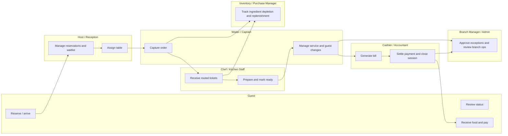
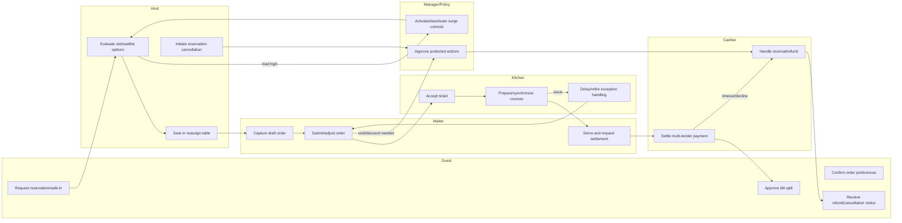

# BPMN Swimlane Diagram - Restaurant Management System

## Swimlane Interpretation

- Front-of-house, kitchen, inventory, and cashiering are intentionally linked as one operational chain.
- Inventory visibility is not a back-office afterthought; it feeds ordering and kitchen decisions in real time.
- Manager approvals remain explicit for operational exceptions such as voids, stock overrides, and settlement issues.

## Detailed Swimlane with Exception and Cancellation Paths

