# BPMN Swimlane Diagrams — Restaurant Management System

This document contains three fully detailed BPMN-style swimlane process diagrams for the Restaurant
Management System. Each diagram captures all primary flows, decision points, exception paths, and
cross-lane handoffs. Following the diagrams, reference tables summarise handoff points, KPIs, and the
exception escalation matrix.

---

## Process 1: Dine-In Order Process (Complete)

### Introduction

The dine-in order process spans six organisational lanes and begins the moment a guest steps through
the door. It covers table assignment, menu interaction, order capture and POS entry, kitchen
preparation, food delivery, billing, payment settlement, and final departure. Exception paths model
the real-world scenarios that front-of-house teams encounter on every shift: discount approvals that
require manager sign-off, void requests, table transfers mid-meal, split-bill negotiations, and
declined card payments. The diagram follows a left-to-right (`LR`) orientation so that the temporal
flow of the guest journey reads naturally from arrival on the left to departure on the right.

**Lanes:** Guest | Host/Reception | Waiter/Server | Kitchen | Cashier | Manager

```mermaid
flowchart LR
    subgraph GUEST[Guest]
        G1([Arrives at restaurant])
        G2[Reviews menu]
        G3{Needs help\nwith menu?}
        G4[Places order verbally]
        G5[Requests item modification]
        G6[Waits for food]
        G7[Receives food]
        G8{Satisfied\nwith order?}
        G9[Requests refire / correction]
        G10[Reviews bill]
        G11{Requests\nsplit bill?}
        G12[Approves split amounts]
        G13{Has discount\nor promo?}
        G14[Presents coupon / loyalty card]
        G15[Pays bill]
        G16{Payment\ndeclined?}
        G17[Provides alternate payment]
        G18([Departs restaurant])
    end

    subgraph HOST[Host / Reception]
        H1[Greets guest]
        H2{Reservation\nexists?}
        H3[Checks reservation record]
        H4[Checks walk-in availability]
        H5{Table\navailable?}
        H6[Adds guest to waitlist]
        H7[Assigns table]
        H8[Updates floor plan in POS]
        H9{Transfer\nrequested?}
        H10[Reassigns table in system]
        H11[Updates floor plan again]
    end

    subgraph WAITER[Waiter / Server]
        W1[Approaches table, introduces self]
        W2[Presents menu & specials]
        W3[Answers menu questions]
        W4[Takes order notes]
        W5[Enters order into POS]
        W6{Modifier or\nallergy flag?}
        W7[Adds modifier / allergy note to ticket]
        W8[Sends ticket to kitchen]
        W9[Monitors kitchen display]
        W10[Picks up food from pass]
        W11[Delivers food to table]
        W12[Checks back after 2 min]
        W13[Submits refire ticket to kitchen]
        W14[Presents bill to guest]
        W15{Split bill\nrequested?}
        W16[Splits check in POS]
        W17{Void item\nneeded?}
        W18[Submits void request]
        W19[Adds tip to record]
        W20[Closes table in POS]
    end

    subgraph KITCHEN[Kitchen]
        K1[Receives ticket on KDS]
        K2[Assigns to station]
        K3{All ingredients\navailable?}
        K4[Flags 86'd item to waiter]
        K5[Prepares dishes]
        K6[Quality check at pass]
        K7{Passes QC?}
        K8[Refires / corrects dish]
        K9[Marks ticket ready on KDS]
        K10[Rings pass bell]
        K11[Receives refire ticket]
        K12[Reprepares item]
        K13[Marks refire ready]
    end

    subgraph CASHIER[Cashier]
        C1[Generates bill from POS]
        C2[Applies auto-discounts / happy hour]
        C3{Manual discount\nor comp request?}
        C4[Holds bill for manager approval]
        C5[Applies approved discount]
        C6[Processes payment]
        C7{Payment\nmethod?}
        C8[Processes card payment]
        C9[Processes cash payment]
        C10[Processes digital wallet]
        C11{Card\ndeclined?}
        C12[Prompts alternate payment]
        C13[Calculates change]
        C14[Prints / emails receipt]
        C15[Closes check in POS]
        C16[Reconciles shift drawer]
    end

    subgraph MANAGER[Manager]
        M1[Monitors floor activity]
        M2{Discount\napproval request?}
        M3[Reviews discount reason]
        M4{Approve?}
        M5[Approves discount]
        M6[Denies discount]
        M7{Void item\nrequest?}
        M8[Reviews void reason]
        M9[Approves void in POS]
        M10[Denies void]
        M11{Complaint\nescalated?}
        M12[Approaches table]
        M13[Resolves complaint]
        M14[Authorises comp if needed]
        M15[Logs incident]
    end

    %% --- Primary happy-path flow ---
    G1 --> H1
    H1 --> H2
    H2 -->|Yes| H3
    H2 -->|No| H4
    H3 --> H5
    H4 --> H5
    H5 -->|Yes| H7
    H5 -->|No| H6
    H6 -->|Table freed| H7
    H7 --> H8
    H8 --> W1
    W1 --> G2
    G2 --> G3
    G3 -->|Yes| W2
    G3 -->|No| G4
    W2 --> W3
    W3 --> G4
    G4 --> W4
    W4 --> W5
    W5 --> W6
    W6 -->|Yes| W7
    W7 --> W8
    W6 -->|No| W8
    W8 --> K1
    K1 --> K2
    K2 --> K3
    K3 -->|No — 86'd| K4
    K4 --> W9
    W9 -->|Notifies guest| G5
    G5 --> W4
    K3 -->|Yes| K5
    K5 --> K6
    K6 --> K7
    K7 -->|No| K8
    K8 --> K6
    K7 -->|Yes| K9
    K9 --> K10
    K10 --> W10
    W10 --> W11
    W11 --> G7
    G7 --> G8
    G8 -->|Yes| W12
    G8 -->|No| G9
    G9 --> W13
    W13 --> K11
    K11 --> K12
    K12 --> K13
    K13 --> W10

    %% --- Billing flow ---
    W12 --> C1
    C1 --> C2
    C2 --> C3
    C3 -->|Yes| C4
    C4 --> M2
    M2 --> M3
    M3 --> M4
    M4 -->|Yes| M5
    M5 --> C5
    M4 -->|No| M6
    M6 --> C1
    C3 -->|No| C6
    C5 --> C6
    C6 --> W14
    W14 --> G10
    G10 --> G11
    G11 -->|Yes| W15
    W15 --> W16
    W16 --> G12
    G12 --> C6
    G11 -->|No| G13
    G13 -->|Yes| G14
    G14 --> C3
    G13 -->|No| G15
    G15 --> C7
    C7 -->|Card| C8
    C7 -->|Cash| C9
    C7 -->|Digital| C10
    C8 --> C11
    C11 -->|Yes| C12
    C12 --> G16
    G16 -->|Yes| G17
    G17 --> C7
    G16 -->|No| M11
    C11 -->|No| C14
    C9 --> C13
    C13 --> C14
    C10 --> C14
    C14 --> W19
    W19 --> W20
    W20 --> C15
    C15 --> C16
    C16 --> G18

    %% --- Void item path ---
    W17 -->|Yes| W18
    W18 --> M7
    M7 --> M8
    M8 --> M9
    M9 --> W5
    M8 --> M10
    M10 --> W14

    %% --- Complaint escalation ---
    M11 -->|Yes| M12
    M12 --> M13
    M13 --> M14
    M14 --> M15
    M15 --> C5

    %% --- Table transfer ---
    H9 -->|Yes| H10
    H10 --> H11
    H11 --> W1

    %% --- Manager monitors floor continuously ---
    M1 --> M2
    M1 --> M7
    M1 --> M11
```

### Narrative Process Description — Dine-In Order Process

**Arrival & Seating (Host/Reception lane)**
A guest arrives and is greeted by the host. The host checks whether a reservation exists in the
system. If one is found, the host retrieves the booking details and locates the assigned or preferred
table. Walk-in guests without reservations are checked against current availability on the live floor
plan. When a suitable table is free, the host assigns it and immediately updates the floor plan in
the POS so that all staff can see the current cover count. If no table is available, the guest is
placed on the waitlist and notified when a table is freed. At any point during the meal, the host
can execute a table transfer if the guest requests a different seat or if operational needs dictate a
move; the host reassigns the table in the system and informs the server.

**Order Taking (Waiter/Server lane)**
Once seated, the server approaches the table, introduces themselves, and presents the physical or
digital menu along with the day's specials. If the guest needs help understanding items or has
allergy questions, the server answers those queries before the guest places a verbal order. The
server captures order notes and enters each item into the POS. Any modifier (e.g., "no onion",
"medium-rare") or allergy flag is attached to the ticket at the POS level before the ticket is fired
to the kitchen display system.

**Kitchen Preparation (Kitchen lane)**
The kitchen receives the ticket on the KDS and routes each item to the relevant station. Before
preparation begins, the kitchen checks ingredient availability. If an item has been 86'd (sold out),
the kitchen flags this to the server, who notifies the guest and offers a substitute; the guest
re-orders, and a new ticket is sent. For available items, the kitchen prepares the dishes and
conducts an in-house quality check at the pass. Items that fail QC are refired before being marked
ready. The pass bell signals the server to collect the food.

**Service & Exception Handling (Waiter/Server ↔ Kitchen)**
The server delivers food to the table and checks back two minutes later. If the guest reports
dissatisfaction (wrong item, temperature issue, etc.), the server submits a refire ticket directly
to the kitchen. The kitchen reprepares the item and marks the refire ready for collection.

**Billing (Cashier lane)**
When the guest signals they are ready for the bill, the cashier generates it from the POS and
automatically applies any eligible discounts (e.g., happy-hour pricing). If a manual discount or
complimentary item is requested, the bill is held and a discount approval request is routed to the
manager. The manager reviews the reason, approves or denies, and the cashier either applies the
discount or presents the undiscounted bill. The guest reviews the bill and, if a split is requested,
the server splits the check in the POS and the guest confirms the amounts.

**Payment (Cashier lane)**
Payment can be processed by card, cash, or digital wallet. A declined card triggers a prompt for an
alternate payment method. If the guest is unable to pay after multiple attempts, the situation is
escalated to the manager for resolution. Successful payment results in a printed or emailed receipt,
the tip is recorded, the check is closed, and the cashier reconciles the shift drawer.

**Void & Complaint Escalation**
Void requests are routed to the manager for approval; approved voids are reflected in the POS
immediately. Unresolved guest complaints escalate to the manager who approaches the table, resolves
the issue, and authorises a comp if necessary, logging the incident for shift reporting.

---

## Process 2: Reservation Confirmation Process (Complete)

### Introduction

The reservation confirmation process governs how a guest request for a future dining slot is
received, validated, confirmed, reminded, and ultimately resolved — whether through arrival,
modification, cancellation, or no-show. It involves four lanes: the Guest who initiates and responds
to communications; the Host/System which checks availability and manages the reservation record;
the Notification Service which orchestrates all outbound messages; and the Manager who handles
policy-sensitive decisions such as overbooking, special accommodation requests, and no-show
penalties. The process explicitly models the waitlist escalation path when the restaurant is at
capacity and the modification and cancellation sub-flows triggered by guest actions.

**Lanes:** Guest | Host/System | Notification Service | Manager

```mermaid
flowchart LR
    subgraph GUEST2[Guest]
        RG1([Wants to make a reservation])
        RG2{Channel?}
        RG3[Submits online reservation form]
        RG4[Calls restaurant]
        RG5[Receives booking confirmation]
        RG6{Needs to\nmodify?}
        RG7[Submits modification request]
        RG8[Receives modified confirmation]
        RG9{Needs to\ncancel?}
        RG10[Submits cancellation request]
        RG11[Receives cancellation confirmation]
        RG12[Receives 24h reminder]
        RG13{Attending?}
        RG14([Arrives at restaurant])
        RG15([No-show — does not arrive])
        RG16[Receives no-show notification]
        RG17{Has special\nrequest?}
        RG18[Submits special request detail]
    end

    subgraph HOST2[Host / System]
        RH1[Receives reservation request]
        RH2[Checks date/time availability]
        RH3{Slot\navailable?}
        RH4[Checks waitlist length]
        RH5{Waitlist\nacceptable?}
        RH6[Offers waitlist position]
        RH7[Validates party size vs floor plan]
        RH8{Party size\nvalid?}
        RH9[Suggests adjusted party size or date]
        RH10{Special\nrequest flagged?}
        RH11[Creates reservation record]
        RH12[Assigns provisional table]
        RH13[Triggers confirmation notification]
        RH14[Monitors arrival window]
        RH15{Guest arrived\non time?}
        RH16[Marks reservation as arrived]
        RH17[Starts no-show timer]
        RH18{No-show\ntimer expired?}
        RH19[Marks reservation as no-show]
        RH20[Releases table back to availability]
        RH21[Receives modification request]
        RH22[Checks new slot availability]
        RH23{New slot\navailable?}
        RH24[Updates reservation record]
        RH25[Triggers modified confirmation]
        RH26[Receives cancellation request]
        RH27[Marks reservation cancelled]
        RH28[Releases slot]
        RH29[Triggers cancellation confirmation]
        RH30{Overbooking\nthreshold reached?}
    end

    subgraph NOTIFY[Notification Service]
        RN1[Sends SMS/email booking confirmation]
        RN2[Queues 24h reminder job]
        RN3[Sends 24h reminder SMS/email]
        RN4[Sends no-show alert to manager]
        RN5[Sends modification confirmation]
        RN6[Sends cancellation confirmation]
        RN7[Sends waitlist position SMS]
        RN8[Sends waitlist promotion SMS]
    end

    subgraph MGR2[Manager]
        RM1[Receives overbooking alert]
        RM2{Approve\noverbooking?}
        RM3[Activates overflow seating]
        RM4[Declines — holds waitlist]
        RM5[Receives special request]
        RM6{Request\nfeasible?}
        RM7[Approves & notes on reservation]
        RM8[Declines & notifies guest]
        RM9[Receives no-show alert]
        RM10{Apply no-show\nfee / policy?}
        RM11[Charges no-show fee]
        RM12[Waives fee — logs exception]
        RM13[Reviews waitlist queue]
        RM14[Promotes next waitlist guest]
    end

    %% --- Reservation request intake ---
    RG1 --> RG2
    RG2 -->|Online| RG3
    RG2 -->|Phone| RG4
    RG3 --> RH1
    RG4 --> RH1
    RH1 --> RH2
    RH2 --> RH3
    RH3 -->|No| RH4
    RH4 --> RH5
    RH5 -->|Yes| RH6
    RH6 --> RN7
    RN7 --> RG5
    RH5 -->|No — full| RH30
    RH30 --> RM1
    RM1 --> RM2
    RM2 -->|Yes| RM3
    RM3 --> RH3
    RM2 -->|No| RM4
    RM4 --> RH6

    RH3 -->|Yes| RH7
    RH7 --> RH8
    RH8 -->|No| RH9
    RH9 --> RG5
    RH8 -->|Yes| RH10
    RH10 -->|Yes| RG17
    RG17 --> RG18
    RG18 --> RM5
    RM5 --> RM6
    RM6 -->|Yes| RM7
    RM7 --> RH11
    RM6 -->|No| RM8
    RM8 --> RG5
    RH10 -->|No| RH11
    RH11 --> RH12
    RH12 --> RH13
    RH13 --> RN1
    RN1 --> RG5
    RN1 --> RN2

    %% --- Reminder ---
    RN2 -->|24h before| RN3
    RN3 --> RG12

    %% --- Modification flow ---
    RG5 --> RG6
    RG6 -->|Yes| RG7
    RG7 --> RH21
    RH21 --> RH22
    RH22 --> RH23
    RH23 -->|Yes| RH24
    RH24 --> RH25
    RH25 --> RN5
    RN5 --> RG8
    RH23 -->|No| RH9

    %% --- Cancellation flow ---
    RG6 -->|No| RG9
    RG9 -->|Yes| RG10
    RG10 --> RH26
    RH26 --> RH27
    RH27 --> RH28
    RH28 --> RH29
    RH29 --> RN6
    RN6 --> RG11

    %% --- Arrival / no-show flow ---
    RG12 --> RG13
    RG13 -->|Yes| RG14
    RG14 --> RH14
    RH14 --> RH15
    RH15 -->|Yes| RH16

    RG13 -->|No| RG15
    RG15 --> RH17
    RH17 --> RH18
    RH18 -->|Yes| RH19
    RH19 --> RH20
    RH20 --> RN4
    RN4 --> RG16
    RN4 --> RM9
    RM9 --> RM10
    RM10 -->|Yes| RM11
    RM10 -->|No| RM12
    RM11 --> RM13
    RM12 --> RM13
    RM13 --> RM14
    RM14 --> RN8
    RN8 --> RG5

    %% --- Waitlist promotion ---
    RH5 -->|Waitlisted, slot freed| RH28
```

### Narrative Process Description — Reservation Confirmation Process

**Request Intake (Guest → Host/System)**
A guest wishing to reserve a table reaches the system either through the online booking portal or by
calling the restaurant directly. In both cases the request lands in the Host/System lane which
immediately checks whether the requested date, time, and party-size combination has available
capacity. Phone requests are entered by the host; online requests are processed automatically.

**Availability Check & Waitlist (Host/System → Manager)**
The system validates the requested slot against the current floor-plan capacity. If the slot is
fully booked, the system checks the waitlist depth. When the waitlist is within the acceptable
threshold, the guest is offered a waitlist position and receives an SMS notifying them of their
place. When the restaurant is at full capacity and the waitlist is also exhausted, an overbooking
alert is sent to the manager, who decides whether to activate overflow seating (e.g., opening a
private dining room) or hold the waitlist without expansion.

**Party Size Validation & Special Requests**
For available slots, the system validates the party size against available table configurations. An
oversized party may be offered an adjusted date or layout. If the guest has flagged a special
request (accessibility needs, VIP table, dietary flags for kitchen pre-prep), the request is routed
to the manager for feasibility review. Approved requests are annotated on the reservation record
before it is finalised.

**Confirmation & Reminder (Notification Service)**
Once a reservation record is created and a provisional table assigned, the Notification Service
fires a confirmation message via the guest's preferred channel (SMS or email). A 24-hour reminder
job is queued automatically; when triggered it sends a reminder with the booking summary and a
one-click cancellation link.

**Modification Flow**
A guest who needs to change their booking submits a modification request. The system checks whether
the new slot is available. If so, the record is updated and a new confirmation is dispatched. If the
new slot is unavailable, the system presents the next nearest available options.

**Cancellation Flow**
A guest who cancels receives a cancellation confirmation and the slot is immediately released,
which may trigger promotion of the next waitlist guest via SMS.

**Arrival & No-Show Flow**
On the day of the reservation, the host monitors the arrival window. A guest who arrives is checked
in, marking the reservation as arrived. If the guest does not appear within the grace period, the
system starts a no-show timer. When the timer expires, the reservation is marked no-show, the table
is released, and the Notification Service sends an alert to both the guest and the manager. The
manager then applies the no-show policy (fee charge or exception waiver) and reviews the waitlist to
promote the next eligible guest.

---

## Process 3: Inventory Replenishment Process (Complete)

### Introduction

The inventory replenishment process ensures that the restaurant never runs out of critical
ingredients during service and that purchasing is conducted through an auditable, approval-gated
workflow. It covers four lanes: Kitchen Staff who surface the initial demand signal; the Inventory
Manager who owns the ordering and receiving workflow; the Supplier who fulfils the order; and
System/Accounting which maintains the ledger, tracks PO status, and records payables. The process
models three exception sub-flows — emergency purchases that bypass standard approval gates, variance
or rejection handling when received goods do not match the PO, and partial delivery handling when
only a subset of ordered items arrive.

**Lanes:** Kitchen Staff | Inventory Manager | Supplier | System/Accounting

```mermaid
flowchart LR
    subgraph KITCHEN3[Kitchen Staff]
        IK1([Notices low stock during service])
        IK2[Records item and quantity in waste/stock log]
        IK3{Stock level\ncritical?}
        IK4[Flags low-stock alert in system]
        IK5[Submits emergency stock request]
        IK6[Records daily wastage report]
        IK7[Confirms received items usable]
        IK8{Items\nacceptable?}
        IK9[Accepts stock into kitchen]
        IK10[Rejects unusable items]
        IK11[Documents rejection reason]
    end

    subgraph INVMGR[Inventory Manager]
        IM1[Receives low-stock alert]
        IM2[Reviews current stock levels]
        IM3{Stock below\nreorder threshold?}
        IM4[Schedules next regular order]
        IM5{Emergency\npurchase needed?}
        IM6[Creates standard Purchase Order]
        IM7[Routes PO for approval]
        IM8{PO approved\nby management?}
        IM9[Creates emergency PO]
        IM10[Notifies manager of emergency spend]
        IM11[Sends PO to preferred supplier]
        IM12[Sends emergency PO to nearest supplier]
        IM13[Monitors expected delivery date]
        IM14[Receives goods at dock]
        IM15[Checks delivery against PO line items]
        IM16{Full delivery\nreceived?}
        IM17[Records partial delivery]
        IM18{Acceptable\npartial?}
        IM19[Accepts partial, chases remainder]
        IM20[Rejects partial — escalates to manager]
        IM21[Records full receipt]
        IM22[Checks quality / expiry dates]
        IM23{Quality\nacceptable?}
        IM24[Accepts goods into stock]
        IM25[Records variance — rejects items]
        IM26[Updates stock levels in system]
        IM27[Files supplier rejection notice]
    end

    subgraph SUPPLIER[Supplier]
        IS1[Receives Purchase Order]
        IS2{Can fulfil\nin full?}
        IS3[Confirms full delivery date]
        IS4[Confirms partial delivery date]
        IS5[Notifies of back-order items]
        IS6[Prepares shipment]
        IS7[Dispatches delivery]
        IS8[Delivers goods to restaurant]
        IS9[Provides delivery note]
        IS10[Sends invoice]
        IS11{Rejection\nreceived?}
        IS12[Issues credit note]
        IS13[Arranges replacement delivery]
    end

    subgraph SYSACC[System / Accounting]
        SA1[Generates automated reorder alert]
        SA2[Logs PO creation in system]
        SA3[Updates PO status to Sent]
        SA4[Tracks PO delivery ETA]
        SA5[Updates PO status to Partially Received]
        SA6[Updates PO status to Fully Received]
        SA7[Records goods receipt note]
        SA8[Matches invoice to PO and GRN]
        SA9{3-way match\nsuccessful?}
        SA10[Posts AP transaction]
        SA11[Schedules payment run]
        SA12[Flags invoice discrepancy]
        SA13[Holds payment pending resolution]
        SA14[Updates inventory ledger]
        SA15[Generates variance report]
        SA16[Sends reorder alert for back-order items]
    end

    %% --- Demand signal ---
    IK1 --> IK2
    IK2 --> IK3
    IK3 -->|No — low but not critical| IK4
    IK4 --> SA1
    SA1 --> IM1
    IK3 -->|Yes — critical| IK5
    IK5 --> IM5

    %% --- Stock review ---
    IM1 --> IM2
    IM2 --> IM3
    IM3 -->|No| IM4
    IM4 --> IM2
    IM3 -->|Yes| IM5

    %% --- Emergency vs standard PO ---
    IM5 -->|Yes — emergency| IM9
    IM9 --> IM10
    IM10 --> IM12
    IM12 --> IS1
    IM5 -->|No — standard| IM6
    IM6 --> SA2
    SA2 --> IM7
    IM7 --> IM8
    IM8 -->|Approved| IM11
    IM8 -->|Rejected — revise| IM6
    IM11 --> IS1
    IS1 --> SA3

    %% --- Supplier fulfilment ---
    IS1 --> IS2
    IS2 -->|Yes| IS3
    IS2 -->|No — partial| IS4
    IS4 --> IS5
    IS5 --> SA16
    SA16 --> IM1
    IS3 --> IS6
    IS4 --> IS6
    IS6 --> IS7
    IS7 --> IS8
    IS8 --> IS9
    IS9 --> SA4

    %% --- Receiving & inspection ---
    IS9 --> IM14
    IM14 --> IM15
    IM15 --> IM16
    IM16 -->|No — partial| IM17
    IM17 --> IM18
    IM18 -->|Yes| IM19
    IM19 --> SA5
    IM18 -->|No| IM20
    IM20 --> IM27

    IM16 -->|Yes| IM21
    IM21 --> SA6

    %% --- Quality check ---
    IM15 --> IM22
    IM22 --> IM23
    IM23 -->|No| IM25
    IM25 --> IM27
    IM27 --> IS11
    IS11 -->|Yes| IS12
    IS12 --> IS13
    IS13 --> IS8
    IM23 -->|Yes| IM24
    IM24 --> IM26
    IM26 --> SA7
    SA7 --> SA14
    SA14 --> IK7

    %% --- Kitchen acceptance ---
    IK7 --> IK8
    IK8 -->|Yes| IK9
    IK8 -->|No| IK10
    IK10 --> IK11
    IK11 --> IM25

    %% --- Invoice matching & AP ---
    IS10 --> SA8
    SA8 --> SA9
    SA9 -->|Yes| SA10
    SA10 --> SA11
    SA9 -->|No| SA12
    SA12 --> SA13
    SA13 --> SA8

    %% --- Variance reporting ---
    IM25 --> SA15
    SA5 --> SA15
    IK6 --> SA15
```

### Narrative Process Description — Inventory Replenishment Process

**Demand Signal (Kitchen Staff)**
The replenishment process is triggered whenever kitchen staff observe that an ingredient's stock
level is dropping. During active service, a cook or kitchen manager records the item in the
stock/waste log. If the level is merely low, a standard low-stock alert is sent to the system,
which generates an automated reorder alert to the Inventory Manager. If the level is critically low
and service is at risk, the kitchen staff submits an emergency stock request directly, bypassing the
standard review cycle.

**Stock Review & PO Creation (Inventory Manager)**
Upon receiving an alert, the Inventory Manager reviews current stock levels across all affected
items. Items above the reorder threshold are scheduled for the next regular order cycle. Items at or
below threshold trigger PO creation. Standard POs are entered into the system, logged, and routed
for management approval. The approver reviews the PO value and vendor selection; if rejected, the
Inventory Manager revises and resubmits. Emergency POs skip the approval queue and are sent
directly to the nearest available supplier; the manager is notified of the emergency spend after
the fact for audit purposes.

**Supplier Fulfilment (Supplier)**
Upon receipt of a PO, the supplier checks whether they can fulfil the order in full. Full
fulfilment results in a confirmed delivery date. Partial fulfilment triggers notification of
back-ordered items, which feeds a secondary reorder alert in the system so the Inventory Manager
can source the remainder from an alternate supplier. The supplier prepares and dispatches the
shipment, delivering goods to the restaurant dock with a delivery note.

**Goods Receipt & Quality Check (Inventory Manager ↔ Kitchen Staff)**
The Inventory Manager checks the received delivery against every PO line item. A partial delivery
is recorded, and a decision is made whether the partial receipt is sufficient to continue service
or requires immediate escalation. Rejected partials trigger a supplier rejection notice. For
complete deliveries, the Inventory Manager performs a quality and expiry-date inspection. Failed
items are rejected with a documented variance and a rejection notice is sent to the supplier. The
supplier issues a credit note and arranges a replacement delivery. Accepted goods are updated in the
stock system and transferred to the kitchen for a final usability check by kitchen staff.

**Invoice Processing & AP (System/Accounting)**
Once goods are received, the System/Accounting lane performs a three-way match between the
Purchase Order, the Goods Receipt Note, and the Supplier Invoice. A successful match posts the
accounts-payable transaction and schedules the item for the next payment run. A mismatch (price
discrepancy, quantity difference, missing PO reference) holds the payment and flags the discrepancy
for manual resolution. Variance reports are generated from partial deliveries, wastage logs, and
quality rejections to support supplier performance reviews and menu costing updates.

---

## Process Handoff Points Table

The following table documents every significant cross-lane handoff across all three processes,
specifying what triggers the handoff, what data is transferred, and the service-level expectation
for the receiving lane to act.

| Process | From Lane | To Lane | Trigger | Data Passed | SLA |
|---|---|---|---|---|---|
| Dine-In | Guest | Host/Reception | Guest arrives at door | Walk-in flag or reservation reference | Greet within 60 seconds |
| Dine-In | Host/Reception | Waiter/Server | Table assigned & floor plan updated | Table number, cover count, reservation notes | Approach table within 3 minutes |
| Dine-In | Waiter/Server | Kitchen | Order entered and fired in POS | Ticket with items, modifiers, allergy flags, table number | Acknowledge on KDS within 30 seconds |
| Dine-In | Kitchen | Waiter/Server | Ticket marked ready on KDS, pass bell rings | Table number, item list, course sequence | Collect from pass within 2 minutes |
| Dine-In | Waiter/Server | Cashier | Guest signals ready for bill | Table number, check ID | Generate bill within 2 minutes |
| Dine-In | Cashier | Manager | Manual discount or comp requested | Table number, discount reason, amount | Manager response within 3 minutes |
| Dine-In | Manager | Cashier | Discount approved or denied | Approved discount amount and type | Immediate — synchronous approval |
| Dine-In | Cashier | Manager | Card payment declined after retry | Table number, outstanding amount, decline code | Manager response within 2 minutes |
| Dine-In | Waiter/Server | Manager | Void item request submitted | Item, quantity, void reason, POS check ID | Manager response within 2 minutes |
| Dine-In | Kitchen | Waiter/Server | 86'd item flagged | Item name, replacement suggestions | Notify guest within 1 minute |
| Reservation | Guest | Host/System | Online form submitted or phone call received | Date, time, party size, contact details, special requests | Availability check within 10 seconds (online) / real-time (phone) |
| Reservation | Host/System | Notification Service | Reservation record created | Booking reference, date, time, guest name, channel preference | Confirmation sent within 60 seconds |
| Reservation | Host/System | Manager | Overbooking threshold reached | Date, time, current cover count, overflow options | Manager decision within 5 minutes |
| Reservation | Host/System | Manager | Special request flagged on booking | Request type, booking reference, guest contact | Manager review within 2 hours |
| Reservation | Notification Service | Guest | Confirmation triggered | Booking reference, date, time, party size, cancellation link | Delivered within 60 seconds |
| Reservation | Notification Service | Guest | 24h reminder job fires | Booking reference, date, time, one-click cancel link | Delivered 24h ± 15 min before reservation |
| Reservation | Notification Service | Manager | No-show timer expired | Booking reference, guest name, contact, reservation value | Alert within 1 minute of expiry |
| Reservation | Manager | Notification Service | Waitlist guest to be promoted | Guest name, contact, new slot details | Promotion SMS within 2 minutes |
| Inventory | Kitchen Staff | System/Accounting | Low-stock alert submitted | Item name, current quantity, threshold quantity | Reorder alert generated within 5 minutes |
| Inventory | Kitchen Staff | Inventory Manager | Emergency stock request submitted | Item name, quantity needed, urgency level | Emergency PO initiated within 30 minutes |
| Inventory | Inventory Manager | Supplier | PO sent after approval | PO number, line items, quantities, delivery address, required date | Supplier acknowledgement within 4 hours |
| Inventory | Supplier | Inventory Manager | Goods delivered to dock | Delivery note, item list, quantities, batch numbers | Inspection commenced within 1 hour |
| Inventory | Supplier | System/Accounting | Invoice submitted | Invoice number, PO reference, line items, total amount, payment terms | 3-way match attempted within 24 hours |
| Inventory | Inventory Manager | System/Accounting | Goods receipt note created | GRN number, PO reference, received quantities, variance notes | Ledger updated within 2 hours |
| Inventory | Inventory Manager | Supplier | Rejection notice issued | Rejected items, quantities, rejection reason, RMA reference | Credit note expected within 48 hours |

---

## Process KPIs

The following KPIs are measured at key points within each process to support operational dashboards
and continuous improvement reviews.

| Process | KPI Name | Target | Measurement Point |
|---|---|---|---|
| Dine-In | Guest wait time (door to seated) | ≤ 5 minutes | Host assigns table |
| Dine-In | Order entry time (seated to ticket fired) | ≤ 4 minutes | Ticket sent to KDS |
| Dine-In | Kitchen ticket time (fired to ready) | ≤ 18 minutes (mains) | KDS marked ready |
| Dine-In | Food delivery time (ready to table) | ≤ 3 minutes | Server delivers food |
| Dine-In | Bill generation time (request to bill presented) | ≤ 3 minutes | Bill handed to guest |
| Dine-In | Payment processing time (bill presented to receipt) | ≤ 4 minutes | Receipt printed/sent |
| Dine-In | Total table turn time | ≤ 75 minutes (casual) / ≤ 105 min (fine dining) | Table closed in POS |
| Dine-In | Void rate per shift | ≤ 2% of items ordered | End-of-shift POS report |
| Dine-In | Discount / comp rate | ≤ 1.5% of revenue | Cashier shift close |
| Dine-In | Guest complaint rate | ≤ 1 per 50 covers | Manager incident log |
| Dine-In | Table transfer rate | ≤ 5% of covers | Floor plan change events |
| Dine-In | Refire rate | ≤ 1% of items served | KDS refire tickets |
| Reservation | Confirmation delivery time | ≤ 60 seconds | Notification sent timestamp |
| Reservation | Reservation creation time (request to confirmed) | ≤ 2 minutes (online) / ≤ 5 minutes (phone) | Record created in system |
| Reservation | No-show rate | ≤ 8% of reservations | Daily no-show report |
| Reservation | Waitlist conversion rate | ≥ 60% of waitlisted guests seated | Waitlist closed events |
| Reservation | Modification rate | ≤ 15% of reservations | Modification events |
| Reservation | Cancellation rate | ≤ 12% of reservations | Cancellation events |
| Reservation | Special request fulfilment rate | ≥ 95% of approved requests | Post-visit review |
| Reservation | Overbooking escalation rate | ≤ 2% of service periods | Manager alerts |
| Inventory | Stockout rate during service | 0% — zero tolerance | Kitchen 86 events |
| Inventory | PO approval cycle time | ≤ 4 hours (standard) / ≤ 30 minutes (emergency) | PO approved timestamp |
| Inventory | Supplier on-time delivery rate | ≥ 95% of POs | Delivery vs PO due date |
| Inventory | Goods receipt inspection time | ≤ 1 hour per delivery | GRN created timestamp |
| Inventory | Invoice 3-way match rate | ≥ 98% first-pass match | AP posting event |
| Inventory | Variance rate (received vs ordered) | ≤ 2% by line value | Variance report |
| Inventory | Emergency PO frequency | ≤ 1 per week per category | Emergency PO log |
| Inventory | Wastage as % of food cost | ≤ 4% | Weekly wastage report |
| Inventory | Supplier rejection rate | ≤ 1% of deliveries | Rejection notices issued |
| Inventory | Stock accuracy (physical vs system) | ≥ 98% | Weekly stock count |

---

## Exception Escalation Matrix

The matrix below defines how exceptions are detected, who owns escalation, the resolution path
taken, and the maximum acceptable time to resolve. Unresolved exceptions beyond the stated maximum
resolution time are re-escalated to the next management tier.

| Exception Type | Detected By | Escalated To | Resolution Path | Max Resolution Time |
|---|---|---|---|---|
| Discount / comp request exceeding waiter authority | Waiter/Server | Manager on duty | Manager reviews justification, approves or denies in POS; denial returns to waiter to present undiscounted bill | 3 minutes |
| Void item request | Waiter/Server | Manager on duty | Manager audits void reason in POS, approves or denies; approved void updates check immediately | 2 minutes |
| Card payment declined | Cashier | Manager on duty | Cashier retries once; on second decline manager approaches guest to arrange alternate tender or payment plan | 5 minutes |
| Guest complaint (food quality) | Waiter/Server | Manager on duty | Manager visits table, assesses issue, authorises refire or comp, logs incident; unresolved after 10 min escalates to GM | 10 minutes |
| Table transfer mid-service | Waiter/Server / Guest | Host/Reception | Host reassigns table in POS, server transfers open check to new table number; kitchen notified if in-flight tickets affected | 3 minutes |
| Split bill conflict (guest dispute) | Cashier | Manager on duty | Manager mediates, manually adjusts split amounts in POS, processes each portion separately | 5 minutes |
| 86'd item mid-service | Kitchen | Waiter/Server → Guest | Waiter notified immediately via KDS flag; waiter informs guest and offers substitute; kitchen updates availability list | 1 minute |
| Reservation overbooking | Host/System | Manager on duty | Manager decides on overflow seating activation or waitlist cap; guests on boundary offered alternative slots or compensation | 10 minutes |
| Reservation no-show (policy enforcement) | Host/System timer | Manager on duty | Manager reviews case, applies or waives fee per policy, logs decision, promotes next waitlist guest | 15 minutes |
| Special request unfulfillable | Manager | General Manager | GM notified before reservation date; guest contacted with alternate arrangement offer or cancellation option | 24 hours before reservation |
| Reservation modification — no availability | Host/System | Host (human) | Host manually checks adjacent dates, contacts guest with alternatives; if no resolution after 2 offers, cancels without penalty | 30 minutes |
| Supplier delivery late (> 2 hours past agreed time) | Inventory Manager | Purchasing Manager | Purchasing Manager contacts supplier, assesses impact on service, activates secondary supplier if critical items missing | 2 hours |
| Goods received — quality rejection | Inventory Manager | Purchasing Manager | Inventory Manager documents rejection, issues RMA, Purchasing Manager negotiates credit or replacement timeline with supplier | 48 hours |
| Partial delivery — critical items missing | Inventory Manager | Manager on duty + Purchasing Manager | Manager adjusts menu 86 list for service; Purchasing Manager sources from emergency supplier; formal shortage report filed | 4 hours |
| Invoice 3-way match failure | System/Accounting | Accounts Payable Supervisor | AP Supervisor contacts supplier to reconcile; payment held until resolution; credit note or revised invoice obtained | 5 business days |
| Emergency PO exceeding spend authority | Inventory Manager | General Manager | GM reviews emergency PO retroactively, approves or requests partial credit; revised procurement policy review triggered if recurring | 24 hours |
| Stockout during service (item ordered but unavailable) | Kitchen Staff | Head Chef + Manager on duty | Head Chef activates substitute recipe or removes item from menu immediately; Manager notifies affected tables; incident logged | 5 minutes |
| Wastage rate exceeds weekly threshold | System/Accounting | Head Chef + Inventory Manager | Joint review of wastage log, root cause identified (over-ordering, poor storage, prep loss), corrective action plan created | 1 week (next review cycle) |
