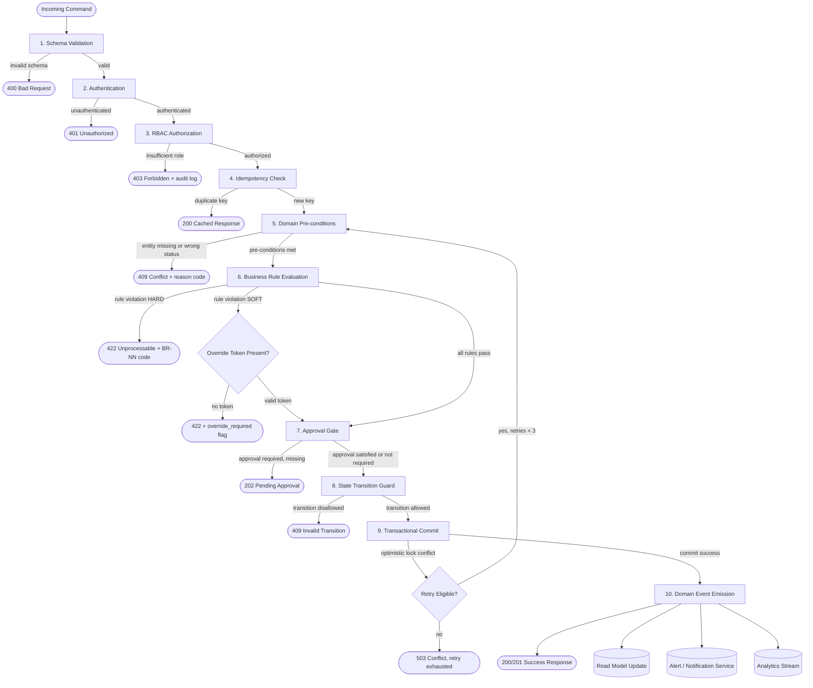

# Business Rules

This document defines all enforceable policy rules for the **Restaurant Management System (RMS)**. Every command processed by the system — whether originating from a front-of-house terminal, a mobile application, a delivery channel API, or a back-office scheduler — must pass through the rule evaluation pipeline described here before any state mutation is committed. Rules are grouped by domain, assigned stable identifiers (BR-NN), classified by severity, and mapped to their enforcement point so engineers, QA teams, and operations staff share a single source of truth for expected system behaviour.

---

## Context

- **Domain scope:** Full restaurant lifecycle including reservations, table management, ordering, kitchen dispatch, billing, inventory, staff scheduling, delivery channels, and loyalty programmes.
- **Rule categories:** capacity & availability constraints, authorization & role gates, financial integrity, compliance & tax, data quality, SLA & experience policy.
- **Enforcement points:** REST/GraphQL API gateway validators, domain command handlers, workflow/state-machine guards, background job processors, event-stream consumers, and administrative console middleware.
- **Rule authoring:** Each rule carries a unique ID, a human-readable name, a precise description with concrete thresholds, a rationale, a severity (HARD = system-rejected / SOFT = warning + override allowed), and an enforcement point.
- **Idempotency contract:** All state-changing operations must carry a client-generated `idempotency_key`; the rule engine rejects or de-duplicates any command that replays a key already committed within the same business day.

---

## Enforceable Rules

### BR-01 — Table Assignment Requires Available Status

**Description:** A table may be assigned to a walk-in or reservation only when `table.status = 'available'`. Attempting to seat a party at a table whose status is `occupied`, `reserved`, `cleaning`, or `maintenance` must be rejected.

**Trigger:** `POST /seatings` or `PATCH /reservations/{id}/seat`

**Condition:** `table.status NOT IN ('available') → REJECT`

**Rationale:** Prevents double-seating conflicts and ensures the physical table is ready for service.

**Severity:** HARD

**Enforcement Point:** Seating command handler, atomic table-lock transaction

---

### BR-02 — Party Size Must Not Exceed Table Capacity

**Description:** The number of confirmed guests in a party (`party.confirmed_count`) must be less than or equal to `table.max_capacity`. Attempting to seat 7 guests at a 6-top must be rejected even if a manager requests it.

**Trigger:** `POST /seatings`, `POST /reservations`

**Condition:** `party.confirmed_count > table.max_capacity → REJECT`

**Rationale:** Fire code and comfort standards; over-seating creates safety and service quality issues.

**Severity:** HARD

**Enforcement Point:** Seating validator, reservation validator

---

### BR-03 — Table Merge Requires All Constituent Tables to Be Available

**Description:** When a merge of N tables is requested to accommodate a large party, every constituent table must satisfy `table.status = 'available'` at the same instant. The merge operation must be atomic; partial merges are forbidden.

**Trigger:** `POST /table-merges`

**Condition:** `ANY(table.status != 'available') → REJECT entire merge`

**Rationale:** A partial merge leaves an orphaned occupied table which cannot be tracked correctly in the floor plan.

**Severity:** HARD

**Enforcement Point:** Table-merge command handler, multi-row pessimistic lock

---

### BR-04 — Section Assignment Must Respect Server Coverage

**Description:** A table must only be assigned to a section that has at least one active server with `shift.status = 'active'` and whose `server.assigned_section = section.id`. Assigning a table to a section with no active server is rejected unless a manager override is provided.

**Trigger:** `POST /seatings` (section-routing step)

**Condition:** `COUNT(active_servers_in_section) = 0 AND override.manager_id IS NULL → REJECT`

**Rationale:** Guarantees every seated table has an accountable service owner.

**Severity:** SOFT (manager override allowed with logged rationale)

**Enforcement Point:** Section-routing service

---

### BR-05 — Reservation Advance Booking Window

**Description:** Reservations must be created at least 30 minutes before the desired slot start time and no more than 90 days in advance.

**Trigger:** `POST /reservations`

**Condition:**
```
slot_start < NOW() + 30 minutes → REJECT (too soon)
slot_start > NOW() + 90 days   → REJECT (too far ahead)
```

**Rationale:** Prevents same-minute walk-in confusion with reservation channel and limits speculative far-future holds that block capacity planning.

**Severity:** HARD

**Enforcement Point:** Reservation command validator

---

### BR-06 — Party Size Limits for Reservations

**Description:** Online and phone reservations are capped at a party size of 20. Groups larger than 20 must use the banquet/event booking flow which triggers a dedicated event coordinator assignment.

**Trigger:** `POST /reservations`

**Condition:** `party_size > 20 → REJECT with redirect to /events`

**Rationale:** Parties >20 have different space, staffing, and menu requirements that the standard reservation flow does not accommodate.

**Severity:** HARD

**Enforcement Point:** Reservation validator

---

### BR-07 — No-Show Policy and Table Release

**Description:** If a reservation holder has not arrived within 15 minutes of the slot start time and has not contacted the restaurant, the reservation transitions to `no_show` status and the table is released back to `available`. A no-show flag is recorded against the guest profile. Guests with ≥3 no-show flags within 6 months require a credit card guarantee for future reservations.

**Trigger:** Scheduled job running every 5 minutes

**Condition:**
```
reservation.status = 'confirmed'
AND NOW() > slot_start + 15 minutes
AND arrival_event IS NULL
→ SET reservation.status = 'no_show', table.status = 'available'
```

**Rationale:** Reclaims capacity and deters serial no-show behaviour.

**Severity:** HARD (automated; no override without manager)

**Enforcement Point:** Reservation expiry background job

---

### BR-08 — Cancellation Window

**Description:** A guest may cancel a reservation without penalty if the cancellation is received more than 2 hours before the slot start time. Cancellations within 2 hours but more than 30 minutes before slot start incur a soft penalty flag. Cancellations within 30 minutes of slot start time require manager approval to waive any deposit hold.

**Trigger:** `DELETE /reservations/{id}` or `PATCH /reservations/{id}/cancel`

**Condition:**
```
NOW() < slot_start - 2 hours          → free cancellation
slot_start - 2 hours ≤ NOW() < slot_start - 30 min → soft penalty flag
NOW() ≥ slot_start - 30 min           → deposit hold; manager approval to waive
```

**Rationale:** Protects revenue from last-minute cancellations while providing a reasonable guest grace period.

**Severity:** SOFT (deposit hold is soft; waiver requires manager role)

**Enforcement Point:** Reservation cancellation handler, payment adapter

---

### BR-09 — Item Availability Check Before Adding to Order

**Description:** A menu item may only be added to an active order if `menu_item.status = 'available'` and `inventory.current_qty >= menu_item.qty_per_serving`. Items marked `86'd` (out of stock) or `suspended` must be blocked at the point of entry.

**Trigger:** `POST /orders/{id}/items`

**Condition:**
```
menu_item.status != 'available' → REJECT with reason 'item_unavailable'
inventory.current_qty < menu_item.qty_per_serving → REJECT with reason 'insufficient_stock'
```

**Rationale:** Prevents guest disappointment and kitchen disruption from orders that cannot be fulfilled.

**Severity:** HARD

**Enforcement Point:** Order item command handler, real-time inventory check

---

### BR-10 — Modifier Validation Against Item Profile

**Description:** Every modifier added to an order item must exist in the item's `allowed_modifiers` list. Modifiers that conflict (e.g., `no_dairy` + `add_cheese`) must be rejected. The total modifier upcharge must not exceed 150% of the base item price.

**Trigger:** `POST /orders/{id}/items` (modifier payload)

**Condition:**
```
modifier.id NOT IN item.allowed_modifiers → REJECT
modifier_conflicts(selected_modifiers) = true → REJECT
SUM(modifier.upcharge) > item.base_price * 1.5 → REJECT
```

**Rationale:** Ensures POS accuracy, prevents kitchen confusion, and guards against runaway upcharge accumulation errors.

**Severity:** HARD

**Enforcement Point:** Order item validator

---

### BR-11 — Void and Discount Approval Thresholds

**Description:** Order item voids and discounts are subject to role-based approval thresholds:
- Discount ≤ 10%: any server may apply.
- Discount 10%–15%: shift supervisor approval required.
- Discount > 15%: manager role required; logged to audit trail with mandatory reason code.
- Full item void after kitchen acknowledgement: manager role required.
- Full order void after any payment captured: requires manager + a second manager confirmation (four-eyes control).

**Trigger:** `POST /orders/{id}/discounts`, `DELETE /orders/{id}/items/{itemId}`

**Condition:**
```
discount_pct > 15 AND actor.role NOT IN ('manager','owner') → REJECT
item.kitchen_status != 'pending' AND actor.role NOT IN ('manager','owner') → REJECT void
```

**Rationale:** Prevents revenue leakage from unauthorized discounting and fraudulent voids.

**Severity:** HARD

**Enforcement Point:** Order discount handler, order void handler, role middleware

---

### BR-12 — Order Timing: Last Item Entry Before Kitchen Cutoff

**Description:** New items must not be added to an order once the order has been in `kitchen_sent` status for more than 20 minutes unless the existing ticket is placed on hold first. Adding items to a ticket already in `plating` or `ready` status is always rejected.

**Trigger:** `POST /orders/{id}/items`

**Condition:**
```
order.kitchen_status IN ('plating','ready') → REJECT
order.kitchen_status = 'kitchen_sent' AND (NOW() - order.sent_at) > 20 min
  AND ticket.hold_status != 'on_hold' → REJECT
```

**Rationale:** Prevents mid-cook interruptions that degrade food quality and disrupt kitchen flow.

**Severity:** HARD

**Enforcement Point:** Order item command handler

---

### BR-13 — Split Order Rules

**Description:** An order may be split into at most 8 sub-orders. Each sub-order must contain at least 1 item. A split may only be performed while the parent order status is `open` or `kitchen_sent` (not `closed`, `voided`, or `partially_paid`). Splitting does not reset item kitchen timestamps.

**Trigger:** `POST /orders/{id}/split`

**Condition:**
```
order.status NOT IN ('open','kitchen_sent') → REJECT
requested_split_count > 8 → REJECT
ANY(sub_order.item_count < 1) → REJECT
```

**Rationale:** Accommodates separate billing requests while preventing abuse that creates empty or untrackable sub-orders.

**Severity:** HARD

**Enforcement Point:** Order split handler

---

### BR-14 — Kitchen Ticket Routing to Station

**Description:** Each order item must be routed to exactly one kitchen station based on `menu_item.station_id`. If the designated station's `status = 'offline'` or `queue_depth >= station.max_queue`, the item must be rerouted to the station's configured `fallback_station_id`. If the fallback is also unavailable, an alert is raised and the item is held in `pending_route` status.

**Trigger:** `ORDER_PLACED` domain event consumed by kitchen orchestrator

**Condition:**
```
station.status = 'offline' OR station.queue_depth >= station.max_queue
  → route to station.fallback_station_id
fallback_station also unavailable → SET item.route_status = 'pending_route', EMIT StationCapacityAlert
```

**Rationale:** Prevents ticket loss and ensures continuous throughput even during partial equipment failure.

**Severity:** HARD

**Enforcement Point:** Kitchen orchestrator event consumer

---

### BR-15 — Station Queue Capacity

**Description:** A kitchen station must not accept more than `station.max_queue` active tickets simultaneously. When `queue_depth = station.max_queue - 2` (two below max), a `STATION_NEAR_CAPACITY` warning event is emitted to the KDS and floor manager display. New tickets beyond max are rerouted per BR-14.

**Trigger:** Ticket assignment in kitchen orchestrator

**Condition:**
```
station.queue_depth >= station.max_queue → reroute (BR-14)
station.queue_depth = station.max_queue - 2 → EMIT StationNearCapacityWarning
```

**Rationale:** Prevents cook overload that causes quality degradation and ticket latency violations.

**Severity:** SOFT (warning) / HARD (max enforcement)

**Enforcement Point:** Kitchen orchestrator, KDS push channel

---

### BR-16 — Refire Policy

**Description:** A refire (remake of an already-completed item) must include a mandatory reason code from the approved list: `GUEST_COMPLAINT`, `QUALITY_DEFECT`, `WRONG_ITEM`, `ALLERGEN_CONCERN`, `MANAGER_COMP`. Refires are logged to the waste and quality reporting system. More than 3 refires on a single order triggers an automatic manager notification.

**Trigger:** `POST /orders/{id}/items/{itemId}/refire`

**Condition:**
```
reason_code NOT IN approved_list → REJECT
refire_count_on_order > 3 → EMIT ManagerNotification + proceed
```

**Rationale:** Creates accountability for waste, enables quality trend analysis, and prevents refires being used as a covert comp mechanism.

**Severity:** HARD (reason required) / SOFT (count threshold)

**Enforcement Point:** Refire command handler, waste tracking service

---

### BR-17 — Payment Idempotency

**Description:** The billing service must not issue more than one successful payment capture for the same `order.id` + `payment_method.token` combination within a single billing lifecycle. Any retry carrying an already-committed `idempotency_key` must return the cached success response rather than initiating a second charge.

**Trigger:** `POST /payments/capture`

**Condition:**
```
committed_payment EXISTS WHERE idempotency_key = request.idempotency_key → return cached response, no new charge
```

**Rationale:** Protects guests from double-charging due to network retries or client-side bugs.

**Severity:** HARD

**Enforcement Point:** Payment adapter, idempotency cache (Redis)

---

### BR-18 — Refund Threshold and Approval

**Description:** Refunds are subject to the following approval matrix:
- Refund ≤ $25: server may initiate; auto-approved.
- Refund $25–$100: shift supervisor approval required.
- Refund > $100: manager approval required; reason code mandatory; logged to financial audit trail.
- Refunds on orders older than 7 days require owner/admin approval regardless of amount.

**Trigger:** `POST /payments/{id}/refund`

**Condition:**
```
amount <= 25 → auto-approve
25 < amount <= 100 AND actor.role NOT IN ('supervisor','manager','owner') → REJECT
amount > 100 AND actor.role NOT IN ('manager','owner') → REJECT
order.closed_at < NOW() - 7 days AND actor.role NOT IN ('owner','admin') → REJECT
```

**Rationale:** Prevents revenue leakage while ensuring guests can receive fair refunds within reasonable bounds.

**Severity:** HARD

**Enforcement Point:** Payment refund handler, role middleware

---

### BR-19 — Tax Application

**Description:** Tax must be calculated and applied to every billable item at the tax rate configured for the restaurant's jurisdiction (`location.tax_rate`). Dine-in and takeout may have different applicable rates per jurisdiction configuration. Tax must be recalculated whenever an item is added, removed, or modified. Tax lines must never be manually deleted from a closed order.

**Trigger:** Any mutation to `order.items`; `POST /payments/checkout`

**Condition:**
```
tax_line.amount != ROUND(taxable_subtotal * location.tax_rate, 2) → recalculate
tax_line DELETE on closed_order → REJECT
```

**Rationale:** Regulatory compliance; incorrect tax application creates legal liability.

**Severity:** HARD

**Enforcement Point:** Order tax service, checkout pipeline

---

### BR-20 — Inventory Reorder Threshold

**Description:** When `inventory.current_qty` drops to or below `inventory.reorder_point`, a `REORDER_REQUIRED` event must be emitted automatically. If `current_qty = 0` and the item has no pending purchase order, a `CRITICAL_STOCKOUT` alert is raised to the purchasing manager within 5 minutes.

**Trigger:** Any inventory deduction event

**Condition:**
```
current_qty <= reorder_point → EMIT ReorderRequired
current_qty = 0 AND pending_po_count = 0 → EMIT CriticalStockoutAlert within 5 minutes
```

**Rationale:** Prevents service interruption due to stockouts and automates procurement triggers.

**Severity:** SOFT (alert) escalating to HARD (item blocked per BR-09)

**Enforcement Point:** Inventory deduction event consumer, alert service

---

### BR-21 — FIFO Stock Depletion

**Description:** When an inventory item has multiple batches (identified by `batch.received_at`), deductions must consume the oldest batch first (FIFO). Partial batch depletion is allowed. Batches past their `batch.expiry_date` must be flagged `expired` and excluded from deductions; expired stock requires a waste log entry before removal.

**Trigger:** Any inventory deduction command

**Condition:**
```
SELECT batch ORDER BY received_at ASC; deduct from oldest first
batch.expiry_date < NOW() → SET batch.status = 'expired', require waste_log entry
```

**Rationale:** Minimises spoilage and ensures food safety compliance.

**Severity:** HARD

**Enforcement Point:** Inventory deduction service, batch manager

---

### BR-22 — Shift Overlap Prevention

**Description:** A staff member must not be scheduled for two overlapping shifts. A shift is considered overlapping if its `[start_time, end_time]` interval intersects with any other confirmed shift for the same `staff.id`. Scheduling overlaps must be rejected at the time of shift creation or modification.

**Trigger:** `POST /shifts`, `PATCH /shifts/{id}`

**Condition:**
```
EXISTS(
  shift WHERE staff_id = new_shift.staff_id
  AND status NOT IN ('cancelled','swapped')
  AND new_shift.start_time < shift.end_time
  AND new_shift.end_time > shift.start_time
) → REJECT
```

**Rationale:** Prevents payroll errors, legal compliance issues, and ensures staff are not accidentally double-booked.

**Severity:** HARD

**Enforcement Point:** Shift command handler

---

### BR-23 — Role-Based Access Enforcement

**Description:** Every API endpoint and administrative action is mapped to a minimum required role. Role hierarchy: `server < supervisor < manager < owner < admin`. Actions must be rejected if `actor.role` rank is below the required rank for the endpoint. Role assignments may only be changed by a user whose own role rank is strictly higher than the role being granted.

**Trigger:** All authenticated API requests

**Condition:**
```
actor.role_rank < endpoint.required_role_rank → REJECT 403
role_grant.new_role_rank >= granting_actor.role_rank → REJECT
```

**Rationale:** Defence-in-depth; prevents privilege escalation and enforces least-privilege access.

**Severity:** HARD

**Enforcement Point:** Authorization middleware (API gateway)

---

### BR-24 — Delivery Radius Enforcement

**Description:** Delivery orders are only accepted if the delivery address falls within `restaurant.delivery_radius_km` from the restaurant's coordinates. Distance is calculated using the Haversine formula. Orders outside the delivery radius must be rejected with a user-facing message and must not be forwarded to the kitchen.

**Trigger:** `POST /orders` with `channel = 'delivery'`

**Condition:**
```
haversine(restaurant.lat, restaurant.lng, address.lat, address.lng) > restaurant.delivery_radius_km → REJECT
```

**Rationale:** Ensures food quality (temperature, travel time) and delivery SLA compliance.

**Severity:** HARD

**Enforcement Point:** Order creation validator, delivery channel adapter

---

### BR-25 — Delivery Fee Calculation

**Description:** The delivery fee is calculated as a base fee plus a per-kilometre charge: `fee = delivery_fee_base + (distance_km * delivery_fee_per_km)`. Promotions may reduce the delivery fee to a minimum of $0 but never negative. The fee is locked at order placement and must not be recalculated after the order is confirmed, even if the address is corrected.

**Trigger:** `POST /orders` (delivery channel); fee locked on `ORDER_CONFIRMED` event

**Condition:**
```
fee = MAX(0, delivery_fee_base + distance_km * delivery_fee_per_km - promo_discount)
fee must not change after order.status = 'confirmed'
```

**Rationale:** Provides fee transparency to the guest and prevents backend fee manipulation after confirmation.

**Severity:** HARD

**Enforcement Point:** Delivery fee calculator, order confirmation handler

---

### BR-26 — Loyalty Points Accrual

**Description:** Loyalty points are accrued at a rate of 1 point per $1.00 of net spend (post-discount, pre-tax) on dine-in and delivery orders. Points are not awarded on gift card purchases, service charges, or delivery fees. Points are credited to the guest's account only after the order transitions to `closed` status and payment is fully captured. Points accrued on a refunded order are reversed pro-rata.

**Trigger:** `ORDER_CLOSED` event

**Condition:**
```
points = FLOOR(order.net_food_spend)
exclude: gift_card_items, service_charge, delivery_fee
IF refund_issued: reverse FLOOR(refund_amount) points
```

**Rationale:** Aligns loyalty incentive with actual revenue contribution; prevents points farming via refunded transactions.

**Severity:** HARD

**Enforcement Point:** Loyalty event consumer (post-payment)

---

### BR-27 — Loyalty Points Redemption Minimum

**Description:** A guest must have a minimum balance of 200 points to redeem. Redemptions are in multiples of 50 points, where 50 points = $1.00 credit. Points cannot be redeemed against tax, delivery fees, or tip lines. The redemption amount must not exceed 30% of the order's taxable subtotal. Points redemptions are applied before tax calculation.

**Trigger:** `POST /orders/{id}/loyalty-redemption`

**Condition:**
```
guest.points_balance < 200 → REJECT
redemption_amount % 50 != 0 → REJECT
redemption_credit > order.taxable_subtotal * 0.30 → REJECT
```

**Rationale:** Preserves programme economics while offering meaningful guest value.

**Severity:** HARD

**Enforcement Point:** Loyalty redemption handler, order pricing service

---

## Rule Evaluation Pipeline

Every state-changing command entering the RMS passes through a staged evaluation pipeline. Stages execute in strict order; failure at any stage short-circuits the pipeline and returns a structured error response. The pipeline is synchronous within a single request/response cycle; asynchronous side-effects (domain events, alerts) are emitted only after a successful commit.

**Pipeline Stages:**

1. **Schema Validation** — JSON schema / OpenAPI contract check; malformed payloads rejected immediately.
2. **Authentication** — JWT/session token verification; expired or invalid tokens rejected.
3. **Authorization (RBAC)** — Role rank check per endpoint map (BR-23); insufficient rank rejected.
4. **Idempotency Check** — Duplicate key detected; return cached response without re-processing.
5. **Domain Pre-conditions** — Entity existence, status eligibility (e.g., table available, order open).
6. **Business Rule Evaluation** — All applicable BR-NN rules evaluated in priority order.
7. **Approval Gate** — For operations requiring manager/supervisor approval, approval token verified.
8. **State Transition Guard** — Finite state machine checks that the requested transition is permitted from the current state.
9. **Transactional Commit** — All writes atomically committed; optimistic locking conflicts trigger retry or rejection.
10. **Domain Event Emission** — Post-commit events published to the event bus; downstream consumers update read models, trigger alerts, and feed analytics.



---

## Business Rule Catalog

| Rule ID | Name | Description | Category | Trigger | Action on Violation | Severity | Enforcement Point |
|---------|------|-------------|----------|---------|---------------------|----------|-------------------|
| BR-01 | Table Assignment — Status Check | Seat only at available tables | Table Mgmt | POST /seatings | Reject | HARD | Seating handler |
| BR-02 | Party Size vs. Table Capacity | party_count ≤ table.max_capacity | Table Mgmt | POST /seatings | Reject | HARD | Seating validator |
| BR-03 | Atomic Table Merge | All merge tables must be available | Table Mgmt | POST /table-merges | Reject entire merge | HARD | Merge handler |
| BR-04 | Section Server Coverage | Section must have active server | Table Mgmt | POST /seatings | Reject or manager override | SOFT | Section router |
| BR-05 | Reservation Booking Window | 30 min ahead, max 90 days | Reservations | POST /reservations | Reject | HARD | Reservation validator |
| BR-06 | Reservation Party Size Cap | Max 20 for standard bookings | Reservations | POST /reservations | Redirect to /events | HARD | Reservation validator |
| BR-07 | No-Show Table Release | Release table 15 min after slot | Reservations | Scheduler (5 min) | Auto-transition to no_show | HARD | Expiry job |
| BR-08 | Cancellation Window Policy | Free cancel >2 h; deposit hold <30 min | Reservations | DELETE /reservations | Apply penalty or hold | SOFT | Cancellation handler |
| BR-09 | Item Availability Check | Block unavailable/86'd items | Ordering | POST /orders/items | Reject | HARD | Order item handler |
| BR-10 | Modifier Validation | Modifiers must be in allowed list | Ordering | POST /orders/items | Reject | HARD | Order item validator |
| BR-11 | Void/Discount Approval | Role-gated discount thresholds | Ordering | POST discounts/voids | Reject without role | HARD | Discount/void handler |
| BR-12 | Order Timing Cutoff | No new items after 20 min in kitchen | Ordering | POST /orders/items | Reject | HARD | Order item handler |
| BR-13 | Split Order Limits | Max 8 sub-orders, ≥1 item each | Ordering | POST /orders/split | Reject | HARD | Split handler |
| BR-14 | Ticket Station Routing | Route to fallback if station offline | Kitchen | ORDER_PLACED event | Reroute or hold | HARD | Kitchen orchestrator |
| BR-15 | Station Queue Capacity | Alert at max-2; block at max | Kitchen | Ticket assignment | Alert then reroute | SOFT/HARD | Kitchen orchestrator |
| BR-16 | Refire Policy | Mandatory reason code for refires | Kitchen | POST /items/refire | Reject without code | HARD | Refire handler |
| BR-17 | Payment Idempotency | No duplicate captures | Billing | POST /payments/capture | Return cached response | HARD | Payment adapter |
| BR-18 | Refund Approval Thresholds | Role-gated refund amounts | Billing | POST /payments/refund | Reject without role | HARD | Refund handler |
| BR-19 | Tax Application | Always recalculate on item change | Billing | Order mutation | Recalculate | HARD | Tax service |
| BR-20 | Inventory Reorder Threshold | Alert at reorder_point, critical at 0 | Inventory | Deduction event | Emit alert | SOFT→HARD | Inventory consumer |
| BR-21 | FIFO Stock Depletion | Oldest batch first; expire stale | Inventory | Deduction command | FIFO enforced; block expired | HARD | Inventory service |
| BR-22 | Shift Overlap Prevention | No overlapping confirmed shifts | Staff | POST/PATCH /shifts | Reject | HARD | Shift handler |
| BR-23 | Role-Based Access | Actor rank ≥ endpoint required rank | Auth | All API requests | 403 Forbidden | HARD | Auth middleware |
| BR-24 | Delivery Radius | Address within delivery_radius_km | Delivery | POST /orders (delivery) | Reject | HARD | Order validator |
| BR-25 | Delivery Fee Lock | Fee locked at confirmation | Delivery | ORDER_CONFIRMED | Block fee mutation | HARD | Order confirm handler |
| BR-26 | Loyalty Points Accrual | 1 pt/$1 net food spend | Loyalty | ORDER_CLOSED event | Credit/reverse points | HARD | Loyalty consumer |
| BR-27 | Loyalty Redemption Minimum | Min 200 pts; max 30% of subtotal | Loyalty | POST /loyalty-redemption | Reject | HARD | Redemption handler |

---

## Rule by Domain/Module

### Reservation and Seating Rules

Rules BR-01 through BR-08 govern the full lifecycle of a guest's physical presence in the restaurant. The seating subsystem must enforce an atomic table-lock before confirming a seating to prevent TOCTOU race conditions on high-traffic floors. The reservation subsystem integrates with the notification service to send reminders at T-24 h and T-2 h, and the no-show job (BR-07) must run with at-least-once delivery guarantees and be idempotent on repeat executions.

Key integrations: `TableService`, `ReservationService`, `NotificationService`, `SchedulerService`, `GuestProfileService`.

### Ordering and Menu Rules

Rules BR-09 through BR-13 ensure that every order entering the kitchen is complete, accurate, and fulfillable. The order item validator performs a synchronous inventory spot-check (BR-09) using a read-your-writes consistency model against the inventory cache, which is refreshed on every deduction event. Modifier conflict detection (BR-10) uses a pre-loaded conflict matrix sourced from the menu configuration service.

Key integrations: `OrderService`, `MenuService`, `InventoryService`, `KitchenService`, `DiscountService`.

### Kitchen and Prep Rules

Rules BR-14 through BR-16 operate entirely within the kitchen orchestration layer and are consumed asynchronously from the `ORDER_PLACED` event. Station routing decisions (BR-14, BR-15) are made in under 100 ms using in-memory station state maintained by the KDS websocket server. Refire tracking (BR-16) feeds the daily waste report and the quality dashboard visible to the head chef.

Key integrations: `KitchenOrchestratorService`, `KDSService`, `WasteTrackingService`, `AlertService`.

### Billing and Payment Rules

Rules BR-17 through BR-19 ensure financial integrity end-to-end. The idempotency cache (BR-17) uses Redis with a 24-hour TTL keyed on `{order_id}:{idempotency_key}`. Tax service (BR-19) must use the jurisdiction configuration from `LocationService` and support multi-rate tax tables (e.g., alcohol at a different rate). All billing mutations write to the financial audit log before the response is returned to the caller.

Key integrations: `BillingService`, `PaymentAdapter`, `TaxService`, `AuditLogService`, `LocationService`.

### Inventory and Procurement Rules

Rules BR-20 and BR-21 operate at the intersection of real-time service (deductions per order item sent to kitchen) and supply chain (purchase orders, receiving). The FIFO enforcement (BR-21) requires that batch metadata (received_at, expiry_date) is captured at receiving time. The reorder alert (BR-20) integrates with the procurement module to auto-draft purchase orders for items configured with `auto_reorder = true`.

Key integrations: `InventoryService`, `BatchService`, `ProcurementService`, `AlertService`.

### Staff and Shift Rules

Rules BR-22 and BR-23 protect scheduling integrity and system access control. Shift overlap detection (BR-22) must account for `timezone` offsets when the restaurant operates across multiple locations. The RBAC system (BR-23) uses a centrally-managed role registry; role changes are propagated to all services via a `ROLE_UPDATED` event within 30 seconds.

Key integrations: `StaffService`, `ShiftService`, `AuthService`, `RoleRegistryService`.

### Delivery and Channel Rules

Rules BR-24 and BR-25 apply exclusively to orders arriving via the delivery channel (first-party app, third-party aggregator webhook). The delivery radius check (BR-24) must be performed before the order is forwarded to the kitchen to avoid wasted prep on undeliverable orders. For third-party aggregator orders, the fee may already be set by the aggregator; BR-25 still locks the captured fee to prevent post-confirmation mutations.

Key integrations: `DeliveryService`, `GeoService`, `OrderService`, `AggregatorAdapterService`.

### Loyalty and Promotions Rules

Rules BR-26 and BR-27 govern the loyalty programme economics. Points accrual (BR-26) is event-driven and processes `ORDER_CLOSED` events from the message bus. The pro-rata reversal on refunds must be atomic with the refund payment event to prevent point balance discrepancies. Promotion stacking is governed by the `PromotionService` which validates that applied promotions are mutually compatible before the order is confirmed.

Key integrations: `LoyaltyService`, `PromotionService`, `PaymentService`, `GuestProfileService`.

---

## Exception and Override Handling

### Permitted Exception Classes

Not all rule violations warrant a hard rejection. The following classes of exceptions may be overridden by an authorised actor:

| Exception Class | Overridable By | Override Requires | Override Expiry |
|-----------------|---------------|-------------------|-----------------|
| SOFT rule violation | Shift supervisor | Reason code, own credentials | Single transaction |
| Table capacity override (minor, ≤2 extra guests) | Manager | Reason code, acknowledgement of fire code waiver | Single seating |
| Cancellation penalty waiver | Manager | Guest reason + manager note | Single reservation |
| Discount >15% | Manager | Reason code from approved list | Single order |
| Full void post-payment | Manager + second manager | Four-eyes approval tokens | Single order |
| Delivery radius extension | Manager | Distance override (max +5 km) | Single order |
| Refund >$100 | Manager | Reason code, financial audit entry | Single payment |
| Out-of-hours shift modification | Owner/Admin | Reason, affected staff notification | Single shift record |

### Override Logging Requirements

Every override must produce an `OverrideAuditRecord` containing:
- `override_id` (UUID)
- `actor_id` and `actor_role`
- `target_entity_type` and `target_entity_id`
- `rule_id` violated (e.g., `BR-08`)
- `reason_code` from the approved override reason enumeration
- `free_text_note` (optional, ≤500 characters)
- `approved_by` (second approver ID for four-eyes controls)
- `created_at` timestamp (UTC)
- `expires_at` timestamp (UTC) — maximum 24 hours from creation

Override records are immutable after creation and are retained for 7 years per financial record-keeping policy.

### Override Expiry and Follow-up

Override tokens expire at the `expires_at` timestamp; any subsequent command attempting to reuse an expired token is rejected as if no override were present. The compliance engine runs a nightly job that aggregates override usage by actor and rule; actors accumulating more than 10 overrides of the same rule within 30 days are flagged for manager review. Rules generating high override rates are escalated to the policy governance team for potential rule refinement.

---

## Rule Conflict Resolution

When two or more rules produce conflicting directives for the same command, the following priority order governs:

1. **Safety and Regulatory Compliance rules** — fire code, allergen controls, tax compliance (always win).
2. **Financial Integrity rules** — payment idempotency, refund thresholds, tax application.
3. **Operational Feasibility rules** — inventory availability, kitchen capacity, delivery radius.
4. **Authorization and Role rules** — RBAC gates, approval workflows.
5. **Experience and SLA Optimisation rules** — timing windows, loyalty, promotions.

**Resolution principle:** The highest-priority violated rule is the one returned in the error response. Lower-priority conflicts are logged but do not appear in the user-facing rejection message.

**Example conflicts and resolution:**

| Scenario | Conflicting Rules | Resolution |
|----------|------------------|------------|
| Manager applies 20% discount AND loyalty redemption on same order | BR-11 (discount approval), BR-27 (redemption cap 30%) | Both evaluated independently; BR-11 requires manager approval (already present); BR-27 cap enforced regardless of role |
| Delivery order is within radius but item is out of stock | BR-24 (radius ok), BR-09 (item unavailable) | BR-09 (feasibility) triggers rejection; BR-24 is satisfied |
| Server attempts to seat 8-top at 6-top with manager override token | BR-02 (hard capacity), override present | BR-02 is HARD; capacity override for ≤2 guests only; 8 at 6-top (+2 max over capacity) allowed if override specifies extra seating acknowledgement |
| Refire requested with no reason code AND order is already closed | BR-16 (reason required), order state guard | Pipeline stage 5 (pre-condition: order must be open for refire) fails first; BR-16 never reached |

---

## Rule Versioning

### Versioning Strategy

Each business rule is version-controlled in the rule registry. The rule ID (e.g., `BR-11`) is stable across versions; breaking changes to rule logic require a new minor or major version tag on the rule record (e.g., `BR-11 v1.0.0 → v1.1.0`). Rule versions are stored in the `business_rule_versions` table with `effective_from` and `effective_until` timestamps, allowing the rule engine to apply the correct version for any point-in-time audit replay.

### Deprecation Policy

1. A rule proposed for deprecation must be marked `DEPRECATED` in the registry with a `sunset_date` at least 30 days in the future.
2. All enforcement points referencing the deprecated rule must emit a `DEPRECATED_RULE_TRIGGERED` metric for the deprecation window.
3. If the metric shows zero triggers over the last 14 days of the deprecation window, the rule is archived (status: `RETIRED`).
4. If triggers are still occurring, the rule owner must investigate before retiring.
5. Retired rules are never deleted; they remain in the registry with `status = 'retired'` and are excluded from the active evaluation pipeline.

### Change Management

All rule changes must be peer-reviewed by at least one domain lead and one operations stakeholder before merging to the production rule registry. Rule changes are deployed via the standard configuration release pipeline (not a code deployment) and take effect at `effective_from` without requiring a service restart.

