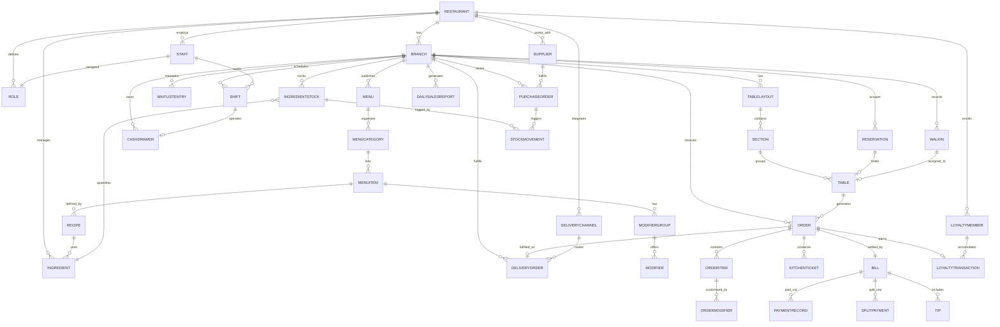

# Data Dictionary

This data dictionary is the canonical reference for the **Restaurant Management System** (RMS). It defines shared terminology, entity semantics, field-level constraints, and governance controls required to keep all restaurant management workflows — from table bookings and kitchen operations to inventory replenishment and loyalty programmes — consistent across engineering, analytics, and operations teams. Every entity and attribute documented here maps directly to production schema objects and must be updated whenever schema migrations are merged. Teams consuming this dictionary should treat it as the authoritative source of truth ahead of any individual service's own internal documentation.

## Scope and Goals

- **Vocabulary alignment**: Establish stable, unambiguous names for all domain objects so that architecture, API, analytics, BI, and operations teams share the same language without resorting to informal synonyms.
- **Schema governance**: Define minimum required fields, acceptable data types, and inter-entity relationship boundaries to prevent schema drift between microservices and keep integrations stable.
- **Data quality baseline**: Enumerate validation rules, referential-integrity requirements, and controlled vocabulary constraints that every write path must enforce before persisting data.
- **Regulatory readiness**: Document retention periods, sensitivity classifications, and audit trails to support PCI-DSS, GDPR, and local food-safety record-keeping obligations across all operating markets.
- **Onboarding acceleration**: Provide new engineers, data analysts, and QA engineers with a single document that answers "what does this field mean?" without requiring them to read raw database migrations or reverse-engineer service code.

## Core Entities

| Entity | Description | Required Attributes | Optional Attributes | Constraints |
|--------|-------------|--------------------|--------------------|-------------|
| Restaurant | Top-level legal entity or brand that owns one or more branches | `restaurant_id, name, legal_name, status, default_currency_code, default_timezone, created_at` | `logo_url, website, support_email, tax_id` | `status ∈ {active, suspended, closed}` |
| Branch | Physical operating location belonging to a restaurant | `branch_id, restaurant_id, name, address_line1, city, postcode, country_code, timezone, currency_code, status` | `phone, geo_lat, geo_lng, seating_capacity` | FK → Restaurant; `currency_code` ISO-4217 |
| TableLayout | Versioned floor-plan configuration for a branch | `layout_id, branch_id, name, effective_from, is_active` | `floor_image_url, description` | At most one `is_active = true` layout per branch at a time |
| Table | Physical or virtual table within a section | `table_id, section_id, table_number, capacity, status` | `qr_code_token, pos_terminal_id` | `status ∈ {available, occupied, reserved, dirty, inactive}`; `capacity ≥ 1` |
| Section | Named zone within a floor layout (e.g., Patio, Bar, VIP) | `section_id, layout_id, name, display_order` | `color_hex, notes` | Unique `name` per layout |
| Menu | Versioned menu assigned to a branch and service period | `menu_id, branch_id, name, service_type, valid_from` | `valid_to, description, image_url` | `service_type ∈ {dine_in, takeaway, delivery, bar}`; overlapping active menus allowed per service type |
| MenuCategory | Logical grouping of items within a menu (e.g., Starters, Mains) | `category_id, menu_id, name, display_order` | `description, image_url, is_hidden` | Unique `name` per menu |
| MenuItem | Orderable item belonging to a category | `item_id, category_id, name, base_price, tax_rate, status` | `description, image_url, prep_time_minutes, calories, allergen_flags, is_featured` | `base_price ≥ 0`; `tax_rate ∈ [0,1]`; `status ∈ {available, 86ed, seasonal, hidden}` |
| Modifier | Individual customisation option (e.g., "Extra cheese +£0.50") | `modifier_id, group_id, name, price_delta, is_available` | `calories_delta, display_order` | `price_delta` may be negative for discount modifiers |
| ModifierGroup | Named set of modifiers applied to a menu item | `group_id, item_id, name, selection_type, min_selections, max_selections` | `display_order, is_required` | `selection_type ∈ {single, multi}`; `min_selections ≤ max_selections` |
| Recipe | Bill-of-materials linking a menu item to its raw ingredients | `recipe_id, item_id, version, created_at` | `notes, prep_instructions` | One active version per item; immutable once published |
| Ingredient | Raw or semi-processed component tracked in inventory | `ingredient_id, restaurant_id, name, unit_of_measure, category` | `allergen_flags, supplier_sku, reorder_level` | `unit_of_measure ∈ {g, kg, ml, l, unit, portion}` |
| Order | A guest's request for food/beverages at a table or via delivery | `order_id, branch_id, order_type, status, opened_at, staff_id` | `table_id, delivery_order_id, loyalty_member_id, covers, notes, source_channel` | `order_type ∈ {dine_in, takeaway, delivery}`; `status ∈ {open, submitted, in_kitchen, ready, served, closed, voided}` |
| OrderItem | A single line on an order mapped to a menu item | `order_item_id, order_id, item_id, quantity, unit_price, line_total, tax_rate, status` | `special_instructions, seat_label, voided_at, voided_by` | `quantity ≥ 1`; `line_total = quantity × unit_price`; `unit_price` is a snapshot |
| OrderModifier | A modifier selection attached to an order item | `order_modifier_id, order_item_id, modifier_id, quantity, price_delta` | `notes` | FK → OrderItem and Modifier; `price_delta` is a snapshot |
| KitchenTicket | Print/display ticket sent to a kitchen or bar station | `ticket_id, order_id, branch_id, station, status, sent_at, items_snapshot` | `printed_at, completed_at, recalled_at, bump_count` | `station ∈ {grill, fryer, salad, pastry, bar, expo}`; `status ∈ {pending, in_progress, done, recalled}` |
| Bill | Financial summary of an order presented to the guest | `bill_id, order_id, subtotal, tax_total, discount_total, service_charge, grand_total, status` | `promo_code, notes, printed_at, paid_at` | `grand_total = subtotal + tax_total + service_charge − discount_total`; `status ∈ {open, paid, voided, refunded}`; UNIQUE on `order_id` |
| PaymentRecord | A single payment tender applied against a bill | `payment_id, bill_id, tender_type, amount, currency_code, status, staff_id, created_at` | `paid_at, reference_code, gateway_response_code, terminal_id` | `tender_type ∈ {cash, card, digital_wallet, voucher, loyalty_points}`; `amount > 0` |
| SplitPayment | Allocation of a bill amount to a specific guest or seat | `split_id, bill_id, seat_label, amount_due, amount_paid, status` | `guest_name` | All `amount_due` values must sum to `bill.grand_total`; `status ∈ {unpaid, partial, paid}` |
| Tip | Gratuity collected separately from the bill total | `tip_id, bill_id, staff_id, amount, tender_type, recorded_at` | `is_pooled, pool_id` | `amount ≥ 0`; must reference a Bill with `status = paid` |
| Reservation | Pre-booked table for a guest at a specific date/time | `reservation_id, branch_id, guest_name, guest_phone, party_size, scheduled_at, duration_minutes, status` | `guest_email, table_id, notes, source_channel, loyalty_member_id` | `status ∈ {confirmed, checked_in, seated, completed, cancelled, no_show}`; no overlapping confirmed bookings per table |
| WalkIn | Unannounced guest party recorded at arrival | `walkin_id, branch_id, party_size, arrived_at, status` | `guest_name, table_id, wait_minutes, seated_at` | `status ∈ {waiting, seated, left}` |
| WaitlistEntry | Queue position for guests waiting for a table | `entry_id, branch_id, guest_name, party_size, added_at, status` | `guest_phone, estimated_wait_minutes, notified_at, seated_at` | `status ∈ {waiting, notified, seated, cancelled}` |
| Staff | Employee or contractor working at the restaurant | `staff_id, restaurant_id, role_id, first_name, last_name, email, pin_code_hash, status` | `phone, hire_date, profile_image_url` | `status ∈ {active, on_leave, terminated}`; `pin_code_hash` must be bcrypt (cost ≥ 12) |
| Role | Named permission set defining what a staff member may do | `role_id, restaurant_id, name, permissions` | `description, is_system_role` | `permissions` stored as JSONB array of permission keys; unique `name` per restaurant |
| Shift | Scheduled or actual work period for a staff member | `shift_id, staff_id, branch_id, scheduled_start, scheduled_end, status` | `actual_start, actual_end, cash_drawer_id, break_minutes, notes` | `status ∈ {scheduled, clocked_in, clocked_out, absent}`; `actual_end > actual_start` when both present |
| CashDrawer | Physical cash drawer assigned to a branch POS terminal | `drawer_id, branch_id, terminal_id, opening_float, status` | `shift_id, closing_float, closing_counted_at, variance` | `status ∈ {open, closed, suspended}`; one `status = open` drawer per terminal at a time |
| IngredientStock | Current on-hand quantity of an ingredient at a branch | `stock_id, branch_id, ingredient_id, quantity_on_hand, unit_of_measure, last_updated_at` | `reorder_point, par_level, bin_location, batch_number, expiry_date` | `quantity_on_hand ≥ 0`; UNIQUE `(branch_id, ingredient_id)` |
| Supplier | Vendor supplying ingredients or consumables | `supplier_id, restaurant_id, name, contact_name, contact_email, status` | `phone, address, payment_terms_days, tax_id, notes` | `status ∈ {active, inactive, blacklisted}` |
| PurchaseOrder | Formal order placed with a supplier to replenish stock | `po_id, branch_id, supplier_id, status, ordered_at, expected_delivery_date, currency_code, line_items, created_by` | `delivered_at, invoice_number, total_cost, notes` | `status ∈ {draft, submitted, confirmed, partially_received, received, cancelled}` |
| StockMovement | Immutable record of any change to ingredient stock level | `movement_id, stock_id, movement_type, quantity_delta, occurred_at, reference_id` | `staff_id, notes, batch_number` | `movement_type ∈ {purchase_receipt, recipe_usage, waste, adjustment, transfer_in, transfer_out}`; append-only; never updated or deleted |
| LoyaltyMember | Guest enrolled in the restaurant's loyalty programme | `member_id, restaurant_id, first_name, last_name, email, points_balance, lifetime_points, tier, enrolled_at` | `phone, birth_date, preferred_branch_id, last_visit_at` | UNIQUE `(restaurant_id, email)`; `tier ∈ {bronze, silver, gold, platinum}`; `points_balance ≥ 0` |
| LoyaltyTransaction | Points earned or redeemed by a loyalty member | `lt_id, member_id, transaction_type, points, occurred_at` | `reference_order_id, expiry_date, notes, staff_id` | `transaction_type ∈ {earn, redeem, adjust, expire}`; `points ≠ 0` |
| DeliveryOrder | Delivery-specific metadata attached to an order | `delivery_id, order_id, channel_id, delivery_address_line1, delivery_city, delivery_postcode, customer_name, customer_phone, status, promised_at` | `delivery_address_line2, picked_up_at, delivered_at, delivery_fee, platform_order_ref, rider_name, rider_phone` | `status ∈ {pending, assigned, picked_up, en_route, delivered, failed}`; UNIQUE on `order_id` |
| DeliveryChannel | External or internal delivery platform integration | `channel_id, restaurant_id, name, channel_type, is_active` | `api_key_ref, webhook_url, commission_rate, menu_sync_enabled` | `channel_type ∈ {own_fleet, third_party, aggregator}`; `commission_rate ∈ [0,1]` |
| DailySalesReport | Pre-aggregated end-of-day financial summary for a branch | `report_id, branch_id, report_date, total_orders, gross_sales, net_sales, tax_collected, discount_total, refund_total, generated_at` | `service_charge_total, tip_total, avg_order_value, covers_count, top_selling_item_id, delivery_sales, dine_in_sales, takeaway_sales` | UNIQUE `(branch_id, report_date)`; immutable once generated |

## Canonical Relationship Diagram

## Entity Attribute Details

### Restaurant

| column_name | type | constraints | description |
|-------------|------|-------------|-------------|
| `restaurant_id` | UUID | PK, NOT NULL | Globally unique restaurant identifier generated at creation |
| `name` | VARCHAR(120) | NOT NULL | Trading name displayed to guests and staff across all surfaces |
| `legal_name` | VARCHAR(200) | NOT NULL | Registered legal entity name used on tax invoices and contracts |
| `status` | ENUM | NOT NULL, CHECK IN ('active','suspended','closed') | Operational status controlling whether branches may accept orders |
| `default_currency_code` | CHAR(3) | NOT NULL | ISO-4217 currency applied when a branch does not specify its own |
| `default_timezone` | VARCHAR(60) | NOT NULL | IANA timezone used for date-based aggregations when branch TZ is absent |
| `logo_url` | VARCHAR(500) | NULLABLE | CDN URL for the brand logo; served on receipts and guest-facing apps |
| `website` | VARCHAR(300) | NULLABLE | Public website URL included in guest communications |
| `support_email` | VARCHAR(254) | NULLABLE | Contact email displayed on digital receipts |
| `tax_id` | VARCHAR(50) | NULLABLE | Government-issued tax registration number for VAT/GST filings |
| `created_at` | TIMESTAMP | NOT NULL, DEFAULT NOW() | UTC timestamp when the restaurant record was created |
| `updated_at` | TIMESTAMP | NOT NULL, DEFAULT NOW() | UTC timestamp of the most recent update |

### Branch

| column_name | type | constraints | description |
|-------------|------|-------------|-------------|
| `branch_id` | UUID | PK, NOT NULL | Unique branch identifier |
| `restaurant_id` | UUID | FK → Restaurant, NOT NULL | Owning restaurant; determines inherited config defaults |
| `name` | VARCHAR(120) | NOT NULL | Branch display name shown in staff and guest interfaces (e.g., "King's Cross") |
| `address_line1` | VARCHAR(200) | NOT NULL | Primary street address line |
| `address_line2` | VARCHAR(200) | NULLABLE | Secondary address line (unit, floor, suite) |
| `city` | VARCHAR(100) | NOT NULL | City name |
| `postcode` | VARCHAR(20) | NOT NULL | Postal / ZIP code |
| `country_code` | CHAR(2) | NOT NULL | ISO-3166-1 alpha-2 country code |
| `timezone` | VARCHAR(60) | NOT NULL | IANA timezone for local-time operations and reporting cut-offs |
| `currency_code` | CHAR(3) | NOT NULL | ISO-4217 operational currency for all transactions at this branch |
| `phone` | VARCHAR(30) | NULLABLE | Branch contact phone number shown on booking confirmations |
| `geo_lat` | DECIMAL(9,6) | NULLABLE | Latitude coordinate used for delivery radius checks and maps |
| `geo_lng` | DECIMAL(9,6) | NULLABLE | Longitude coordinate used for delivery radius checks and maps |
| `seating_capacity` | INTEGER | NULLABLE, CHECK ≥ 0 | Maximum dine-in covers; used for occupancy alerts |
| `status` | ENUM | NOT NULL, CHECK IN ('active','closed','temporarily_closed') | Trading status controlling order acceptance |
| `created_at` | TIMESTAMP | NOT NULL | UTC creation timestamp |
| `updated_at` | TIMESTAMP | NOT NULL | UTC last-modified timestamp |

### Table

| column_name | type | constraints | description |
|-------------|------|-------------|-------------|
| `table_id` | UUID | PK, NOT NULL | Unique table identifier |
| `section_id` | UUID | FK → Section, NOT NULL | Section this table belongs to within the active layout |
| `table_number` | VARCHAR(20) | NOT NULL | Human-readable label displayed on POS and KDS (e.g., "T12", "Bar-3") |
| `capacity` | INTEGER | NOT NULL, CHECK ≥ 1 | Maximum seated covers; used for reservation availability checks |
| `status` | ENUM | NOT NULL, CHECK IN ('available','occupied','reserved','dirty','inactive') | Real-time table state updated by POS and housekeeping workflows |
| `qr_code_token` | VARCHAR(64) | UNIQUE, NULLABLE | URL-safe token embedded in the table QR code for self-ordering flows |
| `pos_terminal_id` | VARCHAR(50) | NULLABLE | Hardware identifier of the POS terminal associated with this table |
| `created_at` | TIMESTAMP | NOT NULL | UTC creation timestamp |
| `updated_at` | TIMESTAMP | NOT NULL | UTC last-modified timestamp |

### MenuItem

| column_name | type | constraints | description |
|-------------|------|-------------|-------------|
| `item_id` | UUID | PK, NOT NULL | Unique menu item identifier |
| `category_id` | UUID | FK → MenuCategory, NOT NULL | Parent category; determines display grouping on menu |
| `name` | VARCHAR(150) | NOT NULL | Display name shown to guests and staff on all interfaces |
| `description` | TEXT | NULLABLE | Long-form description for guest-facing menus and kiosk displays |
| `base_price` | DECIMAL(10,2) | NOT NULL, CHECK ≥ 0 | Price before modifiers, discounts, and tax |
| `tax_rate` | DECIMAL(5,4) | NOT NULL, CHECK BETWEEN 0 AND 1 | VAT/GST rate applied at point-of-sale; e.g., 0.2000 for 20% |
| `status` | ENUM | NOT NULL, CHECK IN ('available','86ed','seasonal','hidden') | Availability; '86ed' means out of stock, 'hidden' means draft |
| `prep_time_minutes` | INTEGER | NULLABLE, CHECK ≥ 0 | Estimated kitchen preparation time used for delivery ETA calculations |
| `calories` | INTEGER | NULLABLE, CHECK ≥ 0 | Calorie count for mandatory nutritional labelling in applicable markets |
| `allergen_flags` | JSONB | NULLABLE | Array of allergen codes e.g. `["gluten","nuts","dairy","shellfish"]` |
| `image_url` | VARCHAR(500) | NULLABLE | CDN URL for item photography displayed on kiosk and online menus |
| `is_featured` | BOOLEAN | NOT NULL, DEFAULT FALSE | Whether item appears in promoted slots on digital menus |
| `display_order` | INTEGER | NOT NULL, DEFAULT 0 | Ascending sort order within the category |
| `created_at` | TIMESTAMP | NOT NULL | UTC creation timestamp |
| `updated_at` | TIMESTAMP | NOT NULL | UTC last-modified timestamp |

### Order

| column_name | type | constraints | description |
|-------------|------|-------------|-------------|
| `order_id` | UUID | PK, NOT NULL | Unique order identifier |
| `branch_id` | UUID | FK → Branch, NOT NULL | Branch where the order was placed |
| `table_id` | UUID | FK → Table, NULLABLE | Dine-in table assignment; NULL for delivery and takeaway orders |
| `order_type` | ENUM | NOT NULL, CHECK IN ('dine_in','takeaway','delivery') | Fulfilment channel determines routing and bill behaviour |
| `status` | ENUM | NOT NULL | Full lifecycle state; see Core Entities for allowed values |
| `opened_at` | TIMESTAMP | NOT NULL | When the order session was first opened by staff or self-order kiosk |
| `submitted_at` | TIMESTAMP | NULLABLE | When the order was committed and sent to the kitchen |
| `closed_at` | TIMESTAMP | NULLABLE | When the order was finalised (paid) or voided |
| `staff_id` | UUID | FK → Staff, NOT NULL | Staff member who opened or owns the order |
| `covers` | INTEGER | NULLABLE, CHECK ≥ 1 | Number of dining guests; used for per-cover analytics |
| `loyalty_member_id` | UUID | FK → LoyaltyMember, NULLABLE | Linked loyalty account if guest was identified at order time |
| `delivery_order_id` | UUID | FK → DeliveryOrder, NULLABLE | Associated delivery record when `order_type = delivery` |
| `notes` | TEXT | NULLABLE | Free-text order-level instructions visible on kitchen tickets |
| `source_channel` | VARCHAR(50) | NULLABLE | Origin system e.g. `pos`, `kiosk`, `app`, `aggregator_ubereats` |
| `created_at` | TIMESTAMP | NOT NULL | UTC record creation timestamp |
| `updated_at` | TIMESTAMP | NOT NULL | UTC last-modified timestamp |

### OrderItem

| column_name | type | constraints | description |
|-------------|------|-------------|-------------|
| `order_item_id` | UUID | PK, NOT NULL | Unique order item identifier |
| `order_id` | UUID | FK → Order, NOT NULL | Parent order |
| `item_id` | UUID | FK → MenuItem, NOT NULL | Ordered menu item at time of order |
| `quantity` | INTEGER | NOT NULL, CHECK ≥ 1 | Number of portions ordered |
| `unit_price` | DECIMAL(10,2) | NOT NULL, CHECK ≥ 0 | Price per unit captured as snapshot at order submission; immutable thereafter |
| `line_total` | DECIMAL(10,2) | NOT NULL | `quantity × unit_price`; computed and stored for auditability |
| `tax_rate` | DECIMAL(5,4) | NOT NULL | Tax rate snapshot at time of order submission |
| `status` | ENUM | NOT NULL, CHECK IN ('pending','in_kitchen','ready','served','voided') | Item lifecycle state updated by KDS events |
| `special_instructions` | TEXT | NULLABLE | Guest customisation note not expressible via modifier selections |
| `seat_label` | VARCHAR(20) | NULLABLE | Seat identifier used in split-bill and course-firing workflows |
| `voided_at` | TIMESTAMP | NULLABLE | Timestamp when the item was voided |
| `voided_by` | UUID | FK → Staff, NULLABLE | Staff member who authorised the void |
| `created_at` | TIMESTAMP | NOT NULL | UTC creation timestamp |

### KitchenTicket

| column_name | type | constraints | description |
|-------------|------|-------------|-------------|
| `ticket_id` | UUID | PK, NOT NULL | Unique ticket identifier |
| `order_id` | UUID | FK → Order, NOT NULL | Source order that generated this ticket |
| `branch_id` | UUID | FK → Branch, NOT NULL | Branch for station routing and display filtering |
| `station` | ENUM | NOT NULL, CHECK IN ('grill','fryer','salad','pastry','bar','expo') | Kitchen or bar station to which this ticket is routed |
| `status` | ENUM | NOT NULL, CHECK IN ('pending','in_progress','done','recalled') | Ticket lifecycle state on the KDS |
| `sent_at` | TIMESTAMP | NOT NULL | When the ticket was dispatched to the KDS or printer |
| `printed_at` | TIMESTAMP | NULLABLE | When the physical docket was acknowledged by kitchen staff |
| `completed_at` | TIMESTAMP | NULLABLE | When the station operator marked the ticket as done |
| `recalled_at` | TIMESTAMP | NULLABLE | When the ticket was recalled after completion for a correction |
| `bump_count` | INTEGER | NOT NULL, DEFAULT 0, CHECK ≥ 0 | Number of times the ticket was bumped forward on the KDS screen |
| `items_snapshot` | JSONB | NOT NULL | Snapshot of order items at ticket creation; preserved for reprint accuracy |

### Bill

| column_name | type | constraints | description |
|-------------|------|-------------|-------------|
| `bill_id` | UUID | PK, NOT NULL | Unique bill identifier |
| `order_id` | UUID | FK → Order, NOT NULL, UNIQUE | One bill per order; enforced by unique constraint |
| `subtotal` | DECIMAL(10,2) | NOT NULL, CHECK ≥ 0 | Sum of all OrderItem `line_total` values before tax and discounts |
| `tax_total` | DECIMAL(10,2) | NOT NULL, CHECK ≥ 0 | Total tax amount across all line items |
| `discount_total` | DECIMAL(10,2) | NOT NULL, DEFAULT 0, CHECK ≥ 0 | Total promotional and manual discount applied |
| `service_charge` | DECIMAL(10,2) | NOT NULL, DEFAULT 0, CHECK ≥ 0 | Optional percentage or fixed service charge added to the bill |
| `grand_total` | DECIMAL(10,2) | NOT NULL | `subtotal + tax_total + service_charge − discount_total`; what the guest owes |
| `status` | ENUM | NOT NULL, CHECK IN ('open','paid','voided','refunded') | Bill lifecycle state |
| `promo_code` | VARCHAR(50) | NULLABLE | Promotion or voucher code applied to generate the discount |
| `notes` | TEXT | NULLABLE | Internal notes on the bill (e.g., manager override reason) |
| `printed_at` | TIMESTAMP | NULLABLE | When the bill was first printed for the guest |
| `paid_at` | TIMESTAMP | NULLABLE | When the bill transitioned to `paid` status |
| `created_at` | TIMESTAMP | NOT NULL | UTC creation timestamp |
| `updated_at` | TIMESTAMP | NOT NULL | UTC last-modified timestamp |

### PaymentRecord

| column_name | type | constraints | description |
|-------------|------|-------------|-------------|
| `payment_id` | UUID | PK, NOT NULL | Unique payment record identifier |
| `bill_id` | UUID | FK → Bill, NOT NULL | Bill this payment partially or fully settles |
| `tender_type` | ENUM | NOT NULL, CHECK IN ('cash','card','digital_wallet','voucher','loyalty_points') | Payment method used |
| `amount` | DECIMAL(10,2) | NOT NULL, CHECK > 0 | Amount tendered in the bill's currency |
| `currency_code` | CHAR(3) | NOT NULL | ISO-4217 currency code matching the branch operational currency |
| `status` | ENUM | NOT NULL, CHECK IN ('pending','approved','declined','refunded','cancelled') | Payment gateway or cash processing status |
| `paid_at` | TIMESTAMP | NULLABLE | Gateway approval or cash acceptance timestamp |
| `reference_code` | VARCHAR(100) | NULLABLE | External transaction identifier from payment gateway or card terminal |
| `gateway_response_code` | VARCHAR(20) | NULLABLE | Raw response code returned by payment gateway for reconciliation |
| `terminal_id` | VARCHAR(50) | NULLABLE | POS terminal hardware identifier that processed the payment |
| `staff_id` | UUID | FK → Staff, NOT NULL | Staff member who processed or recorded this payment |
| `created_at` | TIMESTAMP | NOT NULL | UTC creation timestamp |

### Reservation

| column_name | type | constraints | description |
|-------------|------|-------------|-------------|
| `reservation_id` | UUID | PK, NOT NULL | Unique reservation identifier |
| `branch_id` | UUID | FK → Branch, NOT NULL | Branch where the reservation is held |
| `guest_name` | VARCHAR(150) | NOT NULL | Full name of the lead guest |
| `guest_phone` | VARCHAR(30) | NOT NULL | Contact phone number for SMS reminders and confirmations |
| `guest_email` | VARCHAR(254) | NULLABLE | Email address for digital confirmation and cancellation links |
| `party_size` | INTEGER | NOT NULL, CHECK ≥ 1 | Number of guests in the party |
| `scheduled_at` | TIMESTAMP | NOT NULL | Booked date and time stored in UTC; displayed in branch local time |
| `duration_minutes` | INTEGER | NOT NULL, DEFAULT 90, CHECK ≥ 15 | Expected table turn duration used for availability calculations |
| `table_id` | UUID | FK → Table, NULLABLE | Pre-assigned table; NULL until a table is specifically allocated |
| `status` | ENUM | NOT NULL, CHECK IN ('confirmed','checked_in','seated','completed','cancelled','no_show') | Reservation lifecycle state |
| `source_channel` | VARCHAR(50) | NULLABLE | Booking origin e.g. `phone`, `website`, `opentable`, `google_reserve` |
| `loyalty_member_id` | UUID | FK → LoyaltyMember, NULLABLE | Linked loyalty account if guest identified during booking |
| `notes` | TEXT | NULLABLE | Special requests including allergies, occasions, and seating preferences |
| `created_at` | TIMESTAMP | NOT NULL | UTC creation timestamp |
| `updated_at` | TIMESTAMP | NOT NULL | UTC last-modified timestamp |

### Staff

| column_name | type | constraints | description |
|-------------|------|-------------|-------------|
| `staff_id` | UUID | PK, NOT NULL | Unique staff member identifier |
| `restaurant_id` | UUID | FK → Restaurant, NOT NULL | Owning restaurant; staff may work across all branches of this restaurant |
| `role_id` | UUID | FK → Role, NOT NULL | Permission role assigned to this staff member |
| `first_name` | VARCHAR(80) | NOT NULL | Given name |
| `last_name` | VARCHAR(80) | NOT NULL | Family name |
| `email` | VARCHAR(254) | UNIQUE, NOT NULL | Work email address used for application login |
| `phone` | VARCHAR(30) | NULLABLE | Contact phone number |
| `pin_code_hash` | VARCHAR(72) | NOT NULL | bcrypt hash (cost ≥ 12) of the 4–6 digit POS PIN; never stored plaintext |
| `hire_date` | DATE | NULLABLE | Date the employee commenced employment |
| `status` | ENUM | NOT NULL, CHECK IN ('active','on_leave','terminated') | Employment status; terminated staff cannot authenticate |
| `profile_image_url` | VARCHAR(500) | NULLABLE | CDN URL for staff avatar image |
| `created_at` | TIMESTAMP | NOT NULL | UTC creation timestamp |
| `updated_at` | TIMESTAMP | NOT NULL | UTC last-modified timestamp |

### IngredientStock

| column_name | type | constraints | description |
|-------------|------|-------------|-------------|
| `stock_id` | UUID | PK, NOT NULL | Unique stock record identifier |
| `branch_id` | UUID | FK → Branch, NOT NULL | Branch where this stock is physically held |
| `ingredient_id` | UUID | FK → Ingredient, NOT NULL | Ingredient being tracked at this branch |
| `quantity_on_hand` | DECIMAL(12,3) | NOT NULL, CHECK ≥ 0 | Current stock level expressed in `unit_of_measure` |
| `unit_of_measure` | ENUM | NOT NULL, CHECK IN ('g','kg','ml','l','unit','portion') | Base unit consistent with Recipe and PurchaseOrder line items |
| `reorder_point` | DECIMAL(12,3) | NULLABLE, CHECK ≥ 0 | Stock threshold that automatically triggers a purchase order suggestion |
| `par_level` | DECIMAL(12,3) | NULLABLE, CHECK ≥ 0 | Target quantity to restore to when placing a reorder |
| `bin_location` | VARCHAR(50) | NULLABLE | Physical storage location code (e.g., "FRIDGE-A", "DRY-STORE-3") |
| `batch_number` | VARCHAR(100) | NULLABLE | Batch or lot number of the most recent stock intake |
| `expiry_date` | DATE | NULLABLE | Earliest expiry date of stock currently on hand |
| `last_updated_at` | TIMESTAMP | NOT NULL | Timestamp of the most recent StockMovement that updated this record |
| — | — | UNIQUE(branch_id, ingredient_id) | Enforces one stock record per ingredient per branch |

### Supplier

| column_name | type | constraints | description |
|-------------|------|-------------|-------------|
| `supplier_id` | UUID | PK, NOT NULL | Unique supplier identifier |
| `restaurant_id` | UUID | FK → Restaurant, NOT NULL | Restaurant that manages this supplier relationship |
| `name` | VARCHAR(150) | NOT NULL | Supplier or company trading name |
| `contact_name` | VARCHAR(150) | NOT NULL | Full name of the primary account contact |
| `contact_email` | VARCHAR(254) | NOT NULL | Account contact email for purchase orders and invoicing |
| `phone` | VARCHAR(30) | NULLABLE | Contact phone number |
| `address` | TEXT | NULLABLE | Supplier mailing or delivery address |
| `payment_terms_days` | INTEGER | NULLABLE, CHECK ≥ 0 | Net payment terms in days (e.g., 30 for Net-30) |
| `tax_id` | VARCHAR(50) | NULLABLE | Supplier government tax registration number |
| `status` | ENUM | NOT NULL, CHECK IN ('active','inactive','blacklisted') | Relationship status; blacklisted suppliers cannot receive new POs |
| `notes` | TEXT | NULLABLE | Internal notes on the supplier relationship or terms |
| `created_at` | TIMESTAMP | NOT NULL | UTC creation timestamp |
| `updated_at` | TIMESTAMP | NOT NULL | UTC last-modified timestamp |

### PurchaseOrder

| column_name | type | constraints | description |
|-------------|------|-------------|-------------|
| `po_id` | UUID | PK, NOT NULL | Unique purchase order identifier |
| `branch_id` | UUID | FK → Branch, NOT NULL | Branch placing and receiving the order |
| `supplier_id` | UUID | FK → Supplier, NOT NULL | Supplier fulfilling the order |
| `status` | ENUM | NOT NULL, CHECK IN ('draft','submitted','confirmed','partially_received','received','cancelled') | PO lifecycle state |
| `ordered_at` | TIMESTAMP | NOT NULL | When the PO was submitted to the supplier |
| `expected_delivery_date` | DATE | NOT NULL | Agreed delivery date negotiated with supplier |
| `delivered_at` | TIMESTAMP | NULLABLE | Actual delivery completion timestamp |
| `invoice_number` | VARCHAR(80) | NULLABLE | Supplier invoice reference for accounts-payable matching |
| `total_cost` | DECIMAL(12,2) | NULLABLE, CHECK ≥ 0 | Total order value; populated once invoiced or received |
| `currency_code` | CHAR(3) | NOT NULL | ISO-4217 currency of the supplier invoice |
| `line_items` | JSONB | NOT NULL | Array of `{ingredient_id, quantity, unit_of_measure, unit_cost}` objects |
| `notes` | TEXT | NULLABLE | Delivery instructions or special handling notes |
| `created_by` | UUID | FK → Staff, NOT NULL | Staff member who created the purchase order |
| `created_at` | TIMESTAMP | NOT NULL | UTC creation timestamp |
| `updated_at` | TIMESTAMP | NOT NULL | UTC last-modified timestamp |

### LoyaltyMember

| column_name | type | constraints | description |
|-------------|------|-------------|-------------|
| `member_id` | UUID | PK, NOT NULL | Unique loyalty member identifier |
| `restaurant_id` | UUID | FK → Restaurant, NOT NULL | Loyalty programme owner |
| `first_name` | VARCHAR(80) | NOT NULL | Member given name |
| `last_name` | VARCHAR(80) | NOT NULL | Member family name |
| `email` | VARCHAR(254) | NOT NULL | Email address used for login and communications |
| `phone` | VARCHAR(30) | NULLABLE | Mobile number for SMS notifications and point balance alerts |
| `points_balance` | INTEGER | NOT NULL, DEFAULT 0, CHECK ≥ 0 | Current redeemable point balance; decremented on redemption |
| `lifetime_points` | INTEGER | NOT NULL, DEFAULT 0, CHECK ≥ 0 | Cumulative earned points; never decremented; used for tier calculation |
| `tier` | ENUM | NOT NULL, DEFAULT 'bronze', CHECK IN ('bronze','silver','gold','platinum') | Membership tier determining earn rate and perks |
| `birth_date` | DATE | NULLABLE | Date of birth used for birthday reward automation |
| `preferred_branch_id` | UUID | FK → Branch, NULLABLE | Guest's most frequently visited branch |
| `enrolled_at` | TIMESTAMP | NOT NULL | Programme enrolment timestamp |
| `last_visit_at` | TIMESTAMP | NULLABLE | Timestamp of the most recent qualifying order |
| — | — | UNIQUE(restaurant_id, email) | One loyalty account per email address per restaurant |

### DeliveryOrder

| column_name | type | constraints | description |
|-------------|------|-------------|-------------|
| `delivery_id` | UUID | PK, NOT NULL | Unique delivery record identifier |
| `order_id` | UUID | FK → Order, NOT NULL, UNIQUE | Linked kitchen order; each order has at most one delivery record |
| `channel_id` | UUID | FK → DeliveryChannel, NOT NULL | Delivery platform or fleet channel used to fulfil this order |
| `delivery_address_line1` | VARCHAR(200) | NOT NULL | Primary street address for delivery |
| `delivery_address_line2` | VARCHAR(200) | NULLABLE | Flat, unit, or floor number |
| `delivery_city` | VARCHAR(100) | NOT NULL | Delivery city |
| `delivery_postcode` | VARCHAR(20) | NOT NULL | Delivery postal code |
| `customer_name` | VARCHAR(150) | NOT NULL | Recipient name displayed to rider |
| `customer_phone` | VARCHAR(30) | NOT NULL | Recipient contact number for rider and customer support |
| `status` | ENUM | NOT NULL, CHECK IN ('pending','assigned','picked_up','en_route','delivered','failed') | Delivery lifecycle state |
| `promised_at` | TIMESTAMP | NOT NULL | Estimated delivery time communicated to the customer at order placement |
| `picked_up_at` | TIMESTAMP | NULLABLE | When the rider collected the order from the kitchen |
| `delivered_at` | TIMESTAMP | NULLABLE | Actual delivery completion timestamp |
| `delivery_fee` | DECIMAL(8,2) | NULLABLE, CHECK ≥ 0 | Delivery fee charged to the customer |
| `platform_order_ref` | VARCHAR(100) | NULLABLE | External reference from the third-party aggregator platform |
| `rider_name` | VARCHAR(150) | NULLABLE | Name of the assigned delivery rider |
| `rider_phone` | VARCHAR(30) | NULLABLE | Rider contact number shown to kitchen for coordination |
| `created_at` | TIMESTAMP | NOT NULL | UTC creation timestamp |
| `updated_at` | TIMESTAMP | NOT NULL | UTC last-modified timestamp |

### DailySalesReport

| column_name | type | constraints | description |
|-------------|------|-------------|-------------|
| `report_id` | UUID | PK, NOT NULL | Unique report identifier |
| `branch_id` | UUID | FK → Branch, NOT NULL | Branch this report covers |
| `report_date` | DATE | NOT NULL | Calendar date (branch local) this report summarises |
| `total_orders` | INTEGER | NOT NULL, CHECK ≥ 0 | Count of closed (paid + refunded) orders on the report date |
| `gross_sales` | DECIMAL(14,2) | NOT NULL, CHECK ≥ 0 | Sum of `bill.grand_total` for all closed orders before refunds |
| `net_sales` | DECIMAL(14,2) | NOT NULL | `gross_sales − refund_total`; primary top-line revenue figure |
| `tax_collected` | DECIMAL(14,2) | NOT NULL, CHECK ≥ 0 | Total VAT/GST collected across all bills |
| `discount_total` | DECIMAL(14,2) | NOT NULL, DEFAULT 0, CHECK ≥ 0 | Total promotional and manual discounts applied |
| `refund_total` | DECIMAL(14,2) | NOT NULL, DEFAULT 0, CHECK ≥ 0 | Total value of refunded bills |
| `service_charge_total` | DECIMAL(14,2) | NOT NULL, DEFAULT 0, CHECK ≥ 0 | Total service charges collected |
| `tip_total` | DECIMAL(14,2) | NOT NULL, DEFAULT 0, CHECK ≥ 0 | Total gratuities recorded via Tip records |
| `dine_in_sales` | DECIMAL(14,2) | NULLABLE | Net sales attributed to dine-in orders |
| `takeaway_sales` | DECIMAL(14,2) | NULLABLE | Net sales attributed to takeaway orders |
| `delivery_sales` | DECIMAL(14,2) | NULLABLE | Net sales attributed to delivery orders |
| `covers_count` | INTEGER | NULLABLE, CHECK ≥ 0 | Total dine-in covers served on the date |
| `avg_order_value` | DECIMAL(10,2) | NULLABLE | `net_sales / total_orders`; computed and stored for BI tooling |
| `top_selling_item_id` | UUID | FK → MenuItem, NULLABLE | Best-selling menu item by quantity sold on the date |
| `generated_at` | TIMESTAMP | NOT NULL | Timestamp when this report was computed by the batch job |
| — | — | UNIQUE(branch_id, report_date) | One report per branch per calendar day; generation is idempotent |

## Data Quality Controls

1. **Required-field enforcement**: Every write endpoint performs server-side validation of all NOT NULL fields before any data is persisted. Client-side validation is advisory only and must never be relied upon as the sole enforcement point.
2. **Referential integrity at database level**: All foreign key relationships are enforced by database constraints, not only at the application layer. Orphaned records (e.g., an OrderItem without a valid parent Order) are rejected with a constraint violation error.
3. **Bill balance invariant**: When a Bill transitions to `status = paid`, the system must verify that the sum of all associated PaymentRecord `amount` values equals `bill.grand_total` (within a rounding tolerance of ±£0.01). Any shortfall or overpayment triggers a reconciliation alert and blocks the status transition.
4. **Price snapshot immutability**: `OrderItem.unit_price`, `OrderItem.tax_rate`, and `OrderModifier.price_delta` are captured as snapshots at order submission time. These fields must never be updated retroactively even if the parent MenuItem or Modifier is later repriced.
5. **Stock non-negative enforcement**: `IngredientStock.quantity_on_hand` cannot be decremented below zero by recipe usage deductions, waste adjustments, or transfer operations. Such requests must be rejected and logged as an `insufficient_stock_event` for management review.
6. **PIN storage policy**: `Staff.pin_code_hash` must always contain a bcrypt hash with a work factor of at least 12. Any write path that receives a plaintext PIN must hash it before storage. Plaintext PINs must never appear in database fields, logs, or API responses.
7. **Controlled vocabulary enforcement**: All ENUM columns (`order_type`, `tender_type`, `station`, `movement_type`, `tier`, etc.) are enforced by database CHECK constraints. Unknown or misspelled values are rejected, not silently coerced to a default.
8. **Duplicate reservation guard**: A new Reservation must be rejected if the same `table_id` has an overlapping `[scheduled_at, scheduled_at + duration_minutes]` window with an existing Reservation in `{confirmed, checked_in, seated}` status. The overlap check must use a half-open interval `[start, end)`.
9. **LoyaltyMember email uniqueness**: A guest email address may appear only once per restaurant in LoyaltyMember. Duplicate enrolment attempts must return the existing member record, log a `duplicate_enrolment_attempt` audit event, and not create a new row.
10. **StockMovement append-only rule**: StockMovement rows are immutable once written. No UPDATE or DELETE operations are permitted. All corrections must be made by inserting a new compensating movement with `movement_type = 'adjustment'` and a mandatory `notes` field explaining the reason and referencing the erroneous movement ID.
11. **DailySalesReport generation idempotency**: The end-of-day report job must use an UPSERT (INSERT … ON CONFLICT DO UPDATE) strategy on `(branch_id, report_date)`. Running the job multiple times for the same date must produce the same result without duplicating rows.
12. **Delivery promised-time validation**: `DeliveryOrder.promised_at` must be strictly in the future at record creation time (`promised_at > NOW() + 5 minutes`). Orders accepted with a past `promised_at` must be rejected with an SLA validation error.
13. **Cash drawer variance alerting**: On CashDrawer closure, the system computes `variance = closing_counted − (opening_float + cash_payments_total − cash_refunds_total)`. Variances exceeding the configured threshold (default ±£10.00) must generate an immediate push notification to users with the `manager` or `owner` role.
14. **Tip association integrity**: A Tip record must only be associated with a Bill where `status = paid`. Attempts to record a tip against an open, voided, or refunded bill must be rejected to preserve payment audit trail integrity.

## Retention and Audit

| Entity / Category | Online Retention | Archive Retention | Notes |
|-------------------|-----------------|-------------------|-------|
| Order, OrderItem, OrderModifier | 24 months | 7 years | Required for tax audit trails in most jurisdictions; do not purge before tax year +6 |
| Bill, PaymentRecord, SplitPayment | 24 months | 7 years | PCI-DSS Requirement 10 and financial record obligations |
| Tip | 24 months | 7 years | Payroll and income tax reporting for tronc schemes |
| KitchenTicket | 90 days | 1 year | Operational analytics only; not required for financial audit |
| DailySalesReport | Indefinite online | N/A | Aggregated summary data; small storage footprint; retained permanently |
| Reservation, WalkIn, WaitlistEntry | 12 months | 3 years | Guest service history; subject to GDPR right-to-erasure requests |
| LoyaltyMember, LoyaltyTransaction | Active duration + 24 months | 5 years post-account-closure | PII; erasure requests must be fulfilled within 30 days |
| Staff, Role, Shift | Active duration + 36 months | 7 years | Employment record requirements under local labour law |
| IngredientStock | Current snapshot only | N/A | Point-in-time snapshot; full history is captured via StockMovement |
| StockMovement | 24 months | 7 years | Food-safety traceability requirement; supports contamination trace-back |
| Supplier, PurchaseOrder | Active + 36 months | 7 years | Procurement and accounts-payable records; required for auditor access |
| DeliveryOrder | 24 months | 3 years | Operational and consumer dispute resolution |
| Restaurant, Branch, Menu, MenuItem | Indefinite while active | 5 years post-closure | Configuration data underpinning historical financial records |
| AuditLog (all entities) | 12 months | 10 years | Security and compliance; immutable once written; breach evidence |

**Audit Logging Requirements**

All state-changing operations on the following entities must emit an immutable audit log entry containing `(entity_type, entity_id, actor_id, actor_type, action, prev_state_hash, new_state_hash, occurred_at, ip_address, correlation_id)`:

- Bill (all status transitions)
- PaymentRecord (all write operations)
- Staff (create, update, status change)
- Role (any permission change)
- IngredientStock (reorder threshold changes)
- LoyaltyMember (manual points adjustments)
- PurchaseOrder (all status transitions)
- CashDrawer (open, close, variance recording)

## Glossary

| Term | Definition |
|------|-----------|
| **86'd** | Restaurant industry slang for an item that is temporarily or permanently unavailable. Reflected as `status = '86ed'` on MenuItem. When an item is 86'd mid-service, open orders already containing it are not affected. |
| **Bump** | The action of acknowledging and advancing a kitchen ticket on a KDS screen. Each bump increments `KitchenTicket.bump_count` and is used to measure kitchen speed metrics. |
| **Covers** | The number of individual dining guests served. Used to compute per-cover metrics such as average spend per cover and table turn time. Stored on Order as `covers`. |
| **Float** | The starting cash amount placed in a CashDrawer at the beginning of a shift, representing the initial working capital for cash transactions and change-giving. |
| **Grand Total** | The final amount a guest owes after all tax, service charges, and discounts: `subtotal + tax_total + service_charge − discount_total`. Stored on the Bill entity. |
| **KDS** | Kitchen Display System — a screen in the kitchen or bar station used to receive, manage, and bump kitchen tickets electronically, replacing or supplementing printed dockets. |
| **Modifier** | A customisation option a guest selects for a menu item (e.g., sauce choice, cooking temperature, add-ons, removals). Stored in the Modifier entity and referenced via OrderModifier on order items. |
| **Par Level** | The target stock quantity to restore to when a reorder is triggered. Represents expected consumption over a full supply cycle plus a safety buffer against late deliveries. |
| **POS** | Point of Sale — the terminal hardware and software system used by staff to take orders, fire courses to the kitchen, and process payments on the restaurant floor or counter. |
| **Reorder Point** | The value stored in `IngredientStock.reorder_point`; when `quantity_on_hand` falls to or below this value, the inventory system should automatically suggest or raise a purchase order. |
| **Section** | A named zone within a restaurant floor plan (e.g., Terrace, Bar, Private Dining Room, Garden) used to group tables for layout management and waiter section assignments. |
| **Service Charge** | An optional fixed or percentage-based charge added to a bill, often distributed to front-of-house staff via a tronc scheme. Legally and operationally distinct from a voluntary guest tip. |
| **SKU** | Stock Keeping Unit — a supplier-assigned identifier for a specific ingredient or product variant. Stored as `Ingredient.supplier_sku` and used for purchase order matching and invoice reconciliation. |
| **Tender Type** | The payment method category used to settle a bill. Supported values: `cash`, `card`, `digital_wallet`, `voucher`, `loyalty_points`. Determines reconciliation bucket in end-of-day reporting. |
| **Tier** | A named loyalty programme level (Bronze → Silver → Gold → Platinum) that determines a member's point earning multiplier, redemption thresholds, and access to exclusive perks. |
| **Variance** | The difference between the expected cash balance in a CashDrawer (computed from opening float plus cash payments minus cash refunds) and the physically counted amount at drawer close. |
| **Void** | The cancellation of an order item or entire order after it has been submitted to the kitchen. Voids require manager-role authorisation, generate a compensating kitchen recall ticket, and are permanently audited. |
| **Walk-In** | A guest party that arrives at the restaurant without a prior reservation. Recorded in the WalkIn entity for real-time capacity management and historical footfall analysis. |
| **Waitlist** | A queue of walk-in guests or reservation overflow parties waiting to be seated. Each position is managed as a WaitlistEntry with SMS notification support when a table becomes available. |

## Data Classification

All fields in the Restaurant Management System are classified into one of four sensitivity levels. Classification governs encryption-at-rest requirements, access control, masking rules in non-production environments, API response filtering, and data export restrictions.

| Level | Label | Description | Representative Examples | Controls Required |
|-------|-------|-------------|------------------------|-------------------|
| L1 | **Public** | Data safe for public disclosure with no material risk to the business or individuals | `MenuItem.name`, `MenuCategory.name`, `Branch.address`, `Restaurant.logo_url`, `Menu.service_type` | No special controls; may be cached in CDNs and served unauthenticated |
| L2 | **Internal** | Operational data for authenticated staff use; not for public exposure but low individual harm if disclosed | `Order.status`, `KitchenTicket.items_snapshot`, `Shift.scheduled_start`, `DailySalesReport.*`, `IngredientStock.quantity_on_hand` | Role-based access control; TLS in transit; not included in public API responses |
| L3 | **Confidential** | Sensitive business or guest personal data requiring stronger protection and subject to privacy regulations | `LoyaltyMember.email`, `LoyaltyMember.phone`, `LoyaltyMember.birth_date`, `Reservation.guest_phone`, `Reservation.guest_email`, `Staff.email`, `Supplier.contact_email`, `PurchaseOrder.total_cost` | AES-256 encrypted at rest; masked in non-production environments; access logged; GDPR subject-access and erasure rights apply |
| L4 | **Restricted** | Highest sensitivity; regulatory, security-critical, or payment-adjacent data with strict handling obligations | `Staff.pin_code_hash`, `PaymentRecord.reference_code`, `PaymentRecord.gateway_response_code`, `DeliveryOrder.customer_phone`, `DeliveryChannel.api_key_ref`, `CashDrawer.closing_counted_at` | Stored via bcrypt or secrets vault; never appear in logs or non-prod data; production-only access; mandatory MFA for access; breach notification obligations within 72 hours |

### Field-Level Classification Index (Selected)

| Entity | Field | Level |
|--------|-------|-------|
| Staff | `pin_code_hash` | L4 — Restricted |
| PaymentRecord | `reference_code`, `gateway_response_code` | L4 — Restricted |
| DeliveryChannel | `api_key_ref` | L4 — Restricted |
| CashDrawer | `closing_counted_at`, `variance` | L4 — Restricted |
| LoyaltyMember | `email`, `phone`, `birth_date` | L3 — Confidential |
| Reservation | `guest_name`, `guest_phone`, `guest_email` | L3 — Confidential |
| Staff | `email`, `phone`, `hire_date` | L3 — Confidential |
| Supplier | `contact_email`, `contact_name`, `tax_id` | L3 — Confidential |
| DeliveryOrder | `customer_name`, `customer_phone`, `delivery_address_line1` | L3 — Confidential |
| Order | `order_id`, `status`, `opened_at`, `covers` | L2 — Internal |
| DailySalesReport | All aggregated financial fields | L2 — Internal |
| KitchenTicket | `items_snapshot`, `station` | L2 — Internal |
| IngredientStock | `quantity_on_hand`, `reorder_point` | L2 — Internal |
| MenuItem | `name`, `base_price`, `description`, `allergen_flags` | L1 — Public |
| Branch | `name`, `address_line1`, `city`, `geo_lat`, `geo_lng` | L1 — Public |
| Menu | `name`, `service_type`, `valid_from` | L1 — Public |
