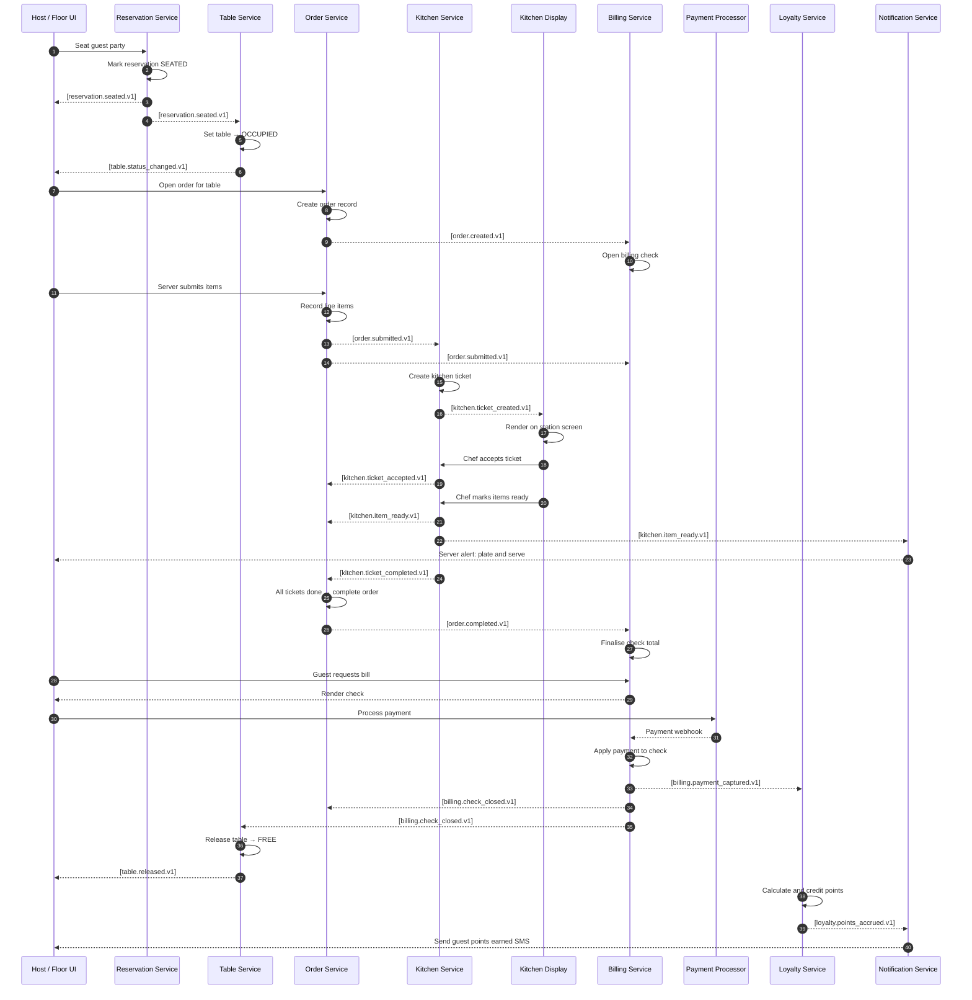

# Event Catalog

The **Restaurant Management System** is built on an event-driven architecture where every significant state transition within a restaurant operation is captured as a named, versioned, schema-governed domain event. Events flow through a central Kafka bus, enabling real-time coordination between the reservation, table, order, kitchen, billing, inventory, staff, delivery, and loyalty domains without tight service coupling. Each event is an immutable fact — once published it is never mutated — and downstream consumers replay or project that history to maintain their own read models. This catalog is the single source of truth for event contracts, routing rules, SLO targets, and schema lifecycle governance across all environments.

---

## Contract Conventions

### Naming Convention

All events follow the pattern:

```
<domain>.<aggregate>.<verb>.v<N>
```

| Segment | Description | Example |
|---------|-------------|---------|
| `domain` | Business capability area | `order`, `kitchen`, `billing` |
| `aggregate` | The root entity involved | `order`, `ticket`, `check` |
| `verb` | Past-tense action | `submitted`, `completed`, `failed` |
| `v<N>` | Integer schema version | `v1`, `v2` |

Examples: `order.order.submitted.v1`, `kitchen.ticket.item_ready.v1`, `billing.check.closed.v1`

For brevity, when the domain and aggregate share the same name, the duplicate segment is collapsed: `order.submitted.v1` rather than `order.order.submitted.v1`.

---

### Required Envelope Fields

Every event, regardless of domain, must include the following top-level envelope fields. Producers that omit any required field will be rejected by the schema registry.

| Field | Type | Required | Description |
|-------|------|----------|-------------|
| `event_id` | `UUID v4` | ✅ | Globally unique identifier for this event instance. Used for deduplication. |
| `event_type` | `string` | ✅ | Fully qualified event name, e.g. `order.submitted.v1`. |
| `occurred_at` | `string (ISO 8601)` | ✅ | UTC timestamp of when the fact occurred in the domain, e.g. `2025-04-12T14:32:00.000Z`. |
| `correlation_id` | `UUID v4` | ✅ | Traces a chain of causally related events back to the originating request. |
| `causation_id` | `UUID v4` | ✅ | `event_id` of the immediately preceding event that caused this one. Set to `correlation_id` for root events. |
| `producer_service` | `string` | ✅ | Logical service name publishing the event, e.g. `order-service`. |
| `schema_version` | `integer` | ✅ | Numeric version of the payload schema. Must match the `v<N>` suffix of `event_type`. |
| `tenant_id` | `UUID v4` | ✅ | Restaurant group / franchise owner identifier. Used for data isolation. |
| `branch_id` | `UUID v4` | ✅ | Individual restaurant branch. Required for all operational events. |

---

### Delivery Guarantee

All topics are configured for **at-least-once delivery**. Consumers must implement idempotency guards keyed on `event_id` or on a domain-specific natural key documented per event. The platform does **not** guarantee exactly-once delivery — duplicate events will occur during broker failover and consumer restarts.

---

### Idempotency Requirement

Each consumer service must maintain a processed-event ledger (e.g. a `processed_events(event_id, consumed_at)` table with a unique index on `event_id`). Before processing any event, check this ledger. If the `event_id` is already present, acknowledge the message and skip processing. This check must be performed within the same database transaction as the business state mutation to prevent split-brain.

---

### Schema Evolution Rules

1. **Backward-compatible changes** (allowed within the same `v<N>`): adding optional fields with defaults, relaxing validation constraints, adding enum values.
2. **Forward-compatible changes** (allowed within same `v<N>`): removing optional fields, tightening validation, deprecating enum values (mark `deprecated: true` in schema annotation; keep field in wire format for one full deprecation cycle of 90 days).
3. **Breaking changes** require a **new version suffix** (`v2`, `v3`, …). The old version must remain published alongside the new version for a minimum of **90 days** to allow consumer migration. After that window, the old version topic is closed for new publishes and archived for replay-only access.
4. Schema changes must be reviewed and merged into the Schema Registry before the first producer deployment that uses them. Producers deploying against an unregistered schema will be rejected at runtime.

---

### Transport: Kafka Topics and Partition Strategy

| Topic Pattern | Partition Key | Retention | Replication |
|---------------|---------------|-----------|-------------|
| `rms.{domain}.events.v{N}` | `branch_id + aggregate_id` | 7 days (hot), 365 days (cold tier) | RF=3 |
| `rms.{domain}.events.dlq` | `branch_id` | 30 days | RF=3 |

Partition keys are computed as `SHA-256(branch_id + ":" + aggregate_id)` modulo partition count. This ensures all events for a given reservation, order, or table arrive in-order within a partition while distributing load across branches.

---

## Domain Events

### Reservation Domain

---

#### `reservation.created.v1`

**Description:** A guest has requested a reservation slot; the record exists in a `PENDING` state awaiting confirmation.

**Trigger:** `POST /reservations` accepted by reservation-service.

**Payload Fields:**

| Field | Type | Description |
|-------|------|-------------|
| `reservation_id` | UUID | Unique reservation identifier. |
| `branch_id` | UUID | Branch where the reservation is requested. |
| `guest_id` | UUID | Registered guest profile, nullable for walk-in pre-bookings. |
| `guest_name` | string | Display name for the guest party. |
| `guest_phone` | string | E.164 format contact number. |
| `party_size` | integer | Number of covers. |
| `requested_at` | ISO 8601 | Desired date-time for the reservation. |
| `seating_preference` | string | `INDOOR`, `OUTDOOR`, `BAR`, `PRIVATE_DINING`. |
| `special_requests` | string | Free-text notes, nullable. |
| `channel` | string | `ONLINE`, `PHONE`, `WALK_IN`, `THIRD_PARTY_APP`. |
| `source_ref` | string | External booking reference if `channel=THIRD_PARTY_APP`, nullable. |

**Consumers:** `notification-service` (send confirmation request SMS/email), `table-allocation-service` (tentative table hold), `analytics-service`.

**Idempotency Key:** `reservation_id`

---

#### `reservation.confirmed.v1`

**Description:** Staff or auto-confirm logic has accepted the reservation and a table has been tentatively allocated.

**Trigger:** Reservation transitions from `PENDING` → `CONFIRMED`.

**Payload Fields:**

| Field | Type | Description |
|-------|------|-------------|
| `reservation_id` | UUID | Reservation being confirmed. |
| `table_id` | UUID | Tentatively allocated table. |
| `table_label` | string | Human-readable label, e.g. `T-12`. |
| `confirmed_by` | UUID | Staff member or `SYSTEM` for auto-confirm. |
| `confirmed_at` | ISO 8601 | Timestamp of confirmation. |
| `estimated_arrival` | ISO 8601 | Expected guest arrival window start. |
| `hold_expires_at` | ISO 8601 | Table hold expiry; table released if guest no-shows by this time. |
| `deposit_required` | boolean | Whether a deposit was collected. |
| `deposit_amount` | decimal | Deposit amount in branch currency, 0.00 if none. |

**Consumers:** `notification-service` (send confirmation to guest), `table-service` (set table to `RESERVED`), `loyalty-service` (log upcoming visit), `analytics-service`.

**Idempotency Key:** `reservation_id + "CONFIRMED"`

---

#### `reservation.cancelled.v1`

**Description:** Reservation has been cancelled by guest or staff before seating.

**Trigger:** Reservation transitions to `CANCELLED`.

**Payload Fields:**

| Field | Type | Description |
|-------|------|-------------|
| `reservation_id` | UUID | Cancelled reservation. |
| `cancelled_by` | UUID | Actor ID; `GUEST` system value if self-service. |
| `cancellation_reason` | string | `GUEST_REQUEST`, `BRANCH_CLOSURE`, `CAPACITY_CHANGE`, `OTHER`. |
| `cancellation_notes` | string | Free-text, nullable. |
| `cancelled_at` | ISO 8601 | Timestamp. |
| `deposit_refund_amount` | decimal | Amount to be refunded, 0.00 if none. |
| `hours_notice` | integer | Hours between cancellation and original reservation time. |

**Consumers:** `table-service` (release table hold), `billing-service` (process deposit refund), `notification-service` (cancellation confirmation), `analytics-service`.

**Idempotency Key:** `reservation_id + "CANCELLED"`

---

#### `reservation.no_show.v1`

**Description:** Guest did not arrive by the hold expiry time; reservation marked as no-show.

**Trigger:** Automated hold-expiry job fires after `hold_expires_at` passes without a `reservation.seated.v1`.

**Payload Fields:**

| Field | Type | Description |
|-------|------|-------------|
| `reservation_id` | UUID | No-show reservation. |
| `original_party_size` | integer | Expected covers lost. |
| `hold_expired_at` | ISO 8601 | When the hold lapsed. |
| `table_id` | UUID | Table that was held and is now being released. |
| `deposit_forfeited` | boolean | Whether deposit was retained. |

**Consumers:** `table-service` (release table), `billing-service` (forfeit deposit if policy applies), `loyalty-service` (log no-show against guest profile), `analytics-service`.

**Idempotency Key:** `reservation_id + "NO_SHOW"`

---

#### `reservation.seated.v1`

**Description:** The guest party has been physically seated at the assigned table.

**Trigger:** Host taps "Seat Party" in floor-management UI.

**Payload Fields:**

| Field | Type | Description |
|-------|------|-------------|
| `reservation_id` | UUID | Associated reservation, nullable for walk-ins. |
| `table_id` | UUID | Table where guests are seated. |
| `party_size` | integer | Actual covers seated (may differ from reservation). |
| `seated_at` | ISO 8601 | Actual seating timestamp. |
| `server_id` | UUID | Staff member assigned as primary server. |
| `wait_time_minutes` | integer | Actual wait time from arrival to seating. |

**Consumers:** `order-service` (open new order for table), `table-service` (set table to `OCCUPIED`), `loyalty-service` (begin visit tracking), `analytics-service`.

**Idempotency Key:** `table_id + seated_at`

---

### Table Domain

---

#### `table.status_changed.v1`

**Description:** A table's operational status has changed.

**Trigger:** Any workflow that transitions a table (seating, release, cleaning, merge).

**Payload Fields:**

| Field | Type | Description |
|-------|------|-------------|
| `table_id` | UUID | Table identifier. |
| `table_label` | string | Human-readable label. |
| `previous_status` | string | `FREE`, `RESERVED`, `OCCUPIED`, `DIRTY`, `BLOCKED`. |
| `new_status` | string | Same enum as above. |
| `changed_by` | UUID | Actor triggering the status change. |
| `reason` | string | `SEATED`, `RELEASED`, `CLEANED`, `MAINTENANCE`, `MERGED`. |

**Consumers:** `floor-display-service` (update floor map), `reservation-service` (recalculate availability), `analytics-service`.

**Idempotency Key:** `table_id + occurred_at`

---

#### `table.merged.v1`

**Description:** Two or more tables have been combined to accommodate a larger party.

**Trigger:** Host action in floor-management UI.

**Payload Fields:**

| Field | Type | Description |
|-------|------|-------------|
| `merge_group_id` | UUID | Logical group identifier for this merge. |
| `primary_table_id` | UUID | The table that carries the order. |
| `secondary_table_ids` | UUID[] | Tables merged into the primary. |
| `combined_capacity` | integer | Total seat count after merge. |
| `merged_by` | UUID | Staff actor. |
| `merged_at` | ISO 8601 | Timestamp. |

**Consumers:** `order-service` (associate all tables to one order), `floor-display-service`, `analytics-service`.

**Idempotency Key:** `merge_group_id`

---

#### `table.released.v1`

**Description:** Table has been cleared and returned to `FREE` status after a party departs.

**Trigger:** Server taps "Release Table" or automated release after billing.check.closed.v1.

**Payload Fields:**

| Field | Type | Description |
|-------|------|-------------|
| `table_id` | UUID | Released table. |
| `released_by` | UUID | Staff actor or `SYSTEM`. |
| `released_at` | ISO 8601 | Timestamp. |
| `turnover_time_minutes` | integer | Minutes from order.completed to release. |

**Consumers:** `reservation-service` (make table available), `floor-display-service`, `analytics-service`.

**Idempotency Key:** `table_id + released_at`

---

### Order Domain

---

#### `order.created.v1`

**Description:** A new order record has been opened for a table, but no items submitted yet.

**Trigger:** Automatic upon `reservation.seated.v1` or manual "Open Check" action.

**Payload Fields:**

| Field | Type | Description |
|-------|------|-------------|
| `order_id` | UUID | New order identifier. |
| `table_id` | UUID | Associated table. |
| `server_id` | UUID | Assigned server. |
| `covers` | integer | Number of guests for this order. |
| `order_type` | string | `DINE_IN`, `TAKEAWAY`, `DELIVERY`. |
| `created_at` | ISO 8601 | Timestamp. |

**Consumers:** `billing-service` (open check), `kitchen-service` (prepare station context), `analytics-service`.

**Idempotency Key:** `order_id`

---

#### `order.submitted.v1`

**Description:** Server has sent the order (or a round of items) to the kitchen.

**Trigger:** "Send to Kitchen" POS action.

**Payload Fields:**

| Field | Type | Description |
|-------|------|-------------|
| `order_id` | UUID | Order being submitted. |
| `submission_seq` | integer | Monotonically increasing sequence per order (1 = first round). |
| `table_id` | UUID | Table the order belongs to. |
| `server_id` | UUID | Submitting server. |
| `items` | object[] | List of items (see sub-fields below). |
| `items[].order_item_id` | UUID | Unique line item identifier. |
| `items[].menu_item_id` | UUID | Menu item reference. |
| `items[].name` | string | Menu item display name at time of order. |
| `items[].quantity` | integer | Quantity ordered. |
| `items[].modifiers` | string[] | Applied modifier names, e.g. `["no onion", "extra sauce"]`. |
| `items[].course` | string | `STARTER`, `MAIN`, `DESSERT`, `BEVERAGE`, `SIDE`. |
| `items[].station` | string | Target kitchen station, e.g. `GRILL`, `COLD`, `BAR`. |
| `items[].unit_price` | decimal | Price per unit at time of order. |
| `items[].notes` | string | Per-item special instructions, nullable. |
| `fire_immediately` | boolean | If true, kitchen should start immediately; false = hold for course timing. |
| `covers` | integer | Current cover count. |

**Consumers:** `kitchen-service` (create ticket), `inventory-service` (decrement projected stock), `billing-service` (add line items to check), `analytics-service`.

**Idempotency Key:** `order_id + submission_seq`

---

#### `order.item_added.v1`

**Description:** A single additional item has been added to an existing order after initial submission.

**Trigger:** Server adds item in mid-service.

**Payload Fields:**

| Field | Type | Description |
|-------|------|-------------|
| `order_id` | UUID | Parent order. |
| `order_item_id` | UUID | New line item. |
| `menu_item_id` | UUID | Menu item reference. |
| `name` | string | Display name. |
| `quantity` | integer | Quantity. |
| `modifiers` | string[] | Applied modifiers. |
| `course` | string | Course enum. |
| `station` | string | Target station. |
| `unit_price` | decimal | Price at time of add. |
| `added_by` | UUID | Server ID. |

**Consumers:** `kitchen-service`, `billing-service`, `inventory-service`.

**Idempotency Key:** `order_item_id`

---

#### `order.item_voided.v1`

**Description:** An item has been voided from the order, typically due to guest change or error.

**Trigger:** Manager-approved void action in POS.

**Payload Fields:**

| Field | Type | Description |
|-------|------|-------------|
| `order_id` | UUID | Parent order. |
| `order_item_id` | UUID | Voided line item. |
| `voided_by` | UUID | Server ID. |
| `approved_by` | UUID | Manager who approved the void. |
| `void_reason` | string | `GUEST_CHANGE`, `ALLERGY`, `ERROR`, `QUALITY_ISSUE`, `OTHER`. |
| `kitchen_already_fired` | boolean | Whether kitchen had already started this item. |

**Consumers:** `kitchen-service` (cancel ticket item if not yet fired), `billing-service` (remove from check), `inventory-service` (restore projected stock), `analytics-service`.

**Idempotency Key:** `order_item_id + "VOIDED"`

---

#### `order.completed.v1`

**Description:** All items have been served and the order is complete (pre-billing state).

**Trigger:** Server taps "Complete Order" or automatic on all kitchen items ready.

**Payload Fields:**

| Field | Type | Description |
|-------|------|-------------|
| `order_id` | UUID | Completed order. |
| `table_id` | UUID | Table. |
| `total_items` | integer | Total items served. |
| `total_amount` | decimal | Pre-tax, pre-discount total. |
| `service_duration_minutes` | integer | Duration from order.created to order.completed. |
| `completed_at` | ISO 8601 | Timestamp. |

**Consumers:** `billing-service` (generate bill), `loyalty-service` (calculate points), `analytics-service`.

**Idempotency Key:** `order_id + "COMPLETED"`

---

#### `order.cancelled.v1`

**Description:** Entire order has been cancelled (different from item void — covers full order cancellation).

**Trigger:** Manager action; also auto-triggered if guest leaves before ordering.

**Payload Fields:**

| Field | Type | Description |
|-------|------|-------------|
| `order_id` | UUID | Cancelled order. |
| `cancelled_by` | UUID | Actor. |
| `cancellation_reason` | string | `GUEST_LEFT`, `DUPLICATE`, `WRONG_TABLE`, `SYSTEM_ERROR`. |
| `items_fired` | integer | Count of items already sent to kitchen. |
| `cancelled_at` | ISO 8601 | Timestamp. |

**Consumers:** `kitchen-service` (cancel all open tickets), `billing-service` (close check with zero balance), `inventory-service` (restore stock), `table-service` (release table).

**Idempotency Key:** `order_id + "CANCELLED"`

---

### Kitchen Domain

---

#### `kitchen.ticket_created.v1`

**Description:** Kitchen has received a new ticket from an order submission.

**Trigger:** `order.submitted.v1` consumed by kitchen-service.

**Payload Fields:**

| Field | Type | Description |
|-------|------|-------------|
| `ticket_id` | UUID | Kitchen ticket identifier. |
| `order_id` | UUID | Source order. |
| `table_label` | string | Display label for KDS screen. |
| `station` | string | Target kitchen station. |
| `items` | object[] | Items on this ticket. |
| `items[].order_item_id` | UUID | Line item reference. |
| `items[].name` | string | Display name. |
| `items[].quantity` | integer | Quantity. |
| `items[].modifiers` | string[] | Modifiers. |
| `items[].course` | string | Course. |
| `items[].notes` | string | Special instructions. |
| `priority` | string | `NORMAL`, `RUSH`, `ALLERGEN_ALERT`. |
| `promised_ready_at` | ISO 8601 | SLA-based ready target. |
| `covers` | integer | Cover count for pacing context. |

**Consumers:** `kitchen-display-service` (render on KDS), `analytics-service`.

**Idempotency Key:** `ticket_id`

---

#### `kitchen.ticket_accepted.v1`

**Description:** Kitchen staff has acknowledged and accepted the ticket on the KDS.

**Trigger:** Chef taps "Accept" on KDS screen.

**Payload Fields:**

| Field | Type | Description |
|-------|------|-------------|
| `ticket_id` | UUID | Accepted ticket. |
| `accepted_by` | UUID | Staff member (KDS login). |
| `accepted_at` | ISO 8601 | Timestamp. |
| `estimated_ready_at` | ISO 8601 | Chef's estimated ready time. |

**Consumers:** `order-service` (update item status to `IN_PREPARATION`), `floor-display-service` (notify server), `analytics-service`.

**Idempotency Key:** `ticket_id + "ACCEPTED"`

---

#### `kitchen.item_ready.v1`

**Description:** An individual item on a ticket is ready to be plated and served.

**Trigger:** Chef taps item as ready on KDS.

**Payload Fields:**

| Field | Type | Description |
|-------|------|-------------|
| `ticket_id` | UUID | Parent ticket. |
| `order_item_id` | UUID | The ready item. |
| `table_label` | string | For server routing. |
| `course` | string | Course enum. |
| `ready_at` | ISO 8601 | Timestamp. |
| `prep_time_seconds` | integer | Actual prep duration for analytics. |

**Consumers:** `floor-display-service` (alert server), `order-service` (item status `READY`), `analytics-service`.

**Idempotency Key:** `order_item_id + "READY"`

---

#### `kitchen.ticket_completed.v1`

**Description:** All items on a kitchen ticket have been marked ready; ticket is done.

**Trigger:** Final item on ticket fires `kitchen.item_ready.v1`.

**Payload Fields:**

| Field | Type | Description |
|-------|------|-------------|
| `ticket_id` | UUID | Completed ticket. |
| `order_id` | UUID | Parent order. |
| `station` | string | Kitchen station. |
| `completed_at` | ISO 8601 | Timestamp. |
| `total_prep_time_seconds` | integer | Time from ticket_created to ticket_completed. |
| `sla_met` | boolean | Whether `promised_ready_at` was honoured. |

**Consumers:** `order-service` (check if all tickets done → trigger order.completed), `analytics-service`.

**Idempotency Key:** `ticket_id + "COMPLETED"`

---

#### `kitchen.refire_requested.v1`

**Description:** A previously completed item must be re-prepared (quality failure, drop, wrong order).

**Trigger:** Server requests refire via POS or manager action.

**Payload Fields:**

| Field | Type | Description |
|-------|------|-------------|
| `ticket_id` | UUID | New ticket created for refire. |
| `original_order_item_id` | UUID | The item being refired. |
| `reason` | string | `QUALITY`, `DROPPED`, `WRONG_ITEM`, `ALLERGEN_ERROR`. |
| `requested_by` | UUID | Server or manager. |
| `rush` | boolean | Whether refire should be treated as RUSH priority. |

**Consumers:** `kitchen-display-service` (create new KDS entry), `billing-service` (no-charge line), `analytics-service` (waste/refire tracking).

**Idempotency Key:** `ticket_id`

---

### Billing Domain

---

#### `billing.check_opened.v1`

**Description:** A guest check has been opened and is ready to accumulate line items.

**Trigger:** Consumed from `order.created.v1`.

**Payload Fields:**

| Field | Type | Description |
|-------|------|-------------|
| `check_id` | UUID | Billing check identifier. |
| `order_id` | UUID | Associated order. |
| `table_id` | UUID | Table. |
| `opened_at` | ISO 8601 | Timestamp. |
| `currency` | string | ISO 4217 currency code, e.g. `INR`, `USD`. |
| `tax_profile_id` | UUID | Active tax configuration. |

**Consumers:** `pos-service` (display check on terminal), `analytics-service`.

**Idempotency Key:** `check_id`

---

#### `billing.payment_captured.v1`

**Description:** A payment has been successfully authorised and captured.

**Trigger:** Payment processor webhook confirming capture.

**Payload Fields:**

| Field | Type | Description |
|-------|------|-------------|
| `payment_id` | UUID | Internal payment record. |
| `check_id` | UUID | Check being paid. |
| `payment_intent_id` | string | Payment processor's intent/transaction ID. |
| `amount` | decimal | Captured amount. |
| `currency` | string | ISO 4217. |
| `tender_type` | string | `CASH`, `CARD`, `UPI`, `WALLET`, `VOUCHER`. |
| `card_last4` | string | Last 4 digits if tender_type=CARD, nullable. |
| `captured_at` | ISO 8601 | Processor capture timestamp. |
| `tip_amount` | decimal | Tip included in capture, 0.00 if none. |
| `processor_response_code` | string | Gateway response code. |

**Consumers:** `billing-service` (apply payment to check balance), `loyalty-service` (trigger points accrual), `analytics-service`, `accounting-service`.

**Idempotency Key:** `payment_intent_id`

---

#### `billing.payment_failed.v1`

**Description:** A payment attempt was declined or failed.

**Trigger:** Payment processor returns failure or timeout.

**Payload Fields:**

| Field | Type | Description |
|-------|------|-------------|
| `payment_id` | UUID | Internal payment attempt record. |
| `check_id` | UUID | Check being paid. |
| `amount_attempted` | decimal | Amount attempted. |
| `tender_type` | string | Tender type used. |
| `failure_reason` | string | `INSUFFICIENT_FUNDS`, `CARD_DECLINED`, `TIMEOUT`, `FRAUD_BLOCK`, `NETWORK_ERROR`. |
| `processor_error_code` | string | Raw gateway error code. |
| `failed_at` | ISO 8601 | Timestamp. |
| `retry_allowed` | boolean | Whether guest can retry with same or different tender. |

**Consumers:** `notification-service` (alert staff), `pos-service` (show failure on terminal), `analytics-service`.

**Idempotency Key:** `payment_id + "FAILED"`

---

#### `billing.check_closed.v1`

**Description:** The check has been fully settled and closed.

**Trigger:** All outstanding balance reaches zero via payment(s).

**Payload Fields:**

| Field | Type | Description |
|-------|------|-------------|
| `check_id` | UUID | Closed check. |
| `order_id` | UUID | Parent order. |
| `subtotal` | decimal | Pre-tax amount. |
| `tax_amount` | decimal | Total tax applied. |
| `discount_amount` | decimal | Total discounts applied. |
| `tip_amount` | decimal | Total tip. |
| `grand_total` | decimal | Final amount paid. |
| `payment_ids` | UUID[] | All payments contributing to settlement. |
| `closed_at` | ISO 8601 | Timestamp. |
| `covers` | integer | Final cover count for per-cover analytics. |

**Consumers:** `table-service` (trigger table release), `loyalty-service` (finalise points), `order-service` (archive order), `analytics-service`, `accounting-service`.

**Idempotency Key:** `check_id + "CLOSED"`

---

#### `billing.refund_issued.v1`

**Description:** A full or partial refund has been issued against a previously closed check.

**Trigger:** Manager approves refund in POS.

**Payload Fields:**

| Field | Type | Description |
|-------|------|-------------|
| `refund_id` | UUID | Refund record identifier. |
| `check_id` | UUID | Original check. |
| `payment_id` | UUID | Original payment being refunded. |
| `refund_amount` | decimal | Amount refunded. |
| `reason` | string | `QUALITY_COMPLAINT`, `WRONG_CHARGE`, `MANAGER_COMP`, `ALLERGY_INCIDENT`. |
| `approved_by` | UUID | Manager ID. |
| `issued_at` | ISO 8601 | Timestamp. |
| `processor_refund_id` | string | Gateway refund reference. |

**Consumers:** `loyalty-service` (reverse points if applicable), `analytics-service`, `accounting-service`.

**Idempotency Key:** `refund_id`

---

### Inventory Domain

---

#### `inventory.stock_depleted.v1`

**Description:** A tracked ingredient or SKU has dropped below its reorder threshold.

**Trigger:** Inventory-service detects stock level crosses threshold after processing `order.submitted.v1`.

**Payload Fields:**

| Field | Type | Description |
|-------|------|-------------|
| `inventory_item_id` | UUID | Stock item. |
| `sku_code` | string | Internal SKU. |
| `item_name` | string | Display name. |
| `current_qty` | decimal | Current quantity on hand. |
| `unit` | string | `KG`, `LITRE`, `UNIT`, `PORTION`. |
| `reorder_threshold` | decimal | The threshold that was crossed. |
| `depleted_at` | ISO 8601 | Timestamp. |
| `affected_menu_item_ids` | UUID[] | Menu items that depend on this ingredient. |

**Consumers:** `procurement-service` (create purchase request), `menu-service` (flag items as low-stock), `notification-service` (alert kitchen manager), `analytics-service`.

**Idempotency Key:** `inventory_item_id + depleted_at`

---

#### `inventory.reorder_triggered.v1`

**Description:** A purchase order has been automatically generated for a depleted item.

**Trigger:** `inventory.stock_depleted.v1` consumed by procurement-service.

**Payload Fields:**

| Field | Type | Description |
|-------|------|-------------|
| `purchase_order_id` | UUID | Generated PO. |
| `inventory_item_id` | UUID | Item being reordered. |
| `supplier_id` | UUID | Selected supplier. |
| `order_qty` | decimal | Quantity being ordered. |
| `unit` | string | Unit enum. |
| `estimated_delivery` | ISO 8601 | Expected delivery date. |
| `triggered_at` | ISO 8601 | Timestamp. |

**Consumers:** `notification-service` (alert manager), `analytics-service`.

**Idempotency Key:** `purchase_order_id`

---

#### `inventory.stock_received.v1`

**Description:** A delivery has arrived and stock levels have been updated.

**Trigger:** Receiving staff confirms delivery in inventory management UI.

**Payload Fields:**

| Field | Type | Description |
|-------|------|-------------|
| `receipt_id` | UUID | Goods receipt record. |
| `purchase_order_id` | UUID | Fulfilled PO, nullable if ad-hoc delivery. |
| `inventory_item_id` | UUID | Item received. |
| `received_qty` | decimal | Quantity accepted. |
| `unit` | string | Unit. |
| `batch_number` | string | Supplier batch/lot number. |
| `expiry_date` | date | Expiry date for perishables, nullable. |
| `received_by` | UUID | Staff member. |
| `received_at` | ISO 8601 | Timestamp. |

**Consumers:** `menu-service` (re-enable low-stock items), `procurement-service` (close PO), `analytics-service`.

**Idempotency Key:** `receipt_id`

---

### Staff Domain

---

#### `staff.shift_started.v1`

**Description:** A staff member has clocked in and their shift has officially begun.

**Trigger:** Clock-in action on staff terminal or mobile app.

**Payload Fields:**

| Field | Type | Description |
|-------|------|-------------|
| `shift_id` | UUID | Shift record. |
| `staff_id` | UUID | Employee. |
| `role` | string | `SERVER`, `COOK`, `HOST`, `BARTENDER`, `MANAGER`. |
| `station` | string | Assigned station or section. |
| `scheduled_start` | ISO 8601 | Scheduled start time. |
| `actual_start` | ISO 8601 | Actual clock-in time. |
| `late_minutes` | integer | Minutes late (0 if on time or early). |

**Consumers:** `scheduling-service` (mark shift active), `floor-display-service` (show staff availability), `analytics-service`.

**Idempotency Key:** `shift_id + "STARTED"`

---

#### `staff.shift_ended.v1`

**Description:** A staff member has clocked out and their shift has ended.

**Trigger:** Clock-out action.

**Payload Fields:**

| Field | Type | Description |
|-------|------|-------------|
| `shift_id` | UUID | Shift record. |
| `staff_id` | UUID | Employee. |
| `actual_end` | ISO 8601 | Clock-out time. |
| `shift_duration_minutes` | integer | Total worked duration. |
| `overtime_minutes` | integer | Minutes over scheduled hours. |
| `orders_served` | integer | Count of orders the staff member was primary server for. |
| `tips_declared` | decimal | Tips declared at close, nullable. |

**Consumers:** `payroll-service`, `scheduling-service` (mark shift closed), `analytics-service`.

**Idempotency Key:** `shift_id + "ENDED"`

---

### Delivery Domain

---

#### `delivery.order_dispatched.v1`

**Description:** A takeaway or delivery order has been handed to a delivery rider.

**Trigger:** Dispatch action confirmed in delivery management UI.

**Payload Fields:**

| Field | Type | Description |
|-------|------|-------------|
| `delivery_id` | UUID | Delivery record. |
| `order_id` | UUID | Parent order. |
| `rider_id` | UUID | Assigned rider. |
| `rider_name` | string | Rider display name. |
| `estimated_delivery_at` | ISO 8601 | ETA to customer. |
| `dispatch_address` | object | `{ street, city, postcode, lat, lng }`. |
| `dispatched_at` | ISO 8601 | Timestamp. |

**Consumers:** `notification-service` (send tracking link to customer), `analytics-service`.

**Idempotency Key:** `delivery_id + "DISPATCHED"`

---

#### `delivery.order_delivered.v1`

**Description:** Rider has confirmed delivery to the customer.

**Trigger:** Rider marks delivery complete in rider app.

**Payload Fields:**

| Field | Type | Description |
|-------|------|-------------|
| `delivery_id` | UUID | Delivery record. |
| `order_id` | UUID | Parent order. |
| `rider_id` | UUID | Rider. |
| `delivered_at` | ISO 8601 | Actual delivery time. |
| `delivery_duration_minutes` | integer | Duration from dispatch to delivery. |
| `proof_of_delivery_url` | string | Photo evidence URL, nullable. |
| `customer_signature` | boolean | Whether customer signed. |

**Consumers:** `billing-service` (if COD, trigger capture), `loyalty-service` (accrue points), `notification-service` (delivery confirmation), `analytics-service`.

**Idempotency Key:** `delivery_id + "DELIVERED"`

---

### Loyalty Domain

---

#### `loyalty.points_accrued.v1`

**Description:** Loyalty points have been credited to a guest's account.

**Trigger:** Consumed from `billing.check_closed.v1` or `delivery.order_delivered.v1`.

**Payload Fields:**

| Field | Type | Description |
|-------|------|-------------|
| `accrual_id` | UUID | Accrual transaction record. |
| `guest_id` | UUID | Loyalty member. |
| `points_earned` | integer | Points credited. |
| `basis_amount` | decimal | Spend amount used to calculate points. |
| `source_order_id` | UUID | Order that triggered accrual. |
| `tier` | string | Guest loyalty tier: `BRONZE`, `SILVER`, `GOLD`, `PLATINUM`. |
| `new_balance` | integer | Updated points balance after accrual. |
| `accrued_at` | ISO 8601 | Timestamp. |

**Consumers:** `notification-service` (send points earned message), `analytics-service`.

**Idempotency Key:** `accrual_id`

---

#### `loyalty.points_redeemed.v1`

**Description:** Guest has redeemed loyalty points against a check.

**Trigger:** Guest or server applies points redemption in POS.

**Payload Fields:**

| Field | Type | Description |
|-------|------|-------------|
| `redemption_id` | UUID | Redemption transaction. |
| `guest_id` | UUID | Loyalty member. |
| `points_redeemed` | integer | Points debited. |
| `monetary_value` | decimal | Currency value of redeemed points. |
| `check_id` | UUID | Check receiving the discount. |
| `new_balance` | integer | Updated points balance after redemption. |
| `redeemed_at` | ISO 8601 | Timestamp. |

**Consumers:** `billing-service` (apply discount to check), `notification-service`, `analytics-service`.

**Idempotency Key:** `redemption_id`

---

## Publish and Consumption Sequence

The following diagram illustrates the canonical happy-path flow of a dine-in order from guest arrival through kitchen preparation to final payment. Each arrow annotated with `[event]` represents a Kafka publish; unlabelled arrows are synchronous internal calls.



---

## Event Routing

The table below maps each event to the downstream services that consume it and describes the purpose of each subscription.

| Event | Consumer Service | Purpose |
|-------|-----------------|---------|
| `reservation.created.v1` | notification-service | Send booking request confirmation to guest |
| `reservation.created.v1` | table-allocation-service | Evaluate and hold a candidate table |
| `reservation.confirmed.v1` | notification-service | Send confirmed booking details to guest |
| `reservation.confirmed.v1` | table-service | Set table status to `RESERVED` |
| `reservation.cancelled.v1` | table-service | Release table hold |
| `reservation.cancelled.v1` | billing-service | Issue deposit refund if applicable |
| `reservation.no_show.v1` | table-service | Release table for walk-ins |
| `reservation.no_show.v1` | loyalty-service | Record no-show on guest profile |
| `reservation.seated.v1` | order-service | Auto-open order for the table |
| `reservation.seated.v1` | table-service | Set table to `OCCUPIED` |
| `table.status_changed.v1` | floor-display-service | Refresh floor plan view |
| `table.merged.v1` | order-service | Merge order contexts |
| `order.created.v1` | billing-service | Open guest check |
| `order.submitted.v1` | kitchen-service | Create and route kitchen ticket |
| `order.submitted.v1` | billing-service | Add line items to check |
| `order.submitted.v1` | inventory-service | Decrement projected stock levels |
| `order.item_voided.v1` | kitchen-service | Cancel or stop in-flight item |
| `order.item_voided.v1` | billing-service | Remove line item from check |
| `order.completed.v1` | billing-service | Finalise check for payment |
| `order.completed.v1` | loyalty-service | Begin points calculation |
| `kitchen.ticket_created.v1` | kitchen-display-service | Render ticket on KDS |
| `kitchen.ticket_accepted.v1` | order-service | Update item statuses to `IN_PREPARATION` |
| `kitchen.item_ready.v1` | floor-display-service | Alert server to collect and serve |
| `kitchen.ticket_completed.v1` | order-service | Check if all tickets done → complete order |
| `billing.payment_captured.v1` | loyalty-service | Trigger points accrual |
| `billing.payment_captured.v1` | accounting-service | Post journal entry |
| `billing.check_closed.v1` | table-service | Trigger table release |
| `billing.check_closed.v1` | analytics-service | Revenue reporting |
| `billing.refund_issued.v1` | loyalty-service | Reverse points if applicable |
| `billing.refund_issued.v1` | accounting-service | Post reversal journal entry |
| `inventory.stock_depleted.v1` | procurement-service | Create purchase request |
| `inventory.stock_depleted.v1` | menu-service | Flag dependent menu items |
| `inventory.stock_depleted.v1` | notification-service | Alert kitchen manager |
| `inventory.stock_received.v1` | menu-service | Re-enable low-stock items |
| `staff.shift_started.v1` | scheduling-service | Mark shift active |
| `staff.shift_ended.v1` | payroll-service | Compute wage for shift |
| `delivery.order_dispatched.v1` | notification-service | Send tracking link to customer |
| `delivery.order_delivered.v1` | billing-service | Trigger COD capture if applicable |
| `loyalty.points_accrued.v1` | notification-service | Send points earned SMS/push |
| `loyalty.points_redeemed.v1` | billing-service | Apply monetary discount to check |

---

## Event Schema Examples

### `order.submitted.v1`

```json
{
  "event_id": "a3f7c2d1-84e2-4b1f-9c3a-1234567890ab",
  "event_type": "order.submitted.v1",
  "occurred_at": "2025-04-12T14:32:00.000Z",
  "correlation_id": "e1b2c3d4-0000-4000-8000-aabbccddeeff",
  "causation_id": "e1b2c3d4-0000-4000-8000-aabbccddeeff",
  "producer_service": "order-service",
  "schema_version": 1,
  "tenant_id": "t-9988776655",
  "branch_id": "b-1234abcd",
  "payload": {
    "order_id": "ord-00234",
    "submission_seq": 1,
    "table_id": "tbl-012",
    "server_id": "staff-0055",
    "fire_immediately": true,
    "covers": 4,
    "items": [
      {
        "order_item_id": "item-001",
        "menu_item_id": "menu-paneer-tikka",
        "name": "Paneer Tikka",
        "quantity": 2,
        "modifiers": ["extra spicy", "no onion"],
        "course": "STARTER",
        "station": "TANDOOR",
        "unit_price": 320.00,
        "notes": "Guest is lactose intolerant — use non-dairy marinade"
      },
      {
        "order_item_id": "item-002",
        "menu_item_id": "menu-dal-makhani",
        "name": "Dal Makhani",
        "quantity": 2,
        "modifiers": [],
        "course": "MAIN",
        "station": "HOT_LINE",
        "unit_price": 280.00,
        "notes": null
      },
      {
        "order_item_id": "item-003",
        "menu_item_id": "menu-mango-lassi",
        "name": "Mango Lassi",
        "quantity": 4,
        "modifiers": ["sugar-free"],
        "course": "BEVERAGE",
        "station": "BAR",
        "unit_price": 120.00,
        "notes": null
      }
    ]
  }
}
```

---

### `kitchen.ticket_created.v1`

```json
{
  "event_id": "b8e1a9f2-11cc-4d5e-82ab-fedcba987654",
  "event_type": "kitchen.ticket_created.v1",
  "occurred_at": "2025-04-12T14:32:03.450Z",
  "correlation_id": "e1b2c3d4-0000-4000-8000-aabbccddeeff",
  "causation_id": "a3f7c2d1-84e2-4b1f-9c3a-1234567890ab",
  "producer_service": "kitchen-service",
  "schema_version": 1,
  "tenant_id": "t-9988776655",
  "branch_id": "b-1234abcd",
  "payload": {
    "ticket_id": "kticket-00891",
    "order_id": "ord-00234",
    "table_label": "T-12",
    "station": "TANDOOR",
    "priority": "NORMAL",
    "promised_ready_at": "2025-04-12T14:47:00.000Z",
    "covers": 4,
    "items": [
      {
        "order_item_id": "item-001",
        "name": "Paneer Tikka",
        "quantity": 2,
        "modifiers": ["extra spicy", "no onion"],
        "course": "STARTER",
        "notes": "Guest is lactose intolerant — use non-dairy marinade"
      }
    ]
  }
}
```

---

### `billing.payment_captured.v1`

```json
{
  "event_id": "c4d5e6f7-2233-4455-a6b7-112233445566",
  "event_type": "billing.payment_captured.v1",
  "occurred_at": "2025-04-12T15:58:10.000Z",
  "correlation_id": "e1b2c3d4-0000-4000-8000-aabbccddeeff",
  "causation_id": "d3e4f5a6-bbcc-44dd-ee00-ffeeddccbbaa",
  "producer_service": "billing-service",
  "schema_version": 1,
  "tenant_id": "t-9988776655",
  "branch_id": "b-1234abcd",
  "payload": {
    "payment_id": "pay-77321",
    "check_id": "chk-00234",
    "payment_intent_id": "pi_3OxyzRazorpay1234567890",
    "amount": 1720.00,
    "currency": "INR",
    "tender_type": "UPI",
    "card_last4": null,
    "captured_at": "2025-04-12T15:58:08.123Z",
    "tip_amount": 0.00,
    "processor_response_code": "APPROVED"
  }
}
```

---

### `reservation.confirmed.v1`

```json
{
  "event_id": "d1a2b3c4-9900-4c1d-b2e3-aabbccdd1122",
  "event_type": "reservation.confirmed.v1",
  "occurred_at": "2025-04-12T10:15:00.000Z",
  "correlation_id": "f0e1d2c3-1111-4111-8111-000011112222",
  "causation_id": "f0e1d2c3-1111-4111-8111-000011112222",
  "producer_service": "reservation-service",
  "schema_version": 1,
  "tenant_id": "t-9988776655",
  "branch_id": "b-1234abcd",
  "payload": {
    "reservation_id": "res-00551",
    "table_id": "tbl-012",
    "table_label": "T-12",
    "confirmed_by": "staff-0021",
    "confirmed_at": "2025-04-12T10:15:00.000Z",
    "estimated_arrival": "2025-04-12T20:00:00.000Z",
    "hold_expires_at": "2025-04-12T20:15:00.000Z",
    "deposit_required": false,
    "deposit_amount": 0.00
  }
}
```

---

### `inventory.stock_depleted.v1`

```json
{
  "event_id": "e9f8a7b6-5544-4332-c1d0-998877665544",
  "event_type": "inventory.stock_depleted.v1",
  "occurred_at": "2025-04-12T18:45:22.000Z",
  "correlation_id": "a1b2c3d4-aaaa-4bbb-8ccc-ddddeeeeffff",
  "causation_id": "a3f7c2d1-84e2-4b1f-9c3a-1234567890ab",
  "producer_service": "inventory-service",
  "schema_version": 1,
  "tenant_id": "t-9988776655",
  "branch_id": "b-1234abcd",
  "payload": {
    "inventory_item_id": "inv-paneer-001",
    "sku_code": "DAIRY-PNR-500G",
    "item_name": "Paneer (500g block)",
    "current_qty": 1.5,
    "unit": "KG",
    "reorder_threshold": 2.0,
    "depleted_at": "2025-04-12T18:45:22.000Z",
    "affected_menu_item_ids": [
      "menu-paneer-tikka",
      "menu-paneer-butter-masala",
      "menu-palak-paneer"
    ]
  }
}
```

---

## Dead Letter Queue Handling

### DLQ Naming Convention

Each domain topic has a corresponding DLQ topic:

```
rms.{domain}.events.v{N}  →  rms.{domain}.events.v{N}.dlq
```

Example: `rms.order.events.v1.dlq`

A single catch-all DLQ exists for schema-invalid or unroutable messages: `rms.global.unroutable.dlq`.

---

### Retry Policy

Before a message is moved to the DLQ, consumers must attempt processing with exponential back-off:

| Attempt | Delay |
|---------|-------|
| 1 (original) | Immediate |
| 2 | 5 seconds |
| 3 | 30 seconds |
| 4 | 2 minutes |
| 5 | 10 minutes |
| DLQ | After attempt 5 fails |

Retries must use the same consumer group and partition to preserve ordering semantics. The retry policy is configured at the consumer level using a `RetryTopicConfiguration` bean (Spring Kafka) or equivalent middleware pattern.

---

### Alerting

PagerDuty alerts are triggered when:

- DLQ backlog for any tier-1 topic exceeds **50 messages** for more than **2 minutes**.
- DLQ backlog for any tier-2 topic exceeds **200 messages** for more than **10 minutes**.
- Any message remains in a DLQ without acknowledgement for more than **15 minutes** in production.

Alert routing: P1 (tier-1 DLQ breach) → on-call engineer; P2 (tier-2 DLQ breach) → engineering Slack channel `#rms-alerts`.

---

### Manual Reprocessing Procedure

1. Identify the failing event via DLQ consumer group lag metrics in Grafana dashboard `RMS / DLQ Monitor`.
2. Inspect the message payload using the `rms-kafka-tools replay` CLI: `rms-kafka-tools replay --topic rms.order.events.v1.dlq --from-offset <offset> --dry-run`.
3. If the root cause is a transient dependency failure (database, external API), resolve the dependency and then replay: `rms-kafka-tools replay --topic rms.order.events.v1.dlq --from-offset <offset>`.
4. If the root cause is a bad payload (schema violation, business rule failure), route to the engineering team for payload correction. Do not replay corrupted events automatically.
5. After replay, verify consumer lag returns to zero and no new DLQ messages appear within 5 minutes.
6. Document the incident in the on-call runbook with root cause, affected event count, and resolution steps.

---

### Poison Pill Handling

A **poison pill** is a message that consistently fails processing regardless of retries — typically due to corrupt payload, unresolvable schema mismatch, or a bug in business logic triggered by specific data combinations.

Procedure:
1. After 3 consecutive DLQ replay failures, quarantine the message to `rms.{domain}.events.v{N}.quarantine`.
2. Open a severity-2 incident ticket referencing the `event_id`.
3. The on-call engineer must decide: fix the consumer code and re-apply the event, or discard with documented justification and compensating action.
4. Quarantined events are retained for **90 days** then archived to cold storage (S3 Glacier equivalent).
5. Never discard a quarantined event without an incident ticket and audit trail.

---

## Operational SLOs

### Publish Latency (commit-to-broker)

Events are tiered by business criticality. Tier 1 = guest-facing, revenue-impacting. Tier 2 = operational. Tier 3 = analytics/reporting.

| Tier | Events | P50 | P95 | P99 |
|------|--------|-----|-----|-----|
| Tier 1 | `order.submitted`, `billing.payment_captured`, `billing.check_closed`, `kitchen.ticket_created`, `reservation.seated` | < 200 ms | < 1 s | < 3 s |
| Tier 2 | `reservation.created`, `reservation.confirmed`, `order.completed`, `kitchen.ticket_completed`, `table.status_changed`, `inventory.stock_depleted` | < 500 ms | < 3 s | < 8 s |
| Tier 3 | `staff.shift_started`, `staff.shift_ended`, `loyalty.points_accrued`, `inventory.reorder_triggered` | < 2 s | < 10 s | < 30 s |

---

### Consumer Processing Latency SLOs

Consumer processing latency is measured from broker receipt to business state mutation committed.

| Consumer Service | SLO (P95) | SLO (P99) |
|-----------------|-----------|-----------|
| kitchen-service (consuming `order.submitted.v1`) | < 500 ms | < 2 s |
| billing-service (consuming `order.completed.v1`) | < 1 s | < 5 s |
| billing-service (consuming `billing.payment_captured.v1`) | < 500 ms | < 2 s |
| loyalty-service (consuming `billing.check_closed.v1`) | < 2 s | < 10 s |
| notification-service (all events) | < 3 s | < 15 s |
| inventory-service (consuming `order.submitted.v1`) | < 2 s | < 10 s |
| table-service (consuming `billing.check_closed.v1`) | < 1 s | < 5 s |

---

### DLQ Backlog SLO

| Metric | Target |
|--------|--------|
| Tier-1 DLQ message count | ≤ 0 at steady state; alert at > 10 |
| Tier-2 DLQ message count | ≤ 5 at steady state; alert at > 50 |
| Time-to-triage any DLQ message (production) | ≤ 15 minutes |
| Time-to-resolve tier-1 DLQ incident | ≤ 1 hour |
| Quarantine message review SLA | ≤ 24 hours |

---

### Schema Registry Availability SLO

| Metric | Target |
|--------|--------|
| Schema Registry uptime | 99.95% per calendar month |
| Schema validation latency (P95) | < 10 ms |
| Schema lookup cache hit rate | ≥ 98% |
| Time to register a new schema version | < 5 minutes (manual approval flow) |

---

## Event Versioning Strategy

### Version Bump Rules

| Change Type | Action Required |
|-------------|----------------|
| Add optional field with default | No version bump — annotate field with `@since: <date>` |
| Add required field | **Bump version** (e.g. `v1` → `v2`) |
| Remove any field | **Bump version** |
| Rename a field | **Bump version** (treat as remove + add) |
| Change field type | **Bump version** |
| Add enum value | No version bump — consumers must handle unknown enums gracefully |
| Remove enum value | **Bump version** |
| Change validation constraints (tighten) | **Bump version** |
| Change validation constraints (relax) | No version bump |

---

### Deprecation Timeline

When a version bump is required, the old version enters a deprecation lifecycle:

| Phase | Duration | Behaviour |
|-------|----------|-----------|
| Active | Until deprecation notice | Producers and consumers both use this version |
| Deprecated | 90 days | Old version still published alongside new version; consumers must migrate |
| Sunset | After 90-day window | Old version topic closed for new publishes; replay-only access remains |
| Archived | 12 months after sunset | Topic moved to cold storage; no runtime access |

Deprecation notices are published to the `#rms-platform-changes` Slack channel and the internal developer portal at least **30 days before** the deprecation phase begins.

---

### Migration Path

1. **Schema author** opens a PR against the Schema Registry repository adding the new `v<N>` schema file and updating this catalog with the new version's payload fields.
2. **PR review** requires sign-off from at least one representative of each affected consumer team.
3. **Dual-publish window**: The producing service publishes to both the old and new topic versions simultaneously for the full 90-day deprecation window.
4. **Consumer migration**: Each consumer team updates their subscription to the new topic version and deploys. Teams track migration status in the central migration board.
5. **Cutover**: After all consumers have migrated (confirmed via consumer group metrics), the dual-publish is removed from the producer.
6. **Sunset**: Old topic is sealed at the end of the 90-day window.

---

### Consumer Compatibility Matrix

The table below tracks current consumer compatibility for events with active version migrations.

| Event | v1 Status | v2 Status | Migration Deadline |
|-------|-----------|-----------|-------------------|
| `order.submitted.v1` | Active (current) | — | — |
| `kitchen.ticket_created.v1` | Active (current) | — | — |
| `billing.payment_captured.v1` | Active (current) | — | — |
| `reservation.confirmed.v1` | Active (current) | — | — |
| `inventory.stock_depleted.v1` | Active (current) | — | — |

> All events are currently at v1. This matrix will be updated when the first breaking change requiring a version bump is introduced. Consumer teams are required to update their entry in this table within 5 business days of receiving a deprecation notice.
