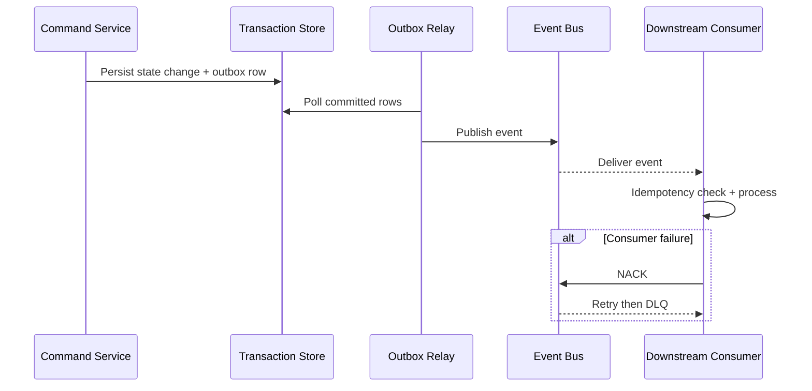
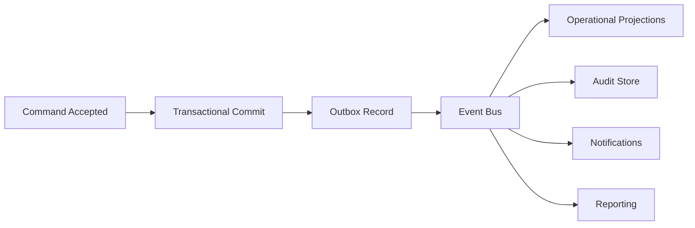

# Event Catalog

This catalog defines stable event contracts for **Restaurant Management System** to support event-driven integrations, auditability, and analytics across restaurant management workflows.

## Contract Conventions
- Event naming: `<domain>.<aggregate>.<action>.v1`.
- Required metadata: `event_id`, `occurred_at`, `correlation_id`, `producer`, `schema_version`, `tenant_context`.
- Delivery mode: at-least-once with mandatory consumer idempotency.
- Ordering guarantee: per aggregate key; no global ordering assumption.

## Domain Events
| Event Name | Payload Highlights | Typical Consumers |
|---|---|---|
| `domain.record.created.v1` | record_id, actor_id, initial_state, occurred_at | orchestration, analytics |
| `domain.record.state_changed.v1` | record_id, old_state, new_state, reason_code | notifications, reporting |
| `domain.record.validation_failed.v1` | record_id, violated_rules, correlation_id | operations, quality dashboards |
| `domain.record.override_applied.v1` | record_id, override_type, approver_id, expires_at | compliance, audit |
| `domain.record.closed.v1` | record_id, terminal_state, closed_at | billing/settlement, archives |

## Publish and Consumption Sequence

## Operational SLOs
- P95 commit-to-publish latency below 5 seconds for tier-1 events.
- DLQ triage acknowledgement within 15 minutes for production incidents.
- Schema changes remain backward compatible within the same major version.

## Implementation-Ready Event Definitions (Cross-Flow)

| Event Name | Required Domain Fields | Idempotency Key Suggestion |
|------------|------------------------|----------------------------|
| `order.submitted.v1` | order_id, table_id, item_count, submitted_by | order_id + version |
| `kitchen.ticket.routed.v1` | ticket_id, station_id, priority_band, promised_ready_at | ticket_id + state |
| `seating.slot.confirmed.v1` | slot_id, table_group, quoted_eta, hold_expires_at | slot_id + version |
| `billing.payment.captured.v1` | check_id, payment_intent_id, amount, tender_type | payment_intent_id + status |
| `policy.cancellation.approved.v1` | decision_id, scope, reason_code, approved_by | decision_id |
| `ops.load_tier.changed.v1` | branch_id, from_tier, to_tier, trigger_metric | branch_id + to_tier + window |

## Event Lineage Diagram

