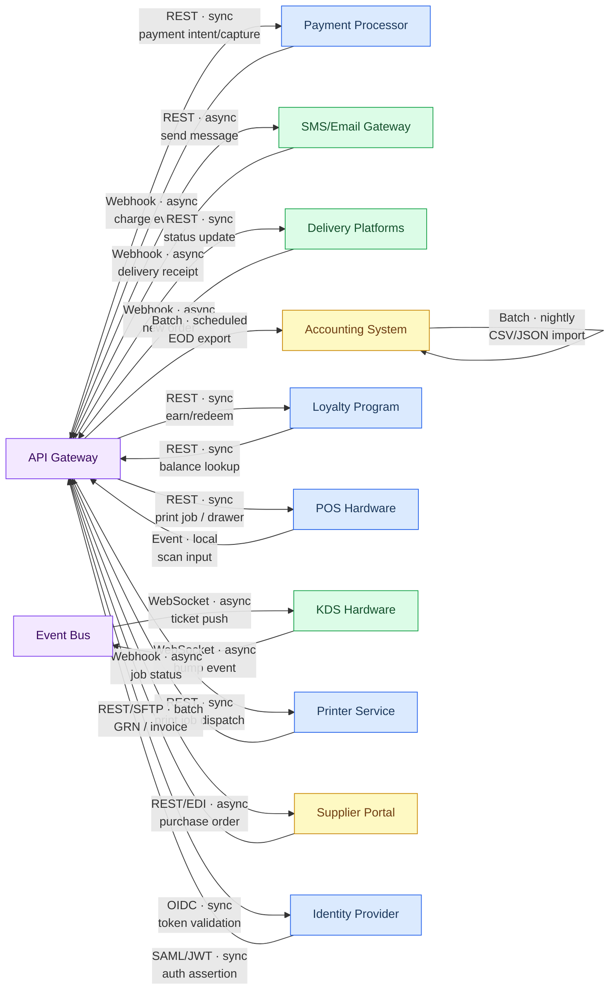

# System Context Diagram — Restaurant Management System

The **Restaurant Management System (RMS)** is a multi-tenant, multi-branch platform that orchestrates every operational dimension of a restaurant business — from guest reservations and table-side ordering through kitchen execution, inventory management, staff scheduling, and financial settlement. It sits at the center of a dense ecosystem of external services, physical hardware, third-party delivery platforms, and enterprise back-office systems. This document defines the system boundary, maps all external actors and integrations at the C4 Context level, describes data flows and integration patterns, and specifies security and non-functional boundaries that govern how the RMS interacts with the outside world.

---

## System Boundary

### Inside the System (RMS-owned)

The following capabilities are fully owned, deployed, and operated by the RMS platform. They run within the system's trust boundary, share the same primary data stores, and are governed by the RMS engineering team:

| Subsystem | Responsibility |
|-----------|----------------|
| **Guest Portal** | Web/mobile UI for reservations, waitlist join, order-status tracking, feedback, and loyalty redemption |
| **Staff POS App** | Tablet/desktop app used by hosts, waiters, and cashiers for table management, order taking, and payment collection |
| **Kitchen Display System Interface** | Real-time ticket display for kitchen staff; receives bump-bar inputs to progress ticket status |
| **Backoffice / Manager Dashboard** | Branch configuration, menu management, shift scheduling, inventory control, promotions, and reporting |
| **Reporting Engine** | Aggregates operational and financial data; produces daily P&L, covers, voids, tax summaries, and custom exports |
| **API Gateway** | Unified entry point for all inbound HTTP traffic; handles auth token validation, rate limiting, and request routing |
| **Event Bus** | Internal async message broker (e.g., Kafka / RabbitMQ) for decoupled communication between subsystems |

### Outside the System (External)

The following actors and systems are operated by third parties or by the restaurant's physical infrastructure. They communicate with the RMS through well-defined integration contracts (REST, webhooks, events, or file transfers) but are not owned or deployed by the RMS platform:

- Payment processors (Stripe, Razorpay)
- SMS/Email gateways (Twilio, SendGrid)
- Third-party delivery platforms (Uber Eats, DoorDash, Zomato)
- Accounting/ERP systems (QuickBooks, Tally)
- Loyalty program platforms (external SaaS or white-label)
- POS peripheral hardware (printers, cash drawers, barcode scanners)
- Physical Kitchen Display Systems (KDS hardware units)
- Printer services (thermal receipt and kitchen printers)
- Supplier/Vendor portals
- Identity Providers (OAuth2 / SAML SSO)

---

## C4 Context Diagram

The diagram below places the RMS and its internal subsystems at the center, with all external actors and systems arranged around it. Arrows are labeled with the primary data exchanged and the direction of flow.

```mermaid
flowchart TD
    %% ── External Actors ──────────────────────────────────────────────
    GUEST([👤 Guest / Customer\nweb · mobile · walk-in])
    STAFF([👨‍🍳 Restaurant Staff\nhost · waiter · chef · cashier · manager])

    %% ── External Systems ─────────────────────────────────────────────
    PAYMENT["💳 Payment Processor\nStripe / Razorpay"]
    SMSEMAIL["📨 SMS & Email Gateway\nTwilio / SendGrid"]
    DELIVERY["🛵 Delivery Platforms\nUber Eats · DoorDash · Zomato"]
    ACCOUNTING["📒 Accounting System\nQuickBooks / Tally"]
    LOYALTY["⭐ Loyalty Program\nexternal SaaS / internal"]
    POSHW["🖨️ POS Hardware\nprinters · cash drawer · scanner"]
    KDS["📟 Kitchen Display System\nKDS hardware units"]
    PRINTER["🖨️ Printer Service\nthermal · kitchen printers"]
    SUPPLIER["🏭 Supplier / Vendor Portal\npurchase orders · deliveries"]
    IDP["🔐 Identity Provider\nOAuth2 / SAML SSO"]

    %% ── RMS Internal Subsystems ──────────────────────────────────────
    subgraph RMS["🍽️  Restaurant Management System"]
        direction TB
        GP["Guest Portal"]
        POS["Staff POS App"]
        KDS_IF["KDS Interface"]
        BO["Backoffice / Manager Dashboard"]
        RPT["Reporting Engine"]
        GW["API Gateway"]
        EB["Event Bus"]
    end

    %% ── Actor → RMS ──────────────────────────────────────────────────
    GUEST -->|"reservations, waitlist,\norder status, feedback"| GP
    STAFF -->|"orders, payments,\nmenu & shift ops"| POS
    STAFF -->|"config, inventory,\nreports"| BO

    %% ── RMS → RMS internal ───────────────────────────────────────────
    GP -->|"API calls"| GW
    POS -->|"API calls"| GW
    BO -->|"API calls"| GW
    GW -->|"domain events"| EB
    EB -->|"ticket events"| KDS_IF
    EB -->|"raw data"| RPT

    %% ── RMS → Payment Processor ──────────────────────────────────────
    GW -->|"payment intents, captures,\nvoids, refunds"| PAYMENT
    PAYMENT -->|"webhook: charge.succeeded,\npayment_failed, dispute"| GW

    %% ── RMS → SMS / Email Gateway ────────────────────────────────────
    GW -->|"reservation confirmations,\nOTP, order-ready alerts"| SMSEMAIL
    SMSEMAIL -->|"delivery receipts,\nbounce/failure callbacks"| GW

    %% ── Delivery Platforms → RMS ─────────────────────────────────────
    DELIVERY -->|"new delivery orders\n(webhook / polling)"| GW
    GW -->|"order status updates,\nitem availability sync"| DELIVERY

    %% ── RMS → Accounting ─────────────────────────────────────────────
    RPT -->|"daily settlement exports,\ntax summaries, COGS"| ACCOUNTING

    %% ── RMS ↔ Loyalty ────────────────────────────────────────────────
    GW -->|"earn / redeem points,\ntransaction events"| LOYALTY
    LOYALTY -->|"member lookup,\npoints balance"| GW

    %% ── RMS → POS Hardware ───────────────────────────────────────────
    GW -->|"receipt print jobs,\ncash drawer open signals"| POSHW
    POSHW -->|"barcode scan input,\nprinter status"| GW

    %% ── RMS → KDS ────────────────────────────────────────────────────
    KDS_IF -->|"ticket display,\nmodifier details"| KDS
    KDS -->|"bump bar: ticket ready,\nvoid, recall"| KDS_IF

    %% ── RMS → Printer Service ────────────────────────────────────────
    GW -->|"print job payloads\n(ESC/POS or ZPL)"| PRINTER
    PRINTER -->|"job status,\nerror callbacks"| GW

    %% ── RMS ↔ Supplier Portal ────────────────────────────────────────
    BO -->|"purchase orders,\nstock requests"| SUPPLIER
    SUPPLIER -->|"delivery confirmations,\ninvoice / GRN"| BO

    %% ── Identity Provider ────────────────────────────────────────────
    STAFF -->|"SSO login"| IDP
    IDP -->|"SAML assertion /\nOAuth2 token"| GW
```

---

## External System Descriptions

### 1. Payment Processor (Stripe / Razorpay)

| Attribute | Detail |
|-----------|--------|
| **Purpose** | Authorise, capture, void, and refund card and UPI payments at POS and online checkout |
| **Integration Pattern** | REST (outbound) + Webhook (inbound) |
| **Data Outbound** | `PaymentIntent` create/confirm, capture, cancel, refund request, terminal reader commands |
| **Data Inbound** | `charge.succeeded`, `charge.failed`, `payment_intent.canceled`, `refund.created`, `dispute.created` webhook events |
| **Authentication** | API key (server-side secret) for outbound calls; webhook signature (HMAC-SHA256 header) for inbound verification |
| **Failure Mode** | POS falls back to cash-only mode; intent stored locally and retried when connectivity restored; cashier alerted |
| **SLA Expectation** | 99.99 % uptime; p99 API latency < 2 s; webhook delivery within 30 s of event |

---

### 2. SMS / Email Gateway (Twilio / SendGrid)

| Attribute | Detail |
|-----------|--------|
| **Purpose** | Send reservation confirmations, OTP for guest login, order-ready notifications, marketing campaigns, and staff alerts |
| **Integration Pattern** | REST (outbound) + Webhook (inbound for delivery receipts) |
| **Data Outbound** | To/From number, message body, template ID, guest email address, dynamic template variables |
| **Data Inbound** | Message delivery status (`delivered`, `failed`, `undelivered`), bounce events, unsubscribe events |
| **Authentication** | Account SID + Auth Token (Twilio); API Key header (SendGrid); webhook validation via signed timestamp |
| **Failure Mode** | Notification queued in Event Bus with exponential back-off; guest informed via in-app banner if SMS undeliverable |
| **SLA Expectation** | SMS delivery within 10 s (domestic); email delivery within 60 s; 99.95 % uptime |

---

### 3. Delivery Platforms (Uber Eats / DoorDash / Zomato)

| Attribute | Detail |
|-----------|--------|
| **Purpose** | Receive online delivery orders from aggregator marketplaces; sync order status and item availability back to platforms |
| **Integration Pattern** | Webhook (inbound orders) + REST polling (status sync) — varies by platform |
| **Data Outbound** | Order accept/reject, estimated preparation time, item 86 (out-of-stock), order status updates (`preparing`, `ready`, `picked-up`) |
| **Data Inbound** | New order payload (items, modifiers, delivery address, aggregator order ID), order cancellation, tip adjustments |
| **Authentication** | Per-platform OAuth2 client credentials; request signing varies by aggregator |
| **Failure Mode** | Orders queued; staff alerted via dashboard banner; automatic rejection with customer notification if queue exceeds SLA window |
| **SLA Expectation** | Order receipt-to-acknowledgement < 15 s; availability sync propagated within 60 s |

---

### 4. Accounting System (QuickBooks / Tally)

| Attribute | Detail |
|-----------|--------|
| **Purpose** | Export end-of-day financial summaries for bookkeeping, tax filing, and cost-of-goods reconciliation |
| **Integration Pattern** | Scheduled file export (CSV/JSON) or REST batch push (QuickBooks Online API) |
| **Data Outbound** | Daily settlement report, VAT/GST tax summary, COGS breakdown by category, void and discount ledger, staff labour cost |
| **Data Inbound** | Chart-of-accounts mapping, tax rate configuration updates |
| **Authentication** | OAuth2 (QuickBooks Online); SFTP key pair (Tally file drops) |
| **Failure Mode** | Export job retried up to 3 times; export file archived locally; finance team alerted if export fails for > 1 business day |
| **SLA Expectation** | Nightly export completed by 02:00 local time; data available in accounting system by start of next business day |

---

### 5. Loyalty Program (External SaaS / Internal Module)

| Attribute | Detail |
|-----------|--------|
| **Purpose** | Award and redeem loyalty points at checkout; perform member lookup at reservation and table-seating |
| **Integration Pattern** | REST (synchronous lookup and earn/redeem) + Event (async points-sync for batch processing) |
| **Data Outbound** | Transaction earn event (member ID, amount, items), redemption request (points to burn, discount value), member enroll |
| **Data Inbound** | Points balance, membership tier, available rewards, member profile (name, preferences) |
| **Authentication** | API key + HMAC request signing; member token passed via guest session |
| **Failure Mode** | Checkout proceeds without loyalty; points transaction queued for later reconciliation; member sees pending balance in app |
| **SLA Expectation** | Member lookup p99 < 500 ms; earn/redeem API p99 < 1 s; 99.9 % uptime |

---

### 6. POS Hardware (Receipt Printers / Cash Drawer / Barcode Scanners)

| Attribute | Detail |
|-----------|--------|
| **Purpose** | Physical peripherals at the cashier station: print receipts, trigger cash drawer, scan barcodes for item lookup |
| **Integration Pattern** | Local network (LAN/USB bridge) via hardware abstraction daemon; ESC/POS protocol for printers |
| **Data Outbound** | Receipt print payload (ESC/POS or PDF), cash drawer open command, barcode query |
| **Data Inbound** | Barcode scan result, printer paper-out / error status, cash drawer open/close state |
| **Authentication** | LAN isolation; device authenticated by static IP + MAC address whitelist on branch network |
| **Failure Mode** | Soft receipt (email/SMS) offered to guest; cash drawer opened manually via key override; barcode entered manually |
| **SLA Expectation** | Print job completed within 3 s; scanner response < 200 ms; hardware daemon heartbeat every 30 s |

---

### 7. Kitchen Display System — KDS Hardware

| Attribute | Detail |
|-----------|--------|
| **Purpose** | Display incoming order tickets to kitchen stations; receive bump-bar inputs to mark tickets as in-progress or complete |
| **Integration Pattern** | WebSocket (persistent, low-latency push) from KDS Interface subsystem |
| **Data Outbound** | Ticket payload (items, modifiers, table/order ID, priority, fire time, course sequence) |
| **Data Inbound** | Bump events (`TICKET_STARTED`, `TICKET_READY`, `TICKET_VOID`, `TICKET_RECALL`) |
| **Authentication** | Device token provisioned at on-boarding; token validated by KDS Interface on WebSocket upgrade |
| **Failure Mode** | Tickets printed to kitchen printer as fallback; KDS attempts auto-reconnect with exponential back-off |
| **SLA Expectation** | Ticket delivered to KDS within 1 s of order fire; bump event processed within 500 ms |

---

### 8. Printer Service (Thermal / Kitchen Printers)

| Attribute | Detail |
|-----------|--------|
| **Purpose** | Route print jobs to the correct physical printer: guest receipts, kitchen dockets, bar chits, manager reports |
| **Integration Pattern** | REST to local print-service daemon; ESC/POS or ZPL payload forwarded over USB/LAN |
| **Data Outbound** | Print job (template type, content, target printer ID, copies) |
| **Data Inbound** | Job status (`queued`, `printing`, `done`, `error`), paper-out / offline alerts |
| **Authentication** | Local service authenticated by internal service mesh mTLS |
| **Failure Mode** | Job spooled in Event Bus; staff alerted; duplicate prevention via job ID deduplication on retry |
| **SLA Expectation** | Print job dispatched within 1 s; physical print within 3 s of dispatch |

---

### 9. Supplier / Vendor Portal

| Attribute | Detail |
|-----------|--------|
| **Purpose** | Issue purchase orders to suppliers; receive delivery confirmations, goods-received notes (GRN), and supplier invoices |
| **Integration Pattern** | REST API (modern suppliers) or EDI/CSV file exchange (legacy suppliers via SFTP) |
| **Data Outbound** | Purchase order (items, quantities, unit prices, expected delivery date, branch location) |
| **Data Inbound** | Delivery confirmation, partial delivery notice, GRN, supplier invoice (for 3-way match), backorder alerts |
| **Authentication** | Per-supplier API key or SFTP credential; IP allowlist for SFTP drops |
| **Failure Mode** | PO stored locally and emailed to supplier as PDF fallback; inventory manager alerted for manual follow-up |
| **SLA Expectation** | PO acknowledgement within 2 hours (business hours); GRN sync within 4 hours of physical delivery |

---

### 10. Identity Provider (OAuth2 / SAML SSO)

| Attribute | Detail |
|-----------|--------|
| **Purpose** | Centralised authentication and SSO for restaurant staff across branches; role-claim mapping for RBAC |
| **Integration Pattern** | SAML 2.0 (enterprise SSO) or OAuth2 + OIDC (SaaS IdP: Okta, Azure AD, Google Workspace) |
| **Data Outbound** | SAML `AuthnRequest`, OAuth2 authorisation request, token introspection calls |
| **Data Inbound** | SAML assertion (name, email, role claims), OIDC ID token, access token, refresh token, JWKS endpoint |
| **Authentication** | X.509 certificate exchange (SAML); client secret or PKCE flow (OAuth2) |
| **Failure Mode** | Break-glass local admin account per branch; offline JWT cache for up to 15 minutes during IdP outage |
| **SLA Expectation** | Authentication round-trip < 1 s; token validation (JWKS) < 100 ms (cached); 99.99 % uptime |

---

## Data Flow Descriptions

### Flow 1 — Guest Makes a Reservation → SMS Confirmation

1. Guest submits a reservation request via the **Guest Portal** (date, party size, time slot, contact number).
2. The Guest Portal sends a `POST /reservations` request through the **API Gateway**.
3. The API Gateway validates the auth token (guest session or phone OTP) and forwards the request to the Reservation domain service.
4. The Reservation service checks table availability, creates a reservation record, and emits a `ReservationConfirmed` event on the **Event Bus**.
5. The Notification consumer reads the event and calls the **SMS/Email Gateway** (`POST /messages`) with a templated confirmation message containing the booking reference and a one-tap cancellation link.
6. Twilio delivers the SMS to the guest's mobile number and returns a delivery receipt webhook.
7. The RMS updates the notification log as `DELIVERED`; if `UNDELIVERED`, the system retries via email.

---

### Flow 2 — Order Placed at POS → Kitchen Display

1. Waiter enters items on the **Staff POS App** and presses "Fire to Kitchen".
2. The POS App sends `POST /orders/{id}/fire` to the **API Gateway**.
3. The Order domain service updates the order state to `FIRED`, assigns the kitchen station based on item category, and publishes a `KitchenTicketCreated` event on the **Event Bus**.
4. The **KDS Interface** subsystem consumes the event, formats the ticket payload (items, modifiers, allergens, course sequence, table number, cover count), and pushes it via **WebSocket** to the target KDS hardware unit at the appropriate kitchen station.
5. The KDS displays the ticket with a countdown timer. When the chef bumps the ticket as ready, the KDS hardware emits a `TICKET_READY` message back to the KDS Interface.
6. The KDS Interface publishes a `KitchenTicketReady` event; the POS App receives a real-time push notification, turning the order row green for the waiter to know the food is ready to collect.

---

### Flow 3 — Bill Paid → Accounting Export

1. Cashier closes a bill on the **Staff POS App**; payment is captured via the **Payment Processor**.
2. The Payment domain service receives the `charge.succeeded` webhook, reconciles the local payment record, and marks the bill as `SETTLED`.
3. The bill close event is streamed to the **Reporting Engine** via the **Event Bus**.
4. At end-of-day (configurable, default 23:59 local time), the Reporting Engine runs a daily settlement job: aggregates all settled bills, voids, discounts, taxes, and tips for the branch.
5. The job generates a structured JSON export conforming to the QuickBooks / Tally schema and pushes it via the Accounting integration adapter (REST or SFTP).
6. The accounting system imports the journal entries; the finance team reviews the day's P&L in QuickBooks by the following morning.

---

### Flow 4 — Delivery Order Received → Kitchen Routing

1. A guest places an order on Uber Eats. Uber Eats sends a `new_order` webhook payload to the RMS **API Gateway** (aggregator-specific endpoint).
2. The Delivery Integration adapter validates the HMAC signature, maps aggregator item IDs to RMS menu item IDs, and creates an internal Order record tagged with source `UBER_EATS`.
3. The RMS automatically acknowledges the order within 15 s (configurable auto-accept or staff-confirm mode).
4. A `KitchenTicketCreated` event is published on the **Event Bus** — identical to a dine-in order from this point forward.
5. The KDS Interface routes the ticket to the packing/delivery station with a "DELIVERY" badge.
6. When the chef bumps the ticket ready, the RMS calls the Uber Eats status API to update the order as `FOOD_READY`, triggering dispatch of a delivery driver.

---

### Flow 5 — End of Day → Accounting Reconciliation

1. At scheduled EOD time, the **Reporting Engine** triggers the nightly reconciliation job.
2. It queries all transactions for the business date: sales by category, payment method split, void ledger, discount and promo summary, tax collected (GST/VAT by rate), COGS (inventory consumed × ingredient cost).
3. It cross-checks payment processor settlement reports (fetched via Stripe / Razorpay balance API) against internal totals; any discrepancy > ₹10 / $0.10 is flagged as a reconciliation exception and sent as an alert to the branch manager.
4. The final settled export is pushed to the **Accounting System**. A signed export manifest (SHA-256 hash, record count, total amount) is stored in the RMS audit log for immutability.
5. The job status (`SUCCESS` / `PARTIAL` / `FAILED`) is recorded; finance team is notified via email with a summary PDF attachment.

---

## Security Boundaries

### Trust Zones

| Zone | Scope | Trust Level |
|------|-------|-------------|
| **Public Internet** | Guest Portal (browser/mobile), delivery platform webhooks, payment processor webhooks | Untrusted — all traffic validated at API Gateway |
| **Staff Network (LAN)** | Staff POS App, Backoffice Dashboard (on-premise or VPN-connected) | Semi-trusted — requires valid staff JWT + MFA for sensitive operations |
| **POS Device Network** | POS peripherals (printers, cash drawer, barcode scanner) on branch LAN segment | Device-trusted — MAC/IP whitelist; isolated VLAN; no internet access |
| **Kitchen Device Network** | KDS hardware units on dedicated kitchen LAN segment | Device-trusted — provisioned device token; isolated VLAN |
| **Internal Service Mesh** | API Gateway ↔ domain services ↔ Event Bus | Trusted — mTLS between all internal services |
| **External SaaS APIs** | Payment, SMS, Accounting, Loyalty, IdP | Verified — outbound only; API keys stored in secrets manager; inbound webhooks verified by signature |

### Authentication Requirements per Zone

- **Guest Portal**: Phone OTP or social OAuth2 (Google) for authenticated sessions; anonymous browsing for menu/availability.
- **Staff POS App**: SSO via Identity Provider (SAML/OIDC); MFA required for manager-level operations (void, discount override, EOD close).
- **API Gateway**: Bearer JWT (OIDC-issued) for all authenticated endpoints; webhook endpoints use HMAC-SHA256 signature validation.
- **Internal Services**: mTLS with service-specific certificates rotated every 90 days.
- **POS Hardware Daemon**: Static API token per device; scoped to print and peripheral commands only.
- **KDS Hardware**: Device provisioning token; WebSocket upgrade requires valid device token.

### Data Encryption

- **In Transit**: TLS 1.2+ for all external HTTPS traffic; TLS 1.3 preferred. WebSocket connections use WSS. Internal service mesh uses mTLS.
- **At Rest**: Database encryption at rest (AES-256) for all PII (guest names, phone numbers, email addresses). Payment card data is never stored — only tokenised references from the payment processor.
- **Secrets Management**: API keys, database credentials, and certificates stored in a secrets manager (AWS Secrets Manager / HashiCorp Vault); never in environment files or source code.

### PCI DSS Scope Boundary

The RMS is designed to minimise PCI DSS scope. Card data never enters RMS application code or databases:

- All card interactions are handled by the payment processor's hosted fields / SDK (client-side tokenisation).
- The RMS only stores the processor's payment token and the last 4 digits of the card for receipt display.
- The POS terminals that handle physical cards are P2PE-certified devices; card data is encrypted at the swipe/tap point and decrypted only within the processor's environment.
- The PCI scope boundary encompasses only the API Gateway endpoints that route payment intents and the network segment carrying payment webhook traffic.

---

## Integration Architecture Diagram

The diagram below classifies every integration by its communication pattern: **synchronous REST**, **asynchronous event/webhook**, or **scheduled batch**. Edge labels indicate the pattern and protocol.

> **Legend**: 🔵 Synchronous REST &nbsp;|&nbsp; 🟢 Asynchronous Event / Webhook &nbsp;|&nbsp; 🟡 Scheduled Batch &nbsp;|&nbsp; 🟣 Internal

---

## Non-Functional Context Boundaries

### Availability Requirements per External System

| External System | Required Availability | Max Tolerated Downtime (per month) |
|-----------------|----------------------|-------------------------------------|
| Payment Processor | 99.99 % | ~4 minutes |
| SMS/Email Gateway | 99.95 % | ~22 minutes |
| Delivery Platforms | 99.9 % | ~44 minutes |
| Accounting System | 99.5 % (batch only) | ~3.6 hours |
| Loyalty Program | 99.9 % | ~44 minutes |
| Identity Provider | 99.99 % | ~4 minutes |
| KDS Hardware | 99.9 % (branch hours only) | ~44 minutes (operating hours) |
| POS Hardware | 99.9 % (branch hours only) | ~44 minutes (operating hours) |

### Degraded Mode Behaviour

| External System Unavailable | RMS Degraded Mode Response |
|----------------------------|---------------------------|
| **Payment Processor** | POS switches to cash-only mode; card payment attempts are rejected with guest-friendly message; all in-flight intents are retried when connectivity restored |
| **SMS/Email Gateway** | Notifications queued with TTL of 24 hours; guest shown in-app confirmation as fallback; staff alerted to manually contact guest for critical bookings |
| **Delivery Platforms** | New delivery orders cannot be received; aggregator integration dashboard shows "unavailable" banner; manual phone orders accepted |
| **Accounting System** | EOD export job retried up to 3 times; export file archived locally for up to 7 days; finance team alerted via email |
| **Loyalty Program** | Checkout proceeds without loyalty earn/redeem; points transactions queued for post-recovery reconciliation; guest informed loyalty is temporarily unavailable |
| **Identity Provider** | Staff can use break-glass local credentials (per-branch emergency account) with 15-minute TTL; cached JWT tokens honoured up to 15 minutes |
| **KDS Hardware** | Tickets auto-printed to kitchen printer as fallback; KDS Interface attempts reconnection every 5 s with exponential back-off |
| **Printer Service** | Soft receipts (SMS/email) offered to guest; staff can trigger reprint from POS once printer is restored; job IDs prevent duplicate prints |
| **Supplier Portal** | PO saved locally and emailed as PDF to supplier contact; inventory manager receives in-app alert to follow up manually |

### Rate Limiting from External Providers

| External System | Rate Limit | RMS Handling Strategy |
|-----------------|------------|----------------------|
| Stripe API | 100 req/s per secret key | Per-request idempotency keys; client-side throttle with token bucket; retry with exponential back-off + jitter |
| Razorpay API | 60 req/s | Same as Stripe; separate throttle budget per provider |
| Twilio SMS | 1 msg/s per number (US); 10 msg/s (long code pool) | Message queue with configurable throughput; burst handled via number pool rotation |
| SendGrid Email | 600 emails/min (free tier) → custom on enterprise plan | Batch digest for bulk notifications; real-time transactional via dedicated IP |
| Uber Eats API | Platform-defined; varies by partner tier | Webhook-first; status polling capped at 1 req/10 s per order |
| QuickBooks API | 500 req/min per realm | Batch all EOD items into a single request set; token-bucket middleware |
| Loyalty SaaS | Typically 100 req/s | Cache member lookups for 60 s; queue earn events asynchronously |
| Identity Provider | Typically no hard limit for token validation (JWKS cached) | JWKS keys cached with 6-hour TTL; token introspection only on cache miss |
