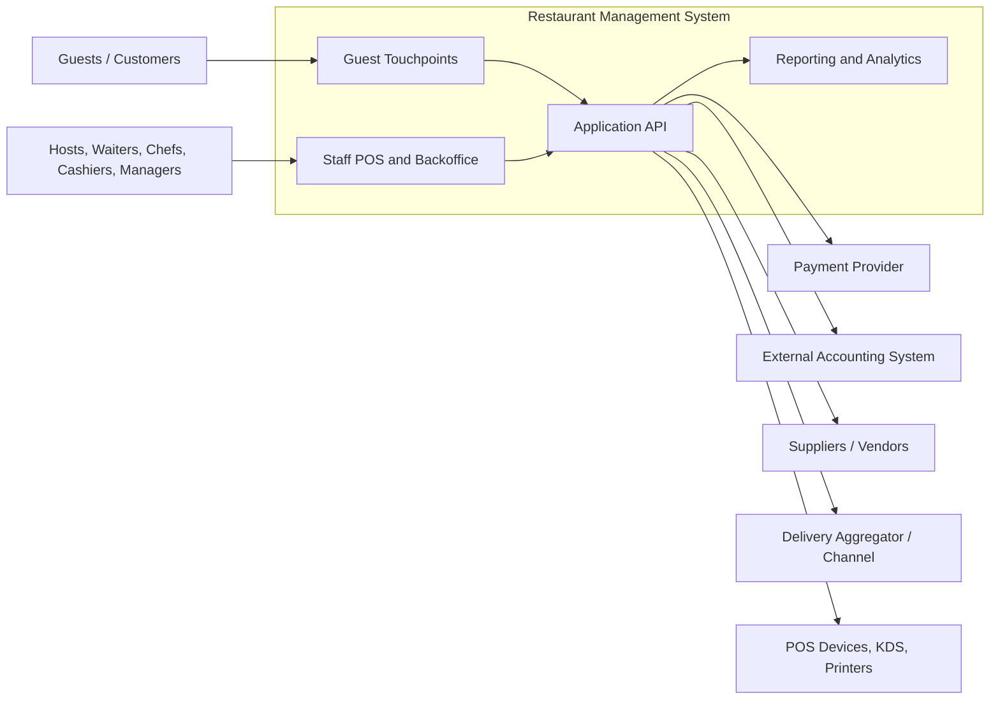
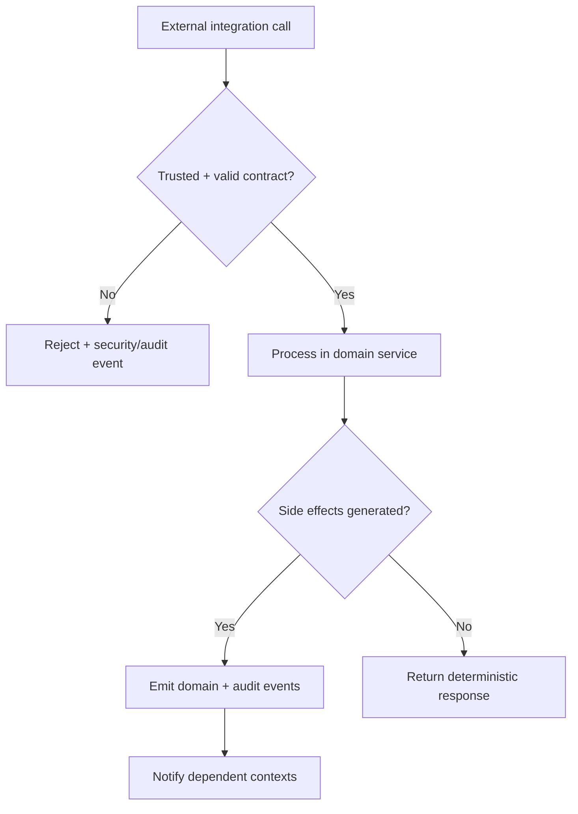

# System Context Diagram - Restaurant Management System

## Context Notes

- Guests interact through lightweight reservation, waitlist, and order-status touchpoints rather than a full guest application stack.
- Staff use branch operational tools for front-of-house, kitchen, inventory, cashiering, and management workflows.
- The system integrates with payments, accounting exports, supplier processes, delivery channels, and restaurant devices.

## Context-Level Non-Functional Boundaries

| External Actor/System | Data Exchanged | Critical Constraint |
|-----------------------|----------------|---------------------|
| Payment Provider | payment intents, captures, voids, refunds | idempotent retries + signed callbacks |
| Accounting System | settlement exports, tax summaries, reconciliation batches | immutable export lineage |
| Vendors/Suppliers | purchase orders, receipts, discrepancy records | branch-level authorization and traceability |
| Delivery Channels | order ingestion/status sync | source-of-truth mapping and deduplication |
| Devices (POS/KDS/Printers) | ticket updates, print jobs, health telemetry | degraded-mode fallback for branch outages |

## Context Risk Flow (Mermaid)

