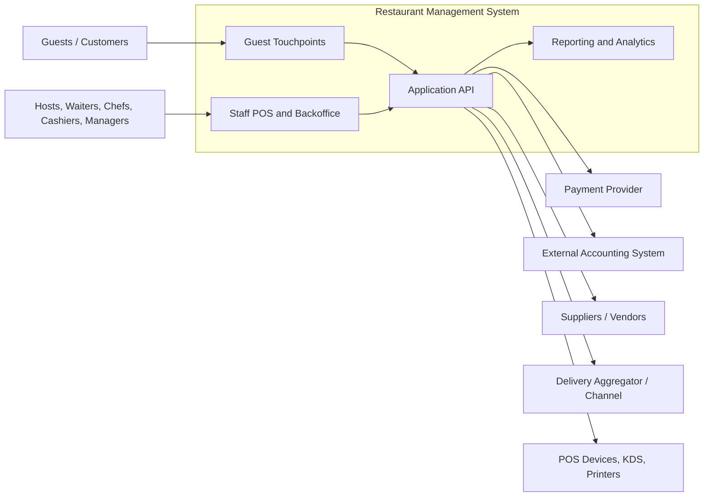

# System Context Diagram - Restaurant Management System

## Context Notes

- Guests interact through lightweight reservation, waitlist, and order-status touchpoints rather than a full guest application stack.
- Staff use branch operational tools for front-of-house, kitchen, inventory, cashiering, and management workflows.
- The system integrates with payments, accounting exports, supplier processes, delivery channels, and restaurant devices.
