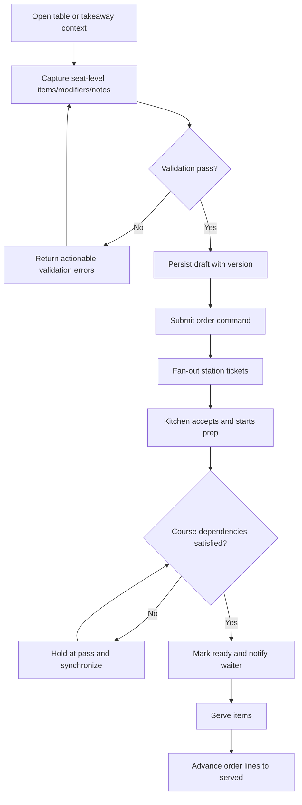
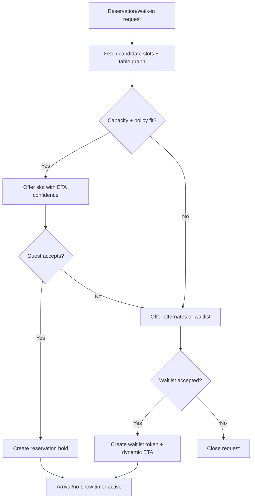
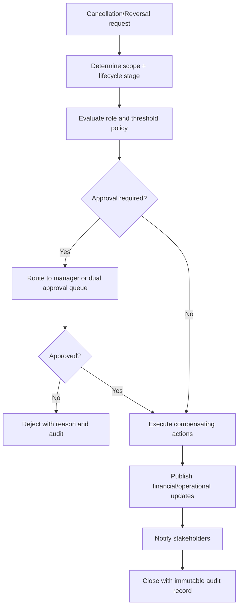

# Use Case Descriptions - Restaurant Management System

## UC-01: Reserve Table or Join Waitlist
**Primary Actor**: Guest / Customer or Host  
**Goal**: Secure dining access with predictable timing.

**Preconditions**:
- Branch is accepting reservations or waitlist entries.
- Seating policy and capacity rules are configured.

**Main Flow**:
1. Guest submits reservation or host creates a reservation/walk-in record.
2. System validates branch hours, table availability, and party-size rules.
3. Reservation or waitlist entry is created.
4. Guest and host see updated status and expected timing.

**Exceptions**:
- E1: No eligible seating window -> suggest alternative times or waitlist placement.
- E2: Reservation no-show threshold reached -> entry transitions according to policy.

---

## UC-02: Seat Table and Start Service
**Primary Actor**: Host / Reception

**Main Flow**:
1. Host selects an available table or merged table group.
2. System validates capacity, reservation linkage, and table readiness.
3. Table is marked occupied and assigned to a service zone/waiter.
4. Service timeline begins for the seated party.

---

## UC-03: Capture Order and Send to Kitchen
**Primary Actor**: Waiter / Captain

**Main Flow**:
1. Waiter opens the active table or takeaway order.
2. Waiter adds items, modifiers, notes, and course timing instructions.
3. System validates menu availability, pricing, and approval rules.
4. Order is saved and submitted.
5. Kitchen tickets are routed to the relevant prep stations.

**Exceptions**:
- E1: Item unavailable -> system prompts substitution or removal.
- E2: Approval needed for void/discount -> manager approval workflow begins.

---

## UC-04: Prepare Items and Coordinate Service
**Primary Actor**: Chef / Kitchen Staff

**Main Flow**:
1. Kitchen staff receives tickets by station and priority.
2. Staff mark items as accepted, in preparation, ready, or delayed.
3. System updates waiter visibility for service coordination.
4. Completed items move to pass/dispatch and then to served state.

**Exceptions**:
- E1: Ingredient shortage discovered -> staff flags stockout to front-of-house.
- E2: Item must be refired -> system records a controlled refire event.

---

## UC-05: Settle Bill and Close Cash Session
**Primary Actor**: Cashier / Accountant

**Main Flow**:
1. Cashier opens the bill for a table or takeaway order.
2. System calculates totals, taxes, charges, discounts, and prior partial payments.
3. Cashier accepts one or more payment methods.
4. System closes the settlement and updates order lifecycle.
5. At shift or day close, cashier balances the drawer and system produces settlement summaries and export data.

---

## UC-06: Procure Stock and Receive Goods
**Primary Actor**: Inventory / Purchase Manager

**Main Flow**:
1. Manager creates purchase request or purchase order from low-stock or planned demand.
2. Vendor and expected delivery details are recorded.
3. On receipt, manager records delivered quantities, variances, and quality notes.
4. Stock ledger is updated and discrepancies remain auditable.

---

## UC-07: Run Shift Scheduling and Attendance
**Primary Actor**: Branch Manager

**Main Flow**:
1. Branch manager publishes shifts for service, kitchen, cashier, and inventory roles.
2. Staff mark shift start/end or attendance is captured by workflow.
3. System shows branch coverage gaps and operational readiness.
4. Shift and day-close operations reference attendance and open sessions.

---

## UC-08: Configure Menus, Taxes, and Policies
**Primary Actor**: Admin

**Main Flow**:
1. Admin configures menu structures, taxes, payment methods, branch rules, and approval thresholds.
2. System validates conflicts and effective dates.
3. Updated policies are versioned and applied according to scope.
4. Audit logs capture actor, before/after state, and branch or global scope.

---

## UC-09: Manage Peak Seating Slots and Walk-In Spillover
**Primary Actor**: Host / Reception
**Supporting Actors**: Guest, Branch Manager

**Preconditions**:
- Slot duration rules, buffer windows, and table combinability are configured.
- Peak-load thresholds are active for the branch.

**Main Flow**:
1. Host views next seating windows with predicted turnover and current queue pressure.
2. System proposes best-fit slot/table options for reservation or walk-in intake.
3. Host confirms booking or waitlist placement.
4. System starts arrival/no-show timers and reserve-hold timers.
5. If queue pressure rises, system suggests throttling and revised quoted wait times.

**Exceptions**:
- E1: Slot overbook risk -> require manager override or alternate slot.
- E2: Guest late beyond grace period -> slot released and waitlist backfill executed.

---

## UC-10: Orchestrate Kitchen Under Mixed Ticket Load
**Primary Actor**: Chef / Expediter

**Main Flow**:
1. System groups incoming items by station, course dependencies, and promise time.
2. Expediter accepts batches and starts preparation waves.
3. Station cooks update progress; system recalculates cross-station synchronization.
4. Pass marks items ready only when course dependencies are satisfied.
5. Waiters receive pickup prompts with table and seat mapping.

**Exceptions**:
- E1: Station overload -> dynamic reroute to secondary station where configured.
- E2: Ingredient unavailable mid-prep -> propose substitute and pause dependent lines.
- E3: Refire needed -> create linked refire ticket with root-cause tag.

---

## UC-11: Process Multi-Tender Payments with Splits
**Primary Actor**: Cashier / Waiter

**Main Flow**:
1. Staff chooses split strategy (equal, item-based, seat-based, custom amount).
2. System creates child checks and computes per-check taxes and charges.
3. Each child check is settled via one or more tenders.
4. System confirms settlement state and prints/sends receipts.
5. Parent check closes when all child checks are fully paid.

**Exceptions**:
- E1: Payment provider timeout -> retain pending intent and offer safe retry.
- E2: Partial decline -> keep unpaid residue open on specific child check.

---

## UC-12: Cancel Reservation/Order/Payment Safely
**Primary Actor**: Host, Waiter, Cashier, Manager (depends on stage)

**Main Flow**:
1. Actor selects entity to cancel and provides reason code.
2. System evaluates lifecycle stage and required approval level.
3. If approved, system executes compensating actions (release slot/table, cancel ticket, create void/refund record).
4. Affected stakeholders receive status updates.
5. Audit log records actor, timestamp, policy basis, and financial/stock impact.

**Exceptions**:
- E1: Post-prep cancellation with non-recoverable cost -> manager-only flow with waste capture.
- E2: Refund exceeds threshold -> dual approval required.

---

## UC-09 to UC-12 Implementation Detail Addendum

### Shared Preconditions
- Branch day-open checklist is complete and no blocking incident is active.
- Menu version, pricing profile, and tax profile are effective for current service window.
- Queue, slot, and payment provider health checks are green or in tolerated degraded mode.

### Shared Postconditions
- All state changes are persisted with monotonic version increments.
- User-visible timelines (host/waiter/cashier views) are updated within near-real-time sync budget.
- Compliance audit envelope is emitted for policy-bound actions.

### Alternate and Recovery Flows

| Use Case | Alternate Flow | Recovery Rule |
|----------|----------------|---------------|
| UC-09 | Guest requests accessibility table not in immediate inventory | Promote next compatible slot and apply hold extension |
| UC-10 | Cross-station dependency misses promise time | Expediter initiates partial-serve policy or replans fire sequence |
| UC-11 | Network flap during capture confirmation | Hold intent in `pending_reconcile` and run async provider reconciliation job |
| UC-12 | Duplicate cancellation request received | Reject as idempotent replay and return original decision reference |

### Data Captured Per Use Case

| Use Case | Required Data Points |
|----------|----------------------|
| UC-09 | `slot_id`, `party_size`, `quoted_eta`, `table_group`, `hold_expires_at` |
| UC-10 | `ticket_id`, `station_id`, `priority_band`, `course_dependency`, `delay_reason_code` |
| UC-11 | `check_id`, `child_check_id`, `payment_intent_id`, `tender_mix`, `provider_status` |
| UC-12 | `cancellation_scope`, `reason_code`, `approval_actor`, `compensation_action`, `financial_delta` |

### Business Rule Traceability
- UC-09 aligns with slot fairness, no-show grace, and anti-overbooking rules.
- UC-10 aligns with kitchen SLA and refire governance rules.
- UC-11 aligns with tender idempotency and reconciliation rules.
- UC-12 aligns with cancellation window, refund threshold, and override governance rules.

---

## Cross-Flow Operational Diagrams (Mermaid)

### 1) Ordering + Kitchen + Service Completion Activity

### 2) Table/Slot Allocation Decision Flow

### 3) Cancellation/Reversal Policy Evaluation

